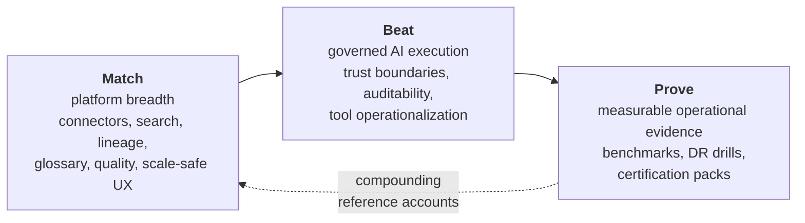

# Vision and Goals

> Status: Authoritative. Supersedes the strategy sections of the retired flat `16-market-comparison-and-product-strategy.md`.
> Owner: Product. Review cadence: quarterly.

## 1. One-sentence product definition

Atlas is the **governed AI data operating system for regulated enterprises**: it understands the enterprise data estate, enforces policy *before* any action, explains every result it produces, and converts safe repeated analysis into reusable, versioned operational capability.

## 2. Why this product exists

Three markets are colliding and none of the incumbents owns the intersection:

| Market | What it solved | What it did not solve |
|---|---|---|
| Data catalog / governance (Atlan, Collibra, Alation, Purview) | Inventory, glossary, stewardship, policy documentation | Governance is *descriptive*. It documents what should happen; it does not stand in the execution path. |
| Warehouse-native context (Databricks Unity Catalog, Snowflake Horizon) | Governance and semantics tightly bound to one compute engine | Single-vendor gravity. A bank with Oracle + Teradata + SQL Server + Snowflake cannot govern from inside one warehouse. |
| AI analyst / text-to-SQL (Cortex Analyst, Genie, Spotter, Hex, Cube) | Natural-language access to data | The model is inside the trust boundary. Correctness is probabilistic, and the audit story is a transcript, not evidence. |

The gap is a system where **the governance plane and the execution plane are the same plane**. Documenting a policy and enforcing a policy should not be two products.

Atlas's structural bet: *deterministic services hold all authority; models only propose.* Every incumbent that lets a model emit executable SQL directly has accepted a trust boundary that a regulated bank cannot accept. That constraint is not a limitation we tolerate — it is the product.

## 3. Goals

### 3.1 Product goals (18-month horizon)

| # | Goal | Measurable definition of success |
|---|---|---|
| G1 | Match category minimum on breadth | 12+ certified connectors, cross-source search, glossary lifecycle, ETL/OpenLineage ingestion, quality rules. No buyer rejects Atlas on "too narrow." |
| G2 | Be the strongest governed-AI-execution story in the market | Every source-touching action passes one gateway; 100% of agent runs produce replayable, value-free evidence; documented kill switch drill. |
| G3 | Turn analysis into durable capability | ≥40% of analyst requests in a mature tenant served by an approved governed tool rather than fresh SQL generation. |
| G4 | Prove scale rather than assert it | Published benchmarks: 1M+ catalog objects, 1000+ sources, p95 control-plane API < 300 ms, authz decision p95 < 50 ms. **Unmeasured as of 2026-08-30** — no benchmark has been run, no load or soak test exists, and there is no performance job in CI. These are design targets, and G4 is by its own wording the one goal currently not met. See `10-architecture/10-performance-and-scale-model.md` §9 and tracker `E10`. |
| G5 | Be the context supplier to other AI surfaces | Governed context products consumable over MCP by third-party agents, with the same policy enforcement as the native analyst. |
| G6 | Be operable by a platform team, not by its authors | Runbooks, SLOs, DR drills, and a connector SDK an external team can build against without core changes. |

### 3.2 Non-goals

Explicitly out of scope. Each of these has been considered and rejected for this horizon.

| Non-goal | Reason |
|---|---|
| Being a general-purpose BI/dashboarding tool | Tableau/Power BI/Looker own this. Atlas supplies them context; it does not replace them. |
| Owning ETL/transformation execution | dbt and the warehouse own compilation and execution. Atlas ingests their artifacts as evidence. |
| Write-back / operational data mutation | Read-only by default. Write paths multiply the blast radius of a model error by orders of magnitude. |
| Copying source business data into the platform | Metadata, statistics, and bounded approved results only. Data replication is a regulatory liability, not a feature. |
| Fully autonomous agents acting without a human-approved capability | Agents select from approved tools; they do not invent authority. |
| Winning on model quality | Atlas is model-neutral. The moat is the control plane, not the LLM. |

## 4. Product principles (non-negotiable)

These constrain every roadmap decision. A feature that violates one is rejected regardless of competitive pressure.

1. **The authoritative store is authoritative.** PostgreSQL (or an approved successor) holds truth. Neo4j, vector, and search indexes are rebuildable projections and can be deleted at any time without data loss.
2. **One execution choke point.** No code path reaches a source except through the Query Execution Gateway — not tools, not profilers, not lineage extractors, not admins.
3. **LLM output is untrusted input.** It is schema-validated, never executed directly, and can never publish a semantic version, approve an object, change a policy, or call a source.
4. **Raw regulated values do not enter model context by default.** Enabling masked-value mode is a per-classification, per-route, approved decision — never a default.
5. **Every high-impact action is attributable, reviewable, and auditable.** Maker-checker is a platform primitive, not a per-feature afterthought.
6. **Fail closed.** Missing identity configuration, unresolvable secrets, unapproved model routes, and unverified policy state deny rather than degrade.
7. **Honest capability reporting.** A connector advertises only behavior that is implemented and certified. `PLANNED` is displayed as `PLANNED`.
8. **Evidence over assertion.** Every inference carries its algorithm version, inputs, and confidence. Rejected inferences (negative knowledge) are retained.

## 5. Strategic posture

Atlas does not win by being a prettier catalog. The strategy is three moves in a fixed order:

**Why this order.** Breadth is the entry ticket — a buyer who dismisses Atlas as "Postgres-only" never sees the governance story. Governed execution is the differentiator, but it is only credible on top of adequate breadth. Proof converts the differentiator from a claim into a procurement asset. Skipping straight to (B) produces a technically superior product that loses every bake-off on the connector slide.

## 6. What "better than the market" means concretely

Not "more features." These six user-visible outcomes:

| Outcome | Measured as |
|---|---|
| Faster time to trusted analytical action | Time from question to a result the user is willing to act on, including the trust check |
| Better explanation of why a result can be trusted | Every answer exposes: interpretation, semantic version, policy version, lineage, confidence, refusal reasons |
| Better control over what AI can and cannot do | Policy graph spanning data, tools, models, agents, and outputs — with an exercised kill switch |
| Better conversion of analysis into reusable capability | Governed tool promotion rate and tool-first execution rate |
| Better visibility across semantics, lineage, tools, and runtime decisions | One graph, one search, one evidence model |
| Better safety under failure | Behaviour under credential rotation, policy change, source outage, and projection loss is specified and drilled |

## 7. Success criteria (the bar for claiming category leadership)

All five must be true simultaneously:

1. Atlas meets buyer expectations on connectors, search, lineage, glossary, governance, and scale-safe UX (see `00-product/04-competitive-feature-matrix.md`).
2. Atlas exceeds the market on governed AI execution, trust boundaries, auditability, and safe operationalization of analysis into tools.
3. Atlas has documented performance, recovery, and security evidence — not only local test success.
4. Real users complete analyst, steward, reviewer, and auditor workflows faster and with fewer handoffs than in competitor products.
5. A third-party team has built and certified a connector against the SDK without core code changes.

## 8. Anti-goals for the roadmap

Work that is actively rejected:

- Decorative UI that does not improve workflow speed or clarity.
- Autonomous AI features that weaken deterministic safety boundaries.
- Connector proliferation without certification and operational evidence.
- Metrics or semantics that are not versioned and reviewable.
- Any capability whose only justification is "a competitor has it."

## Related documents

- Personas and jobs: `00-product/02-personas-and-jobs.md`
- Market landscape: `00-product/03-market-landscape.md`
- Feature matrix: `00-product/04-competitive-feature-matrix.md`
- Differentiation: `00-product/05-differentiation-and-whitespace.md`
- Architecture principles: `10-architecture/01-principles-and-invariants.md`
- Roadmap: `60-delivery/01-roadmap.md`
