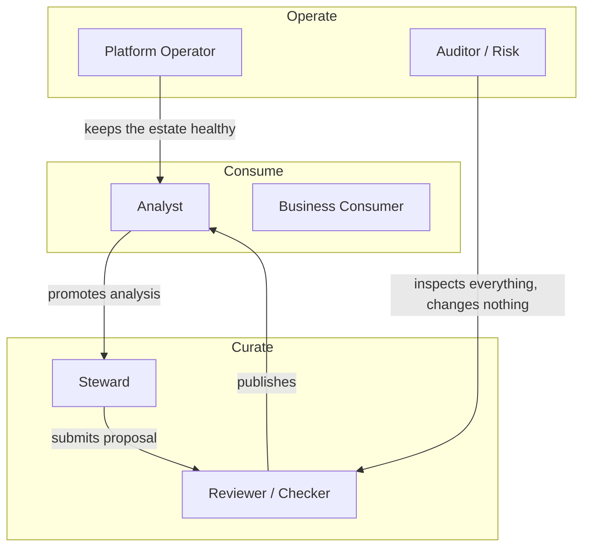

# Personas and Jobs to Be Done

> Status: Authoritative. Owner: Product.
> Purpose: Every module spec in `20-modules/` must name which persona it serves. A capability that serves no persona in this document is not built.

## 1. Why personas drive the architecture

Persona is not a UX concern here. In Atlas, persona is derived from **identity claims** (OIDC groups mapped to roles), and it determines:

- which navigation shell a user receives (`20-modules/21-experience-shell.md`),
- which policy decisions are evaluated (`20-modules/17-policy-and-governance.md`),
- which maker-checker seat a user can occupy (a maker can never check their own proposal),
- which evidence detail is exposed.

A persona chosen in a browser dropdown is a development convenience. In production it must come from the identity provider.

## 2. The six personas

---

### 2.1 Analyst

**Who.** A quantitative analyst, risk analyst, finance analyst, or data scientist inside a line of business. Knows their domain deeply; may or may not write SQL well.

**Primary jobs**

| # | Job | Success condition |
|---|---|---|
| A1 | "Answer this business question against governed data" | Correct answer plus a trust explanation, in under 2 minutes for metadata-grounded questions |
| A2 | "Tell me whether I can trust this number" | Lineage, semantic version, quality signal, and freshness visible without leaving the answer |
| A3 | "Find the right table/metric among 400,000 objects" | Semantic, policy-aware search returns the canonical asset first |
| A4 | "Do this same analysis every month without regenerating it" | Promote the analysis to a governed tool; run it by name thereafter |
| A5 | "Understand why Atlas refused" | Refusal names the control that fired and the remediation path |

**Failure modes we design against.** Silent wrong answers; unexplained refusals; having to ask a data engineer what a column means; rebuilding the same query every quarter.

---

### 2.2 Business Consumer

**Who.** A product owner, relationship manager, or executive who consumes analysis but will not author it.

**Primary jobs**

| # | Job | Success condition |
|---|---|---|
| B1 | "Run the approved analysis for my segment" | Parameterized governed tool, no SQL exposure |
| B2 | "Is this metric the official one?" | Certification badge with owner and approval date |
| B3 | "Share this result with evidence" | Linkable, permission-aware evidence view |

**Design implication.** This persona must never be able to reach raw SQL generation. Their surface is the tool catalog, not the analyst console.

---

### 2.3 Steward

**Who.** A data steward or domain owner accountable for the meaning and quality of a data domain.

**Primary jobs**

| # | Job | Success condition |
|---|---|---|
| S1 | "Document my domain without typing 10,000 descriptions" | Inference proposes; steward curates in bulk; steward never starts from blank |
| S2 | "Resolve conflicting definitions of the same term" | Explicit conflict workflow with a decision record, not last-write-wins |
| S3 | "Assign ownership across thousands of assets" | Bulk assignment, rule-based ownership, and an unowned-asset backlog |
| S4 | "Know what breaks if this table changes" | Impact analysis across semantics, tools, metrics, dbt models, and BI |
| S5 | "Prove my domain is governed" | Coverage score: documented, owned, classified, certified, quality-monitored |

**Failure modes we design against.** The blank-catalog problem (a catalog nobody fills in); bulk actions that are actually one-at-a-time; stewardship metrics that measure typing rather than trust.

---

### 2.4 Reviewer / Checker

**Who.** A second, independent approver. Structurally, *anyone who is not the maker*. Often a senior steward, model-risk officer, or governance lead.

**Primary jobs**

| # | Job | Success condition |
|---|---|---|
| R1 | "Approve or reject with full context" | One queue across all object types; evidence, diff, and blast radius in one pane |
| R2 | "Never accidentally approve my own work" | Platform-enforced maker≠checker, not a policy document |
| R3 | "Handle a queue of 500 proposals" | Bulk decisions with per-item rationale, filters, and delegation |
| R4 | "Record why I decided" | Mandatory rationale captured into the audit ledger |

**Design implication.** The review queue is a *platform primitive* spanning semantics, tools, model routes, relationships, quality policies, and connectors — not one queue per feature. See `20-modules/17-policy-and-governance.md`.

---

### 2.5 Platform Operator

**Who.** The engineering team that runs Atlas: SRE, data platform engineering.

**Primary jobs**

| # | Job | Success condition |
|---|---|---|
| P1 | "Onboard 200 sources this quarter" | Bulk onboarding, credential references, certification run per source |
| P2 | "Know which scans are failing and why" | Fleet health with per-source scoring, backpressure state, and failure classification |
| P3 | "Recover from a projection loss" | Documented rebuild from authoritative state, with measured duration |
| P4 | "Rotate a credential without an outage" | Reference-based secrets, cache invalidation, and a rotation drill |
| P5 | "Stop AI immediately" | Kill switch that halts model traffic without taking down deterministic paths |
| P6 | "Explain the cost" | Per-LOB showback across source compute, model tokens, and platform resources |

---

### 2.6 Auditor / Risk

**Who.** Internal audit, model risk management, compliance, or an external regulator.

**Primary jobs**

| # | Job | Success condition |
|---|---|---|
| U1 | "Show me every action on this data asset in Q3" | Searchable, attributable, tamper-evident ledger with export |
| U2 | "Prove the model could not have executed unapproved SQL" | Architectural evidence plus runtime evidence, both replayable |
| U3 | "Show approval chains for this metric" | Full maker-checker history with versions and rationale |
| U4 | "Export an evidence pack for this control" | Compliance pack generation, WORM-archived |

**Design implication.** This persona changes nothing and sees almost everything. Read-only-by-construction, with its own retention and export path.

---

## 3. Persona × module coverage map

Every module in `20-modules/` must appear in at least one row. `●` primary, `○` secondary.

| Module | Analyst | Consumer | Steward | Reviewer | Operator | Auditor |
|---|:--:|:--:|:--:|:--:|:--:|:--:|
| 01 Identity & tenancy | ○ | ○ | ○ | ○ | ● | ○ |
| 02 Connectivity | | | ○ | | ● | ○ |
| 03 Ingestion | | | ○ | | ● | ○ |
| 04 Catalog | ● | ○ | ● | ○ | ○ | ○ |
| 05 Profiling & classification | ○ | | ● | ○ | ○ | ● |
| 06 Relationship intelligence | ○ | | ● | ● | | |
| 07 Semantic layer | ● | ○ | ● | ● | | ○ |
| 08 Glossary & stewardship | ○ | ○ | ● | ● | | ○ |
| 09 Lineage | ● | ○ | ● | ○ | ○ | ● |
| 10 Knowledge graph | ● | | ● | ○ | | ○ |
| 11 Data quality | ● | ○ | ● | ○ | ● | ○ |
| 12 Retrieval & search | ● | ● | ● | | | |
| 13 Agent runtime | ● | ○ | | | ○ | ● |
| 14 Tool registry | ● | ● | ○ | ● | | ● |
| 15 Model gateway | | | | ● | ● | ● |
| 16 Query gateway | ● | ○ | | | ● | ● |
| 17 Policy & governance | ○ | | ● | ● | ● | ● |
| 18 Studio | ○ | | ● | ○ | ○ | |
| 19 Context products & MCP | ● | ○ | ○ | ○ | ● | ○ |
| 20 Observability & audit | | | ○ | ○ | ● | ● |
| 21 Experience shell | ● | ● | ● | ● | ● | ● |

## 4. Job-to-module traceability rule

Every job ID in this document (A1–A5, B1–B3, S1–S5, R1–R4, P1–P6, U1–U4) must be referenced by at least one module spec's "Jobs served" section and by at least one epic in `60-delivery/02-epic-backlog.md`. Unreferenced jobs are a roadmap gap; unreferenced modules are scope creep. This is checked at each roadmap review.

## Related documents

- Vision: `00-product/01-vision-and-goals.md`
- Experience shell: `20-modules/21-experience-shell.md`
- Policy and governance: `20-modules/17-policy-and-governance.md`
- Epic backlog: `60-delivery/02-epic-backlog.md`
