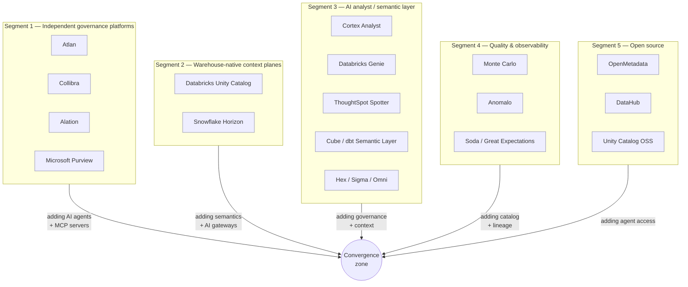

# Market Landscape

> Status: Authoritative. Owner: Product.
> Research baseline: 2026-08-28, against vendor product pages, vendor engineering blogs, and analyst-review summaries. Sources listed in `90-reference/03-sources.md`.
> Boundary: this compares Atlas to **vendor-stated public positioning**, not to private roadmaps or specific customer deployments.

## 1. How the market is actually segmented

The "data catalog" label is now misleading. Four distinct segments compete for the same budget, and each one attacks the problem from a different starting asset.

**The convergence.** Every segment is racing toward the same destination: *a governed context layer that AI agents can safely consume.* Atlan calls it a "Context Lakehouse." Collibra calls it a "governed context compiler." Snowflake calls it "Horizon Context." Databricks calls it the "Unity AI Gateway." Alation calls it "Agentic Data Intelligence."

They are all describing the same thing, and none of them has closed the loop from *context* to *governed execution*. That gap is Atlas's target.

## 2. Segment 1 — Independent governance platforms

### 2.1 Atlan

**Positioning.** "The Context Layer for AI." Repositioned from catalog to AI-context supplier.

**Stated capability set**

| Area | What they ship |
|---|---|
| Core | Enterprise Data Graph; Context Lakehouse (Iceberg-native store with vector capability); Data Marketplace |
| AI | Context Agents (documentation, data prep); Context Engineering Studio; Context Repo (versioned, reusable knowledge packages); Agent Skills (testable units of procedural knowledge) |
| Generation | Description generation, metrics generator, ontology generator, term linkage |
| Access | MCP Server for Claude/ChatGPT/other agents; integrations with Agentforce, Cortex, Genie, Codex |
| Breadth | 80+ native connectors; Snowflake, Databricks, BigQuery, Redshift, Tableau, Looker, Power BI, dbt, Airflow, Slack, Teams |
| Governance | Conflict resolution across metadata sources, certification workflows, access policy enforcement, quality scoring, GDPR/HIPAA/ISO 27001/SOC 2 |
| Posture | "Human-on-the-loop, not out of the loop"; open, portable context; context pipeline automating ~80% of initial enrichment |

**Read.** The most direct strategic competitor, because they have correctly identified that context — not cataloguing — is the product. Strongest AI-native narrative in Segment 1.

**Where they are weak for a bank.** Context supply is not execution control. Atlan hands context to an external agent (Claude, ChatGPT, Agentforce) and that agent then does whatever it does. Atlan governs the *context*, not the *query*. Nothing in their model prevents a downstream agent from generating and executing SQL outside Atlan's boundary — because that execution happens in someone else's product. For a bank, that means the auditable execution record lives in a third-party tool, not in the governance platform.

### 2.2 Collibra

**Positioning.** "Enterprise AI Control Plane." The strongest enterprise-governance and compliance narrative.

**Stated capability set**

| Area | What they ship |
|---|---|
| Modules | Data Catalog; Data Governance; Data Privacy; Data Quality & Observability; Data Lineage; Data Marketplace; AI Command Center; Deasy Labs (unstructured data for AI) |
| AI | "Governed context compiler" delivering semantic models to AI platforms; MCP Server for natural-language lineage queries; pre-built AI policy controls in Control Tower |
| Governance | Data Contract registries; Data Product registries; BCBS 239 risk-reporting controls; federated governance operating model; automated workflow designer |
| Breadth | 100+ native integrations; "Collibra Everywhere" browser extension |
| Proof | 100+ Fortune 500; FedRAMP-ready; published ROI figures |

**Read.** The incumbent a bank's governance function already knows. BCBS 239 controls and FedRAMP readiness are procurement-grade assets that Atlas does not have and cannot fake. Deepest workflow engine in the segment.

**Where they are weak.** Heavy, slow to deploy, and expensive; historically criticized for time-to-value and UX. Governance is documentary — Collibra records that a policy exists and routes an approval; it does not sit in the query path. The AI Command Center governs *models and agents as registered assets*, not *individual query executions*.

### 2.3 Alation

**Positioning.** "Agentic Data Intelligence Platform" — the most explicit agentic framing of the three.

**Stated capability set**

| Area | What they ship |
|---|---|
| Products | Search & Discovery; Data Governance (policy center); Data Lineage (automated column-level); Data Quality (AI-powered monitoring); Data Products Marketplace; Analytics (maturity measurement) |
| Agents | Documentation Agent; Data Quality Agent; Data Products Builder Agent |
| Platform | Active Metadata Graph; Workflow Automation; ALLIE AI (ML core); Open Connector Framework; Open Data Quality Framework; APIs; **AI Agent SDK** |
| Proof | Trusted by 40% of Fortune 100 |

**Read.** Alation's AI Agent SDK is the most direct competitive threat to Atlas's tool-registry differentiation — it is the same idea (let customers build governed agents on catalog context). Their behavioural/usage-driven catalog (query-log popularity) remains their strongest discovery asset.

**Where they are weak.** The agents are *metadata-enrichment* agents (document, monitor, build products), not *analytical execution* agents. Alation does not put itself in the source query path either. Data quality is a comparatively recent addition versus Monte Carlo-class specialists.

### 2.4 Microsoft Purview

**Positioning.** Unified data security + governance, tightly bound to Fabric and the Microsoft estate.

**Read.** The default choice at any bank standardized on Azure/Fabric, often bundled. Purview's real strength is the *security* half — DLP, sensitivity labels, insider risk — extended over data. Its catalog and lineage are weaker than the specialists outside the Microsoft estate, and its non-Microsoft connector story is comparatively thin. For a heterogeneous bank estate (Oracle + Teradata + mainframe + Snowflake), Purview alone does not cover the ground.

**Implication for Atlas.** Do not compete on "Azure-native." Compete on heterogeneity and on execution governance. Plan to *integrate* with Purview sensitivity labels rather than replace them.

## 3. Segment 2 — Warehouse-native context planes

### 3.1 Databricks Unity Catalog

Recent capability additions materially raise the bar:

| Area | Capability |
|---|---|
| AI governance | **Unity AI Gateway** — registers and governs models, MCP services, agents, and skills with unified access control and auditing |
| Runtime control | Contextual Service Policies (beta) enforcing runtime actions; AI Gateway Budgets with hard spend caps; Unified Agent Tracing; Governance Hub |
| Access control | ABAC grant policies; identity attributes from IdP; **context attributes distinguishing agent vs. workspace access**; tag propagation through transformations; RBAC roles |
| Semantics | Glossary (Genie drafts and refines pages); Domains; Metrics with multi-fact relationships, LOD calculations, parameterized metrics, materialization; metrics import from Power BI/Tableau |
| Lineage | External lineage GA (upstream sources + downstream BI); Lakeflow Connect auto-lineage; column-level popularity signals |
| Platform | Cross-cloud/cross-region four-level namespace; managed DR with failover; multimodal FILE type; geospatial types |

**Read — this is the most important competitive development in the document.** "Context attributes distinguishing agent vs. workspace access" and the AI Gateway are Databricks building *exactly* the agent-execution governance Atlas claims as differentiation. They have more engineering capacity and own the compute.

**Where they cannot follow.** Everything above stops at the Databricks boundary. A bank running Oracle EBS, Teradata, DB2 on z/OS, and three SQL Server estates cannot govern from Unity Catalog. Unity Catalog's answer is "move the data to Databricks" — which is a multi-year migration and, in some jurisdictions, a residency problem. **Atlas's defensible ground is heterogeneity and non-migration.**

### 3.2 Snowflake Horizon Catalog / Horizon Context

| Area | Capability |
|---|---|
| Semantics | Semantic Views; Advanced Semantics (LOD, composable definitions, automatic query rewriting); **Semantic Studio** — AI-assisted IDE with Git integration; Semantic View Autopilot generating views from SQL/Tableau/Power BI |
| Metadata | Metadata Connectors (preview) for PostgreSQL, SQL Server, Tableau, Power BI, dbt; OpenLineage API for Airflow; Open Semantic Interchange (OSI) standard |
| Context | End-to-end column-level lineage across Snowflake and external systems; popularity scoring from query logs; AI-generated documentation |
| Activation | Universal Search (hybrid keyword + semantic); automatic semantic view discovery; MCP integration with Omni, Sigma, Hex, Tableau, Power BI, Excel, ThoughtSpot, Looker |
| Governance | Semantics "enforced at the meaning level, not just the table level"; RBAC and row-level masking consistent across tools |

**Read.** Note "Semantic Studio" — Snowflake shipped a semantic authoring IDE. Any Atlas Studio must be measured against it. Note also **Open Semantic Interchange**: Snowflake is trying to standardize semantic portability, which is a threat (commoditizes the semantic layer) and an opportunity (Atlas can support OSI and consume everyone's semantics).

**Where they cannot follow.** Same as Databricks — Snowflake-gravity. Their external metadata connectors are preview-stage and shallow relative to a governance specialist.

## 4. Segment 3 — AI analyst and semantic layer

| Vendor | Approach | Governance posture |
|---|---|---|
| Snowflake Cortex Analyst | Text-to-SQL grounded in semantic views | Inherits Snowflake RBAC; execution inside Snowflake |
| Databricks Genie | Conversational analytics over Unity Catalog; Genie Rooms scope context; now drafts Glossary pages | Inherits Unity Catalog; agent-vs-workspace context attributes |
| ThoughtSpot Spotter | Agentic analytics over a modeled layer | Its own modeling layer; strong NL UX |
| Cube / dbt Semantic Layer | Headless semantic layer; metrics defined once, consumed by BI and agents | Semantic governance only; no execution policy |
| Hex / Sigma / Omni | Notebook and spreadsheet surfaces with AI assist | Workspace-level; not enterprise policy planes |

**The industry's own finding.** The published 2026 comparisons converge on one conclusion: *raw text-to-SQL against physical schemas is not enterprise-viable; a semantic layer materially improves accuracy and, more importantly, consistency.* This validates Atlas's semantic-first design — but it also means the semantic layer is now table stakes, not a differentiator.

**The gap none of them close.** All of these treat the model as trusted enough to emit executable SQL. Their safety story is "the semantic layer constrains what SQL can be generated." Atlas's is "generated SQL is parsed, policy-checked, cost-checked, and executed by a deterministic gateway that the model cannot reach." Those are different guarantees, and only the second survives a model-risk review.

## 5. Segment 4 — Quality and observability

Monte Carlo (ML-driven anomaly detection, incident management, broad warehouse coverage), Anomalo (unsupervised quality detection), Soda / Great Expectations (declarative, code-first checks).

**Read.** This is a mature adjacent market with better detection science than any catalog vendor's bundled quality feature. Atlas should not try to out-detect Monte Carlo.

**Atlas's distinct angle.** Nobody in this segment connects quality evidence *into the runtime decision*. Atlas can: a quality incident on a table should be able to (a) surface as a trust warning on any answer that used it, (b) demote that table in retrieval ranking, and (c) block a governed tool whose SLA depends on it. That is a coupling no standalone observability tool can make, because they do not own the query path.

## 6. Segment 5 — Open source

OpenMetadata (broad connector library, unified metadata standard, active community) and DataHub (LinkedIn-origin, strong at scale, streaming-oriented metadata) are the credible open-source options; Databricks also open-sourced Unity Catalog.

**Read.** These set the *price floor*. A bank platform team can stand up OpenMetadata for the cost of running it. Any commercial or internal platform must justify itself against "we could just run OpenMetadata." Atlas's justification cannot be "we have a catalog too" — it must be the governed execution plane, which no open-source catalog provides.

## 7. Consolidated competitive read

| Competitor class | Their asset | Their structural limit | Atlas's counter |
|---|---|---|---|
| Governance platforms | Breadth, compliance credibility, workflow, references | Governance is documentary; not in the execution path | Be the governance plane that *is* the execution path |
| Warehouse-native | Deep integration, huge R&D, own the compute | Single-engine gravity; cannot govern a heterogeneous estate | Heterogeneity without migration |
| AI analyst / semantic | NL UX, semantic accuracy | Model inside the trust boundary; transcript-grade auditability | Deterministic authority boundary; evidence-grade auditability |
| Quality / observability | Best detection science | Isolated from the query path | Quality evidence coupled to runtime decisions |
| Open source | Free, extensible, community connectors | No execution governance; assembly required | Ship the integrated control plane they cannot assemble |

## 8. What this means for the roadmap

Three conclusions that directly set priority in `60-delivery/01-roadmap.md`:

1. **Connector breadth is an entry ticket, not a differentiator.** Atlan has 80+, Collibra 100+. Atlas will never win on count. Target ~15 *certified, load-tested* connectors covering the bank estate, and win on certification depth and the SDK — not the number on the slide.
2. **The semantic layer is now table stakes.** Snowflake, Databricks, Cube, and dbt all ship one. Atlas must have it, and must differentiate one level up: *semantics that carry policy and operationalize into executable governed tools.*
3. **Governed agent execution is the last uncontested ground, and it is closing.** Databricks' Unity AI Gateway is the clearest signal that this window has 12–24 months. Every roadmap decision should be weighted against "does this widen or narrow our lead on governed execution?"

## Related documents

**Per-vendor deep dives** — module breakdowns, UI surfaces, architecture, and weakness assessments that complement the segment-level view above:

- Master strategy and product plan: `60-delivery/01-roadmap.md`
- Atlan: `review-2026-08/research/02-atlan.md`
- Collibra: `review-2026-08/research/01-collibra.md`
- Alation: `review-2026-08/research/03-alation-purview-unity-ainative.md`
- Purview and Databricks: `review-2026-08/research/03-alation-purview-unity-ainative.md`

Other documents:

- Feature matrix: `00-product/04-competitive-feature-matrix.md`
- Differentiation and whitespace: `00-product/05-differentiation-and-whitespace.md`
- Sources: `90-reference/03-sources.md`
