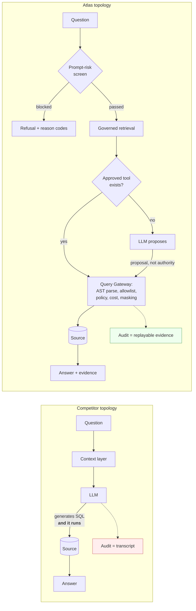

# Differentiation and Whitespace

> Status: Authoritative. Owner: Product.
> Purpose: name the specific, defensible places where Atlas can be structurally better — and the specific places where trying to win would be a mistake.

## 1. The core thesis

Every competitor has made the same architectural choice: **the model is inside the trust boundary.**

Atlan hands context to Claude/ChatGPT/Agentforce and those agents act. Snowflake Cortex generates SQL and Snowflake runs it. Databricks Genie does the same. Alation's agents write documentation and build data products. In every case, an LLM's output becomes an executed action, and the safety argument is "we gave it good context."

Atlas makes the opposite choice: **deterministic services hold all authority; models only propose.**

This is not a safety feature bolted onto a normal product. It is a different system topology, and it produces capabilities that cannot be retrofitted:

The difference that matters to a bank: in the left topology, the answer to "prove the model could not have run unapproved SQL" is *a log review*. In the right topology, it is *an architectural invariant plus runtime evidence*. Only the second passes a model-risk review.

## 2. Five defensible differentiators

Ranked by defensibility — how hard it would be for a competitor to copy.

### D1. The execution choke point (very hard to copy)

**What it is.** Every query that touches a source — generated SQL, approved tool SQL, profiler SQL, lineage extraction SQL, administrator SQL — passes through one Query Execution Gateway that requires identity, purpose, policy version, bounded timeout, row/byte limits, AST validation, and an audit correlation ID.

**Why it is defensible.** This is a *negative* architectural property: the absence of bypass paths. A competitor cannot add it incrementally, because their existing surfaces (notebooks, BI passthrough, direct warehouse access, SDK query methods) are bypass paths by design. Removing them breaks their customers. Atlas has no such paths to remove.

**What it enables.** Universal policy enforcement, universal cost control, universal masking, universal lineage capture, universal audit — each of which competitors implement per-surface and therefore incompletely.

### D2. Analysis → governed capability promotion (hard to copy)

**What it is.** A successful analysis becomes a candidate governed tool: deterministic parameterized SQL, typed parameter schema, RBAC bindings, maker-checker approval, versioning, and deprecation lifecycle. Thereafter the agent invokes the tool by name instead of regenerating SQL.

**Why it matters.** It inverts the economics of AI analytics. Every competitor's cost and risk grow linearly with usage — each question is a fresh generation, a fresh model spend, a fresh chance to be wrong. Atlas's cost and risk *decline* with usage as the tool library covers more of the question space.

**Measured as.** Tool-first execution rate. Target: ≥40% in a mature tenant.

**Why it is defensible.** It requires the deterministic rendering path (D1) plus maker-checker as a platform primitive. Alation's Data Products Builder Agent is the closest analogue, but it builds *data products* (curated datasets), not *executable governed capabilities with parameter contracts*.

### D3. Evidence-grade auditability (hard to copy)

**What it is.** Every agent run produces a value-free, replayable evidence record: prompt-risk classifier version and reason codes, retrieval selections and why they ranked, semantic and policy versions pinned, tool selection, generated or bound SQL, AST validation result, cost estimate, masking applied, output-to-source column lineage, refusals.

**Why it is defensible.** It requires designing for value-freedom from the start. Competitors log conversations; converting a conversation log into evidence that survives an audit requires knowing, at write time, what must be excluded. Retrofitting means rewriting every persistence path.

**Contrast.** Databricks' Unified Agent Tracing is the nearest competitor capability and is genuinely good — but it traces *what happened*, not *what was refused and why*, and it inherits whatever the agent could reach.

### D4. Quality and semantics coupled to runtime decisions (moderate to copy)

**What it is** — and this is currently **whitespace, not built**: a data-quality incident on a table should automatically (a) attach a trust warning to any answer using it, (b) demote it in retrieval ranking, (c) block or flag governed tools that depend on it, and (d) appear in the impact graph.

**Why nobody has it.** Monte Carlo and Anomalo detect superbly but own no query path. Catalogs own no query path either. Only a product that is *both* the governance plane and the execution plane can close this loop. Atlas is the only product in the matrix that is both.

**Priority.** This is the highest-leverage unbuilt differentiator. See `20-modules/11-data-quality.md`.

### D5. Heterogeneity without migration (structural, not technical)

**What it is.** Govern Oracle, Teradata, DB2, SQL Server, PostgreSQL, Snowflake, Databricks, and BigQuery from one plane — without moving data.

**Why it is defensible against the warehouse vendors.** Unity Catalog and Horizon are outstanding products whose answer to a heterogeneous estate is "consolidate onto us." For a bank with a mainframe, a Teradata EDW, and thirty years of Oracle, that is a decade-long programme with residency and cost implications. Atlas does not require it.

**Why it is not defensible against Atlan/Collibra/Alation.** They are heterogeneous too. Against them, heterogeneity is table stakes — D1–D4 are the differentiators.

## 3. Whitespace map

Opportunities nobody currently occupies, scored by value and by how well they fit Atlas's architecture.

| # | Whitespace | Why it is open | Fit | Value | Verdict |
|---|---|---|---|---|---|
| W1 | Quality evidence gating runtime execution and retrieval ranking | Requires owning both governance and query path | Perfect | Very high | **Build** — P1 |
| W2 | Governed context products over MCP with policy enforced *at consumption*, not just at handoff | Everyone ships an MCP server that hands over context and stops governing | Perfect | Very high | **Build** — P0 |
| W3 | AI decision lineage as a first-class, explorable graph alongside data lineage | Nobody models "why the agent chose this" as lineage | Perfect | High | **Build** — P0 |
| W4 | Negative knowledge as a product surface (what we rejected and why, reusable across runs) | Everyone discards rejections | Perfect | Medium | **Build** — P1 |
| W5 | Regulatory control packs (BCBS 239, model risk SR 11-7) generated from runtime evidence rather than authored | Collibra has BCBS 239 *controls*; nobody generates the evidence automatically | Strong | High for banking | **Build** — P1 |
| W6 | Connector certification as an open, publishable standard | Certification harnesses are internal everywhere | Strong | Medium | **Build** — P1 |
| W7 | Trust-scored answers (a numeric, explainable confidence combining quality, freshness, semantic confidence, lineage depth, tool approval) | Competitors show badges, not composite scores | Strong | High | **Build** — P2 |
| W8 | Cross-tenant benchmark of semantic coverage / governance maturity | Alation has "Analytics"; it measures adoption, not trust | Moderate | Medium | Consider — P2 |
| W9 | Source-side connector agents in restricted network zones with mTLS and no egress | Vendors assume cloud reachability; banks do not have it | Strong | High for banking | **Build** — P1 |
| W10 | Unstructured/document governance | Collibra bought Deasy Labs; Databricks has multimodal FILE type | Weak — different problem | High | **Skip this horizon** |
| W11 | Distribution into where people already work (Slack notifications/actions, browser extension over BI tools, IDE/notebook plugin) rather than a single portal | *(added 2026-08-30, from independent-practitioner review, see `90-reference/03-sources.md`)* Atlan's own differentiation claim is collaboration-hub UX, not catalog depth — Slack-native notifications and a Chrome extension over BI tools are load-bearing to its adoption story. Atlas today is a single-page portal (`ui/`) with no embedded/ambient surface; nothing reaches a user who never opens it. | Good — MCP responses and governed-tool results are already structured/typed, so a thin notification/action adapter is additive, not a new trust boundary | Medium–High (adoption, not capability) | **Consider** — P2. Cheapest first step: Slack notifications for governance events (approval requests, quality incidents, kill-switch trips) reusing the existing audit/event stream; a full browser extension is a larger bet and should wait for evidence people want it. |

## 4. Where Atlas should deliberately not compete

Naming these prevents roadmap drift. Each has been considered and rejected.

| Area | Why not | What to do instead |
|---|---|---|
| Connector count | Atlan 80+, Collibra 100+. Losing race; count is a vanity metric. | ~15 *certified* connectors + a public SDK. Win on certification depth. |
| ML anomaly detection science | Monte Carlo and Anomalo have years of head start and dedicated research. | Ship solid deterministic checks; integrate best-of-breed detectors via the quality framework; win on the *coupling* (W1). |
| BI / dashboarding | Tableau, Power BI, Looker, Sigma own it. | Supply them governed context. Be the layer beneath, not the surface. |
| ETL execution | dbt + warehouse own compilation and execution. | Ingest their artifacts as authoritative evidence. |
| General-purpose LLM quality | Not our moat; models commoditize on a 6-month cycle. | Stay model-neutral. Make the control plane the moat. |
| Unstructured data governance | Different problem, different index, different classifiers. | Revisit after the structured estate is certified. |
| Being the cheapest option | OpenMetadata is free. | Justify on execution governance, which free catalogs do not provide. |

## 5. Positioning statements by buyer

| Buyer | Their real question | Atlas's answer |
|---|---|---|
| Chief Data Officer | "Can I govern my whole estate without a migration?" | One plane over Oracle, Teradata, SQL Server, Snowflake, Databricks — no data movement. |
| Chief Risk Officer / Model Risk | "Can I prove the AI could not do something unapproved?" | Architectural invariant (one gateway, no bypass) plus replayable per-run evidence, plus a drilled kill switch. |
| Head of Data Engineering | "Will this create more work for my team?" | Inference proposes so stewards curate rather than author; the connector SDK means new sources do not require core changes. |
| Head of Analytics | "Will my analysts actually be faster?" | Tool-first execution means repeat analysis is a named call; every answer arrives with its trust evidence attached. |
| Internal Audit | "Can I get evidence without asking engineering?" | Self-service compliance packs generated from runtime evidence, WORM-archived. |
| Platform / SRE | "Can I operate this?" | Rebuildable projections, documented RPO/RTO, fleet health scoring, backpressure, and runbooks. |

## 6. The strategic clock

The governed-agent-execution window is closing. Databricks' Unity AI Gateway — model/MCP/agent/skill registration, contextual service policies, context attributes distinguishing agent from workspace access, budgets, unified tracing — is the same idea, from a vendor with far greater engineering capacity.

**Estimated window: 12–24 months** before at least one major vendor ships a credible governed-agent-execution plane for heterogeneous estates.

**What this implies for sequencing.** Do not spend the window building catalog parity features that Atlan already has. Spend it on D1–D5 and W1–W3, which compound and which competitors cannot retrofit. Close entry-ticket gaps (connectors, glossary, search) with the minimum credible investment, in parallel, and preferably by leveraging the SDK and inference rather than by hand-building breadth.

**The decision rule for every roadmap item:** does this widen or narrow our lead on governed execution? If it does neither, it needs to be closing an ENTRY gap, or it does not get built.

## Related documents

- Vision: `00-product/01-vision-and-goals.md`
- Feature matrix: `00-product/04-competitive-feature-matrix.md`
- Roadmap: `60-delivery/01-roadmap.md`
- Data quality module (W1): `20-modules/11-data-quality.md`
- Context products and MCP (W2): `20-modules/19-context-products-and-mcp.md`
- Lineage module (W3): `20-modules/09-lineage.md`
