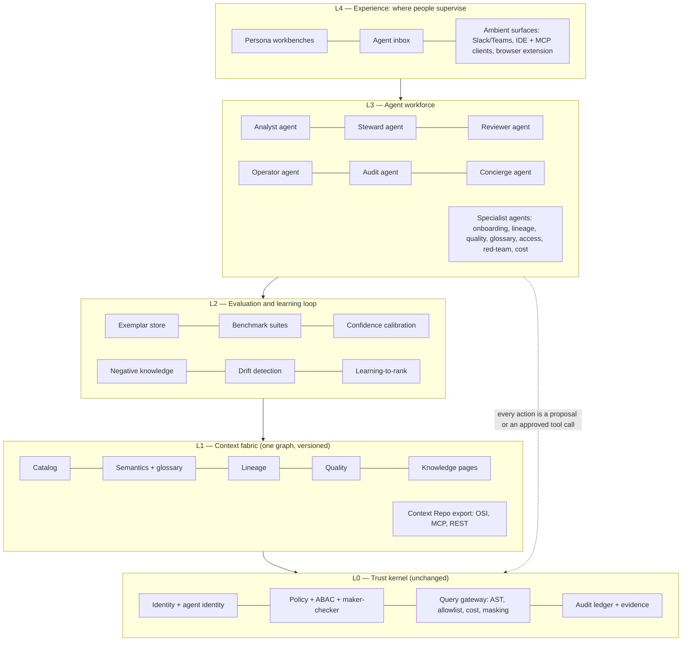

# Market Deep Dive, Target Architecture v2, and the Agentic Operating Model

> Status: **Proposal**, prepared 2026-09-04. Owner: Product + Architecture.
> Baseline compared against: `00-product/03..05` (research baseline 2026-08-28), `review-2026-08/target/05-target-architecture.md`, `60-delivery/00-status.md` (verified 2026-09-02), the `UI_Audit_Report_2026-09-03.html`, the two Atlan deep-dive documents under `Docs/` and `Docs/competitors/`, and the working tree on `feature/snowflake-dbt-lineage-mcp` at 543 commits.
> Boundary: vendor claims are taken from public announcements dated May–September 2026 and are listed in Appendix A. Statements about Atlas are taken from the code, not from earlier documents; where the two disagree this document says so.

---

## 0. Executive summary

Ten findings, in the order a decision-maker needs them.

1. **The market has finished agreeing on the destination.** Between May and July 2026 every incumbent shipped the same four things: context-drafting agents, an MCP server, an agent registry with a non-human identity model, and an evaluation gate on context before it is published. The "context layer" is no longer a positioning idea; it is a shipped feature at Atlan, Collibra, Alation, Databricks, Snowflake, Microsoft, OpenMetadata and DataHub.
2. **Two of Atlas's seven "nobody else has this" differentiators have eroded inside the warehouse boundary.** Databricks' Unity AI Gateway now enforces contextual service policies at runtime with hard budget caps, and Snowflake's Agent Identity distinguishes agent-in-session from human access. Those are the "single mandatory execution gateway" and "agent-vs-human access distinction" rows of the feature matrix, delivered by vendors with far more capacity. They remain absent *across a heterogeneous estate*, which is now the whole of Atlas's defensible ground.
3. **The remaining five differentiators are intact and under-exploited.** AST validation before execution, pre-retrieval prompt-risk screening, approved-tool-first execution, analysis-to-tool promotion under maker-checker, and negative knowledge are still absent from every vendor. Nobody has coupled quality evidence into runtime decisions, and nobody parses stored-procedure bodies at bank depth. Atlas has working code for all of these.
4. **The strategic window has shortened from 12–24 months to roughly 9–18.** The trigger is Databricks' Catalog Federation plus Genie Ontology, which is the first credible attempt at "context outside our plane." It is still Databricks-gravity, but the direction is unmistakable.
5. **Atlas's real gap is not capability, it is proof and shape.** The control plane has 6,500 tests and zero bank-scale evidence. Authorization is wired but in shadow mode everywhere. The flat 111k-line package has 132 ORM classes in one file. Five of 21 target modules are extracted. The React shell has 30 navigation items, which is a symptom of feature-first rather than persona-first design.
6. **Roles can be replaced by agents for the maker side of every workflow today, and for the checker side of low-risk classes with one architectural amendment.** The code already contains the primitives: drafters, playbooks with an auto-apply threshold, an eval gate on agent versions, an exemplar store, a query-history miner, a governance threshold, a kill switch. What is missing is an *agent contract* that binds these into named, budgeted, tiered agents with their own identity, and a console where humans supervise agents instead of doing the work.
7. **The winning product shape is a "governed agent operating system," not a better catalog.** Alation named it AIOS; Atlas can be the one that actually executes under a deterministic boundary. The architecture v2 in §5 keeps every invariant, removes two stateful services, adds an agent workforce layer, an evaluation-and-learning loop, and ambient surfaces.
8. **ML belongs in exactly three places** and is harmful in a fourth. It belongs in ranking (learning-to-rank over usage and feedback), in proposal generation (join discovery, classification, anomaly baselines, confidence calibration, selective abstention), and in prioritisation (what to review next). It must never enter the authority path: no ML model may approve, publish, unmask, or execute. That rule is INV-3 restated, and it is a differentiator rather than a constraint.
9. **The codebase is crackable with a fixed, mechanical plan**: split `models.py` by module, finish the strangler extraction in dependency order, generate the UI's API types, add three architectural fitness functions, and fold six session addenda into one tracker. Eight weeks of disciplined work, no rewrite.
10. **Beating the competitors is a sequencing problem.** Do not spend the window on catalog parity. Spend it on the six plays in §9, prove them with published benchmarks and drills, and distribute them where users already work.

---

## 1. What changed in the market since the 2026-08-28 baseline

### 1.1 Vendor moves, May–September 2026

| Vendor | What shipped | Why it matters to Atlas |
|---|---|---|
| **Atlan** (Snowflake Summit, June; Activate) | Context Agents generating 690K+ descriptions across 50+ customers in April alone, 87–89% rated on par with or better than human writing; Context Engineering Studio with a build → test → review → deploy → learn lifecycle and versioned Context Repos; MCP adoption up 17× and MCP calls up 58× since September 2025; a published 38% text-to-SQL accuracy lift from governed context on 174 queries. Named Leader in the 2026 Gartner MQ for D&A Governance Platforms. | Atlan has made "AI drafts, humans curate" the default path and measured it. Atlas's inference exists but is not framed, scored, or marketed as a workforce. The eval-gated Context Repo is the same idea as Atlas's exemplar store and change sets, but Atlan has the narrative. |
| **Collibra** (AI Command Center, 6 May) | Unified registry of agents, models and use cases; AI Trust Score aggregating documentation, data integrity, lifecycle and regulatory signals; automated end-to-end traceability; assessment templates for EU AI Act, NIST AI RMF and AI UC-1; Giskard partnership for testing; MCP Server in production at 100+ customers and a top position in the Databricks Marketplace; Databricks Governance Partner of the Year. | Collibra governs agents as *assets*. It still does not execute anything and does not sit in a query path. The trust score and regulatory templates are procurement assets Atlas lacks and can generate from runtime evidence instead of authoring. |
| **Alation** (AIOS, 14 July; IDC MarketScape Leader, 4 September) | "Intelligence Operating System": Agent Studio, Agentic Compliance, Agentic Data Governance, Conversational Analytics; explicit framing around agents that fail quietly on stale data, wrong context, or drift. | The closest positioning to Atlas's own. Alation now owns the phrase "operating system." Atlas must own "governed execution" and prove it with evidence, or it becomes an AIOS clone without the references. |
| **Databricks** (DAIS, 15–18 June) | Genie One GA on web, mobile, Slack, Teams and MCP with usage-based pricing; Genie Ontology extracting a context graph from tables, queries, dashboards and pipelines with ACLs enforced through Unity Catalog; Unity AI Gateway with contextual service policies, PII filtering, prompt-injection guards and **hard budget caps that stop requests**; agents, tools, models and skills registered as catalog objects; Catalog Federation across clouds and engines; Agent Bricks with managed memory, harness-agnostic support, MLflow tracing; ZeroOps proposing fixes in sandboxes with human approval. | This is the most important development. The "execution gateway with runtime policy" idea is now shipped inside Databricks. Catalog Federation is the first move outside the plane. Atlas's counter must be heterogeneity *plus* a deterministic boundary, not heterogeneity alone. |
| **Snowflake** (Summit, June) | CoWork and CoCo as primary agent surfaces; Horizon Context as governed semantic layer; Cortex Sense assembling context at query time, with a published benchmark rising from roughly 24% to 86% accuracy on hard questions when full context is supplied; Semantic Studio and Semantic View Autopilot; **Agent Identity** as a first-class non-human identity so policies can apply when an agent is in session; AI Security Posture Management; Iceberg v3. | Agent-vs-human access distinction is now table stakes inside Snowflake. The 24 → 86 number is the best public evidence that context, not model choice, drives accuracy. Atlas should publish its own equivalent on a bank corpus. |
| **Microsoft** (Build, May) | Fabric Data Agents GA; Fabric MCP Server with catalog search as a built-in tool; Purview DSPM for AI; AI-powered classification in Unified Catalog. | Still Azure-centric and still no first-party Purview catalog MCP. Integrate with Purview labels; do not compete for Azure-native estates. |
| **OpenMetadata / DataHub** | OpenMetadata 1.12 shipped a Metadata AI SDK and MCP server, then became the top trending GitHub repository in April 2026 at 13.5k stars, passing DataHub. DataHub MCP is in production at Block. | The free floor now includes MCP. "We have an MCP server" is worth nothing. Governed, policy-enforced-at-consumption MCP is the only version worth building. |
| **New entrants** | Actian Data Steward Agent embedded in catalog workflows; Google's Autonomous Data Steward provisioning data for other agents; OvalEdge shipping six governance agent types with an explicit "escalate high-risk, automate low-risk" doctrine; six vendors launched agent-identity products in H1 2026. | The "role as agent" idea is arriving from the edges. None of them own an execution path. |

### 1.2 What the research literature settled this year

- **Semantic grounding is decisive and measurable.** dbt Labs (April 2026) reported Claude Sonnet 4.6 moving from 90.0% to 98.2% and GPT-5.3-Codex from 84.1% to 100% on their benchmark once grounded in a semantic layer. Snowflake reported 24% → 86%. Atlan reported +38%. The implication for Atlas is that the semantic layer plus governed tools *is* the accuracy strategy, and that a bank-domain benchmark is a product feature.
- **Text-to-SQL benchmarks are unreliable as published.** CIDR 2026 work shows annotation errors materially misestimate agent performance. Atlas's exemplar store, which promotes *confirmed* runs into ground truth, is the right primitive; it should become the benchmark.
- **Confidence estimation and selective abstention are now well-studied for SQL agents** (syntax-aware logit aggregation, selective-prediction studies, calibrated tabular QA). Atlas already refuses deterministically; it can add a calibrated "I am not confident enough to answer" that is evidence-backed.
- **LLM judges are miscalibrated by default** and need at least several hundred labelled cases and calibration-based bias correction before aggregate metrics are trusted. This shapes how Atlas should build its reviewer agent.
- **Joinable-column discovery has matured** (OmniMatch's self-supervised any-join discovery, LakeBench, TabSketchFM's sketch-based representation learning, QJoin's transformation-aware joins). These work on value sketches rather than raw values, which is compatible with Atlas's value-free control plane if the sketches are computed source-side.

### 1.3 The revised differentiator ledger

| Atlas differentiator (2026-08-28) | Status 2026-09-04 | Who closed it and how |
|---|---|---|
| Single mandatory execution gateway | **Contested inside the warehouse boundary** | Databricks Unity AI Gateway contextual service policies and hard caps |
| Agent-vs-human access distinction | **Now table stakes** | Snowflake Agent Identity; Databricks context attributes |
| Deterministic AST validation before execution | Intact | Nobody |
| Pre-retrieval prompt-risk screening | Intact; Databricks has injection guards at the gateway, not pre-retrieval | Partially approached |
| Approved-tool-first execution | Intact | Nobody |
| Analysis → governed tool promotion with maker-checker | Intact | Alation's Data Products Builder is the nearest analogue |
| AI decision lineage | Intact; Databricks unified tracing is closest | Partially approached |
| Negative knowledge | Intact | Nobody |
| Quality evidence gating runtime execution and ranking | Intact, and now **built** in Atlas | Nobody |
| Stored-procedure lineage at bank depth | Intact; Atlas has a parser and per-edge review | Collibra excludes procedures on Db2/MySQL |
| Governed cross-source federation | Intact, **not built** in Atlas | Databricks federates within-plane only |

The lesson: differentiators that live *inside* one execution plane are being absorbed by the plane owners. Differentiators that require owning the boundary *across* planes are not. Every roadmap decision should be re-weighted accordingly.

---

## 2. Where Atlas actually stands (from the code, 2026-09-04)

| Dimension | Measured | Read |
|---|---|---|
| Python source | 302 files, ~111k lines; `src/aida/` flat package plus `src/atlas/modules/` | Large for its age; the flat package is the primary complexity source |
| ORM | 132 model classes in one 5,123-line `models.py`; `schemas.py` 3,929 lines | The single largest maintainability risk |
| Module extraction | 5 of 21 target modules have directories with real content (identity-tenancy, connectivity, ingestion, catalog, observability-audit); 4 import-linter privacy contracts | Strangler pattern is working, slowly |
| Tests | 226 test files, ~2,700 test functions, 6,497 passing per the last verified status | Strong unit and contract coverage; no load, soak, chaos, or pen test |
| Commit cadence | 543 commits; 186 on 2026-08-30 alone, 168 on 2026-09-01, from many concurrent sessions | Documentation and the tracker lag the code by days; six session addenda are waiting to be folded in |
| Authorization | ABAC wired into the execution path and five read surfaces; every workspace in `SHADOW`; 17 tests fail under `DENY` | Measures, does not deny. A demo-blocking gap for a bank buyer |
| Agent runtime | Typed state machine with pre-retrieval screening, tool-first planning, structured-output adapters for OpenAI and Gemini, plan evidence, eval gate on agent versions, exemplar store, kill switch | The strongest differentiating code; not organized as a workforce |
| Agentic primitives | Description drafters auto-enqueued on ingest; playbooks with `auto_apply_max_items`; bulk governance threshold; reaper; query-history miner producing join and metric candidates; per-edge-type lineage review | Every ingredient for role agents exists as an unnamed function |
| UI | Legacy vanilla-JS portal at :3000; React 18 + TypeScript shell at :3001 with 33 screens and 30 navigation items; identity header fix from the 3 September audit is in `api.ts`; all seven legacy-only areas named in that audit now have React screens | Feature parity is nearly complete; persona clarity is not |
| Retrieval | GIN full-text, live embedding similarity, graph expansion, RRF fusion; persisted pgvector index not wired | Competitive, unbenchmarked |
| Lineage | Query, dbt, OpenLineage, view, procedure, Tableau and Power BI lineage; unified transitive impact; narrated lineage screen | Ahead of the 08-28 matrix on paper; needs certification corpus |
| Connectors | PostgreSQL implemented; SQL Server beta with real fixture; Oracle, BigQuery, Snowflake, Databricks beta unverified live; Teradata and Db2 planned | The entry-ticket gap, unchanged |
| Operational evidence | None at bank scale; no drill has been run (projection rebuild, PITR, Temporal failover, credential rotation, kill switch) | The honest blocker to "production-grade" |

**The one-sentence diagnosis.** Atlas has more governed-execution capability than any vendor in the matrix and less proof, less shape, and less distribution than all of them.

---

## 3. Current architecture versus proposed architecture v2

| Axis | Current (as built) | 2026-08 target proposal | **Proposed v2 (this document)** |
|---|---|---|---|
| Core commitment | Deterministic authority, models propose (ADR-0001) | Unchanged | **Unchanged and extended to agents**: an agent is a principal with a capability envelope; it never gains authority by being an agent |
| Stores | PostgreSQL, Neo4j (per-org optional), Redis, Temporal, Kafka, MinIO | Remove Neo4j; defer Kafka; add pgvector and ephemeral DuckDB | Same as 2026-08, plus a **persisted pgvector index wired to the live path** and an **event-sourced agent ledger** table family in PostgreSQL |
| Modules | 21 target, 5 extracted, flat package for the rest | 16 merged modules | **14 modules**: the 16, with `capability` split into `agent-workforce` (agents, contracts, autonomy tiers, supervision) and `capability` (tools, context products, MCP, model gateway), and `knowledge` folded into `semantics-glossary` until INV-10 is accepted |
| Agent model | One orchestrator, one operational run type, registry entries not linked to runs | Not addressed | **Named role agents** bound to `AiAsset` versions with an `AgentRun → AiAssetVersion` link, per-agent identity, budget, autonomy tier, eval gate, and kill switch scope |
| Human roles | Six personas do the work | Same | **Six personas supervise agents**; the persona's workbench becomes an agent inbox plus the residual high-judgement tasks |
| Review | Unified queue, maker ≠ checker | Same | **Risk-tiered review**: tier-0 and tier-1 proposals may be checked by an independent reviewer agent with sampled human audit; tier-2+ remains human-only. Requires ADR-0027 amending INV-8's wording, not its intent |
| Retrieval | Hybrid, unbenchmarked | Vector + graph + policy-before-ranking | Same, plus **learning-to-rank** over usage, feedback, quality and certification signals, with the deterministic policy filter kept in front |
| Evaluation | Eval gate on agent versions; control corpus; exemplar store | Benchmark as publication gate | **Evaluation-and-learning loop as a module**: exemplars, benchmark suites per workspace, drift detection, confidence calibration, negative-knowledge feedback |
| Execution | One gateway, single-source | Federation planner, DuckDB join layer | Same; federation is the one new execution capability worth the window |
| Surfaces | Two portals, MCP, REST | Rebuilt shell | **Persona workbenches + agent inbox + ambient surfaces** (Slack/Teams, IDE/MCP, browser extension), with a design system and generated API types |
| ML | None in production | Embeddings | **ML in three lanes only** (rank, propose, prioritise), never in the authority path |
| Proof | None | Drills and benchmarks listed | **Proof as a product**: published bank-corpus benchmark, drill register with dates, compliance packs generated from evidence |

What is kept unchanged deserves stating plainly: the nine invariants, the execution choke point, the value-free control plane, maker-checker as a platform primitive, PostgreSQL as the single authority, Temporal for durable work, fail-closed defaults, and honest capability reporting. Architecture v2 adds a layer; it does not touch the kernel.

---

## 4. Architecture v2: the governed agent operating system

### 4.1 Layer diagram

### 4.2 The agent contract (module `agent-workforce`)

Every agent, whether it replaces a role or specialises a task, is an `AiAsset` of kind `AGENT` with a governed version that declares:

| Field | Meaning | Existing hook |
|---|---|---|
| `identity` | A workload identity distinct from any human; appears as `principal_kind=AGENT` in every policy decision | PG-2 `principal_kind`, Snowflake-style agent identity |
| `capability_envelope` | The governed tools, context products, and write lanes it may use; nothing else | Tool registry RBAC, context product policy, write-back lanes |
| `autonomy_tier` | T0 observe · T1 draft · T2 auto-apply below threshold with sampled audit · T3 autonomous within envelope, kill-switch scoped | `auto_apply_max_items`, `AIDA_BULK_GOVERNANCE_THRESHOLD`, kill switch |
| `budget` | Tokens, source compute, wall clock, per run and per day, hard-capped | Model route budgets, Redis MCP budgets, tool plan budgets |
| `eval_gate` | The exemplar corpus and pass threshold a new version must clear before activation | `agent_eval_gate.py`, `exemplar_store.py` |
| `evidence_contract` | The value-free trace every run must emit | `AgentRun.plan_evidence`, audit ledger |
| `supervisor` | The human persona accountable for it, and the inbox its proposals land in | Persona from OIDC groups |
| `kill_scope` | What the kill switch stops: this agent, this tier, or all model traffic | `kill_switch_blocking_state` |

Two schema changes make this real: a foreign key from `AgentRun` to `AiAssetVersion` (the roster module names this gap explicitly), and an `agent_task` table that records intent, inputs fingerprint, proposal, decision, and outcome for every unit of agent work. Both are additive.

### 4.3 What the evaluation-and-learning loop adds

The loop is the mechanism by which "agents get better without the model changing," which is the evidence-backed lesson from Alation's 60% → 100% metadata-correction case, Databricks Genie's trusted assets, and Atlan's Context Repo evals.

1. Every confirmed analyst run becomes an **exemplar** (exists).
2. Exemplars become a **benchmark suite per workspace** that every new agent version, model route, semantic version, and context product must pass (exists for agent versions; extend to the other three).
3. Every rejection in any review queue becomes **negative knowledge** retrievable at planning time (exists for relationships; extend to lineage edges, descriptions, tools).
4. Reviewer decisions train a **confidence calibration curve** per proposal type (machinery exists in RL-7; no corpus yet).
5. Usage, feedback, quality incidents and certification train a **learning-to-rank** model for retrieval (new).
6. A **drift detector** re-runs the suite on a schedule and demotes any version whose score falls (new, small).

---

## 5. Replacing roles with agents

### 5.1 The principle

A role is a bundle of jobs. Some of those jobs are *making* (draft, propose, classify, execute an approved tool, monitor), some are *checking* (approve, reject, certify), and some are *being accountable* (sign the attestation a regulator reads). Agents can take all of the making today, the checking for low-risk classes with one amendment, and none of the accountability. The persona survives as the supervisor of its agent, which is exactly the "human-on-the-loop" posture the whole market now claims and Atlas can actually enforce.

### 5.2 Role-by-role mapping

| Persona | Jobs that move to an agent | Agent | Tier | Existing code the agent is assembled from | What stays human |
|---|---|---|---|---|---|
| **Analyst** | A1 answer, A2 trust explanation, A3 find asset, A4 repeat analysis | **Analyst agent** (exists as `GovernedAgentOrchestrator`) | T2 for approved tools, T1 for freeform SQL proposals | `agent_orchestrator.py`, `tool_api.py`, `retrieval.py`, `exemplar_store.py` | Deciding what question matters; confirming a run into an exemplar |
| **Business consumer** | B1 run approved analysis, B2 is this official, B3 share with evidence | **Concierge agent** in Slack/Teams and marketplace search | T2 | Tool registry, marketplace API, context products | Nothing; this persona becomes pure consumption |
| **Steward** | S1 document domain, S3 assign ownership, S5 coverage | **Steward agent**: drafts descriptions, terms, links, ownership rules; runs playbooks; proposes classifications | T1 by default, T2 for playbooks below the governance threshold | `asset_description_service.py`, `newly_created_table_drafter.py`, `semantic_inference.py`, `playbooks.py`, `classification_propagation.py`, `metric_suggestion_service.py` | S2 conflict resolution between business units; final say on meaning |
| **Reviewer / checker** | R1 context assembly, R3 queue triage, and the *decision* for tier-0/1 classes | **Reviewer agent**: pre-reviews every proposal, attaches blast radius, diff, evidence, and a calibrated recommendation; auto-decides tier-0/1 items with an independent agent identity, sampled to a human at a set rate | T2 for tier-0/1, T0 above | Unified review queue, `agent_eval_gate.py`, impact analysis, bulk decisions PG-3 | Every tier-2+ decision; the sampling audit; setting the tiers |
| **Platform operator** | P2 failing scans, P3 projection rebuild, P4 rotation, P6 cost | **Operator agent** (ZeroOps pattern): root-causes from logs and lineage, proposes remediation, runs approved runbooks | T1 proposals, T2 for runbooks marked safe | `fleet.py`, `operational_api.py`, `reaper_service.py`, `graph_reconciliation.py`, scheduler | Approving anything that touches credentials, network, or production topology |
| **Auditor / risk** | U1 ledger search, U3 approval chains, U4 evidence packs | **Audit agent**: continuous control monitoring, drift alerts, generates BCBS 239 / SR 11-7 / EU AI Act packs from runtime evidence | T2, read-only by construction | `compliance_packs.py`, audit ledger, `ai_governance_api.py` | Signing the attestation |

### 5.3 Specialist agents that have no human role today

| Agent | Purpose | Tier | Built from |
|---|---|---|---|
| **Onboarding agent** | Registers a source from a ticket, runs certification, proposes bindings, opens the fleet schedule | T1 | Connectivity certification, workspace bindings, fleet |
| **Lineage agent** | Parses views and procedures, proposes edges, attaches parser evidence, files review items | T1 (T2 for trusted sources) | `procedure_lineage.py`, `view_lineage_api.py`, per-edge review (LR-1), `Datasource.trusted_for_lineage` |
| **Quality agent** | Proposes rule packs from profiles and query history, tunes thresholds, triages incidents, routes | T1, T2 for routing | `quality_service.py`, `dbt_quality_bridge.py`, DQ-1..4 |
| **Glossary agent** | Mines terms from query history and documents, detects conflicting definitions across LOBs | T1 | `query_history_miner.py`, SM-2 bindings, conflict resolution |
| **Access agent** | Simulates policy impact, proposes ABAC policies from classification patterns, handles marketplace access requests | T1; never grants | PG-8 simulation, `policy_native_sync.py`, marketplace lifecycle |
| **Red-team agent** | Continuously replays the model-risk corpus and mutates it (multilingual, obfuscated, indirect injection) against every active route | T3 within a sandbox envelope | `prompt_risk.py`, `agent_evals.py`, model-risk benchmark |
| **Cost agent** | Forecasts token and source spend per LOB, proposes budget changes, flags anomalous consumption (aggregate exfiltration T20) | T1 | Budgets, MCP budgets, audit ledger |

### 5.4 Risks of an agent workforce and the controls Atlas already has

| Risk (from the 2026 practitioner literature) | Atlas control |
|---|---|
| Agents acting on incomplete metadata | Honest capability flags (INV-9); quality gating of tools; abstention when evidence is thin |
| Policy that does not translate to machine logic | ABAC engine with DENY ceiling; policy simulation before activation |
| Autonomy calibration | Tier per agent per workspace; governance threshold; sampled audit rate as a number, not a policy document |
| Emergent multi-agent conflicts | One state envelope per run (no hidden permissions); agents communicate only through proposals in the review queue, never directly |
| Explainability | Plan evidence on every run; AI decision lineage; refusal reason codes |
| Blast radius of non-human identities | Agent identity distinct from the invoking human; envelope smaller than the human's; kill scope per agent |

### 5.5 The one amendment needed

INV-8 says maker ≠ checker. Its intent is that no single actor approves its own work. An independent reviewer agent, with its own identity, own model route, own eval gate, and no shared context with the maker agent, satisfies that intent for tier-0/1 classes (descriptions, synonyms, tag applications, owner assignments under N items, lineage edges from trusted sources). Propose **ADR-0027: risk-tiered agent checking**, with three hard conditions: the reviewer agent can only approve, never publish a semantic version or change policy; every auto-approved item is sampled to a human at a configurable rate with a floor of 5%; and a single human can suspend the tier for a workspace with one action. Regulators accept sampled human oversight of automated controls already; they do not accept its absence.

---

## 6. UI features and functionality

The 3 September audit found the shell's problem was one missing header and a thin front door. Both are fixed or fixable. The larger problem is now visible: 30 navigation items across six groups is a feature map, not a product. The competitor benchmark in that audit ("Notion crossed with Slack" for Atlan, steward-first density for Alation) points at the same conclusion. The recommendations below are ordered by leverage.

### 6.1 Structural changes

1. **Collapse navigation to six persona workbenches plus one agent inbox.** Each workbench is the persona's jobs from `02-personas-and-jobs.md`; the 30 screens become tabs, panels, or inspectors inside them. The command palette stays as the universal escape hatch. This is a routing change, not a rebuild; the screens already exist.
2. **Agent inbox as the new home.** For every persona: what its agents did since last visit, what is waiting for a decision (ranked by blast radius and confidence), what was auto-applied and sampled for audit, and the autonomy dial for each agent in this workspace. This is the single screen no competitor has, because no competitor separates agent proposals from human decisions structurally.
3. **Evidence-first answer layout.** The Ask screen shows the answer, then a trust strip: composite trust score (W7), semantic and policy versions pinned, quality warnings, lineage depth, tool-or-freeform badge, masking applied, and the refusal explainer when applicable. Every element is a permalink into an inspector.
4. **Trust signals at a glance on every row.** Certification pill, freshness age, quality state, owner avatar, AI-drafted versus human-confirmed provenance (the Select Star pattern) on catalog rows, marketplace cards and search hits. The data exists; the display does not.
5. **Provenance styling everywhere prose appears.** AI-drafted text renders visibly differently from human-confirmed text until confirmed. Generalise from descriptions to terms, knowledge blocks, and lineage narration.

### 6.2 Workflow features

6. **Review as a decision surface, not a list.** Proposal detail shows diff, blast radius graph, calibrated confidence, negative-knowledge hits ("a similar proposal was rejected on 12 June because…"), and one-keystroke bulk decisions with per-item rationale. Delegation and sampling stats visible.
7. **Conversational marketplace and search.** "What is our most trusted churn dataset for retail?" answered by the concierge agent with cards, not a filtered table. Atlan ships this; the retrieval stack already supports it.
8. **Playbook and policy builders without code.** Filter → action → schedule → approval rule, rendered as a small flow graph. Policy builder with live simulation results before activation.
9. **Studio as an IDE.** Change sets, diff, test harness and impact preview exist; add inline eval results, exemplar coverage, and a "promote this run to a tool" flow that starts from the Ask screen.
10. **Narrated lineage as the default, graph as the drill-down.** The narrated screen is ahead of both competitors' static graphs; make it the entry point and keep the unified graph one click away with the level-of-detail renderer.
11. **Collaboration primitives.** Comment threads and mentions on assets, terms, and proposals; the one feature-level gap both named competitors have. Comments feed the steward agent as evidence.

### 6.3 Distribution surfaces (W11, now P1)

12. **Slack and Teams.** Governance events (approval requests, quality incidents, kill-switch trips), the concierge agent, and one-tap approvals for tier-1 items. Reuses the outbox stream and governed tools; no new trust boundary.
13. **IDE and MCP clients.** The MCP server already exists; publish a Cursor/VS Code-facing context product so engineers get Atlas context in their editor, with policy enforced at consumption.
14. **Browser extension over BI tools** as a later bet, gated on evidence people want it.

### 6.4 Foundations

15. **Design system.** `tokens.css` and `primitives.tsx` exist; formalise density modes (steward-dense, consumer-airy), theme, and accessibility as tokens.
16. **Generated API types (UX-14)** from the OpenAPI baseline so the 33 screens stop hand-maintaining types.
17. **Certification of the shell**: axe-core WCAG AA in CI, million-row virtualization test as a Tier-4 job, keyboard-only walkthrough of every workbench.
18. **Retire the legacy portal** once the six workbenches exist; two portals against one API is a permanent tax.

---

## 7. Flexibility for users

Flexibility in a regulated product means *configurable within the invariants*, never *configurable around them*. Eight layers, cheapest first.

| Layer | What the user can change | Mechanism | Invariant boundary |
|---|---|---|---|
| Autonomy | Per-workspace, per-agent tier and sampling rate | Agent contract | Tier-2+ always human; kill switch always available |
| Policy | ABAC rules, purposes, masking, budgets, governance thresholds | Policy builder with simulation | DENY ceiling; models cannot edit policy |
| Automation | Playbooks, quality rule packs, notification routes | No-code builders on existing objects | Playbooks route through review above threshold |
| Meaning | Custom object types, templates, typed fields, categories (the Alation Articles/Hubs model) | Template registry per organization | Immutable versions; provenance on every field |
| Context | Which assets, terms and tools compose a context product; export as OSI or Context Repo | Context compiler | Policy enforced at consumption, not only at handoff |
| Models | Bring your own route (OpenAI, Gemini, private endpoint), embedding provider, PDP (OPA or bank PDP) | Route versions, adapters | Route approval is not activation (ADR-0009) |
| Sources | Connector SDK, envelope v1.1 producers, source-side agents in restricted zones | SDK + certification harness | Honest capability flags derived from certification |
| Surface | Persona workbench layout, density, ambient channels, language | Preferences + design tokens | Persona from identity provider, never from a dropdown in production |

Two further flexibility features are worth building because the vendors are weak on them: an **opinionated default operating model** that a bank can adopt in a day and then extend (the direct answer to Collibra's 12–18 month curation tax), and **workspace-scoped experimentation**: a sandbox workspace where tiers, policies, and routes can be trialled against the same estate with evidence, then promoted.

---

## 8. How to beat the competitors

Six plays, ordered by how much lead they create per month of effort. Each names the competitor it beats and the proof that makes it a procurement asset rather than a claim.

| # | Play | Beats | What ships | Proof |
|---|---|---|---|---|
| 1 | **Governed execution across the whole estate, including federation** | Databricks, Snowflake (plane-bound); Collibra, Atlan, Alation (no execution) | Federation planner with DuckDB join layer; leaf queries through the gateway; one policy, one cost ceiling, one audit record per plan | A published demo joining Oracle and Snowflake under one policy with replayable evidence |
| 2 | **Agents you can audit** | Alation AIOS, Collibra AI Command Center, Atlan Context Agents | The agent workforce with contracts, tiers, sampling, kill scope, and the agent inbox | Per-agent evidence pack; a drilled kill switch with a date |
| 3 | **Eval-gated context as a publication gate** | Atlan Context Engineering Studio, Genie trusted assets | Benchmark suites from exemplars gating agent versions, routes, semantic versions and context products; drift detector | Bank-corpus benchmark published with accuracy, refusal, and abstention curves |
| 4 | **Compiled knowledge with negative knowledge** | Everyone (all four uncontested spaces from the cross-vendor synthesis) | Provenance-tracked pages, INV-10, rejected inferences retrievable at planning time | A steward-facing "why not" surface; measured re-proposal rate near zero |
| 5 | **Regulatory packs generated, not authored** | Collibra (authored BCBS 239 controls) | BCBS 239, SR 11-7, EU AI Act packs generated from runtime evidence, WORM-archived | A pack a model-risk officer accepts without engineering help |
| 6 | **Distribution where people work** | Atlan (Slack-native adoption story), Genie One (Slack/Teams/mobile) | Slack/Teams concierge and approvals; IDE context product | Weekly active users outside the portal |

And the explicit refusal list, because the window is short: no connector-count race (target 12 certified, win on the SDK and certification depth), no ML anomaly science (integrate Monte Carlo-class detectors, win on coupling), no BI builder, no unstructured governance this horizon, no custom LLM training, no second catalogue seam, no unbounded agent SQL socket.

---

## 9. Cracking the codebase

The complexity is real but ordinary: a fast-growing flat package, a monolithic model file, concurrent authorship, and a documentation set that lags by days. None of it needs a rewrite. The plan below is mechanical on purpose.

### 9.1 Reading the code (for anyone new)

Entry points in order: `src/aida/main.py` mounts routers; routers in `src/aida/*_api.py` and `src/atlas/modules/*/router.py`; services in `*_service.py` and `src/atlas/modules/*/service.py`; every source touch ends in `query_gateway.py` (INV-2, enforced by import-linter); durable work in `workflows/`; evidence in `events.py`. Read modules 01 → 04 → 16 → 13 in the module index, then `agent_orchestrator.py` end to end. The module index's last column is the map from concept to file and is the most valuable page in the documentation set.

### 9.2 Eight-week plan

| Week | Work | Fitness function that makes it stick |
|---|---|---|
| 1 | Fold the six session addenda into `03-tracker.md`; re-verify `00-status.md` §1; merge the parallel migration heads the lineage-review addendum found | `test_doc_claims.py` extended to assert tracker IDs cited in addenda exist in the tracker |
| 2–3 | Split `models.py` by module into `atlas/modules/<m>/models.py` with the existing re-export shim pattern; same for `schemas.py` | Import-linter contract per module (already the pattern); a test that `aida.models` contains only re-exports |
| 3–5 | Extract the next four modules in dependency order: policy-governance, query-gateway, tool-registry, agent-runtime (the trust kernel first, because everything depends on it) | Layering contract: intelligence modules never import runtime modules; runtime never imports experience |
| 5–6 | Add `AgentRun → AiAssetVersion`, the `agent_task` table, and the agent contract schema | Tier-0 test: no agent action reaches the gateway without an envelope |
| 6–7 | Generate UI types from OpenAPI (UX-14); route the 33 screens under six workbenches | OpenAPI baseline diff gate in CI |
| 7–8 | Run the five drills once (projection rebuild, PITR, Temporal failover, rotation, kill switch) and record dates in the drill register | A CI job that fails when a drill date is older than 90 days |

### 9.3 Standing disciplines

- **One tracker, one status page, append-only log.** The rules already exist in `00-status.md` §10; enforce them with a CI check rather than goodwill.
- **CODEOWNERS per module** so concurrent sessions stop colliding in `models.py` and `api.py`.
- **Architecture fitness functions in CI**: import-linter (exists), the doc-claim test (exists), a cycle detector over module imports (new), and the OpenAPI byte-identity gate for router splits (exists as an exit criterion, not yet a job).
- **Complexity budget**: no file over 1,000 lines without an ADR; the current top ten violate it and are the extraction targets.
- **AI-assisted comprehension**: generate a per-module README from the module spec's §11 plus the actual file list on every merge, so the map never drifts from the territory again.

---

## 10. Machine learning: every angle, with the fit stated honestly

The rule first, because it is the product: **ML proposes and ranks; it never decides.** An ML classifier may add a block, a warning, or a demotion; it may never remove one, approve, publish, unmask, or execute. Every ML output carries model version, features, and a calibrated confidence, and is retained as evidence including when rejected.

| # | Lane | Technique | Purpose | Data Atlas already has | Value-free compatible | Effort | Priority |
|---|---|---|---|---|---|---|---|
| 1 | Rank | **Learning-to-rank** (LambdaMART/LightGBM) over lexical, vector, graph, usage, feedback, quality, certification, recency features | Better retrieval and search; the single biggest accuracy lever after semantics | Fusion evidence per query, consumption edges, exemplar confirmations, quality incidents | Yes | Medium | **P0** |
| 2 | Rank | **Cross-encoder rerank** of the top-k with an approved route | Precision on the first result | Same | Yes (metadata only) | Low | P1 |
| 3 | Propose | **Self-supervised joinable-column discovery** on value sketches (MinHash/HLL/TabSketch-style) computed source-side through the gateway | Relationship candidates beyond naming heuristics; composite keys | RL-1..6 candidates, constraint inventory, profiling activity | Yes if only sketches leave the source; needs an INV-6 note that sketches are statistics | Medium | **P0** |
| 4 | Propose | **Confidence calibration** (isotonic/Platt) per proposal type against reviewer decisions | Honest confidences; drives auto-apply thresholds | RL-7 machinery; review decisions | Yes | Low | **P0** once a labelled corpus exists |
| 5 | Propose | **Classification ensembles** (name patterns + type + sketch statistics + lineage label propagation) | PII/PCI detection with propagation along lineage | `classification_propagation.py`, classification feed | Yes | Medium | P1 |
| 6 | Propose | **Time-series anomaly baselines** on value-free profile statistics (robust z-score, seasonal decomposition) | Fewer false incidents; seasonality-aware freshness | Immutable profile observations per scan | Yes | Low | P1 |
| 7 | Propose | **Exemplar-retrieved few-shot generation** (nearest confirmed runs as in-context examples) | Text-to-SQL accuracy; the Genie trusted-assets lesson | Exemplar store | Yes | Low | **P0** |
| 8 | Propose | **Confidence estimation and selective abstention** for generated SQL (syntax-aware logit aggregation where available; black-box consistency otherwise) | Evidence-backed "not confident enough to answer" | Plan evidence, run outcomes | Yes | Medium | P1 |
| 9 | Propose | **Calibrated LLM-as-judge** for the reviewer agent, with bias correction and a minimum labelled set before trusting aggregates | Tier-0/1 pre-review recommendations | Review decisions, exemplar verdicts | Yes | Medium | P1 (with ADR-0027) |
| 10 | Propose | **Supervised prompt-risk classifier** layered over the deterministic one; embedding similarity to the attack corpus; multilingual | Closes the multilingual and obfuscation gap without weakening the deterministic floor | Model-risk corpus, red-team agent output | Yes | Low | P1 |
| 11 | Propose | **Term and metric mining** from query history (already deterministic) plus clustering of metric shapes | Glossary agent, metric suggestions | `query_history_miner.py` | Yes | Low | P2 |
| 12 | Propose | **Claim entailment checking** of generated prose against structured metadata | INV-10 support: generated knowledge that cites its inputs | Knowledge compilation inputs | Yes | Medium | P2 |
| 13 | Prioritise | **Usage × impact × deficit scoring** for what to document, review, or certify next; active learning to pick review items that most improve calibration | Steward and reviewer agents' worklists | Consumption edges, coverage snapshots, unowned backlog | Yes | Low | **P0** |
| 14 | Prioritise | **Aggregate exfiltration detection** (per-principal query-pattern anomaly over the audit ledger) | Threat T20 | Audit ledger | Yes | Medium | P1 |
| 15 | Prioritise | **Cost forecasting** per LOB and per agent | Cost agent, budgets | Budgets, run evidence | Yes | Low | P2 |
| 16 | Later | **Graph ML** (node embeddings, link prediction) on the knowledge graph | Relationship and impact suggestions at scale | Unified graph | Yes | High | P3, only after 3 and 4 show limits |

What deliberately stays out: training or fine-tuning foundation models (model-neutral is the moat), ML anomaly science competing with Monte Carlo, any ML in the authorization decision, and any ML that needs raw source values in the control plane.

---

## 11. Roadmap and measures

| Horizon | Deliverables | Measures |
|---|---|---|
| **0–3 months** | Codebase plan §9.2; agent contract and inbox; LTR v1; exemplar few-shot; prioritisation scoring; authorization out of shadow for one workspace; Slack notifications; drills run once | Tool-first rate; auto-apply rate with sampled-audit disagreement below 3%; retrieval recall@10 on the exemplar set; five drill dates in the register |
| **3–6 months** | Reviewer agent with ADR-0027; steward, lineage, quality agents at T1; federation planner MVP; bank-corpus benchmark published; conversational marketplace; six-workbench shell; legacy portal retired | Benchmark accuracy, refusal and abstention curves; proposals-per-steward-hour; time-to-first-value in a fresh tenant under one day |
| **6–12 months** | Operator and audit agents; generated regulatory packs; join-discovery ML; calibration curves published; IDE context product; Teradata and Db2 connectors certified; load and soak at 1M objects | p95 targets measured; one third-party connector certified; a compliance pack accepted by a model-risk reviewer |

---

## 12. Risks and decisions this document creates

| # | Decision | Recommendation |
|---|---|---|
| 1 | Accept ADR-0027 (risk-tiered agent checking) | Accept with the three hard conditions in §5.5; without it the reviewer agent is a triage tool only, which is still valuable |
| 2 | Accept INV-10 (generated knowledge never silently authoritative) | Accept now; every agent in §5 produces prose |
| 3 | Persisted pgvector index and LTR feature store | Build; both are rebuildable projections under INV-1 |
| 4 | Sketch-based join discovery under INV-6 | Amend INV-6 to state that fixed-size hashed sketches are statistics, not values, and cap sketch cardinality |
| 5 | Federation in this window | Yes; it is the only execution capability that widens the lead against the plane owners |
| 6 | Navigation collapse to six workbenches | Yes; it is a routing change and the highest-leverage UX move available |

The risk worth naming above all others is the same one the status page names: shipping capability faster than proof. Every play in §8 has a proof column for that reason.

---

## Appendix A — Sources consulted 2026-09-04

Vendor and analyst:
- Atlan at Snowflake Summit 2026 announcements: https://atlan.com/snowflake-summit-2026-announcements/
- Atlan, context layer guides and Activate 2026: https://atlan.com/know/context-layer-for-ai-agents/ , https://atlan.com/activate/
- Atlan Gartner MQ 2026 Leader: https://atlan.com/gartner-magic-quadrant-data-governance-2026/
- Collibra AI Command Center launch and product page: https://www.collibra.com/company/newsroom/press-releases/collibra-launches-ai-command-center-to-scale-agentic-ai , https://www.collibra.com/products/ai-command-center , https://siliconangle.com/2026/05/06/collibras-new-ai-command-center-promises-cut-back-agentic-hallucinations/
- Collibra and Databricks partnership: https://www.collibra.com/company/newsroom/press-releases/collibra-named-databricks-governance-partner-of-the-year
- Alation AIOS launch: https://www.globenewswire.com/news-release/2026/07/14/3326909/0/en/alation-launches-aios-all-new-intelligence-operating-system-for-enterprise-ai.html , https://www.techtarget.com/searchdatamanagement/news/366645666/Alation-launches-OS-for-building-governing-AI-agents
- Alation IDC MarketScape 2026: https://www.globenewswire.com/news-release/2026/09/04/3356577/0/en/alation-named-a-leader-in-the-2026-idc-marketscape-for-worldwide-data-intelligence-platform-software.html
- Databricks DAIS 2026: https://www.databricks.com/blog/agent-bricks-dais-2026 , https://bcastelino.com/blogs/blog/databricks-data-ai-summit-2026/ , https://lovelytics.com/post/data-ai-summit-2026-recap/ , https://www.flexera.com/blog/perspectives/databricks-data-ai-summit-2026/
- Snowflake Summit 2026: https://www.constellationr.com/insights/news/snowflake-summit-2026-context-custom-model-training-iceberg-v3 , https://futurumgroup.com/insights/snowflake-summit-2026-four-infrastructure-bets-that-determine-whether-the-agentic-enterprise-delivers/ , https://medium.com/snowflake/snowflake-summit-2026-summary-of-new-features-09f3d5ffeefe , https://www.flexera.com/blog/perspectives/snowflake-summit-2026/
- Snowflake Agent Identity: https://docs.snowflake.cn/en/user-guide/agent-identity , https://www.snowflake.com/en/blog/securing-the-agentic-enterprise/ , https://nhimg.org/articles/snowflake-cortex-agents-turn-broad-role-access-into-data-exposure/
- Microsoft Build 2026 and Fabric MCP: https://dbi-analytics.de/en/blog/microsoft-build-2026-agentic-bi-governance , https://blog.fabric.microsoft.com/en-US/blog/agentic-fabric-how-mcp-is-turning-your-data-platform-into-an-ai-native-operating-system/
- OpenMetadata and DataHub MCP: https://open-metadata.org/mcp , https://blog.pebblous.ai/report/openmetadata-ai-ready-data-2026-04/en/ , https://docs.datahub.com/docs/features/feature-guides/mcp , https://datahub.com/blog/datahub-mcp-server-block-ai-agents-use-case/
- Gartner MQ 2026 commentary: https://www.ataccama.com/blog/gartner-magic-quadrant-for-data-and-analytics-governance-platforms-2026-explained-what-changed-this-year
- Agentic governance practice: https://www.ovaledge.com/blog/agentic-data-governance , https://www.actian.com/blog/data-intelligence/data-steward-agent-the-missing-layer-between-ai-and-context/ , https://promethium.ai/guides/ai-agent-data-governance-enterprise-playbook-2026/

Research:
- dbt Labs semantic-layer accuracy (April 2026), via https://atlan.com/know/ai-agent/data-for-ai/text-to-sql-for-enterprise/
- Text-to-SQL benchmark annotation errors (CIDR 2026): https://www.vldb.org/cidrdb/papers/2026/p5-jin.pdf
- Confidence estimation for text-to-SQL: https://arxiv.org/pdf/2508.14056 ; selective prediction: https://arxiv.org/pdf/2607.06799 ; calibrated tabular QA: https://arxiv.org/pdf/2604.12491
- LLM-as-judge bias and calibration: https://arxiv.org/pdf/2605.06939 , https://arxiv.org/pdf/2407.18370 ; production SQL accuracy evaluation: https://arxiv.org/pdf/2604.28049
- Enterprise agent benchmarks: https://arxiv.org/pdf/2606.03363 (EntSQL), https://arxiv.org/pdf/2512.04324 (DAComp), https://arxiv.org/pdf/2602.13521 (tribal knowledge), https://clickhouse.com/blog/agentic-analytics-benchmark-data-agent-mnist
- Join discovery: https://www.vldb.org/pvldb/vol18/p4588-koutras.pdf (OmniMatch), https://www.vldb.org/pvldb/vol17/p1925-chai.pdf (LakeBench), https://arxiv.org/pdf/2407.01619 (TabSketchFM), https://arxiv.org/pdf/2512.02444 (QJoin), https://arxiv.org/pdf/2510.24599
- Learning to rank: https://www.elastic.co/docs/solutions/search/ranking/learning-to-rank-ltr , https://www.algolia.com/blog/engineering/learn-to-rank

Internal:
- `Docs/00-product/01..07`, `Docs/review-2026-08/research/04-cross-vendor-synthesis.md`, `Docs/review-2026-08/target/05-target-architecture.md`, `Docs/60-delivery/00-status.md`, `Docs/60-delivery/09..16-session-*.md`, `Docs/UI_Audit_Report_2026-09-03.html`, `Docs/competitors/Atlan_Concept_Deep_Dive.docx`, `Docs/Atlan-context.docx`, and the source tree as listed in §2.
