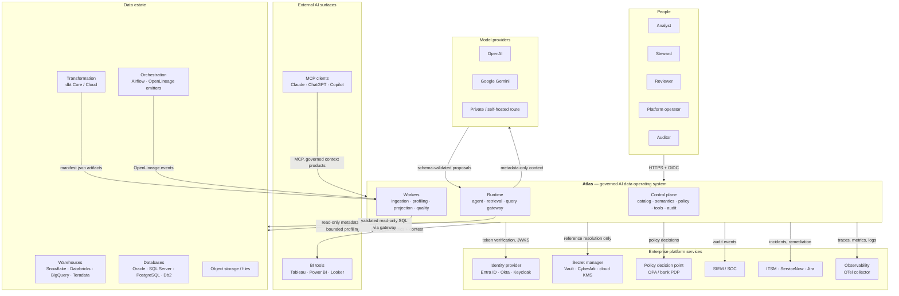

# System Context

> Status: Authoritative. Owner: Architecture.
> Scope: what sits outside Atlas, what crosses the boundary, and what the trust posture of each crossing is.

## 1. Context diagram

## 2. Boundary crossings and trust posture

Each crossing is a place where something outside Atlas can influence something inside it. Each has a defined posture.

| # | Crossing | Direction | Trust posture | Control |
|---|---|---|---|---|
| X1 | User / agent → API | in | **Untrusted** | Signed OIDC verification (issuer, audience, expiry, algorithm, subject); role and organization claim mapping; deny by default |
| X2 | User question → agent runtime | in | **Hostile-capable** | Pre-retrieval prompt-risk screening before retrieval, model context, or tool selection |
| X3 | Source metadata → catalog | in | **Semi-trusted, value-suspect** | Envelope validation; bounded sizes; rejection of value-bearing attribute keys; no raw payload retention |
| X4 | Retrieved metadata → model context | internal | **Untrusted content** | Indirect-injection screening (planned P0); bounded grounding; no raw values |
| X5 | Model → runtime | in | **Untrusted** | Strict schema validation; proposal types are inert (INV-3) |
| X6 | Runtime → source | out | **Privileged** | Query Execution Gateway: identity, purpose, AST validation, allowlist, cost gate, timeout, row/byte caps, masking (INV-2) |
| X7 | Atlas → secret manager | out | **Reference-only** | Only opaque references persisted; plaintext never stored; bounded cache with rotation invalidation |
| X8 | Atlas → SIEM | out | **One-way** | Append-only audit export; no inbound command path |
| X9 | MCP client → context products | in | **Untrusted** | Same identity, policy, and value-freedom guarantees as native surfaces; consumption is policy-evaluated per read |
| X10 | dbt artifacts → transformation intelligence | in | **Semi-trusted** | Immutable import; SQL literal redaction; raw artifact not persisted; artifact SQL never executed |
| X11 | OpenLineage events → lineage | in | **Semi-trusted** | Schema validation; producer identity; bounded event size |
| X12 | Outbox → Kafka → projectors | internal | **At-least-once** | Stable event IDs; idempotent consumers; committed offsets; dead-letter with authorized requeue |

**The key reading of this table.** X2, X4, and X5 are the AI attack surface. X6 is the blast-radius control. Every competitor in `00-product/03-market-landscape.md` has X2 and X5; almost none has a real X6.

## 3. What Atlas does not own

Explicit dependency boundaries. Atlas integrates with these and must not reimplement them.

| Concern | Owner | Atlas's role |
|---|---|---|
| Authentication | Enterprise IdP | Verify tokens; map claims to roles and tenancy |
| Ultimate data authorization | Source system | Respect it; add a second, stricter layer. Never grant access the source would deny. |
| Secret storage | Enterprise secret manager | Hold references; resolve at runtime; never persist plaintext |
| Transformation execution | dbt + warehouse | Ingest artifacts as evidence |
| Pipeline orchestration | Airflow / enterprise scheduler | Consume OpenLineage; do not schedule ETL |
| Dashboarding | BI tools | Supply governed context |
| Incident ticketing | ITSM | Emit; do not replace |
| Log aggregation / SIEM | Enterprise SOC | Export; do not replace |
| Model hosting | Provider or private endpoint | Route, budget, and govern; do not host |

## 4. Data classes crossing the boundary

| Class | Enters Atlas? | Persisted? | Reaches a model? |
|---|---|---|---|
| Structural metadata (names, types, constraints) | Yes | Yes, authoritative | Yes — this is the grounding set |
| Statistical profiles (counts, null rates, distinct, length) | Yes | Yes, value-free | Yes, bounded |
| Sample row values | **No** | No | No |
| Query result sets | Transiently | No (bounded approved results only, with retention policy) | No by default |
| User questions | Yes | **Fingerprint only** (keyed HMAC) | Yes — the question is the prompt |
| Generated SQL | Yes | Yes, **literals redacted** | N/A |
| dbt compiled SQL | Yes | Yes, **literals redacted**, plus hash | Bounded |
| Credentials | **Never** | Reference only | Never |
| Audit evidence | Generated internally | Yes, append-only | No |

This table is the operational definition of INV-6. `50-security/01-security-architecture.md` carries the full classification and retention policy.

## 5. Failure posture of each external dependency

| Dependency | If unavailable | Posture |
|---|---|---|
| Identity provider | All authenticated requests fail | **Fail closed** — no cached-credential fallback beyond JWKS cache TTL |
| Secret manager | Source connections cannot establish | **Fail closed** — bounded cache serves in-flight work, then denies |
| Policy decision point | Authorization cannot be evaluated | **Fail closed** |
| Model provider | Generation unavailable | **Degrade** — tool-first execution and deterministic paths continue |
| Data source | That source's scans and queries fail | **Isolate** — one source's failure never affects unrelated sources |
| Kafka | Projections lag | **Degrade** — outbox retains; authoritative reads unaffected; lag is visible |
| Neo4j | Graph exploration unavailable | **Degrade** — projection, not truth; catalog and analyst paths continue |
| Temporal | Durable workflows cannot start | **Fail closed** on new batches; no stranded pseudo-queued jobs |
| SIEM | Audit export queues | **Degrade** — local ledger retains; export backlog alarms |

**The principle behind the column.** Anything on the *authorization* path fails closed. Anything on the *enrichment* path degrades. Nothing silently succeeds with reduced guarantees.

## Related documents

- Principles and invariants: `10-architecture/01-principles-and-invariants.md`
- Logical architecture: `10-architecture/03-logical-architecture.md`
- Security architecture: `50-security/01-security-architecture.md`
- Threat model: `50-security/02-threat-model.md`
