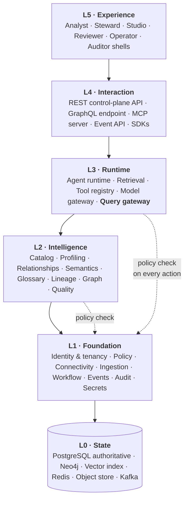
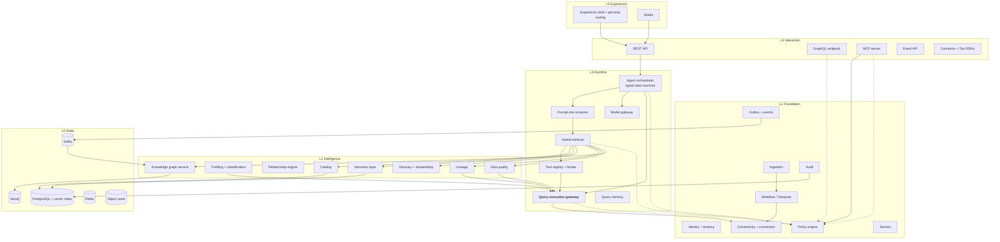
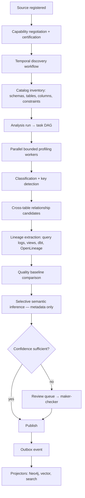
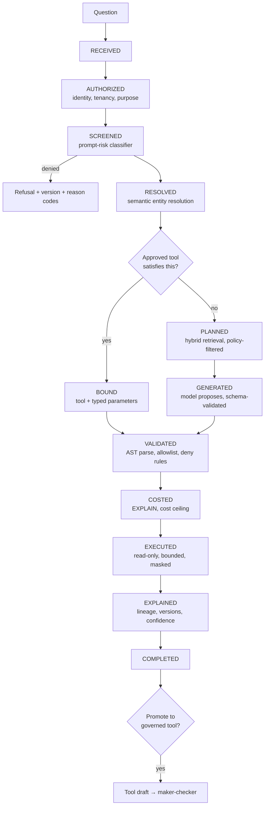

# Logical Architecture

> Status: Authoritative. Owner: Architecture.
> Scope: the layered view — what the system is made of, how a request flows through it, and where the hard boundaries sit.

## 1. Layer model

Atlas has five layers. Dependencies point downward only; a lower layer never imports an upper one.

**Why the layering matters.** The single most common way governed platforms fail is that an upper layer finds a shortcut to L0 or to a source. The import-linter rules in `40-engineering/03-coding-standards.md` make each arrow above mechanically enforced.

> **Implementation status (2026-09-20).** The layer arrows are **not** mechanically enforced today.
> `pyproject.toml` defines 13 import-linter contracts (as of 2026-09-20): six per-module privacy
> contracts, the INV-2 gateway contract, and six narrow `forbidden` ratchets (`security_types`,
> C4 / ST-11, F05, R02, ADR-0029 and R11-GQL01). **None of them is a layers contract**, because
> `src/aida/` is still one flat package. The generated map, `14-generated-architecture-map.md`,
> lists the contracts actually enforced and the domain-to-router imports that run the wrong way and
> that no contract forbids. `04-module-decomposition.md` §5.2 has the per-contract detail.

## 2. Component view

**Read the diagram for one thing.** Every arrow that ends at a source passes through `QGW`. Profiling, quality, lineage extraction, tool execution, and generated SQL all converge there. That convergence is INV-2 and it is the product.

## 3. Control plane vs. data plane

| | Control plane | Data plane |
|---|---|---|
| Contains | Metadata, semantics, policies, model routes, tools, agent definitions, lineage, audit, job orchestration | Source queries, result sets, temporary analytical data |
| State | Durable, versioned, authoritative | Transient, bounded, retention-governed |
| Scale driver | Object count (millions) and tenant count | Concurrent queries and source capacity |
| Failure impact | Governance stops | Analysis stops; governance intact |
| Deployment | Always Atlas-operated | Executes in the source's compute |

**The rule that follows.** Atlas does not permanently copy source business data. Profiling produces statistics; the analyst path produces bounded, policy-approved, retention-governed results. Anything that would require a persistent copy of business data needs an explicit ADR.

## 4. The two primary flows

### 4.1 Metadata intelligence flow (background, high volume)

**Design commitments visible here.** The unit of work is a *task in a DAG*, not an agent (P7). Profiling is bounded and deterministic (P1, P3). Model inference is *selective* and *metadata-only* (INV-6). Nothing becomes authoritative without either sufficient confidence or human approval (INV-8). Projections are downstream of an outbox event, never dual-written (INV-1).

> **Implementation status (2026-09-20).** Only the Neo4j projector exists
> (`src/aida/projectors/graph_projector.py`). There is no vector projector and no search projector:
> the vector index is rebuilt from the catalog by an operator route and a scheduler pass rather than
> from the outbox event, and there is no search index. See INV-1 in
> `01-principles-and-invariants.md`.

### 4.2 Analytical runtime flow (interactive, latency-sensitive)

**Where the guarantees live.**

| State | Guarantee established |
|---|---|
| AUTHORIZED | Tenant isolation, role, purpose (INV-5) |
| SCREENED | Hostile input stopped **before** it can influence retrieval, context, or tool selection |
| RESOLVED / PLANNED | Only authorized objects enter retrieval and model context |
| GENERATED | Model output is a validated proposal, not a command (INV-3) |
| VALIDATED | Deterministic AST authority — this is where the model's influence ends |
| COSTED | Denial-of-service and runaway-spend control |
| EXECUTED | Read-only, bounded, masked, single choke point (INV-2) |
| EXPLAINED | Reproducibility and auditability (P4) |

The critical ordering property: **SCREENED precedes retrieval**, and **VALIDATED is deterministic and downstream of GENERATED**. A model can propose anything; it cannot widen what executes.

## 5. State topology

> **Implementation status (2026-09-20).** PostgreSQL, Neo4j, Redis and Kafka are wired.
> **The vector index is wired without `pgvector`**: embeddings live in an ordinary `bytea` column
> (the `embedding` table, `src/aida/models.py`) behind a port, the default backend is
> `postgres_bruteforce` (ADR-0019), and hybrid retrieval fuses vector, graph and lexical rankings
> (`src/aida/retrieval.py`). It fills only once an embedding provider is configured. The `pgvector`
> extension is installed but unused, and the `pgvector` adapter is not implemented: it refuses with
> `PGVECTOR_ADAPTER_NOT_IMPLEMENTED` (`src/aida/vector_store.py`). The **search index does not
> exist** (lexical search is SQL in PostgreSQL, `src/aida/retrieval.py`). **Object storage is wired
> for the WORM audit archive only**: `src/aida/audit_archive_s3.py` implements S3 Object Lock over
> `httpx`, signed by `src/aida/aws_sigv4.py` with no SDK, and its default backend is `none`;
> profiling artifacts, exports and evidence packs are not stored there. See
> `06-data-architecture.md` §1 for the per-store evidence. The rebuild claims in the fourth column
> are untested for every projection: the rebuild drill has never been run, and
> `test_projection_rebuild` (`tests/test_inv1_single_authoritative_store.py`) shows only that the
> graph projector is a pure function of PostgreSQL. It does not prove Neo4j applies the result, and
> it does not cover the vector index.

| Store | Role | Authoritative? | Rebuildable? | Loss impact |
|---|---|---|---|---|
| PostgreSQL | All governed state, outbox, audit | **Yes** | No — backup/restore only | Catastrophic; RPO 15 min |
| Vector index | Semantic retrieval index | No | Yes, from catalog + semantics | Retrieval quality degrades |
| Neo4j | Graph traversal, lineage, ontology | No | Yes, from outbox replay | Graph explorer unavailable |
| Search index | Lexical + faceted search | No | Yes | Search degrades to DB queries |
| Redis | Short-lived cache, session state, locks | No | Yes | Latency increase |
| Object storage | Large profiling artifacts, exports, evidence packs (target); the WORM audit archive (built) | Semi — artifacts referenced from PG | Partially (re-profiling) | Historical artifacts lost |
| Kafka | Event distribution to projectors and external consumers | No | Yes, from outbox | Projection lag |

**The reason for the split.** Different problems: transactional consistency and approval semantics (PostgreSQL), traversal (Neo4j), similarity (vector), throughput (Kafka). Trying to serve all four from one store produces a system that is bad at three of them. The cost of the split is managed by INV-1 — exactly one of them is true.

## 6. Latency budget

For the interactive path, excluding source execution and model time.

| Stage | Budget (p95) |
|---|---|
| AUTHORIZED (identity + tenancy + policy) | 50 ms |
| SCREENED (deterministic classifier) | 20 ms |
| RESOLVED + PLANNED (hybrid retrieval) | 120 ms |
| Tool match / binding | 30 ms |
| VALIDATED (AST parse + allowlist) | 30 ms |
| COSTED (EXPLAIN round trip) | source-dependent, capped |
| EXPLAINED (evidence assembly) | 50 ms |
| **Total Atlas overhead** | **≤ 300 ms** |

This is the number in G4 of `00-product/01-vision-and-goals.md`. **It is an aspiration, not a
gate (2026-09-20).** `.github/workflows/ci.yml` has a `perf-baseline` job (tracker PF-3) that
times four in-process hot paths — the SQL guard pipeline, ABAC policy evaluation, hybrid-retrieval
fusion ranking and OpenAPI generation — and fails on a slowdown of more than 20% against a
committed baseline. That is a relative regression ratchet on a CI runner; it checks no stage in
this table against its budget. There is no `tests/performance/` suite and no load, soak or
end-to-end latency run. The budget is a design target that has not been validated — see
`10-performance-and-scale-model.md` §9 and tracker `E10`.

## Related documents

- Module decomposition: `10-architecture/04-module-decomposition.md`
- Data architecture: `10-architecture/06-data-architecture.md`
- Workers and workflows: `10-architecture/08-workers-and-workflows.md`
- Performance and scale model: `10-architecture/10-performance-and-scale-model.md`
