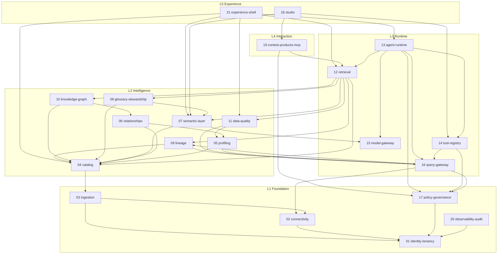

# Module Decomposition

> Status: Authoritative. Owner: Architecture.
> This is the anti-monolith document. It defines the bounded contexts, their ownership of data, their allowed dependencies, and the mechanism that stops the boundaries eroding.

## 1. The problem being solved

The current implementation is a **flat package monolith**: `src/aida/` with ~18,000 lines in which two files — `models.py` (1,274 lines) and `schemas.py` (1,298 lines) — hold the ORM models and DTOs for *every* domain, and `api.py` (1,530 lines) holds a large share of the HTTP surface.

This shape has three specific failure modes, all of which are already visible:

1. **No enforceable boundaries.** Any module can import any model. A semantic-layer change can silently break ingestion because they share a declarative base and a schema namespace.
2. **Change amplification.** A column added for data quality forces a migration that every module's tests must pass.
3. **No extraction path.** When one concern needs independent scaling (profiling workers, agent runtime), there is no seam to cut along.

The decision (`ADR-0011`) is **a modular monolith with mechanically enforced boundaries, and a pre-planned extraction path** — not microservices on day one. Rationale and extraction triggers are in `10-architecture/05-service-extraction-plan.md`.

## 2. Decomposition rules

| # | Rule | Enforcement |
|---|---|---|
| MD-1 | Every module owns its tables. No other module reads or writes them directly. | Schema-per-module in PostgreSQL; repository classes are module-private |
| MD-2 | Cross-module access goes through the module's published interface (`<module>/api.py` — a Python interface, not HTTP) | Import-linter contract: only `<module>.api` and `<module>.contracts` are importable from outside |
| MD-3 | Cross-module data is passed as DTOs, never as ORM entities | Type check: ORM classes are not exported from `<module>.api` |
| MD-4 | A module may depend only on modules in its own layer or below | Import-linter layered contract |
| MD-5 | Async cross-module effects go through domain events, not direct calls | Outbox event catalog in `30-contracts/04-event-catalog.md` |
| MD-6 | Every module has an owner, an SLO, and a test suite that runs independently | CI job per module |
| MD-7 | Shared code lives in `platform/` and contains no domain logic | Review rule; `platform/` may not import any domain module |

## 3. Module map



## 4. Module register

Each row: what it owns, what it may call, and what it emits. The full spec for each is in `20-modules/`.

| # | Module | Owns (data) | May call | Emits (events) |
|---|---|---|---|---|
| 01 | `identity-tenancy` | organizations, legal entities, LOBs, projects, principals, role mappings, secret references | — | `principal.*`, `tenant.*` |
| 02 | `connectivity` | datasources, connection configs, capability declarations, certification runs | 01 | `datasource.*`, `certification.*` |
| 03 | `ingestion` | ingestion jobs, envelopes, batch manifests, chunks | 01, 02 | `ingestion.*`, `batch.*` |
| 04 | `catalog` | catalogs, schemas, tables, columns, constraints, indexes, partitions, fingerprints, tombstones | 03 | `catalog.object.*`, `catalog.drift.*` |
| 05 | `profiling` | analysis runs, tasks, table/column profiles, classifications, key inferences | 04, 16 | `profile.*`, `classification.*` |
| 06 | `relationships` | relationship candidates, evidence, decisions, negative knowledge, table families | 04, 05 | `relationship.*` |
| 07 | `semantic-layer` | domains, entities, annotations, semantic model versions, metrics, dimensions, measures | 04, 15 | `semantic.*`, `metric.*` |
| 08 | `glossary-stewardship` | terms, synonyms, ownership assignments, conflicts, certification, coverage scores | 04, 07 | `glossary.*`, `ownership.*` |
| 09 | `lineage` | lineage edges (query, view, procedure, ETL, dbt, BI, **AI decision**), transformation artifacts | 04, 16 | `lineage.*` |
| 10 | `knowledge-graph` | graph projection state, traversal policies, reconciliation status | 04, 06 | `graph.projection.*` |
| 11 | `data-quality` | quality policies, observations, incidents, baselines, freshness contracts, SLAs | 05, 16 | `quality.*`, `incident.*` |
| 12 | `retrieval` | retrieval indexes (lexical, vector, graph handles), ranking config | 04, 07, 08, 09, 10, 11 | `retrieval.*` |
| 13 | `agent-runtime` | agent runs, states, traces, plans, query memory, evaluations, prompt-risk results | 12, 14, 15, 16, 17 | `agent.run.*`, `screening.*` |
| 14 | `tool-registry` | tools, versions, parameter schemas, bindings, invocations, certification | 16, 17 | `tool.*` |
| 15 | `model-gateway` | model routes, versions, budgets, adapter registry, generation evidence | 17 | `model.route.*`, `generation.*` |
| 16 | `query-gateway` | executions, cost estimates, masking decisions, validation results | 02, 09, 17 | `execution.*` |
| 17 | `policy-governance` | policies, entitlements, review queue, proposals, decisions, approvals | 01 | `policy.*`, `review.*`, `decision.*` |
| 18 | `studio` | change sets, drafts, test fixtures, git bindings | 07, 14, 19 | `studio.changeset.*` |
| 19 | `context-products-mcp` | context product definitions, versions, consumption records | 12, 17 | `context.product.*` |
| 20 | `observability-audit` | audit ledger, outbox, dead letters, metrics, SLO state, compliance packs | 01 | `audit.*`, `outbox.*` |
| 21 | `experience-shell` | persona routing, navigation state, saved views | (L4 API only) | — |

## 5. Dependency contracts

### 5.1 Allowed dependency directions

```
L5 → L4 → L3 → L2 → L1 → platform
```

Plus two cross-cutting exceptions, which every layer may call:

- `17 policy-governance` — because policy must be evaluable everywhere.
- `20 observability-audit` — because audit must be writable everywhere.

These two are the *only* upward-callable modules, and both are append-or-decide-only: they never call back into a domain module. That acyclicity is what keeps the exception safe.

### 5.2 Forbidden dependencies (import-linter contracts)

| Contract | Rule |
|---|---|
| `layers` | L1 must not import L2–L5; L2 must not import L3–L5; and so on |
| `module-privacy` | Only `<module>.api` and `<module>.contracts` are importable across module boundaries |
| `no-orm-leakage` | ORM base classes must not appear in any `<module>.api` signature |
| `gateway-exclusivity` | Only `query_gateway.*` may import `connectivity.execution` (INV-2) |
| `platform-purity` | `platform.*` must not import any domain module |
| `no-cycles` | No import cycles between modules |

These live in `pyproject.toml` and fail CI. See `40-engineering/03-coding-standards.md`.

## 5.3 Known tension: `16 query-gateway`'s layer placement (unresolved, flagged 2026-08-29)

Three L2 modules list `16 query-gateway` (L3) in their "may call" column: `05 profiling`,
`09 lineage`, and `11 data-quality` (§3, §4). That's an L2-importing-L3 edge, which contradicts
the layering rule in §5.2 (`L1 must not import L2-L5; L2 must not import L3-L5`, and so on
upward). Separately, `09 lineage` and `16 query-gateway` list *each other* as callable (§3, §4),
which is a cycle and contradicts the `no-cycles` contract this same document says CI will
enforce (§5.2).

Neither is a typo to silently fix — they're a real modelling question the extraction sequence
(`40-engineering/06-refactor-plan.md` Phase 4) needs answered before `16`, `05`, `09`, and `11`
can be cut into separate modules with an import-linter layers contract that actually passes:

- Either `16 query-gateway` is more foundational than L3 and belongs alongside L1 (every module
  that touches cost/execution needs it, which is most of L2) — in which case the layer diagram in
  §3 needs redrawing, not just the register table — or
- `05`/`09`/`11`'s dependency on `16` is really a narrower thing (e.g., just cost estimation, not
  full execution) that should go through an event or a smaller shared interface instead of a
  direct L2→L3 call.

Either way, `09`↔`16`'s mutual edge needs one direction picked as authoritative before those two
modules are extracted — see tracker ST-11.

## 6. Database schema ownership

One PostgreSQL database, one schema per module. This gives boundary enforcement now and a clean extraction path later.

| Schema | Module | Notes |
|---|---|---|
| `identity` | 01 | Root of the tenancy hierarchy; every other schema carries FK-free tenant IDs |
| `connectivity` | 02 | |
| `ingestion` | 03 | Payload columns nulled after successful processing |
| `catalog` | 04 | Largest by row count — partitioned by datasource |
| `profiling` | 05 | Large artifacts offloaded to object storage |
| `relationships` | 06 | |
| `semantics` | 07 | |
| `glossary` | 08 | |
| `lineage` | 09 | Partitioned by time |
| `graph_projection` | 10 | Projection state only; graph lives in Neo4j |
| `quality` | 11 | Partitioned by time |
| `retrieval` | 12 | Index state; pgvector embeddings |
| `agent` | 13 | Partitioned by time; value-free |
| `tools` | 14 | |
| `model_gateway` | 15 | |
| `execution` | 16 | Partitioned by time |
| `governance` | 17 | |
| `studio` | 18 | |
| `context_products` | 19 | |
| `audit` | 20 | Append-only; WORM export target |

**Cross-schema rules.**

- **No cross-schema foreign keys**, except into `identity`. A module referencing another module's entity stores its ID and resolves it through the published interface. This is what makes extraction possible without a data migration.
- **Referential integrity across modules is eventual**, maintained by projectors and reconciliation jobs, and surfaced as a measurable lag.
- Tenancy columns (`organization_id`, and where applicable `legal_entity_id`, `lob_id`, `project_id`) are mandatory on every governed table (INV-5).

## 7. Module anatomy

Every module has the same internal shape. Uniformity is what lets a new engineer work in any module on day one.

```text
src/atlas/modules/<name>/
├── __init__.py
├── api.py            # PUBLIC. Interface other modules import. DTOs only.
├── contracts.py      # PUBLIC. DTOs, enums, events, error types.
├── router.py         # HTTP routes (FastAPI APIRouter), mounted by the app
├── service.py        # Domain logic. The only place business rules live.
├── models.py         # PRIVATE. SQLAlchemy models in this module's schema.
├── schemas.py        # PRIVATE. Request/response models for router.py.
├── repository.py     # PRIVATE. Data access. Tenant scope is a required arg.
├── events.py         # Domain events this module emits.
├── workers/          # Temporal activities / background jobs owned by this module
├── migrations/       # Alembic revisions scoped to this module's schema
└── tests/            # Runs standalone: `pytest src/atlas/modules/<name>`
```

**The two public files.** `api.py` and `contracts.py` are the module's entire surface to the rest of the system. If a change does not alter those two files, no other module can be affected by it. That property is the whole point of the decomposition.

## 8. Shared platform layer

`src/atlas/platform/` — infrastructure with **no domain knowledge**:

| Package | Contents |
|---|---|
| `db` | Session management, unit of work, tenant-scoped repository base |
| `config` | Settings, environment validation, fail-closed production checks |
| `logging` | Structured logging with tenant and correlation context |
| `telemetry` | OpenTelemetry tracing and metrics |
| `errors` | Error taxonomy and HTTP mapping |
| `pagination` | Cursor pagination primitives |
| `idempotency` | Idempotency key handling |
| `outbox` | Transactional outbox write and publish |
| `workflow` | Temporal client and worker scaffolding |
| `http` | FastAPI app assembly, middleware, dependency wiring |

**Test for correct placement.** If a file in `platform/` mentions a business concept — table, metric, tool, lineage, steward — it is in the wrong place.

## 9. Mapping: current code → target modules

| Current file(s) | Target module | Action |
|---|---|---|
| `api.py` (1,530) | split across all | Decompose into per-module `router.py` |
| `models.py` (1,274) | split across all | Split by schema ownership; this is the highest-value refactor |
| `schemas.py` (1,298) | split across all | Split into per-module `schemas.py` + `contracts.py` |
| `connectors/*` | 02 connectivity | Move; extract execution into 16 |
| `ingestion.py`, `ingestion_api.py`, `batch_ingestion.py` | 03 ingestion | Move |
| `analysis_tasks.py`, `data_quality.py` (profiling parts) | 05 profiling | Move |
| `quality_service.py`, `quality_api.py` | 11 data-quality | Move |
| `semantic_inference.py`, `semantic_api.py`, `semantic_intelligence_api.py` | 07 semantic-layer | Merge and split |
| `knowledge_graph.py`, `projectors/graph_projector.py` | 10 knowledge-graph | Move |
| `dbt_api.py`, `dbt_artifacts.py` | 09 lineage | Move — dbt is a lineage source, not its own domain |
| `agent_orchestrator.py`, `agent_runtime.py`, `agent_intelligence.py`, `agent_evals.py`, `prompt_risk.py` | 13 agent-runtime | Merge |
| `tool_api.py`, `tool_rendering.py` | 14 tool-registry | Move |
| `model_gateway.py`, `ai_governance_api.py` | 15 model-gateway | Merge |
| `query_gateway.py`, `sql_guard.py` | 16 query-gateway | Merge |
| `security.py`, `security_types.py`, `oidc.py`, `secrets.py` | 01 identity-tenancy + 17 policy | Split: authn → 01, authz → 17 |
| `events.py`, `projectors/outbox_publisher.py` | 20 observability-audit | Move |
| `fleet.py`, `workflows/scheduler.py` | 03 ingestion (fleet scheduling) | Move |
| `operational_api.py` | 20 observability-audit | Move |
| `intelligence_api.py` (1,140) | 06 + 07 + 09 | Split by concern — largest untangling task |
| `db.py`, `config.py`, `logging.py`, `context.py`, `main.py` | `platform/` | Move |
| `workflows/*` | per-module `workers/` | Distribute activities to owning modules |

Sequencing, risk, and the strangler approach are in `40-engineering/06-refactor-plan.md`.

## 10. Anti-patterns this decomposition forbids

| Anti-pattern | Why it is forbidden | What to do instead |
|---|---|---|
| Shared `models.py` | The current defect. Couples every module to every schema change. | Per-module models in a private namespace |
| Cross-module ORM relationships | Makes extraction impossible; creates hidden transaction coupling | Store the ID; resolve through the interface |
| "Just this once" direct table access | Boundaries erode one exception at a time | Add a method to the published interface |
| A `common/` or `utils/` package that grows domain logic | Becomes a second monolith with no owner | `platform/` for infrastructure only; domain logic in a module |
| Synchronous cross-module call chains 3+ deep | Reintroduces distributed-monolith latency inside one process | Use domain events for anything not needed in the response |
| A module with no owner | Nobody maintains it; it rots | Every module in the register has a named owner |
| Circular dependency "solved" with a late import | Hides a real modelling error | Fix the boundary or introduce an event |

## Related documents

- Service extraction plan: `10-architecture/05-service-extraction-plan.md`
- Data architecture: `10-architecture/06-data-architecture.md`
- Module specs: `20-modules/00-module-index.md`
- Repository layout: `40-engineering/02-repository-layout.md`
- Refactor plan: `40-engineering/06-refactor-plan.md`
