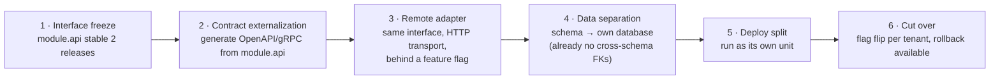

# Service Extraction Plan

> Status: Authoritative. Owner: Architecture. Decision recorded as `ADR-0011`.
> Purpose: define when a module becomes an independently deployed service, what it costs, and how to do it without a rewrite.

## 1. The decision

**Atlas is a modular monolith with a deployable-worker split, not a microservice system — for now.**

This is a deliberate, reversible choice, not an absence of ambition. The decomposition in `04-module-decomposition.md` is designed so that extraction is a *deployment* change, not a *rewrite*.

### Why not microservices on day one

| Cost of premature extraction | Concrete impact here |
|---|---|
| Boundaries are guesses | The right seam between `semantic-layer`, `glossary`, and `retrieval` is not yet known. Extracting the wrong seam is far more expensive than moving a Python package. |
| Distributed transactions | Maker-checker approval spans governance, semantics, and tools. In-process, that is one transaction. Across services, it is a saga with compensations for every object type. |
| Latency budget | The interactive path has a 300 ms total overhead budget (`03-logical-architecture.md` §6). Each network hop costs 5–20 ms plus tail-latency variance. Ten services on the request path spends the budget on transport. |
| Operational surface | 20 services means 20 deployment pipelines, dashboards, alert sets, and on-call runbooks — for a team that has not yet certified one connector fleet. |
| Debuggability | A cross-module bug becomes a distributed-tracing exercise instead of a stack trace. |

### Why not a plain monolith either

Because the failure modes in `04-module-decomposition.md` §1 are real and already present. The answer is **enforced boundaries inside one deployable**, which buys most of the isolation benefit at almost none of the distributed cost.

### What is already split

Even in the "monolith," Atlas ships **four deployment units**, because their scaling and failure characteristics genuinely differ:

| Unit | Contains | Why separate |
|---|---|---|
| `atlas-api` | HTTP/MCP surface, all L2–L4 modules | Latency-sensitive; scales with user concurrency |
| `atlas-worker` | Temporal workers: ingestion, profiling, quality, lineage extraction | CPU/IO-heavy, long-running; must not compete with request latency |
| `atlas-projector` | Outbox consumers writing Neo4j/vector/search | Throughput-oriented; independently restartable; rebuild jobs |
| `atlas-scheduler` | Fleet scheduling, policy polling, maintenance windows | Singleton-ish with HA leader election; distinct failure mode |

All four run the **same image** with different entrypoints. Same code, same modules, different process roles. This is the highest-value split and it is available immediately.

## 2. Extraction triggers

A module is extracted into its own service only when it trips at least one trigger. "It feels like a service" is not a trigger.

| # | Trigger | Threshold | Rationale |
|---|---|---|---|
| T1 | **Independent scaling need** | The module's resource profile differs from the host by >5× and it cannot be satisfied by the worker/projector split | Real isolation benefit |
| T2 | **Independent release cadence** | The module needs to ship >4× more often than the rest, and release coupling is measurably blocking | Deployment coupling is the pain |
| T3 | **Blast-radius isolation** | A failure in this module must not degrade the rest, and in-process bulkheads are insufficient | Availability requirement |
| T4 | **Different runtime requirement** | Needs a different language, GPU, or a security zone the API cannot occupy | Cannot be satisfied in-process |
| T5 | **Team ownership boundary** | A dedicated team owns it and coordination cost is measurably slowing both | Conway's law, honestly applied |
| T6 | **Regulatory placement** | Must run in a network zone or jurisdiction the main deployment cannot | Non-negotiable external constraint |

**Exit rule.** Extraction also requires the module to have had a *stable published interface for two consecutive releases*. Extracting an unstable interface converts a refactor into a versioned-API migration.

## 3. Extraction candidates, ranked

| Rank | Module | Likely triggers | Assessment |
|---|---|---|---|
| 1 | **02 connectivity — as source-side connector agents** | T4, T6 | **Highest confidence.** Banks have restricted network zones that no central service can reach. A connector agent running near the source, speaking mTLS, pushing the canonical envelope, is a *product requirement* (`W9` in the whitespace map), not just an architecture preference. |
| 2 | **05 profiling / worker pool** | T1, T3 | Already partly split as `atlas-worker`. Full extraction when profiling capacity must scale independently per source class. |
| 3 | **16 query-gateway** | T3, T6 | Tempting for blast-radius reasons, but extraction weakens INV-2: a network-reachable gateway is a network-reachable *target*. Extract only with mTLS, workload identity, and no other route to sources. Defer. |
| 4 | **13 agent-runtime** | T1, T2 | Latency-sensitive and model-bound; may need to scale on a different axis than the control plane. Watch. |
| 5 | **12 retrieval** | T1, T4 | If embedding/reranking moves to GPU, T4 fires. Watch. |
| 6 | **10 knowledge-graph projector** | T1 | Already a separate process; full service extraction adds little. |
| 7 | **Everything else** | — | **No extraction planned.** Catalog, semantics, glossary, policy, tools, and audit belong together: they share transactions and change together. |

**Notice what is at the bottom.** The governance core is *not* a candidate. Splitting policy, semantics, and approval across services would make maker-checker a distributed saga for no benefit. Keeping them co-transactional is a design strength.

## 4. Extraction mechanics

Because of the module rules, extraction is mechanical:

Step 4 is cheap **only because** MD-1 (schema per module) and the no-cross-schema-FK rule were applied from the start. That rule is the entire insurance policy; it costs a small amount of join convenience today and saves a data migration later.

### What changes at extraction

| Aspect | Before | After |
|---|---|---|
| Call | Python function on `module.api` | HTTP/gRPC through a generated client with the same signature |
| Failure | Exception | Exception + timeout, retry, circuit breaker |
| Transaction | Shared unit of work | Saga with explicit compensation |
| Consistency | Immediate | Eventual, with reconciliation |
| Tracing | Same trace, same process | Propagated trace context |
| Testing | In-process fake | Contract test against a published schema |

**The honest cost.** Extraction turns three cheap guarantees (immediate consistency, exception-only failure, one trace) into three things that must be designed, tested, and operated. That is the tax the triggers exist to justify.

## 5. What must be true before any extraction

A readiness gate. All must hold:

1. Import-linter contracts pass with zero exemptions for the module.
2. The module's tests run standalone without the rest of the app.
3. The module owns its schema and has no cross-schema FKs except into `identity`.
4. Its published interface is versioned and has been stable for two releases.
5. Distributed tracing is in place end-to-end.
6. There is an owner and an on-call rotation for the new service.
7. A rollback path exists — the feature flag can restore in-process operation.

If any is false, fix that first. Extraction under these conditions is a week of work; extraction without them is a quarter.

## 6. Worker taxonomy

Independent of service extraction, background work is split by *failure and scaling characteristics*, not by domain.

| Worker class | Work | Scaling axis | Failure isolation |
|---|---|---|---|
| **Discovery workers** | Catalog inventory, drift detection | Sources × objects | Per source |
| **Profiling workers** | Bounded statistics, classification | Tables × columns | Per table task |
| **Relationship workers** | Candidate generation, evidence scoring | Table pairs (pruned) | Per candidate batch |
| **Lineage workers** | Query-log parsing, view/procedure parsing, OpenLineage, dbt manifests | Statements | Per artifact |
| **Quality workers** | Baseline comparison, incident lifecycle | Tables × policies | Per policy evaluation |
| **Semantic workers** | Metadata-only inference, embedding generation | Objects | Per proposal |
| **Projection workers** | Outbox → Neo4j / vector / search | Event throughput | Per event, idempotent |
| **Batch ingestion workers** | Manifest chunk processing, FK resolution, reconciliation | Chunks | Per chunk |

**Rules that apply to all worker classes.**

- Every activity is idempotent (P5) and heartbeats.
- Every worker is cancellable and resumable; long histories use continue-as-new.
- One source's failure never blocks unrelated sources (fleet-level bulkhead).
- Admission control and backpressure are enforced at the scheduler, not by worker crash.
- Bounds are configured, not implicit (P3).

Detail in `10-architecture/08-workers-and-workflows.md`.

## 7. Decision record for this document

| Question | Decision | Revisit when |
|---|---|---|
| Microservices now? | **No** — modular monolith + 4 deployment units | A trigger in §2 fires |
| Schema per module? | **Yes**, from the start | Never — this is the extraction insurance |
| Cross-schema FKs? | **No**, except into `identity` | Never |
| Split the governance core? | **No** | Only under T5/T6 |
| Connector agents as separate deployables? | **Yes** — first extraction, product-driven | In progress at Phase B |
| One image, multiple entrypoints? | **Yes** | If a runtime requirement (T4) diverges |

## Related documents

- Module decomposition: `10-architecture/04-module-decomposition.md`
- Workers and workflows: `10-architecture/08-workers-and-workflows.md`
- Deployment topology: `10-architecture/09-deployment-topology.md`
- ADR-0011: `10-architecture/adr/ADR-0011-modular-monolith-over-microservices.md`
