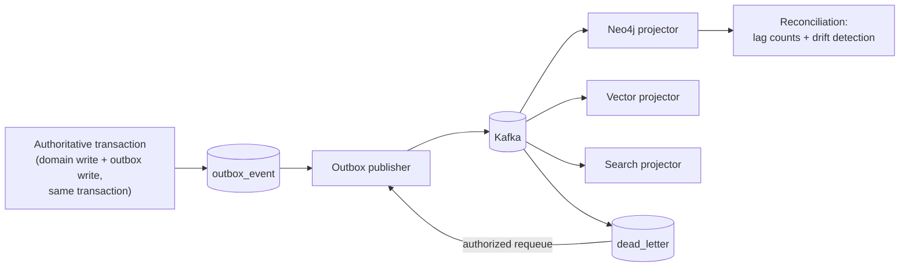

# Data Architecture

> Status: Authoritative. Owner: Architecture.
> Scope: what state exists, who owns it, how it is versioned, how it is rebuilt, and how it is retained.

## 1. Store roles

> **Implementation status (2026-08-30).** Three of the seven stores below are wired and three
> are not. Verified against `compose.yaml`, `pyproject.toml` dependencies and `src/`:
>
> | Store | Today |
> |---|---|
> | PostgreSQL | **Built.** Authoritative, 34 Alembic revisions, single schema |
> | Neo4j | **Built.** `neo4j==5.28.2` dependency, service in `compose.yaml`, `src/aida/graph_store.py` (formerly lineage_graph_store.py) and `projectors/graph_projector.py`. Note: ADR-0020's 2026-08-30 amendment decided to keep it as a per-organization setting rather than drop it (tracker C7) |
> | Kafka | **Built** (Redpanda locally). `aiokafka==0.14.0`, `projectors/outbox_publisher.py`. One topic, not eight — see `07-event-and-messaging-model.md` §6. `gap/02` row C8/D2 proposes deferring it |
> | Redis | **Built.** `redis==6.4.0`; MCP budgets and locks |
> | pgvector | **Extension only.** `infra/postgres/init.sql` runs `CREATE EXTENSION IF NOT EXISTS vector` and the image is `pgvector/pgvector:pg17`, but **no embedding column exists** in any model or migration and nothing writes or reads a vector. `src/aida/retrieval.py` is BM25-style lexical scoring, and its own comment says pgvector arrives "in Phase 2 when the embedding column is added". Tracked as `N5` |
> | Search index | **Does not exist.** No search-engine dependency, no service, no client code. Lexical search is SQL inside PostgreSQL |
> | Object storage | **Not wired.** MinIO runs in `compose.yaml`, but there is **no object-storage client** in the dependency list (no `boto3`, no `minio`) and nothing in `src/` reads or writes it. Profiling artifacts, evidence packs and the WORM archive are all target behaviour |

| Store | Role | Authority | Rebuild source | Growth driver |
|---|---|---|---|---|
| PostgreSQL | All governed state, outbox, audit ledger | **Authoritative** | Backup/restore only | Catalog objects, executions, audit |
| pgvector (in PostgreSQL) | Embeddings for semantic retrieval | Projection | Catalog + semantics | Objects × embedding dim |
| Neo4j | Graph traversal, lineage, ontology | Projection | Outbox replay | Nodes + edges |
| Search index | Lexical + faceted search | Projection | Catalog + semantics + glossary | Indexed objects |
| Redis | Cache, session, distributed locks | Ephemeral | Recompute | Concurrency |
| Object storage | Large profiling artifacts, exports, evidence packs, WORM archive | Semi-authoritative (referenced from PG) | Re-profiling (artifacts); WORM is authoritative for archived audit | Profiles × history |
| Kafka | Event distribution | Transport | Outbox | Event rate × retention |

**INV-1 restated operationally.** If you can answer a question from Neo4j *or* PostgreSQL and the answers differ, PostgreSQL is right and the projector has a bug. No decision — authorization, approval, correctness — is ever made from a projection.

## 2. Core entity model

Grouped by owning module. Names are logical; physical names live in migrations.

### Tenancy (module 01)

```text
organization → line_of_business → data_domain → project → datasource
principal, principal_role, secret_reference
```

> **Implementation status (2026-08-30).** `legal_entity` was in this path and **does not
> exist**: no match anywhere in `src/` or `migrations/`. It has been removed from the line
> above rather than left to mislead; `gap/02` rows C2/D3 are to not build it. The path shown
> is the *pre-ADR-0018* shape, and it is itself being replaced: `Workspace`,
> `WorkspaceMembership`, `SourceBinding`, `BusinessNode`, `BusinessAssignment` and
> `AccessPolicy` are in `src/aida/models.py` and in
> `migrations/versions/f1a2b3c4d5e6_adr_0018_three_axis_tenancy.py`. **This section is not the
> authority on tenancy** — ADR-0018 and `20-modules/01-identity-and-tenancy.md` are, and this
> section should be restated once that work settles.

Every governed table below carries `organization_id`, plus the scope columns ADR-0018 defines where applicable (INV-5).

### Source and ingestion (02, 03)

```text
datasource, datasource_connection, connector_capability, connector_certification
ingestion_job, ingestion_envelope, ingestion_batch, ingestion_chunk
fleet_schedule, admission_state
```

### Catalog (04)

```text
catalog, schema, table, column, constraint, index, partition
object_fingerprint, object_tombstone, drift_record
```

Largest tables by row count. `column` is the dominant one — at 1M tables × ~30 columns, 30M rows. Partitioned by `datasource_id`.

### Profiling and classification (05)

```text
analysis_run, analysis_task, table_profile, column_profile
profile_artifact (→ object storage), classification, key_inference
```

### Relationships (06)

```text
relationship_candidate, relationship_evidence, relationship_decision
negative_knowledge, table_family, table_family_member, canonical_table_mapping
```

`negative_knowledge` is deliberate: rejected inferences are retained so the system does not re-propose them. This is differentiator W4.

### Semantics and glossary (07, 08)

```text
business_domain, business_entity, table_annotation, column_annotation
semantic_model_version, metric, metric_version, dimension, measure
business_term, term_synonym, term_asset_link, term_conflict
ownership_assignment, certification_record, coverage_score
```

### Lineage (09)

```text
lineage_node, lineage_edge, lineage_evidence
transformation_artifact (dbt manifests, view/procedure definitions)
ai_decision_edge          -- differentiator W3
```

`lineage_edge` carries `edge_kind ∈ {QUERY, VIEW, PROCEDURE, ETL, DBT, BI, AI_DECISION}` and `confidence`. Partitioned by time.

### Quality (11)

```text
quality_policy, quality_baseline, quality_observation
quality_incident, freshness_contract, quality_sla
```

Observations are immutable and value-free. Incidents are fingerprinted so re-detection reopens rather than duplicates.

### Runtime (13, 14, 15, 16)

```text
agent_run, agent_state_transition, agent_trace, agent_plan
prompt_risk_result, query_memory, agent_evaluation
tool, tool_version, tool_parameter_schema, tool_binding, tool_invocation
model_route, model_route_version, model_budget, generation_evidence
execution, execution_validation, cost_estimate, masking_decision
```

All partitioned by time. All value-free: questions as keyed HMAC, SQL with literals redacted.

### Governance and audit (17, 20)

```text
policy, policy_version, entitlement
proposal, review_assignment, decision
audit_event, outbox_event, dead_letter, compliance_pack
```

`audit_event` is append-only, never updated or deleted, and exported to WORM storage.

## 3. Versioning model

Six object classes are versioned. Versioning is not optional metadata — it is what makes a runtime decision replayable (P4).

| Object | Version semantics | Runtime binding |
|---|---|---|
| Semantic model | Immutable versions; draft → validated → approved → published → superseded; clone-to-rollback | Pinned per agent run |
| Metric | Version per definition change; supersession chain | Pinned per agent run |
| Tool | Version per SQL or parameter-schema change | Bound at invocation |
| Policy | Version per rule change | Pinned per authorization decision |
| Model route | Immutable versions carrying residency, retention, capability, and budget contracts | Pinned per generation |
| Prompt-risk classifier | Versioned rule set | Recorded per screening |

**The replay guarantee.** Given an `agent_run`, every version it pinned is recoverable, so the decision can be re-derived. This is what converts a log into evidence (differentiator D3).

## 4. Identity and idempotency

| Concern | Mechanism |
|---|---|
| Catalog object identity | Stable internal ID derived from `(datasource, catalog, schema, name, object_type)`; survives re-scan, drift, deprecation, and reactivation |
| Change detection | `object_fingerprint` — content hash per object; unchanged objects are skipped |
| Deletion | Soft deprecation via `object_tombstone`; reactivation restores the same ID |
| Ingestion idempotency | `idempotency_key` unique per datasource; same key + same payload returns the original job; same key + different payload → HTTP 409 |
| Batch idempotency | Batch key unique per datasource; chunk number and chunk key unique within batch |
| Event idempotency | Stable event IDs; consumers use idempotent MERGE |
| Workflow idempotency | Stable Temporal workflow IDs; activities are idempotent and heartbeat |

## 5. Projection and rebuild



**Rules.**

1. Domain write and outbox write are **one transaction**. No dual-write to PostgreSQL and a projection (INV-1).
2. Publication is at-least-once; consumers are idempotent.
3. Projection lag is measured and alarmed, per projection, per tenant.
4. Any projection can be dropped entirely and rebuilt from authoritative state. Rebuild duration is measured and is a published SLO.
5. Failed events go to a dead-letter store with authorized requeue — never silent discard.

**Rebuild targets** (`10-architecture/10-performance-and-scale-model.md` carries the measured numbers):

| Projection | Target rebuild for 1M catalog objects |
|---|---|
| Neo4j | < 4 hours |
| Vector index | < 6 hours |
| Search index | < 2 hours |

## 6. Retention and residency

| Data class | Default retention | Basis |
|---|---|---|
| Catalog metadata | Indefinite while source active; tombstones retained 2 years | Operational need |
| Profiling statistics | 13 months rolling | Trend analysis over a year plus one month |
| Analysis run history | 13 months | Same |
| Quality observations | 13 months | Same |
| Quality incidents | 7 years | Regulatory |
| Agent runs and traces | 7 years | Model risk / audit |
| Executions | 7 years | Audit |
| Audit ledger | 7 years hot + WORM archive per policy | Regulatory |
| Query memory | 13 months, invalidated on semantic version change | Freshness |
| Dead letters | 90 days after resolution | Operational |
| Bounded approved results | 24 hours default, per-classification override | Minimize regulated data at rest |
| dbt manifests | Latest N snapshots per project | Storage bound |

**Residency.** Every governed record carries its tenancy boundary, and the deployment binds tenancy to a region. Cross-region replication of regulated metadata requires an explicit approved residency contract. Model routes carry their own residency and retention contract, evaluated before any generation.

## 7. Partitioning and scale

| Table class | Strategy | Trigger |
|---|---|---|
| `catalog.column`, `catalog.table` | Range/hash partition by `datasource_id` | > 10M rows |
| `lineage.lineage_edge` | Range by month | > 50M rows |
| `execution.*`, `agent.*` | Range by month | > 10M rows |
| `quality.quality_observation` | Range by month | > 50M rows |
| `audit.audit_event` | Range by month, archived to WORM | Always |

Old partitions are detached and archived rather than deleted, so an auditor's question about Q3 two years ago is answerable.

## 8. Data classification enforcement

Implements INV-6. This is the table a security reviewer will read first.

| Class | Permitted in PostgreSQL | Permitted in logs/traces | Permitted in model context |
|---|:--:|:--:|:--:|
| Structural metadata | Yes | Yes | Yes |
| Statistics (counts, rates, fingerprints) | Yes | Yes | Yes, bounded |
| Column names and types | Yes | Yes | Yes |
| Sample values | **No** | **No** | **No** |
| Result rows | Bounded + retention-governed | **No** | **No** by default |
| User question text | **Fingerprint only** | **No** | Yes (it is the prompt) |
| SQL literals | **Redacted** | **Redacted** | N/A |
| Credentials | **Reference only** | **No** | **No** |

Enforced by: ingestion attribute-key rejection, profiling value-free contract, SQL redaction pass, log scrubbing middleware, and the model-context builder. Tested by `test_no_source_values_in_control_plane` (INV-6, `tests/test_inv6_value_freedom.py`).

## 9. Backup, recovery, and drills

| Target | Value | Verification |
|---|---|---|
| PostgreSQL RPO | 15 minutes | Continuous archiving + PITR restore drill |
| PostgreSQL RTO | 4 hours | Quarterly restore rehearsal, timed |
| Audit RPO | Effectively zero | Transactional persistence + WORM export |
| Projection recovery | Rebuild, not restore | Quarterly rebuild drill, timed |
| Temporal history | Per Temporal HA config | Failover drill |
| Object storage | Versioned + cross-region per policy | Restore sample verification |

A drill that has not been run and timed does not count. `60-delivery/03-tracker.md` tracks drill currency.

## Related documents

- Module decomposition (schema ownership): `10-architecture/04-module-decomposition.md`
- Event model: `10-architecture/07-event-and-messaging-model.md`
- Performance and scale: `10-architecture/10-performance-and-scale-model.md`
- Contracts: `30-contracts/01-contract-strategy.md`
- Security architecture: `50-security/01-security-architecture.md`
