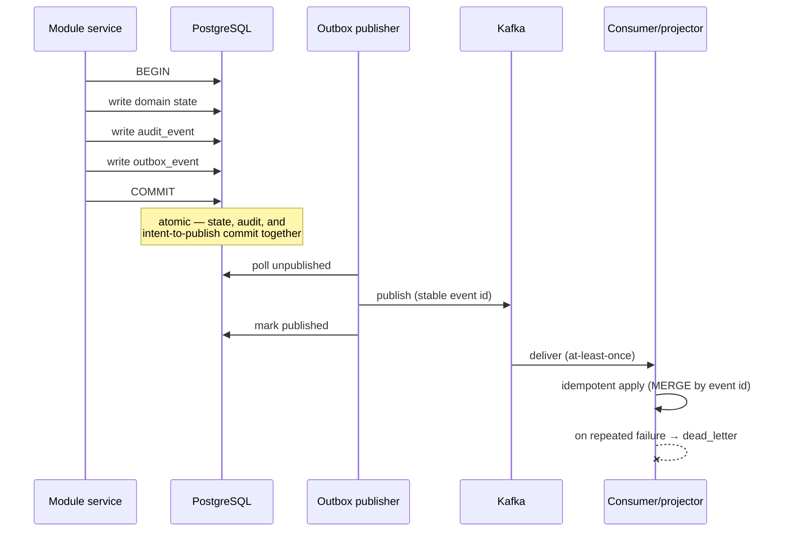

# Event and Messaging Model

> Status: Authoritative. Owner: Architecture.
> Scope: how modules communicate asynchronously, and the strict division of labour between Temporal and Kafka.

## 1. The division that matters most

Temporal and Kafka are not alternatives. Using either for the other's job is the most common architectural mistake in systems of this shape.

| | Temporal | Kafka |
|---|---|---|
| Owns | **Durable process state** — what step are we on, what has been retried, what is cancelled | **Event distribution** — what happened, told to whoever cares |
| Semantics | Exactly-once effect via idempotent activities and deterministic replay | At-least-once delivery, consumer-side idempotency |
| Failure model | Retries, heartbeats, timeouts, compensation, continue-as-new | Offsets, lag, dead-letter, replay |
| Consumer knowledge | The workflow knows its activities | Publisher does not know its consumers |
| Use for | Ingestion batches, discovery, profiling DAGs, scheduled scans, long-running approvals | Projections, integration events, audit fan-out, external consumers |
| **Never use for** | Broadcasting facts to unknown consumers | Storing process state or step position |

**The test.** If you need to know *"where are we in this process?"* → Temporal. If you need to say *"this happened"* → Kafka. If you find yourself reconstructing process position by replaying Kafka, the design is wrong.

## 2. The transactional outbox

Every event Atlas publishes originates in an outbox row written **in the same transaction** as the state change that caused it.



**Why not publish directly from the service?** Because a crash between commit and publish loses the event, and a crash between publish and commit produces an event for state that does not exist. The outbox makes "state changed" and "event will be published" the same atomic fact.

**Guarantees.**

- No event without committed state; no committed governed state without an event.
- At-least-once delivery; consumers are idempotent (P5).
- Stable event IDs enable consumer-side deduplication.
- Repeated failures go to `dead_letter` with authorized requeue — never silent discard.
- Publication lag is measured, per topic, per tenant.

## 3. Event taxonomy

| Class | Purpose | Consumers | Retention |
|---|---|---|---|
| **Projection events** | Drive Neo4j, vector, and search projections | Internal projectors | Until all projections have consumed + buffer |
| **Integration events** | Notify external systems of governance-relevant facts | SIEM, ITSM, customer consumers | Per policy, typically 7 days |
| **Audit events** | Attributable record of every mutation | Audit ledger (PostgreSQL), WORM export | 7 years |
| **Lineage events** | OpenLineage-compatible emission and ingestion | Lineage module, external lineage tools | Per policy |
| **Operational events** | Fleet, scheduler, quality incidents, SLO breaches | Operator console, alerting | 90 days |

The complete named catalog with schemas is in `30-contracts/04-event-catalog.md`.

## 4. Event envelope

Every event carries the same envelope. Payload shape varies; envelope never does.

```json
{
  "event_id": "01J8X...ULID",
  "event_type": "catalog.table.changed",
  "event_version": "1.0",
  "occurred_at": "2026-08-28T14:03:11.482Z",
  "producer": "atlas.catalog",
  "organization_id": "org_...",
  "legal_entity_id": "le_...",
  "lob_id": "lob_...",
  "project_id": "prj_...",
  "resource_type": "table",
  "resource_id": "tbl_...",
  "correlation_id": "cor_...",
  "causation_id": "01J8X...",
  "actor": {"kind": "USER|WORKLOAD|SYSTEM", "id": "..."},
  "payload": { }
}
```

**Envelope rules.**

| Rule | Reason |
|---|---|
| Tenancy fields are mandatory | INV-5 — isolation must survive the event boundary |
| `correlation_id` threads a whole user-visible operation | Traceability across modules and services |
| `causation_id` names the event that caused this one | Reconstructs causal chains for audit |
| **Payloads carry no source business values** | INV-6 — events reach external consumers |
| **Payloads carry no credentials or secret material** | Validated at publish |
| `event_version` is explicit | Schema evolution without consumer breakage |

## 5. Schema evolution

| Change | Allowed? | Mechanism |
|---|---|---|
| Add optional field | Yes | Minor version bump |
| Add required field | No | Publish a new major version alongside the old |
| Remove field | No, without deprecation | Deprecate → 2 releases → remove at major version |
| Change field type | No | New major version |
| Rename field | No | Add new, deprecate old |
| Add event type | Yes | New topic or type; consumers opt in |

Backward compatibility is intended to be enforced by a schema registry compatibility policy (`BACKWARD` minimum), checked in CI against the published catalog. **Planned, not built (2026-08-30):** there is no schema registry in `compose.yaml` or in the dependency list, and `.github/workflows/ci.yml` has no event-schema step — its gates are `ruff`, `mypy`, `lint-imports`, a single-Alembic-head check, and `pytest`.

## 6. Topic design

> **Implementation status (2026-08-30). Target.** There is **one** topic, not eight.
> `src/aida/projectors/outbox_publisher.py` publishes every outbox row to the single topic
> `aida.platform.events.v1`, keyed by `aggregate_id`, with the event type carried as a Kafka
> header rather than encoded in the topic name. None of the `atlas.*.v1` topic names below
> appears anywhere in `src/`. The per-topic partition keys and the broker-ACL isolation model
> that depends on them are therefore also target. The outbox itself — the part that is hard to
> get right — is real: transactional write, `FOR UPDATE SKIP LOCKED` claim, retry with
> backoff, dead-lettering.

| Topic | Partition key | Ordering guarantee |
|---|---|---|
| `atlas.catalog.v1` | `datasource_id` | Per datasource |
| `atlas.semantics.v1` | `organization_id` | Per organization |
| `atlas.lineage.v1` | `datasource_id` | Per datasource |
| `atlas.quality.v1` | `datasource_id` | Per datasource |
| `atlas.governance.v1` | `organization_id` | Per organization |
| `atlas.execution.v1` | `organization_id` | Per organization |
| `atlas.audit.v1` | `organization_id` | Per organization |
| `atlas.operational.v1` | `datasource_id` | Per datasource |

**Partitioning rationale.** Ordering matters *within* a datasource (a table must not be projected as changed before it is projected as created) but not across datasources. Keying by `datasource_id` gives the ordering that matters and the parallelism that scale needs. Tenant-keyed topics preserve isolation in the broker ACL model.

## 7. Consumer requirements

Every consumer, internal or external, must:

1. **Be idempotent.** Apply by event ID; re-delivery is normal, not exceptional.
2. **Tolerate out-of-order across keys.** Ordering holds only within a partition key.
3. **Commit offsets after successful apply**, never before.
4. **Fail to dead-letter after bounded retries**, never crash-loop.
5. **Emit lag metrics** per topic, per partition.
6. **Respect tenancy.** A consumer processing an event for a tenant it has no entitlement to must reject, not process.

## 8. Temporal workflow model

> **Implementation status (2026-08-30). 2 of the 8 workflows below exist.** Verified by
> grepping `@workflow.defn` across `src/`: `DatasourceDiscoveryWorkflow`
> (`src/aida/workflows/discovery.py`) and `MetadataBatchIngestionWorkflow`
> (`src/aida/workflows/ingestion.py`). `SourceOnboarding`, `AnalysisRun`, `QualityEvaluation`,
> `LineageExtraction`, `SemanticInference` and `ProjectionRebuild` are **not defined as
> Temporal workflows**. Some of the work they describe exists as activities on the two real
> workflows (`discover_datasource`, `profile_datasource`, `plan_profile_tasks`,
> `profile_table_task`, `finalize_profile_tasks` in `workflows/activities.py`) or as
> synchronous service code; none of it has the durable, resumable execution this table
> attributes to it. `ProjectionRebuild` in particular does not exist, which is the same gap as
> INV-1's missing `test_projection_rebuild` and the never-run rebuild drill.

| Workflow | Trigger | Activities | Durability need |
|---|---|---|---|
| `SourceOnboarding` | Datasource registered | Connectivity test, capability negotiation, certification | Multi-minute, external system |
| `Discovery` | Schedule or manual | Catalog inventory, drift detection, tombstoning | Long, resumable |
| `AnalysisRun` | Discovery complete or manual | Task DAG: profile → classify → keys → relationships | Hours, thousands of tasks |
| `BatchIngestion` | Manifest finalized | Per-chunk processing, cross-chunk FK resolution, deferred FULL reconciliation | Hours, resumable, partial-progress-preserving |
| `QualityEvaluation` | Scan complete or schedule | Baseline comparison, incident lifecycle | Minutes |
| `LineageExtraction` | Artifact ingested or schedule | Parse, resolve, persist edges | Minutes to hours |
| `SemanticInference` | Analysis complete or manual | Bounded deterministic + optional model proposals | Minutes |
| `ProjectionRebuild` | Operator action | Drop, replay, verify, report | Hours |

**Workflow invariants.**

- Stable workflow IDs — re-submitting the same logical work returns the existing run.
- Activities are idempotent and heartbeat; long ones report progress.
- Cancellation propagates and leaves consistent state.
- Long histories use continue-as-new before hitting history limits.
- A failed workflow retains enough state for an authorized retry to resume rather than restart.
- Finalization fails closed when Temporal is unavailable — no stranded pseudo-queued jobs.

## 9. Anti-patterns

| Anti-pattern | Why it breaks | Correct approach |
|---|---|---|
| Publishing without an outbox row | Lost events on crash | Always write the outbox row in the transaction |
| Reconstructing process state from Kafka | Replay semantics ≠ process semantics | Temporal owns process state |
| Consumer assumes exactly-once | Delivery is at-least-once | Idempotent apply by event ID |
| Payload containing row values | Leaks regulated data to consumers | Value-free payloads, validated at publish |
| Synchronous cross-module call for something not needed in the response | Reintroduces coupling and latency | Domain event |
| Global ordering assumption | Not provided; not affordable | Order within a partition key only |
| Silent event discard on failure | Data loss without a trace | Dead-letter with authorized requeue |
| Consumer writing back into the producer's tables | Breaks MD-1 | Publish a response event |

## Related documents

- Event catalog: `30-contracts/04-event-catalog.md`
- Data architecture: `10-architecture/06-data-architecture.md`
- Workers and workflows: `10-architecture/08-workers-and-workflows.md`
- Observability and audit module: `20-modules/20-observability-and-audit.md`
