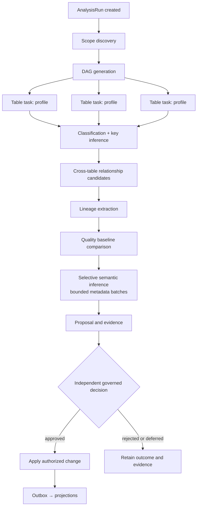

# Workers and Workflows

> Status: Authoritative. Owner: Architecture.
> Scope: how background work is decomposed, scheduled, bounded, and recovered. This is where "hundreds of thousands of tables" becomes tractable.

## 1. The core idea

> **Review correction (2026-09-09):** The DAG below is a target decomposition, not proof that every stage has a dedicated worker. The inspected Temporal worker registers discovery and ingestion on one configured task queue. Queue separation and fleet-wide isolation described later are deployment requirements until verified. Older dated worker-status rows are historical snapshots, not a current inventory. See [critical review AR-08/AR-09](15-agent-architecture-critical-review.md).

**Metadata analysis is a distributed job/DAG execution problem, not an agent problem** (P7).

The naive design — one autonomous agent per table — fails on four counts: cost scales linearly with model calls, there is no dependency ordering (cross-table relationships need both tables profiled first), permissions become unbounded, and failure is unattributable.

The Atlas design: an **analysis run** expands into a **task DAG**, tasks are executed by **bounded, idempotent workers**, and models are invoked **selectively, on aggregated metadata, after deterministic work is complete**.

**Measured claims versus design intent.** Profiling fans out as bounded deterministic work; its actual cost depends on the source and profiling policy. Current semantic enrichment groups at most 25 tables per model call (`semantic_inference.py`). Enriching 100,000 selected tables therefore entails 4,000 nominal batch attempts before failures or retries, not the previously claimed roughly 50. This arithmetic is not a throughput benchmark. Confidence alone does not authorize publication; automated review has open boundary defects documented in AR-01 through AR-04.

## 2. Worker classes

> **Implementation status (2026-08-30).** Of the nine worker classes below, **four have
> running code** and five are target. Verified against `src/aida/workflows/`,
> `src/aida/projectors/` and `compose.yaml`:
>
> | Class | Today |
> |---|---|
> | Discovery | **Built** — `discover_datasource` activity, `DatasourceDiscoveryWorkflow` |
> | Profiling | **Built** — `plan_profile_tasks` / `profile_table_task` / `finalize_profile_tasks`; the fan-out DAG in §1 is real for this class |
> | Batch ingestion | **Built** — `MetadataBatchIngestionWorkflow`, `src/aida/batch_ingestion.py` |
> | Projection | **Built** — `projectors/graph_projector.py` and `projectors/outbox_publisher.py`, run as their own compose services |
> | Classification | **Not a worker.** Deterministic rules run inline (`classify_column_name` in `workflows/activities.py`) |
> | Relationship | **Not a worker.** Candidate handling is request-path code in `src/aida/intelligence_api.py` |
> | Lineage | **Not a worker.** Ingestion is request-path (`openlineage.py`, `dbt_artifacts.py`). Query-log, view-DDL and procedure parsing do not exist at all — see `20-modules/09-lineage.md` |
> | Quality | **Not a worker.** Evaluation is request-path (`quality_service.py`) |
> | Semantic | **Not a worker.** Inference is request-path (`semantic_inference.py`). "Embedding generation" does not exist — there is no embedding column |
>
> The bounds in §3 and the DAG in §1 are accurate for the four built classes. Read them as
> target for the other five.

Split by failure and scaling characteristics, not by domain.

| Class | Work | Scaling axis | Isolation unit | Bounds |
|---|---|---|---|---|
| Discovery | Catalog inventory, drift, tombstoning | sources × objects | per source | objects per scan, scan duration |
| Profiling | Value-free statistics, sampling | tables × columns | per table task | rows sampled, column batch size, table count |
| Classification | Deterministic PII/sensitivity rules | columns | per column batch | batch size |
| Relationship | Candidate generation, evidence scoring | pruned table pairs | per candidate batch | candidate cap, no N×N full-value comparison |
| Lineage | Query-log/view/procedure parsing, OpenLineage, dbt | statements/artifacts | per artifact | statements per run, artifact size |
| Quality | Baseline comparison, incident lifecycle | tables × policies | per policy evaluation | policies per run |
| Semantic | Metadata-only inference, embedding generation | domains/objects | per proposal | tokens, objects per prompt |
| Projection | Outbox → Neo4j / vector / search | event throughput | per event | batch size, in-flight |
| Batch ingestion | Chunk processing, FK resolution, reconciliation | chunks | per chunk | chunk size, cumulative admission |

## 3. Bounds — the rule that makes scale safe

**Every worker operation has an explicit configured bound and returns a truncation reason when it hits one** (P3). Unbounded is a defect, not a performance characteristic.

| Bound | Default | Configurable |
|---|---|---|
| Profile sample rows per table | Adaptive by table size, hard cap | Down only |
| Columns profiled per batch | Configured | Yes |
| Tables per analysis run | Configured | Yes |
| Relationship candidates per table | Configured | Down only |
| Graph traversal | 1–4 hops, node/edge caps | Down only |
| Lineage statements per extraction run | Configured | Yes |
| Model tokens per inference | Per-route budget | Per route |
| Chunks per ingestion batch | 1,000 | Down only |
| Tables / columns per batch | 1M / 5M | Down only |
| Synchronous envelope | 100 catalogs / 50k tables / 250k columns | Down only |
| Query rows / bytes / seconds | Per workload class | Per LOB |

**Why "down only" appears so often.** A bound raised without certification is how a safe system becomes an incident. Raising a hard bound requires performance and privacy evidence, recorded in `60-delivery/03-tracker.md`.

## 4. Fleet scheduling

The scheduler decides *which source gets capacity next*. At thousands of sources, this is the difference between a platform and a queue.

| Concern | Mechanism |
|---|---|
| HA | Leader election with policy polling; a scheduler restart does not double-schedule |
| Priority | Per-source priority class |
| Fairness | Round-robin within priority class, so one huge source cannot starve the fleet |
| Maintenance windows | Per-source allowed windows; work is deferred, not failed |
| Quotas | Per-organization and per-LOB concurrency quotas |
| Admission control | A source at capacity is not admitted; requests queue with visible depth |
| Backpressure | Downstream saturation (worker pool, DB, source) reduces admission rather than causing failures |
| Cancellation | Cancel propagates to running activities and reconciles state |
| Bulkhead | **One source's failure never affects unrelated sources** |

**The bulkhead property is the most important one.** In a bank estate, some sources are always broken — a credential expired, a firewall changed, a database is in maintenance. A design in which those failures consume the shared worker pool degrades everything. Per-source isolation plus admission control keeps a broken source a *local* problem.

## 5. Idempotency and recovery

Every activity must satisfy:

| Property | Meaning | Test |
|---|---|---|
| Idempotent | Running twice produces the same state as once | Re-run an activity mid-workflow; assert no duplicates |
| Heartbeating | Long activities report liveness | Kill a worker mid-activity; assert timely detection |
| Resumable | Retry continues rather than restarts | Force restart mid-batch; assert processed chunks are not reprocessed |
| Cancellable | Cancellation leaves consistent state | Cancel mid-run; assert no partial writes and correct status |
| Bounded | Explicit caps with truncation reasons | Exceed a bound; assert explicit truncation, not silent partial |
| Attributable | Emits audit and evidence | Assert audit rows for every mutation |

### Batch ingestion recovery (worked example)

The most complex recovery path, delivered today:

1. A manifest declares `expected_chunks`. Chunks upload with checksums; numbers and keys are unique within the batch.
2. Finalization requires the exact sequence `1..expected_chunks` — no gaps.
3. Temporal owns execution with heartbeats and bounded exponential retries.
4. **Chunks commit independently**, so a retry resumes already-processed work.
5. Object fingerprints keep reapplication idempotent.
6. A second value-free pass resolves foreign keys whose referenced table arrived in a different chunk.
7. A `FULL` batch accumulates stable object identities across every chunk and runs omission reconciliation **only after all chunks succeed** — it can never retire metadata from a partial delivery.
8. On success, payload JSON is physically cleared (SQL `NULL`); only fingerprints, counts, statuses, and timestamps remain.
9. On failure, validated chunk payloads are retained for authorized retry, and a replacement analysis run is linked via `resumed_from_run_id`.

**Point 7 is the one to internalize.** A partial FULL delivery that ran reconciliation would soft-delete metadata that exists — data loss from a transient network failure. Deferring reconciliation until completeness is proven is what makes FULL safe.

## 6. Selective model invocation

Models are expensive, slow, and non-deterministic. The worker design minimizes calls without losing semantic value.

| Rule | Effect |
|---|---|
| Deterministic first | Never invoke a model for something a rule computes |
| Aggregate before invoking | Current implementation: up to 25 selected tables per call; grouping by domain/family is an optimization target |
| Only after deterministic completion | The model sees structure, keys, classifications, and baselines — not raw metadata |
| Metadata only | Identifiers, types, classifications, constraints, deterministic baselines. Never sample values (INV-6) |
| Structured output | Strict schema validation; malformed output is discarded, not repaired |
| Bounded | Tokens, retries, and timeout per route budget |
| Proposal only | Output enters the review queue, never authoritative state (INV-3) |

**Economics to measure.** Track selected tables, tokens per batch, failed attempts, deterministic fallbacks and cost per accepted result. Fixed-size batching still scales linearly with selected table count. Reuse and incremental selection can reduce volume; low-hundreds call counts are not established for a full 100,000-table enrichment run.

## 7. Worker deployment

| Deployment unit | Worker classes | Scaling signal | Failure mode |
|---|---|---|---|
| `atlas-worker` | Discovery, profiling, classification, relationship, lineage, quality, semantic | Temporal task-queue depth | Task retried on another worker |
| `atlas-projector` | Projection | Kafka consumer lag | Rebalance; offsets uncommitted |
| `atlas-scheduler` | Fleet scheduling, policy polling | Singleton with leader election | Standby takes over |
| `atlas-batch` (optional) | Batch ingestion (isolated when volume warrants) | Batch queue depth | Chunk-level resume |

Task queues are separated per worker class so a profiling backlog cannot starve projection, and a slow source cannot delay quality evaluation.

## 8. Observability requirements

Every worker class emits:

| Signal | Purpose |
|---|---|
| Task started / completed / failed / cancelled, with reason | Health |
| Duration histogram per task type | Capacity planning |
| Retry count and classification (transient vs. permanent) | Failure triage |
| Bound-hit counters with truncation reasons | Detects estates outgrowing configured limits |
| Per-source success rate | Fleet health scoring |
| Queue depth and admission rejections | Backpressure visibility |
| Projection lag per projection per tenant | INV-1 confidence |

SLOs in `10-architecture/10-performance-and-scale-model.md`.

## Related documents

- Event model: `10-architecture/07-event-and-messaging-model.md`
- Service extraction: `10-architecture/05-service-extraction-plan.md`
- Ingestion module: `20-modules/03-ingestion.md`
- Profiling module: `20-modules/05-profiling-and-classification.md`
