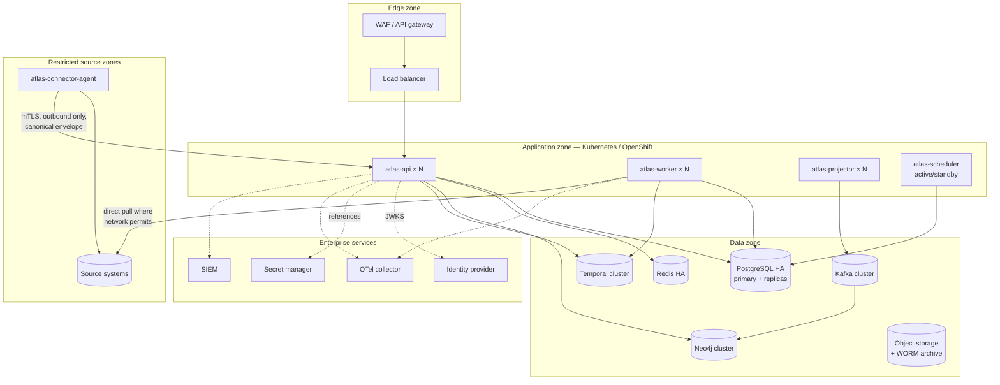

# Deployment Topology

> Status: Authoritative for local and target topology. Bank-specific choices marked **[Bank decision]**.
> Owner: Architecture + Platform.

## 1. Deployment units

> **Implementation status (2026-09-20).** The one-image / multiple-entrypoint shape is real,
> but the unit names below are target names and the count is five, not four. `compose.yaml`
> builds one image and runs it as `api`, `metadata-worker` (`python -m aida.workflows.worker`),
> `fleet-scheduler` (`aida.workflows.scheduler`), `outbox-publisher`
> (`aida.projectors.outbox_publisher`) and `graph-projector` (`aida.projectors.graph_projector`) —
> so the single "projector" unit below is in fact two processes today, and both sit behind
> compose profiles (`events` / `graph`), so a plain `docker compose up` starts three of the
> five. The `atlas-*` names and
> the `src/atlas/entrypoints/` package do not exist. **`atlas-connector-agent` does not exist
> in any form**: no agent code, no registration endpoint, no mTLS path — it is a requirement,
> not a deployed unit, and the `connector_agent.*` events in
> `30-contracts/04-event-catalog.md` are likewise unimplemented. The HA models in the last
> column are untested, and the worker unit's partitioned task queues are not built. The scheduler
> does elect a leader (R11-AUD04): every `fleet-scheduler` replica runs `run_scheduler` in
> `src/aida/workflows/scheduler.py`, and only the one holding a PostgreSQL advisory lock
> (`src/aida/scheduler_leadership.py`, on a dedicated connection outside the pool) runs the passes,
> so more than one replica is safe. Failover is the standby's 5-second retry plus the time
> PostgreSQL takes to drop the old session — at once if the leader's process dies, but only when TCP
> keepalives fire (about two hours on Linux, unless the server sets `tcp_keepalives_*`) if its host
> or network vanishes — and the passes' in-process cadence trackers restart on the new leader; the
> full list of limits is in `08-workers-and-workflows.md` §4. The worker unit has one task queue,
> `aida-metadata`, not queues partitioned by worker class. No failover drill has ever been run.

Four units, one image, different entrypoints (see `05-service-extraction-plan.md` §1).

| Unit | Entrypoint | Scales on | Stateless? | HA model |
|---|---|---|---|---|
| `atlas-api` | HTTP + MCP server | Request concurrency | Yes | N replicas behind a load balancer |
| `atlas-worker` | Temporal worker | Task-queue depth | Yes | N replicas; target: task queues partitioned by worker class (today one queue) |
| `atlas-projector` | Kafka consumer | Consumer lag | Yes | N replicas, consumer-group rebalance |
| `atlas-scheduler` | Fleet scheduler and periodic maintenance loop | — | No (one active leader) | Active/standby: a PostgreSQL advisory lock elects the leader (§1 status note); not drilled |

Plus one optional unit driven by product requirement rather than scale:

| Unit | Purpose | Placement |
|---|---|---|
| `atlas-connector-agent` | Source-side metadata collection in restricted network zones | Inside the source's network zone; outbound mTLS only |

## 2. Local development topology

Reproducible with `docker compose up --build -d`, which starts the ten default services: `postgres`, `temporal`, `migrate`, `api`, `ui-next`, `metadata-worker`, `fleet-scheduler` and three sample-source containers. Everything else is an opt-in compose profile (`--profile <name>`), and `--profile full` starts all of them, 19 services in total as of 2026-09-20, excluding `seed`. The profile block at the top of `compose.yaml` is the authority for what starts when. This is the engineering baseline, not a production model.

| Service | Image role | Port | Notes |
|---|---|---|---|
| PostgreSQL + pgvector | Authoritative store | 5432 | Default stack. Single node, durable volume; Temporal uses the same server |
| Redis | Cache, locks | 6379 | Profile `cache` |
| Neo4j | Graph projection | 7474 / 7687 | Profile `graph`. Browser at 7474 |
| Temporal + UI | Durable workflows | 7233 / 8080 | Temporal is in the default stack; the UI is profile `temporal-ui` |
| Redpanda + Console | Kafka-compatible bus | 19092 (host) / 8081 | Profile `events` for both, and `graph` for Redpanda alone. 9092 is the in-network port |
| MinIO | Object storage | 9000 / 9001 | Profile `archive` |
| Prometheus | Metrics scrape | 9090 | Profile `monitoring` |
| `api` | FastAPI control plane | 8000 | Default stack. `/docs` for OpenAPI |
| `metadata-worker` | Temporal worker | — | Default stack |
| `fleet-scheduler` | Scheduler and periodic maintenance loop | — | Default stack |
| `outbox-publisher` | Outbox → Kafka | — | Profiles `events`, `graph` |
| `graph-projector` | Kafka → Neo4j | — | Profile `graph` |
| `ui-next` | Product UI | 3001 | Default stack. 5174 with `compose.dev.yaml` |

Verification: `/health/live`, `/health/ready`, and `scripts/verify-local.ps1`.

**Development identity is deliberately explicit.** Requests carry identity headers documented in the generated OpenAPI spec. Production configuration refuses this provider (INV-4).

## 3. Target production topology

> **Implementation status (2026-09-11, R11-X10).** Nothing in this repository deploys the
> shape below, and the diagram should be read as a requirement rather than as a description
> of anything that runs. The only Kubernetes manifests that exist anywhere in the tree are
> `infra/k8s/base/`, and they cover one of the four application units: a Deployment for the
> API process plus a one-shot schema-migration Job. There is no manifest for the Temporal
> worker (`aida.workflows.worker`), the fleet scheduler (`aida.workflows.scheduler`), the
> outbox publisher (`aida.projectors.outbox_publisher`), the graph projector
> (`aida.projectors.graph_projector`) or the React UI, and none for any data-zone service —
> `compose.yaml` runs all of them locally, Kubernetes runs none of them. Those manifests
> have never been applied to a cluster: their image digests are the literal placeholder
> `REPLACE_ME_WITH_REAL_DIGEST` because no pipeline builds or pushes the image. The
> migration Job runs `alembic upgrade heads`, the same command as `compose.yaml` and the form
> that survives this repository's routine branch merges (it ran `head` until 2026-09-21,
> R11-AUD13).
> `infra/k8s/base/README.md` is the full accounting of what is and is not there.
> Separately, `infra/airflow/` is one DAG file run by hand as an ingestion smoke test, not
> an Airflow deployment — this repository installs no Airflow and starts none.

**[Bank decision]** Kubernetes vs. OpenShift, managed vs. self-hosted data services, region selection, and private-endpoint topology.

## 4. Network zones and egress

| Zone | Contains | Inbound | Outbound |
|---|---|---|---|
| Edge | WAF, LB | Internet or corporate network | App zone only |
| App | Atlas units | Edge only | Data zone, enterprise services, approved model endpoints, source zones |
| Data | Datastores | App zone only | None |
| Source zone | Bank data sources | Connector agent + approved app-zone pulls | None (agent is outbound-only) |
| Model egress | Approved provider or private endpoint | — | Allowlisted destinations only |

**Rules.**

- Egress from the app zone is allowlisted by destination. No general internet access.
- Connector agents establish **outbound** connections to Atlas. Atlas never dials into a restricted zone. This is what makes the agent model acceptable to a bank network team.
- Model routes use private endpoints where available; public provider endpoints require an approved residency and retention contract.
- Data-zone services are unreachable from the edge.

## 5. Connector placement decision

| Placement | When | Trade-off |
|---|---|---|
| Central pull (worker connects directly) | Source is reachable from the app zone | Simplest; requires network path and firewall rules per source |
| Source-side agent | Source is in a restricted zone, or the network team will not open a path | No inbound path needed; agent must be deployed and upgraded per zone |
| Push producer | Bank already has a metadata bridge or CMDB feed | Atlas is a consumer; producer identity must be signed and rate-limited |
| Broker intake | High-volume estates with an existing event bus | Requires schema registry and admission quotas |

All four converge on the **same canonical metadata envelope** and the same authoritative persistence path (`ADR-0012`). This is why adding a placement mode does not add a persistence mode.

## 6. High availability

| Component | HA approach | Failure behaviour |
|---|---|---|
| `atlas-api` | N replicas, stateless, readiness-gated | Replica loss is transparent |
| `atlas-worker` | N replicas; Temporal reassigns tasks | Task retried elsewhere; heartbeat detects loss |
| `atlas-projector` | Consumer group rebalance | Uncommitted offsets reprocessed; consumers are idempotent |
| `atlas-scheduler` | Leader election by PostgreSQL advisory lock (see the §1 status note) | Standby promotes once the old leader's lock is released; overlap bounded to one iteration; never drilled |
| PostgreSQL | Primary + synchronous replica, automated failover | Brief write pause; RPO 15 min worst case |
| Neo4j | Cluster; or rebuild | Graph explorer degrades; **not authoritative** |
| Kafka | Multi-broker, RF ≥ 3 | Projection lag |
| Temporal | Clustered | New workflows fail closed if fully unavailable |
| Redis | HA with failover | Cache miss, latency increase |

**Readiness semantics.** A replica reports ready only when its required dependencies verify. A replica that cannot reach PostgreSQL is not ready and takes no traffic — it does not serve degraded responses (INV-4).

## 7. Disaster recovery

**[Bank decision]** RPO/RTO targets, region pairing, and failover authority.

Planning defaults:

| Target | Default | Verification |
|---|---|---|
| Metadata RPO | 15 minutes | Continuous archiving + timed PITR drill |
| Metadata RTO | 4 hours | Quarterly restore rehearsal |
| Audit RPO | ~0 | Transactional persistence + WORM export |
| Projection recovery | Rebuild, not restore | Quarterly rebuild drill, timed |
| Regional failover | **[Bank decision]** | Annual regional drill |

**A drill that has not been run and timed does not count.** Drill currency is tracked in `60-delivery/03-tracker.md`.

## 8. Configuration and secrets

| Concern | Approach |
|---|---|
| Configuration | Environment-driven, validated at startup; production posture checks refuse unsafe settings |
| Secrets | **References only** (`vault://`, and the target schemes `cyberark://` and cloud KMS — see the status note below). Plaintext never persisted or logged. |
| Development escape hatch | `env://` resolution is permitted locally and **rejected in production** |
| Rotation | Bounded cache with invalidation on rotation; rotation drill required before go-live |
| Model credentials | Referenced per model route; route approval does not activate generation (ADR-0009) |

> **Implementation status (2026-09-20).** Two secret providers are implemented: `env` and
> `vault` (HashiCorp Vault KV v2, registered once a Vault URL and token are configured), the only
> ones `SecretResolver` registers in `src/aida/secrets.py`. The `credential_provider` setting
> (`src/atlas/platform/config.py`) also accepts `cyberark`, `aws-sm`, `azure-kv` and `gcp-sm`,
> but no code in `src/` implements them: a reference in one of those schemes is refused with
> "configured enterprise secret provider is unavailable". `env` as the production provider is
> refused at settings validation.

## 9. Image and supply chain

| Control | Requirement |
|---|---|
| Base image | Minimal, pinned by digest |
| Runtime user | Non-root |
| Dependencies | Pinned; lockfile committed |
| SBOM | Generated per build |
| Signing | Images signed; admission policy verifies |
| Vulnerability policy | Fail build on critical; documented patch SLA |
| Scanning | SAST, DAST, dependency, and container scans in CI — **partly wired (2026-09-20)**. `.github/workflows/ci.yml` has 21 jobs as of 2026-09-20, including `dependency-scan` (pip-audit against the locked non-dev set, plus a CycloneDX SBOM), `frontend-dependency-scan` (`npm audit` against the `ui-next` lockfile), `secret-scan` (gitleaks over the full history) and `docker-build` (a real image build with a smoke import). Still absent: SAST, DAST, container-image scanning, image signing and an admission policy that verifies signatures |

## 10. Environment matrix

| Environment | Identity | Secrets | Model generation | Data |
|---|---|---|---|---|
| Local | Development headers | `env://` allowed | Optional, approved route required | Synthetic fixtures |
| CI | Development headers | Ephemeral | Disabled | Synthetic fixtures |
| Integration | Real OIDC, test tenant | Real provider, test scope | Enabled, test route | Synthetic + masked |
| Pre-production | Real OIDC | Real provider | Enabled, production-equivalent route | Production-like volumes, non-production data |
| Production | Real OIDC, bank claims | Bank provider | Enabled only after route approval + credential resolution + evaluation evidence | Live |

**The invariant across the matrix.** Safety controls do not vary by environment. What varies is which providers are configured and how much data is real. A control that is off in a lower environment is a control that has never been tested.

## Related documents

- Service extraction: `10-architecture/05-service-extraction-plan.md`
- Performance and scale: `10-architecture/10-performance-and-scale-model.md`
- Security architecture: `50-security/01-security-architecture.md`
- Local runbook: `40-engineering/07-local-runbook.md`
