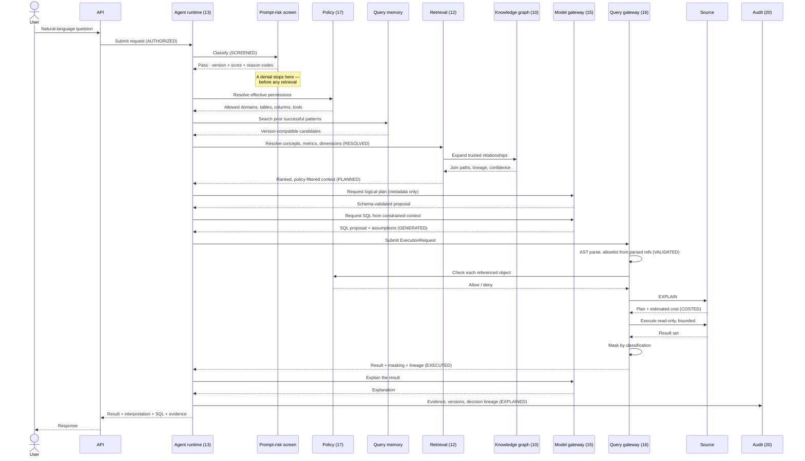
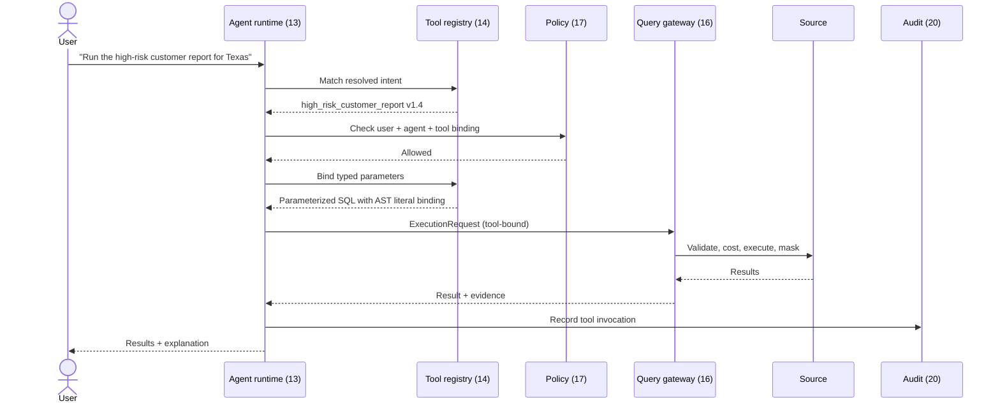
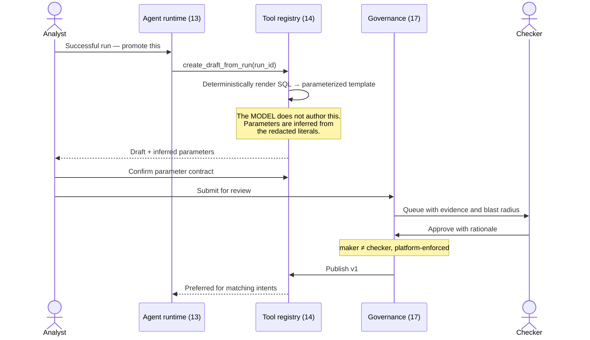
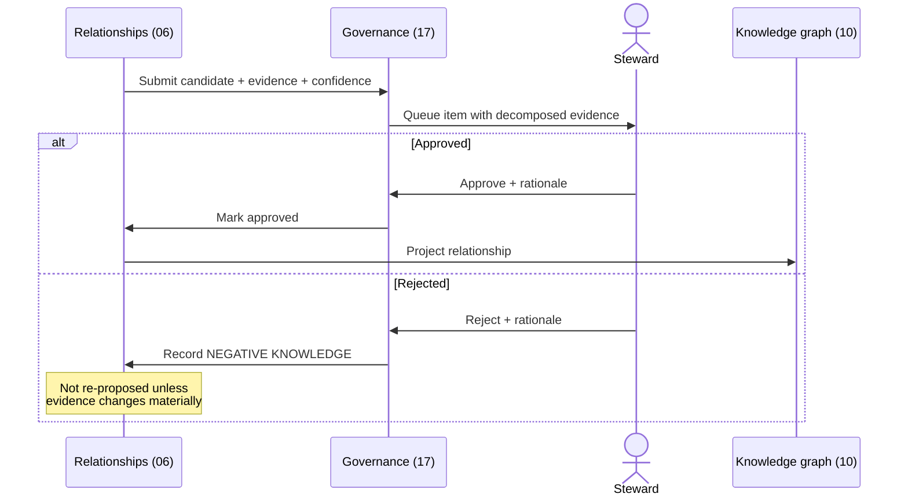
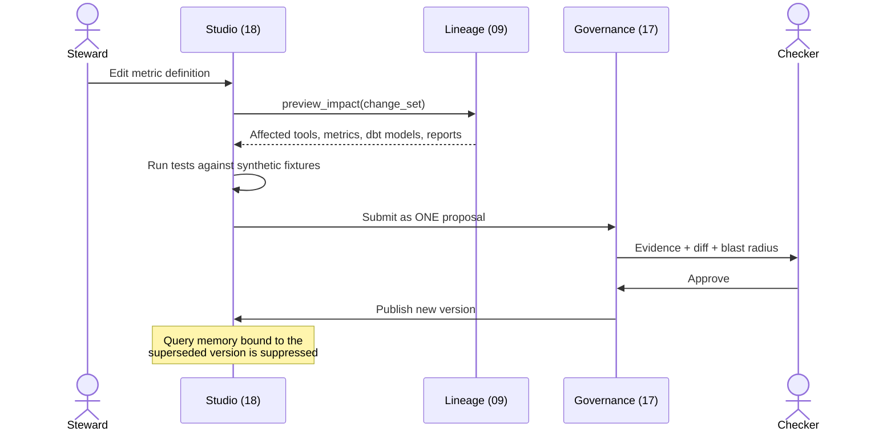
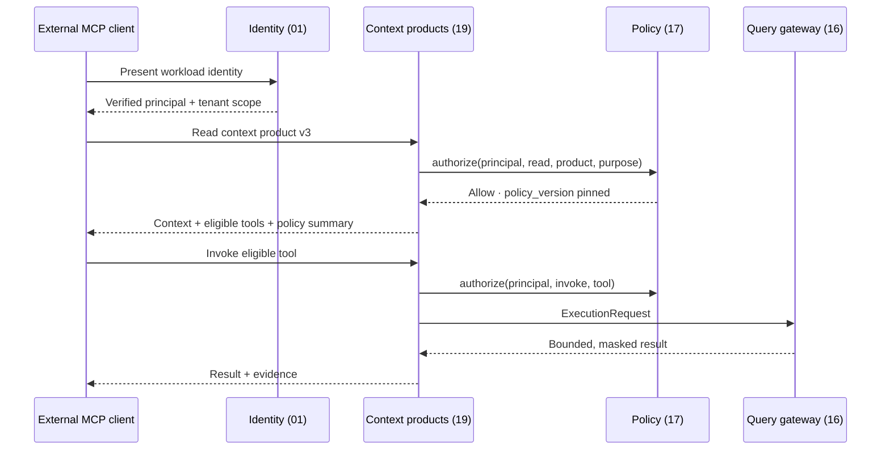
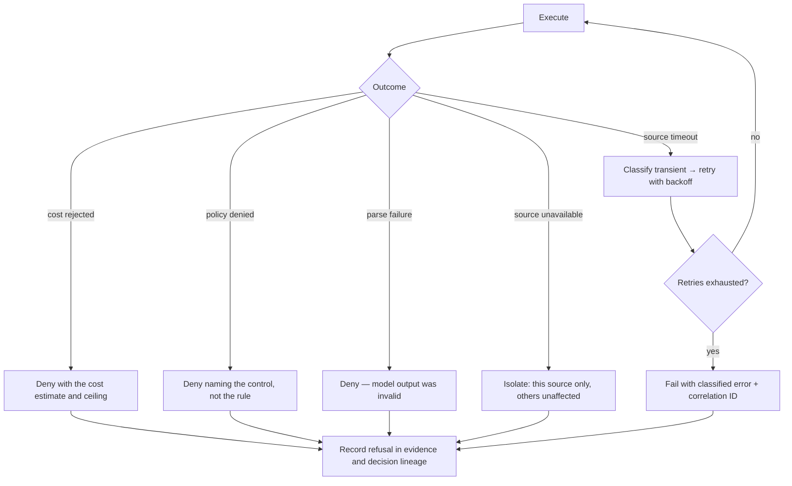
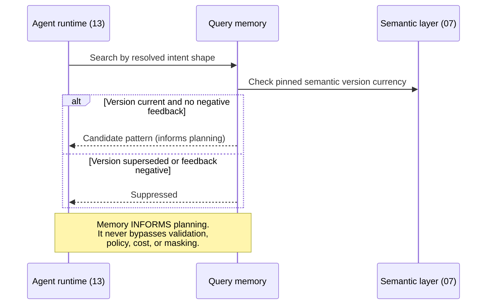

# Runtime Sequences

> Status: Authoritative. Owner: Architecture.
> The interaction sequences that show how the modules compose at runtime. Migrated and updated from the retired flat `03-agent-runtime-sequences.md`.

## 1. Governed NL-to-SQL

The full path when no approved tool matches. Note that **policy resolution and prompt-risk screening happen before retrieval**, and that the gateway sits between every model output and the source.



## 2. Approved tool reuse — the preferred path

Shorter, cheaper, safer, and the path Atlas tries first.



**No model call occurs on this path.** That is the point: cost and risk fall as the tool library matures (differentiator D2).

## 3. Multi-step analytical plan

> *"Find Texas customers whose average spend increased more than 30% in the last six months versus the previous six months and who had at least three complaints. Compare their churn rate to the overall Texas customer population."*

```text
Step 1  resolve the Texas customer population
Step 2  compute spend for the current six-month window
Step 3  compute spend for the previous six-month window
Step 4  calculate growth
Step 5  filter growth > 30%
Step 6  aggregate complaints
Step 7  filter complaint_count >= 3
Step 8  calculate churn rate for the cohort
Step 9  calculate churn rate for the Texas population
Step 10 compare and explain
```

The planner may emit one optimized query or several staged queries depending on the warehouse and complexity. **Every step passes the gateway independently**, and the whole plan is bounded by step, time, token, and cost budgets.

Multi-step plans are **not yet implemented** (tracker AG-4). The current runtime handles single-step requests.

## 4. Promote an analysis to a governed tool



## 5. Human review of an inferred relationship



## 6. Semantic change impact



## 7. Agent identity and authorization



**The symmetry to notice.** An external agent's tool invocation goes through the *same* gateway as a native run. There is no privileged internal path and no unprivileged external one.

## 8. Query failure recovery



Every terminal state records **why**, and every refusal becomes an `AI_DECISION` edge. This is what makes "explain what did not happen" possible (whitespace W3).

## 9. Query memory



## Related documents

- Logical architecture: `10-architecture/03-logical-architecture.md`
- Agent runtime: `20-modules/13-agent-runtime.md`
- Query gateway: `20-modules/16-query-gateway.md`
- Tool and agent contract: `30-contracts/07-tool-and-agent-contract.md`
