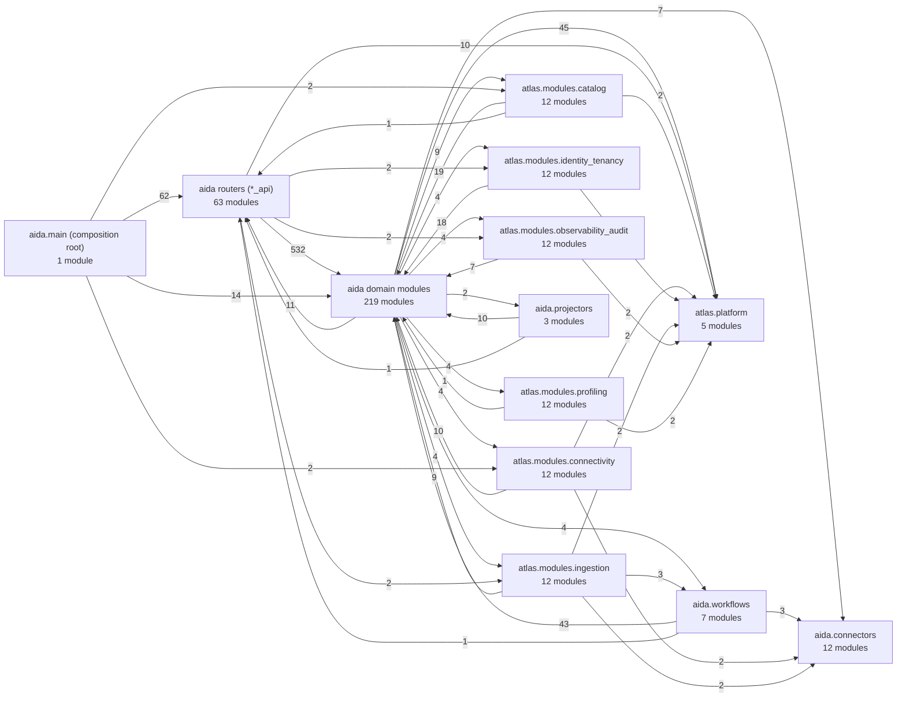
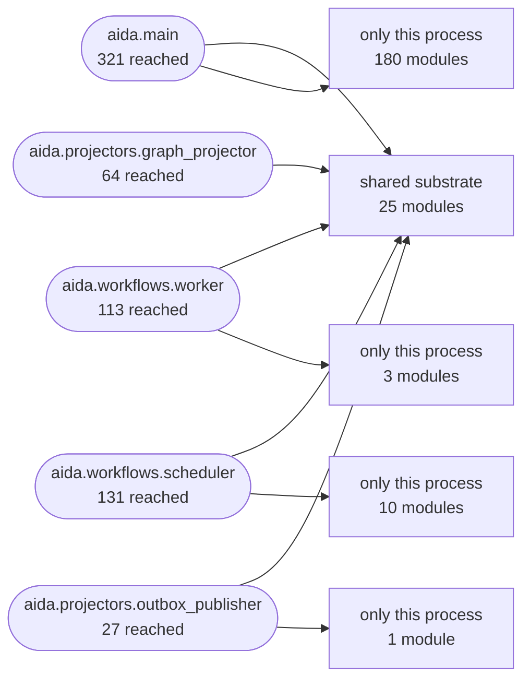

# Architecture map (generated)

> **Generated file — do not edit by hand.**
> Regenerate with `python scripts/generate_architecture_map.py`; `--check` fails
> when it is stale. Every number and every edge below is read out of the source
> tree and `pyproject.toml` at generation time.

385 Python modules under `src/`, 1908 intra-`src` import edges.

## How this map aggregates

Drawn whole, the module graph is a hairball: accurate and unreadable. Every
module is therefore assigned to exactly one **group**, and the diagrams are drawn
at group level with edge weights showing how many module-to-module imports each
line stands for. The assignment is a pure function of a module's dotted path —
package location, plus the `_api` filename suffix this repository already uses
for its HTTP layer — so it cannot drift from the tree it describes.

| Group | Rule | Modules |
|---|---|---:|
| package roots | `aida`, `atlas`, `atlas.modules` — package `__init__` files | 3 |
| aida.main (composition root) | `aida.main` alone — the composition root | 1 |
| aida routers (*_api) | flat `aida.*` whose filename ends `_api` | 63 |
| aida domain modules | everything else flat in `aida.*` | 219 |
| atlas.modules.catalog | `atlas.modules.catalog.*` | 12 |
| atlas.modules.connectivity | `atlas.modules.connectivity.*` | 12 |
| atlas.modules.identity_tenancy | `atlas.modules.identity_tenancy.*` | 12 |
| atlas.modules.ingestion | `atlas.modules.ingestion.*` | 12 |
| atlas.modules.observability_audit | `atlas.modules.observability_audit.*` | 12 |
| atlas.modules.profiling | `atlas.modules.profiling.*` | 12 |
| aida.connectors | `aida.connectors.*` | 12 |
| aida.workflows | `aida.workflows.*` | 7 |
| aida.projectors | `aida.projectors.*` | 3 |
| atlas.platform | `atlas.platform.*` | 5 |

What is deliberately *not* aggregated away: the 6 bounded contexts each keep
their own group even though every one of them is small, because the point of the
map is to show how much of the system has and has not moved into one.

## Module graph, by group

An edge means *importing anything in the source group loads something in the
target group*. Weights are the number of module-level imports aggregated into
that line. The *package roots* group is counted in the table above but not drawn:
every `from aida.x import y` also touches `aida`, so an edge into a package root
restates the edge next to it and nothing more.

### The claim this grouping makes, and whether it holds

Splitting the flat package into *routers* and *domain modules* is only useful if
the dependency runs one way. It mostly does — and where it does not, the
exceptions are named here rather than hidden by the aggregation.

11 import(s) run the wrong way (a domain, platform or connector
module importing a router):

| Importer | Router imported |
|---|---|
| `aida.answer_provenance` | `aida.unified_lineage_api` |
| `aida.lineage_evidence_export` | `aida.unified_lineage_api` |
| `aida.marketplace_discovery` | `aida.product_marketplace_api` |
| `aida.mcp_server` | `aida.product_marketplace_api` |
| `aida.mcp_server` | `aida.sql_validation_api` |
| `aida.mcp_server` | `aida.unified_lineage_api` |
| `aida.relationship_candidate_review` | `aida.unified_lineage_api` |
| `aida.review_queue_read_model` | `aida.semantic_api` |
| `aida.review_queue_schemas` | `aida.semantic_api` |
| `aida.studio_context_product` | `aida.context_product_api` |
| `aida.tool_impact` | `aida.unified_lineage_api` |

These are facts, not verdicts. Two of the import-linter contracts in
`pyproject.toml` exist precisely because edges of this shape closed a cycle
once; the ones listed here are the ones no contract currently forbids.

## Process entry points and what each reaches

The five processes that constitute the running system. *Reaches* is transitive
import reachability from that process's own module, which is what determines
whether code can run in it at all — not whether it does.

| Entry point | Process | Modules reached |
|---|---|---:|
| `aida.main` | FastAPI application (`uvicorn aida.main:app`) | 321 |
| `aida.workflows.worker` | Temporal worker | 113 |
| `aida.workflows.scheduler` | Fleet scheduler (polling loop) | 131 |
| `aida.projectors.graph_projector` | Lineage graph projector (Kafka consumer) | 64 |
| `aida.projectors.outbox_publisher` | Outbox publisher (Kafka producer) | 27 |

Union of all five: 339 of 385 modules.

Per group, how much of each group each process pulls in:

| Group | main | worker | scheduler | graph_projector | outbox_publisher | Group size |
|---|---:|---:|---:|---:|---:|---:|
| package roots | 3 | 3 | 3 | 3 | 3 | 3 |
| aida.main (composition root) | 1 | 0 | 0 | 0 | 0 | 1 |
| aida routers (*_api) | 63 | 0 | 2 | 1 | 0 | 63 |
| aida domain modules | 205 | 68 | 95 | 33 | 6 | 219 |
| atlas.modules.catalog | 7 | 5 | 5 | 5 | 2 | 12 |
| atlas.modules.connectivity | 5 | 3 | 3 | 3 | 2 | 12 |
| atlas.modules.identity_tenancy | 4 | 3 | 3 | 3 | 2 | 12 |
| atlas.modules.ingestion | 4 | 3 | 3 | 3 | 2 | 12 |
| atlas.modules.observability_audit | 4 | 3 | 3 | 3 | 2 | 12 |
| atlas.modules.profiling | 3 | 3 | 3 | 3 | 2 | 12 |
| aida.connectors | 12 | 11 | 0 | 0 | 0 | 12 |
| aida.workflows | 5 | 6 | 4 | 0 | 0 | 7 |
| aida.projectors | 0 | 0 | 2 | 2 | 2 | 3 |
| atlas.platform | 5 | 5 | 5 | 5 | 4 | 5 |

**25 modules are loaded by all five processes** — the shared
substrate every process pays for. The rest divides into what each process alone
pulls in:

## Bounded contexts

All 6 module directories under `src/atlas/modules/`. Tables and routes are
read out of each context's own `models.py` and `router.py`; *mounted via* is read
out of `aida.main`'s imports, which is the fact that says whether a context's
public face is being used or a compatibility shim still stands in front of it.

| Context | Modules | Owned tables | Routes | Mounted via | Privacy contract |
|---|---:|---:|---:|---|---|
| [`catalog`](../20-modules/domain-guides/catalog.md) | 12 | 7 | 10 | `atlas.modules.catalog.api` (public face) | `catalog module privacy` |
| [`connectivity`](../20-modules/domain-guides/connectivity.md) | 12 | 2 | 7 | `atlas.modules.connectivity.api` (public face) | `connectivity module privacy` |
| [`identity_tenancy`](../20-modules/domain-guides/identity-tenancy.md) | 12 | 19 | 29 | `aida.workspace_api` (compatibility shim) | `identity_tenancy module privacy` |
| [`ingestion`](../20-modules/domain-guides/ingestion.md) | 12 | 3 | 15 | `aida.ingestion_api` (compatibility shim) | `ingestion module privacy` |
| [`observability_audit`](../20-modules/domain-guides/observability-audit.md) | 12 | 9 | 2 | `aida.observability_api` (compatibility shim) | `observability_audit module privacy` |
| [`profiling`](../20-modules/domain-guides/profiling.md) | 12 | 9 | 0 | not mounted from `aida.main` | `profiling module privacy` |

Each context's own guide is linked from the name. Owned tables, per context:

- **catalog** — `metadata_catalog`, `metadata_schema`, `metadata_table`, `metadata_column`, `metadata_constraint`, `metadata_index`, `metadata_partition`
- **connectivity** — `datasource`, `connector_certification_run`
- **identity_tenancy** — `organization`, `organization_integration_policy`, `line_of_business`, `data_domain`, `cross_boundary_grant`, `isolation_boundary`, `workspace`, `workspace_membership`, `workspace_access_rule`, `authorization_shadow_record`, `source_binding`, `business_node`, `business_assignment`, `business_assignment_rule`, `business_node_closure`, `business_node_rollup`, `project`, `delegation`, `revoked_token`
- **ingestion** — `metadata_ingestion_job`, `metadata_ingestion_batch`, `metadata_ingestion_chunk`
- **observability_audit** — `outbox_event`, `audit_archive_record`, `audit_archive_membership`, `audit_archive_lease`, `audit_event`, `compliance_pack`, `access_review_report`, `delivery_intent`, `delivery_attempt`
- **profiling** — `classification_evidence`, `column_derived_classification`, `analysis_run`, `analysis_task`, `scan_policy`, `table_profile`, `column_profile`, `profiling_exception_policy`, `column_value_profile_artifact`

## Import-linter contracts actually enforced

Parsed from `pyproject.toml`. These run in CI as `lint-imports` in the
`Lint, types and architecture` job, so every one of them is enforced on every
push rather than described.

| Contract | Type | Guards |
|---|---|---|
| identity_tenancy module privacy | protected | 6 protected module(s), 12 allowed importer(s) |
| connectivity module privacy | protected | 6 protected module(s), 11 allowed importer(s) |
| ingestion module privacy | protected | 6 protected module(s), 12 allowed importer(s) |
| catalog module privacy | protected | 6 protected module(s), 13 allowed importer(s) |
| observability_audit module privacy | protected | 6 protected module(s), 12 allowed importer(s) |
| profiling module privacy | protected | 6 protected module(s), 11 allowed importer(s) |
| INV-2 connector SQL execution is reachable only from the query gateway | protected | 1 protected module(s), 1 allowed importer(s) |
| security_types never depends on api (leaf-module ratchet) | forbidden | 1 source module(s) may not import 1 module(s) |
| C4 / ST-11 lineage and intelligence modules never import the query gateway | forbidden | 12 source module(s) may not import 1 module(s) |
| F05 the governance decision service is never reached from a router (and never imports one) | forbidden | 3 source module(s) may not import 5 module(s) |
| R02 extracted lineage/graph/portfolio services never import a router | forbidden | 3 source module(s) may not import 5 module(s) |
| ADR-0029 the steward agent and the rules it shares never import a router | forbidden | 12 source module(s) may not import 13 module(s) |

12 contracts, 199 forbidden module pairs. The
forbidden edges, drawn — a dashed line is an import the build rejects:

```mermaid
graph LR
  aida_security_types["aida.security_types"]
  aida_api["aida.api"]
  aida_unified_lineage["aida.unified_lineage"]
  aida_query_gateway["aida.query_gateway"]
  aida_unified_lineage_api["aida.unified_lineage_api"]
  aida_lineage_cache["aida.lineage_cache"]
  aida_graph_store["aida.graph_store"]
  aida_openlineage["aida.openlineage"]
  aida_openlineage_api["aida.openlineage_api"]
  aida_knowledge_graph["aida.knowledge_graph"]
  aida_agent_intelligence["aida.agent_intelligence"]
  aida_intelligence_api["aida.intelligence_api"]
  aida_semantic_inference["aida.semantic_inference"]
  aida_unified_lineage_builder["aida.unified_lineage_builder"]
  aida_knowledge_graph_neighborhood["aida.knowledge_graph_neighborhood"]
  aida_governance_decision_contracts["aida.governance_decision_contracts"]
  aida_semantic_api["aida.semantic_api"]
  aida_agent_contract_api["aida.agent_contract_api"]
  aida_agent_contract_request_api["aida.agent_contract_request_api"]
  aida_asset_description_api["aida.asset_description_api"]
  aida_column_description_api["aida.column_description_api"]
  aida_governance_decision_service["aida.governance_decision_service"]
  aida_reviewer_agent["aida.reviewer_agent"]
  aida_product_marketplace_api["aida.product_marketplace_api"]
  aida_portfolio_analytics_read_model["aida.portfolio_analytics_read_model"]
  aida_documentation_worklist_signals["aida.documentation_worklist_signals"]
  aida_lineage_agent_api["aida.lineage_agent_api"]
  aida_parsed_lineage_review_api["aida.parsed_lineage_review_api"]
  aida_procedure_lineage_api["aida.procedure_lineage_api"]
  aida_quality_agent_api["aida.quality_agent_api"]
  aida_quality_api["aida.quality_api"]
  aida_steward_agent_api["aida.steward_agent_api"]
  aida_stewardship_api["aida.stewardship_api"]
  aida_task_agent_api["aida.task_agent_api"]
  aida_view_lineage_api["aida.view_lineage_api"]
  aida_glossary_link_candidates["aida.glossary_link_candidates"]
  aida_lineage_agent["aida.lineage_agent"]
  aida_lineage_table_resolution["aida.lineage_table_resolution"]
  aida_quality_agent["aida.quality_agent"]
  aida_quality_rule_proposal_model["aida.quality_rule_proposal_model"]
  aida_quality_rule_proposals["aida.quality_rule_proposals"]
  aida_routine_lineage_edges["aida.routine_lineage_edges"]
  aida_steward_agent["aida.steward_agent"]
  aida_task_agent["aida.task_agent"]
  aida_task_agent_registry["aida.task_agent_registry"]
  aida_task_agent_schedule["aida.task_agent_schedule"]
  aida_security_types -.->|forbidden| aida_api
  aida_unified_lineage -.->|forbidden| aida_query_gateway
  aida_unified_lineage_api -.->|forbidden| aida_query_gateway
  aida_lineage_cache -.->|forbidden| aida_query_gateway
  aida_graph_store -.->|forbidden| aida_query_gateway
  aida_openlineage -.->|forbidden| aida_query_gateway
  aida_openlineage_api -.->|forbidden| aida_query_gateway
  aida_knowledge_graph -.->|forbidden| aida_query_gateway
  aida_agent_intelligence -.->|forbidden| aida_query_gateway
  aida_intelligence_api -.->|forbidden| aida_query_gateway
  aida_semantic_inference -.->|forbidden| aida_query_gateway
  aida_unified_lineage_builder -.->|forbidden| aida_query_gateway
  aida_knowledge_graph_neighborhood -.->|forbidden| aida_query_gateway
  aida_governance_decision_contracts -.->|forbidden| aida_semantic_api
  aida_governance_decision_contracts -.->|forbidden| aida_agent_contract_api
  aida_governance_decision_contracts -.->|forbidden| aida_agent_contract_request_api
  aida_governance_decision_contracts -.->|forbidden| aida_asset_description_api
  aida_governance_decision_contracts -.->|forbidden| aida_column_description_api
  aida_governance_decision_service -.->|forbidden| aida_semantic_api
  aida_governance_decision_service -.->|forbidden| aida_agent_contract_api
  aida_governance_decision_service -.->|forbidden| aida_agent_contract_request_api
  aida_governance_decision_service -.->|forbidden| aida_asset_description_api
  aida_governance_decision_service -.->|forbidden| aida_column_description_api
  aida_reviewer_agent -.->|forbidden| aida_semantic_api
  aida_reviewer_agent -.->|forbidden| aida_agent_contract_api
  aida_reviewer_agent -.->|forbidden| aida_agent_contract_request_api
  aida_reviewer_agent -.->|forbidden| aida_asset_description_api
  aida_reviewer_agent -.->|forbidden| aida_column_description_api
  aida_knowledge_graph_neighborhood -.->|forbidden| aida_api
  aida_knowledge_graph_neighborhood -.->|forbidden| aida_intelligence_api
  aida_knowledge_graph_neighborhood -.->|forbidden| aida_product_marketplace_api
  aida_knowledge_graph_neighborhood -.->|forbidden| aida_semantic_api
  aida_knowledge_graph_neighborhood -.->|forbidden| aida_unified_lineage_api
  aida_portfolio_analytics_read_model -.->|forbidden| aida_api
  aida_portfolio_analytics_read_model -.->|forbidden| aida_intelligence_api
  aida_portfolio_analytics_read_model -.->|forbidden| aida_product_marketplace_api
  aida_portfolio_analytics_read_model -.->|forbidden| aida_semantic_api
  aida_portfolio_analytics_read_model -.->|forbidden| aida_unified_lineage_api
  aida_unified_lineage_builder -.->|forbidden| aida_api
  aida_unified_lineage_builder -.->|forbidden| aida_intelligence_api
  aida_unified_lineage_builder -.->|forbidden| aida_product_marketplace_api
  aida_unified_lineage_builder -.->|forbidden| aida_semantic_api
  aida_unified_lineage_builder -.->|forbidden| aida_unified_lineage_api
  aida_documentation_worklist_signals -.->|forbidden| aida_agent_contract_api
  aida_documentation_worklist_signals -.->|forbidden| aida_api
  aida_documentation_worklist_signals -.->|forbidden| aida_asset_description_api
  aida_documentation_worklist_signals -.->|forbidden| aida_lineage_agent_api
  aida_documentation_worklist_signals -.->|forbidden| aida_parsed_lineage_review_api
  aida_documentation_worklist_signals -.->|forbidden| aida_procedure_lineage_api
  aida_documentation_worklist_signals -.->|forbidden| aida_quality_agent_api
  aida_documentation_worklist_signals -.->|forbidden| aida_quality_api
  aida_documentation_worklist_signals -.->|forbidden| aida_semantic_api
  aida_documentation_worklist_signals -.->|forbidden| aida_steward_agent_api
  aida_documentation_worklist_signals -.->|forbidden| aida_stewardship_api
  aida_documentation_worklist_signals -.->|forbidden| aida_task_agent_api
  aida_documentation_worklist_signals -.->|forbidden| aida_view_lineage_api
  aida_glossary_link_candidates -.->|forbidden| aida_agent_contract_api
  aida_glossary_link_candidates -.->|forbidden| aida_api
  aida_glossary_link_candidates -.->|forbidden| aida_asset_description_api
  aida_glossary_link_candidates -.->|forbidden| aida_lineage_agent_api
  aida_glossary_link_candidates -.->|forbidden| aida_parsed_lineage_review_api
  aida_glossary_link_candidates -.->|forbidden| aida_procedure_lineage_api
  aida_glossary_link_candidates -.->|forbidden| aida_quality_agent_api
  aida_glossary_link_candidates -.->|forbidden| aida_quality_api
  aida_glossary_link_candidates -.->|forbidden| aida_semantic_api
  aida_glossary_link_candidates -.->|forbidden| aida_steward_agent_api
  aida_glossary_link_candidates -.->|forbidden| aida_stewardship_api
  aida_glossary_link_candidates -.->|forbidden| aida_task_agent_api
  aida_glossary_link_candidates -.->|forbidden| aida_view_lineage_api
  aida_lineage_agent -.->|forbidden| aida_agent_contract_api
  aida_lineage_agent -.->|forbidden| aida_api
  aida_lineage_agent -.->|forbidden| aida_asset_description_api
  aida_lineage_agent -.->|forbidden| aida_lineage_agent_api
  aida_lineage_agent -.->|forbidden| aida_parsed_lineage_review_api
  aida_lineage_agent -.->|forbidden| aida_procedure_lineage_api
  aida_lineage_agent -.->|forbidden| aida_quality_agent_api
  aida_lineage_agent -.->|forbidden| aida_quality_api
  aida_lineage_agent -.->|forbidden| aida_semantic_api
  aida_lineage_agent -.->|forbidden| aida_steward_agent_api
  aida_lineage_agent -.->|forbidden| aida_stewardship_api
  aida_lineage_agent -.->|forbidden| aida_task_agent_api
  aida_lineage_agent -.->|forbidden| aida_view_lineage_api
  aida_lineage_table_resolution -.->|forbidden| aida_agent_contract_api
  aida_lineage_table_resolution -.->|forbidden| aida_api
  aida_lineage_table_resolution -.->|forbidden| aida_asset_description_api
  aida_lineage_table_resolution -.->|forbidden| aida_lineage_agent_api
  aida_lineage_table_resolution -.->|forbidden| aida_parsed_lineage_review_api
  aida_lineage_table_resolution -.->|forbidden| aida_procedure_lineage_api
  aida_lineage_table_resolution -.->|forbidden| aida_quality_agent_api
  aida_lineage_table_resolution -.->|forbidden| aida_quality_api
  aida_lineage_table_resolution -.->|forbidden| aida_semantic_api
  aida_lineage_table_resolution -.->|forbidden| aida_steward_agent_api
  aida_lineage_table_resolution -.->|forbidden| aida_stewardship_api
  aida_lineage_table_resolution -.->|forbidden| aida_task_agent_api
  aida_lineage_table_resolution -.->|forbidden| aida_view_lineage_api
  aida_quality_agent -.->|forbidden| aida_agent_contract_api
  aida_quality_agent -.->|forbidden| aida_api
  aida_quality_agent -.->|forbidden| aida_asset_description_api
  aida_quality_agent -.->|forbidden| aida_lineage_agent_api
  aida_quality_agent -.->|forbidden| aida_parsed_lineage_review_api
  aida_quality_agent -.->|forbidden| aida_procedure_lineage_api
  aida_quality_agent -.->|forbidden| aida_quality_agent_api
  aida_quality_agent -.->|forbidden| aida_quality_api
  aida_quality_agent -.->|forbidden| aida_semantic_api
  aida_quality_agent -.->|forbidden| aida_steward_agent_api
  aida_quality_agent -.->|forbidden| aida_stewardship_api
  aida_quality_agent -.->|forbidden| aida_task_agent_api
  aida_quality_agent -.->|forbidden| aida_view_lineage_api
  aida_quality_rule_proposal_model -.->|forbidden| aida_agent_contract_api
  aida_quality_rule_proposal_model -.->|forbidden| aida_api
  aida_quality_rule_proposal_model -.->|forbidden| aida_asset_description_api
  aida_quality_rule_proposal_model -.->|forbidden| aida_lineage_agent_api
  aida_quality_rule_proposal_model -.->|forbidden| aida_parsed_lineage_review_api
  aida_quality_rule_proposal_model -.->|forbidden| aida_procedure_lineage_api
  aida_quality_rule_proposal_model -.->|forbidden| aida_quality_agent_api
  aida_quality_rule_proposal_model -.->|forbidden| aida_quality_api
  aida_quality_rule_proposal_model -.->|forbidden| aida_semantic_api
  aida_quality_rule_proposal_model -.->|forbidden| aida_steward_agent_api
  aida_quality_rule_proposal_model -.->|forbidden| aida_stewardship_api
  aida_quality_rule_proposal_model -.->|forbidden| aida_task_agent_api
  aida_quality_rule_proposal_model -.->|forbidden| aida_view_lineage_api
  aida_quality_rule_proposals -.->|forbidden| aida_agent_contract_api
  aida_quality_rule_proposals -.->|forbidden| aida_api
  aida_quality_rule_proposals -.->|forbidden| aida_asset_description_api
  aida_quality_rule_proposals -.->|forbidden| aida_lineage_agent_api
  aida_quality_rule_proposals -.->|forbidden| aida_parsed_lineage_review_api
  aida_quality_rule_proposals -.->|forbidden| aida_procedure_lineage_api
  aida_quality_rule_proposals -.->|forbidden| aida_quality_agent_api
  aida_quality_rule_proposals -.->|forbidden| aida_quality_api
  aida_quality_rule_proposals -.->|forbidden| aida_semantic_api
  aida_quality_rule_proposals -.->|forbidden| aida_steward_agent_api
  aida_quality_rule_proposals -.->|forbidden| aida_stewardship_api
  aida_quality_rule_proposals -.->|forbidden| aida_task_agent_api
  aida_quality_rule_proposals -.->|forbidden| aida_view_lineage_api
  aida_routine_lineage_edges -.->|forbidden| aida_agent_contract_api
  aida_routine_lineage_edges -.->|forbidden| aida_api
  aida_routine_lineage_edges -.->|forbidden| aida_asset_description_api
  aida_routine_lineage_edges -.->|forbidden| aida_lineage_agent_api
  aida_routine_lineage_edges -.->|forbidden| aida_parsed_lineage_review_api
  aida_routine_lineage_edges -.->|forbidden| aida_procedure_lineage_api
  aida_routine_lineage_edges -.->|forbidden| aida_quality_agent_api
  aida_routine_lineage_edges -.->|forbidden| aida_quality_api
  aida_routine_lineage_edges -.->|forbidden| aida_semantic_api
  aida_routine_lineage_edges -.->|forbidden| aida_steward_agent_api
  aida_routine_lineage_edges -.->|forbidden| aida_stewardship_api
  aida_routine_lineage_edges -.->|forbidden| aida_task_agent_api
  aida_routine_lineage_edges -.->|forbidden| aida_view_lineage_api
  aida_steward_agent -.->|forbidden| aida_agent_contract_api
  aida_steward_agent -.->|forbidden| aida_api
  aida_steward_agent -.->|forbidden| aida_asset_description_api
  aida_steward_agent -.->|forbidden| aida_lineage_agent_api
  aida_steward_agent -.->|forbidden| aida_parsed_lineage_review_api
  aida_steward_agent -.->|forbidden| aida_procedure_lineage_api
  aida_steward_agent -.->|forbidden| aida_quality_agent_api
  aida_steward_agent -.->|forbidden| aida_quality_api
  aida_steward_agent -.->|forbidden| aida_semantic_api
  aida_steward_agent -.->|forbidden| aida_steward_agent_api
  aida_steward_agent -.->|forbidden| aida_stewardship_api
  aida_steward_agent -.->|forbidden| aida_task_agent_api
  aida_steward_agent -.->|forbidden| aida_view_lineage_api
  aida_task_agent -.->|forbidden| aida_agent_contract_api
  aida_task_agent -.->|forbidden| aida_api
  aida_task_agent -.->|forbidden| aida_asset_description_api
  aida_task_agent -.->|forbidden| aida_lineage_agent_api
  aida_task_agent -.->|forbidden| aida_parsed_lineage_review_api
  aida_task_agent -.->|forbidden| aida_procedure_lineage_api
  aida_task_agent -.->|forbidden| aida_quality_agent_api
  aida_task_agent -.->|forbidden| aida_quality_api
  aida_task_agent -.->|forbidden| aida_semantic_api
  aida_task_agent -.->|forbidden| aida_steward_agent_api
  aida_task_agent -.->|forbidden| aida_stewardship_api
  aida_task_agent -.->|forbidden| aida_task_agent_api
  aida_task_agent -.->|forbidden| aida_view_lineage_api
  aida_task_agent_registry -.->|forbidden| aida_agent_contract_api
  aida_task_agent_registry -.->|forbidden| aida_api
  aida_task_agent_registry -.->|forbidden| aida_asset_description_api
  aida_task_agent_registry -.->|forbidden| aida_lineage_agent_api
  aida_task_agent_registry -.->|forbidden| aida_parsed_lineage_review_api
  aida_task_agent_registry -.->|forbidden| aida_procedure_lineage_api
  aida_task_agent_registry -.->|forbidden| aida_quality_agent_api
  aida_task_agent_registry -.->|forbidden| aida_quality_api
  aida_task_agent_registry -.->|forbidden| aida_semantic_api
  aida_task_agent_registry -.->|forbidden| aida_steward_agent_api
  aida_task_agent_registry -.->|forbidden| aida_stewardship_api
  aida_task_agent_registry -.->|forbidden| aida_task_agent_api
  aida_task_agent_registry -.->|forbidden| aida_view_lineage_api
  aida_task_agent_schedule -.->|forbidden| aida_agent_contract_api
  aida_task_agent_schedule -.->|forbidden| aida_api
  aida_task_agent_schedule -.->|forbidden| aida_asset_description_api
  aida_task_agent_schedule -.->|forbidden| aida_lineage_agent_api
  aida_task_agent_schedule -.->|forbidden| aida_parsed_lineage_review_api
  aida_task_agent_schedule -.->|forbidden| aida_procedure_lineage_api
  aida_task_agent_schedule -.->|forbidden| aida_quality_agent_api
  aida_task_agent_schedule -.->|forbidden| aida_quality_api
  aida_task_agent_schedule -.->|forbidden| aida_semantic_api
  aida_task_agent_schedule -.->|forbidden| aida_steward_agent_api
  aida_task_agent_schedule -.->|forbidden| aida_stewardship_api
  aida_task_agent_schedule -.->|forbidden| aida_task_agent_api
  aida_task_agent_schedule -.->|forbidden| aida_view_lineage_api
```

## Most-imported modules

The hubs: what a change here touches. Fan-in counts direct importers inside
`src/`, so a high number means a wide blast radius, not importance. Package
`__init__` modules are excluded — every submodule import touches its parent, so
a package's fan-in measures nothing but the size of the package.

| Module | Group | Direct importers |
|---|---|---:|
| `aida.models` | aida domain modules | 187 |
| `aida.security` | aida domain modules | 106 |
| `aida.db` | aida domain modules | 97 |
| `aida.schemas` | aida domain modules | 94 |
| `aida.config` | aida domain modules | 83 |
| `aida.events` | aida domain modules | 82 |
| `aida.context` | aida domain modules | 65 |
| `atlas.platform.config` | atlas.platform | 23 |
| `aida.authorization_gate` | aida domain modules | 13 |
| `aida.connectors.base` | aida.connectors | 13 |
| `aida.secrets` | aida domain modules | 11 |
| `aida.business_annotation_versions` | aida domain modules | 10 |
| `aida.classification` | aida domain modules | 10 |
| `aida.task_agent` | aida domain modules | 10 |
| `atlas.platform.db` | atlas.platform | 10 |

## What this map cannot tell you

- An import edge is not a call. Reachable code can still be dead;
  `tests/test_reachability_gate.py` is the module-level gate and function-level
  liveness is a separate, open question.
- Dynamic imports are invisible here, as in every static pass in this repository.
- Group membership is a path rule, not a judgement about what a module is for.
  A misfiled module is grouped by where it sits, which is the honest answer.
