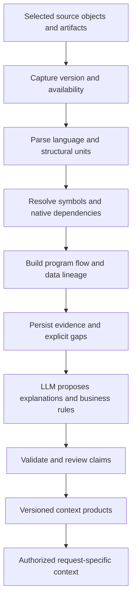

# Database footprint and reusable agent context

> **Design proposal — 2026-09-14.** Based on source inspection at commit
> `abd0794d70e545081a1528cfaf98f2917dd54d4e`. This document proposes an extension
> to Atlas; it does not claim that the proposed contracts or capabilities exist.
> This is documentation work alongside a separate implementation workstream.
> Delivery status continues to live in the [tracker](../60-delivery/03-tracker.md).
>
> **Reviewed 2026-09-15 against `a54ea14`.** The code claims in section 2 were re-checked
> and hold. The review added the rows marked *2026-09-15*; two of them were defects, not
> gaps. The FP-01–FP-18 tasks in section 16 are now tracker rows `R11-FP01`–`R11-FP18`,
> with matching numbers, and the redaction defect is `R11-D16`. Status is tracked there.

**Reading guide:** sections 1–2 explain the recommendation and current gaps; sections 3–8
cover inventory and code mapping; sections 9–12 cover agent context and tools; sections
13–15 describe implementation changes, evaluation and delivery. Section 16 turns the
complete product loop into paired API/backend and UI tasks with release gates.

## 1. Recommendation

Build a **versioned, evidence-backed map of the data estate** and compile the relevant
part of that map into context for each authorized request. Extend the existing catalog,
lineage, retrieval, context-product and tool services to do this.

The map should answer five questions:

1. **What exists?** Databases, schemas, tables, views, materialized views, routines,
   package members, pipelines and the supporting objects that affect their behavior.
2. **What does it do?** Inputs, outputs, transformations, business rules, execution
   conditions, side effects and dependencies, with evidence pointing into versioned code.
3. **How well do we know?** Discovery scope, permissions, freshness, parser coverage,
   unresolved references, conflicting evidence and review status.
4. **What should an agent use?** Approved definitions, relevant objects, valid join paths,
   suitable tools, limitations and examples selected for the current question.
5. **What may this consumer do?** Inspect permitted context, query approved surfaces or
   invoke an explicitly approved capability under the existing execution controls.

**Automatic discovery and draft tool proposals are appropriate. Unrestricted automatic
publication or execution is not the recommended default.** A function can cause external
effects, and a procedure that contains a SELECT can still modify data elsewhere.

“Complete footprint” must mean **accounted-for coverage within a declared scope**. It
cannot mean that every possible runtime path is understood. Dynamic SQL, hidden source,
external code and incomplete telemetry make that promise impossible in general.

### Direct answers to the proposed use cases

| Question | Recommended approach |
|---|---|
| Can we map objects created by users? | Discover native object types and origin/ownership evidence; represent unknown origin explicitly. Support both application-owned and user-created objects. |
| Can we read their code? | Retrieve definitions with metadata credentials, record availability and versions, analyze within approved boundaries, and persist permitted representations with source references. |
| How do we handle thousands of lines? | Parse into structural units, maintain scope and flow, summarize units with evidence, then compose object and domain summaries. |
| Can we follow temp tables and sequential SQL? | Model ordered steps and scoped intermediate datasets, retaining both direct and derived lineage. |
| Can we use this for future questions? | Resolve intent, retrieve authorized objects and dependencies, select approved semantics/tools, and compile a bounded context bundle. |
| Can routines become tools? | Discover candidates automatically; distinguish querying a view, invoking a function, invoking a procedure and extracting a query. Each requires a different contract. |
| Can context be shared with any agent? | Serve it through existing governed MCP/REST context products, applying consumer permissions and purpose on every read. |

## 2. Current base: what exists and where the extension belongs

The findings below describe inspected source behavior. A source path or a unit test is
not certification against every version of a live database.

| Area | Current source evidence | Implication for this proposal |
|---|---|---|
| Connector inventory | [Connector and discovery types](../../src/aida/connectors/base.py): catalogs, schemas, relations, columns, constraints, view definitions, routines, parameters and grants; capability flags for optional axes | Extend these contracts; do not build a second connector system. |
| Streaming | `Connector.discover_streaming` defaults to one `discover()` result; [PostgreSQL](../../src/aida/connectors/postgres.py) has a dedicated streaming implementation | A shared streaming method does not establish bounded discovery on every source. |
| External ingestion | [Ingestion DTOs](../../src/atlas/modules/ingestion/schemas.py): envelope 1.1, availability/truncation fields, definition limits of 1,000,000 characters | Add object coverage and large-artifact protocols with explicit version negotiation. |
| Definitions and overloads | [Envelope persistence](../../src/aida/envelope_models.py): view definitions, routines keyed by schema/name/signature, parameters, availability, redaction and screening | Preserve these identities and controls; add immutable definition versions and richer object relationships. |
| Oracle packages | [Oracle connector](../../src/aida/connectors/oracle.py), `_envelope_routines`, captures PACKAGE source; `_envelope_routine_parameters` skips rows with a package name | Package inventory already exists at connector level. Independently addressable members, their overloads and parameter contracts are missing from this path. |
| Package transport mismatch | `DiscoveredRoutine.routine_type` is a string; Oracle emits `PACKAGE`; `MetadataRoutineEnvelope.routine_type` only allows `FUNCTION` and `PROCEDURE` | Native discovery and external producer ingestion have different type coverage. Do not describe package support as uniform. |
| Databricks definitions | [Databricks connector](../../src/aida/connectors/databricks.py), `DEFAULT_CAPABILITIES`: `views=False`, `routines=False` | Relation inventory must not imply captured view/routine code. This is an adapter gap, not necessarily a vendor limitation. |
| Procedure lineage | [Procedure parser](../../src/aida/procedure_lineage.py): statement walking, selected control-flow headers, DML extraction and intermediate-hop propagation | Reuse this work. It is not a complete control-flow or program-semantics model. |
| Explicit parser gaps | Dynamic SQL and nested calls produce named UNPARSED markers; see the [generated capability matrix](../90-reference/procedure-lineage-capability-matrix.md) | Keep this honesty when adding LLM explanations and broader analysis. Parser dialect recognition does not mean full language support. |
| dbt | [Artifact parser](../../src/aida/dbt_artifacts.py), [column lineage](../../src/aida/dbt_column_lineage.py): resources, dependencies, compiled SQL redaction, catalog/run-result inputs | Add macro dependencies, execution-step coverage and artifact provenance. Current manifest parsing does not ingest the `macros` collection. |
| Runtime lineage | [OpenLineage parser](../../src/aida/openlineage.py) and [API](../../src/aida/openlineage_api.py) | Retain observed runs as evidence alongside static code; do not equate observed paths with all possible paths. |
| Retrieval | [Retrieval](../../src/aida/retrieval.py), [stages](../../src/aida/retrieval_stages.py): table, column, tool, annotation, dbt, semantic and glossary candidates | Add routine/package/code-unit candidates. Indexing code without adding retrieval candidates will not make it reachable. |
| Embeddings | [Existing embedding design](19-embeddings-design.md) records that vectors re-rank already found candidates and identifies semantic-discovery work | Reuse the live embedding/index stack. Coordinate any new discovery stage with that workstream. |
| Context products | [Product models](../../src/aida/models.py), [compiler](../../src/aida/context_compiler.py), [policy](../../src/aida/context_product_policy.py): versions, table references, semantic/glossary/tool version references, compiled artifacts | Add typed object/version references and code evidence. The product is already the sharing boundary. |
| Consumption and grounding | [Agent orchestrator](../../src/aida/agent_orchestrator.py), [consumption lineage](../../src/aida/consumption_lineage.py): retrieval evidence, grounding digests and consumption evidence | Extend receipts with selected code units and analysis versions; avoid a separate opaque memory system. |
| View tools | [View blueprint](../../src/aida/view_tool_blueprint.py) renders a parameterized SELECT over the view, using its output columns and definition eligibility gates | Useful existing surface. Underlying routines and source execution behavior still need appropriate controls. |
| Procedure tools | [Procedure blueprint](../../src/aida/procedure_tool_blueprint.py) accepts a restricted read-only shape with one result SELECT, rejects unresolved statements/literals/variables, and reconstructs that SELECT; [API](../../src/aida/procedure_tool_api.py) creates a draft | This is query extraction, not native procedure invocation or proof of full procedure equivalence. |
| Stored routine bodies (INV-6), *2026-09-15* | [Redaction](../../src/aida/sql_redaction.py) marked a body `PARSED` whenever sqlglot returned a tree. Dollar-quoted PostgreSQL and Snowflake bodies, BigQuery JavaScript bodies and statements kept as an opaque `Command` still carried their literals under that label. MCP transformation detail then released them | **Defect, fixed as R11-D16.** PL/pgSQL bodies are now correctly `LEXICAL`, and the routine-body gates accept both value-free tiers. Rows stored before the fix are repaired by `scripts/reredact_stored_sql.py`. |
| PL/pgSQL program lineage, *2026-09-15* | [Procedure parser](../../src/aida/procedure_lineage.py) problems: temp tables were never intermediates; `EXECUTE format(...)` was reported as a call to `format`; `PERFORM`, `RETURN QUERY` and `EXCEPTION` did not parse; `SELECT INTO v` was a write to a table named `v`; `FOR r IN SELECT ... LOOP` dropped its query | **Fixed as R11-FP07 (partial).** The fixtures used `$$`, which hid that the connector stores `pg_get_functiondef` output tagged `$function$`. |
| Task agents, *2026-09-15* | [Task-agent framework](../../src/aida/task_agent.py) with steward, lineage and quality agents: contract, tier ceiling, kill switch, per-item savepoint and ledger | Investigation (FP-05), descriptions (FP-08) and tool candidates (FP-14) extend these agents. Section 9 does not need a new orchestrator. |
| Discovery reconciliation, *2026-09-15* | A FULL run deprecates every object it did not see in the datasource (`_deprecate_missing` in [activities](../../src/aida/workflows/activities.py), `deprecate_missing_envelope_extensions` in [ingestion](../../src/aida/ingestion.py)). No include/exclude filter exists. The scan policy has no selection fields. PostgreSQL streaming attaches routines to the first batch only | A selection without scoped reconciliation would retire every excluded object, so FP-01 must limit deprecation to the selected scope. |
| Retrieval and MCP reach, *2026-09-15* | [Retrieval](../../src/aida/retrieval.py) has seven candidate kinds: table, column, governed tool, annotation, dbt resource, metric and glossary term. MCP entity resolution matches tables and dbt resources only | A routine is not discoverable by a business question. FP-11 adds a routine candidate inside the existing lexical stage; R11-S3 rules out a new channel. |
| Tool registry, *2026-09-15* | [Tool API](../../src/aida/tool_api.py) draft persistence commits and raises HTTP errors inside the router, and no natural key ties a draft to its source view, routine or definition | FP-14 first needs a service extraction and a candidate record keyed by source and definition fingerprint. |

The most useful first increment is **consistent object identity, capability reporting and
coverage**. More LLM prompts alone cannot repair a missing package member or an excluded
dependency that was silently discarded.

## 3. Object model: represent the estate and the programs that use it

### 3.1 Canonical identity with native detail

Use a common object identity across existing catalog entities and new object extensions.
Initially implement it as a registry/projection over existing IDs with typed extensions;
do not replace every existing metadata table in one migration.

Identity needs:

- Organization, datasource, source instance/environment and database/catalog identity.
- Native object identifier when available, plus an incarnation marker for drop/recreate.
- Schema, native name, native type and normalized kind.
- Parent object for package members and nested units.
- Dialect-aware routine identity/signature for overloads; keep ordered parameter contracts
  separately. Output parameters and defaults must not accidentally redefine native identity.
- Original identifier spelling and quoting rules; never lowercase every database name.
- Native version/edition where relevant, plus Atlas object and definition versions.

A display name is not an identity. `prod.sales.calculate(date)` and
`test.sales.calculate(date)` differ; two `calculate` overloads differ; a recreated object
must not inherit an old tool approval because its name happens to match.

### 3.2 Object families and delivery priority

| Family | Objects | Detail to preserve |
|---|---|---|
| Containers | Instance/account/project, database/catalog, schema/dataset | Native hierarchy, environment, region, owner and discovery visibility |
| Relations — first delivery | Table, external table, view, materialized view | Columns, constraints, definition, refresh behavior and observed freshness where available |
| Routines — first delivery | Procedure, scalar/table/aggregate function, package, package specification/body, package member | Signature, result contract, language, public/private visibility, dependencies, execution identity and effects |
| Program units — first delivery | Script, SQL statement, block, callsite, temp table/table variable/CTE | Parent definition, order, scope, source range, control conditions and output lineage |
| Transformation assets — first delivery for dbt | Project, model, source, seed metadata, snapshot, test, macro, exposure, materialization and job/run | Repository commit, artifact version, environment, compiled representation and logical-to-physical binding |
| Supporting database objects — expand by adapter | Trigger, synonym, sequence, user-defined type, database link/external connection, scheduler job/task | Behavioral effects, alias resolution and external boundaries; no connection secrets |
| Operational/security metadata — expand by adapter | Grants, row/masking policy references, indexes, partitions, refresh/run observations | Policy evidence, performance context and visibility limits; not a new source of authorization |
| Other ETL/ELT — adapter increments | Workflow, task, mapping, transformation, script/notebook reference, run | Native orchestration order, data edges, code references and observed execution |

Do not force a package to masquerade as a callable function. A package is a container
with state and initialization behavior; its public members are the candidate call surfaces.
Likewise, a dbt model and its warehouse relation are linked objects, not duplicates to merge
by name. A dbt package is a dependency distribution, distinct from an Oracle package.

### 3.3 Graph vocabulary

Keep edge types explicit:

- Structural: `CONTAINS`, `HAS_PARAMETER`, `RETURNS`, `ALIAS_OF`.
- Program: `CALLS`, `PRECEDES`, `BRANCHES_TO`, `MATERIALIZES`, `REFRESHES`.
- Data: `READS`, `WRITES`, `DERIVES_FROM`, `JOINS_ON`, `FILTERS_ON`, `GROUPS_BY`.
- Evidence/governance: `SUPPORTED_BY`, `IMPLEMENTS_RULE`, `BOUND_TO_PHYSICAL_OBJECT`,
  `EXPOSED_BY_TOOL`, `IN_CONTEXT_PRODUCT`, `CONSUMED_BY`.

These are proposed conceptual relationships. Map them to the existing
[lineage contract](../30-contracts/06-lineage-contract.md) and edge vocabulary through a
versioned change; do not insert unregistered strings into existing constraints.

Every derived edge references the contributing definition/version, code unit, analyzer
version, evidence kind, resolution status and conditions. Define directions explicitly:
`routine READS table` is an execution relationship; data lineage projects
`table -> routine output`. A `PRECEDES` edge does not prove data dependence, and lineage
does not prove a safe join. Join advice also requires grain, key, cardinality and approval.

## 4. Discovery controls: source-specific include, exclude and depth

### 4.1 A capability descriptor richer than booleans

For each source version and native object kind, report independently:

`inventory`, `definition`, `parameters`, `results`, `native_dependencies`,
`incremental_discovery`, `runtime_observation`, `analysis`, `tool_candidate`, `invocation`.

Each facet has an implementation state (`SUPPORTED`, `PARTIAL`, `UNSUPPORTED`,
`NOT_APPLICABLE`), tested version range and evidence reference. Each actual scan additionally
records permission/availability outcomes. Installed adapter support and the current
connection's permissions are different facts.

The UI should show only relevant native types and explain unavailable facets. It must
not offer Oracle packages on a source that has no equivalent package abstraction.

### 4.2 Proposed selection contract

Illustrative new contract; these fields are **not accepted by the current API**:

```yaml
selection_version: 1
datasource_id: oracle-prod
scope:
  catalogs: [FINANCE]
  schemas: [REPORTING, MART]
  include_kinds: [TABLE, VIEW, MATERIALIZED_VIEW, PROCEDURE, FUNCTION, PACKAGE]
  include_names: ['REPORTING.*', 'MART.*']
  exclude_names: ['REPORTING.SCRATCH_*']
  origins: [USER, APPLICATION, UNKNOWN]
  include_system_objects: false
depth:
  inventory: true
  definitions: true
  static_dependencies: true
  program_analysis: true
  llm_explanations: false
  runtime_evidence: false
dependency_expansion:
  mode: REFERENCE_ONLY
  max_hops: 2
  max_objects: 500
tool_discovery:
  create_candidates: true
  publish: false
limits:
  definition_max_bytes: 1048576
  source_concurrency: 2
  metadata_query_timeout_seconds: 30
```

Proposed matching semantics:

1. Apply platform policy and credential visibility first; selection cannot grant access.
2. Apply container/kind/origin limits, then include-name matches. Empty includes mean all
   names within those bounds; patterns are bounded globs over structured qualified names.
3. Explicit excludes win. System-object inclusion is a separate control. Native origin
   markers are preferable to name heuristics; creator identity may be unavailable.
4. Select depth separately: inventory-only must not retrieve bodies or start LLM calls.
5. Push supported filters into source queries using bound values and trusted identifier
   rendering. Filter definitions before fetching bodies, not just before persisting them.
6. Preview matched/estimated counts, excluded counts, unsupported kinds, expected queries
   and definition availability. Bound the preview itself and mark estimates as estimates.

Dependency expansion modes:

- `NONE`: stop at scope boundaries and record that analysis is incomplete.
- `REFERENCE_ONLY`: preserve authorized dependency references without fetching bodies.
- `EXPAND_WITHIN_POLICY`: expand only into the explicitly allowed dependency scope and
  within budgets. It must not override an explicit exclusion.

If an included view depends on an excluded schema, retain a coverage gap. Display an
opaque boundary if the consumer cannot see that schema; dependency names can be sensitive.
The same filtering must apply to graph nodes, counts, search, snippets and exported bundles.

### 4.3 Scan correctness

Store a scan receipt with selection fingerprint, adapter/version, credential visibility
scope, per-kind counts, bytes, timestamps, errors, pagination cursors and completion state.
Use independent completion markers for inventory and definition facets.

**Only a successfully completed authoritative scan of the same scope/facet can establish
that an object disappeared.** A timeout, filter change, revoked permission or unsupported
axis must not tombstone unseen objects. Track `OUT_OF_SCOPE`, `NOT_VISIBLE`, `UNKNOWN`
and `SOURCE_DELETED` separately. Resume large scans idempotently; reconcile only completed
partitions and record any source-side lack of snapshot consistency.

## 5. Source-specific acquisition plan

This table identifies native evidence surfaces to evaluate. It is not a claim that every
surface is implemented in Atlas or available under the configured credentials.

| Source | Acquisition and adaptation |
|---|---|
| PostgreSQL | Extend the existing catalog/view/routine path. Preserve routine kind, language, call signature, security-definer mode and local execution settings; SQL and compiled/external-language bodies need different treatment. [PostgreSQL pg_proc](https://www.postgresql.org/docs/current/catalog-pg-proc.html) |
| SQL Server | Use native object/module metadata and parameter/dependency facilities, recording encrypted or inaccessible definitions. Capture execution identity and module settings that affect interpretation. Metadata visibility is permission-limited. Indexed views need their native representation rather than an assumption that all engines expose a materialized-view kind. [Microsoft sys.sql_modules](https://learn.microsoft.com/en-us/sql/relational-databases/system-catalog-views/sys-sql-modules-transact-sql?view=sql-server-ver17) |
| Oracle | Extend existing object/source/argument acquisition with public subprogram inventory and package-member binding. Preserve owner, package, subprogram, overload, container/edition where applicable and AUTHID; avoid merging arguments across members. [Oracle ALL_PROCEDURES](https://docs.oracle.com/en/database/oracle/oracle-database/26/refrn/ALL_PROCEDURES.html) |
| Snowflake | Extend existing views/functions/procedures acquisition with native dependency evidence, tracking evidence latency and unsupported relationships. Its OBJECT_DEPENDENCIES view explicitly excludes some data-movement dependencies, so use code/runtime evidence as well. [Snowflake OBJECT_DEPENDENCIES](https://docs.snowflake.com/en/sql-reference/account-usage/object_dependencies) |
| BigQuery | Preserve project/dataset/region scope, routine kind, definition and available language information. Normalize table and aggregate functions deliberately; the current two-value ingestion routine enum needs expansion or explicit subtype mapping. Query location must match metadata region. [BigQuery ROUTINES](https://docs.cloud.google.com/bigquery/docs/information-schema-routines) |
| Databricks | Add native routine/view-definition collection to the current adapter. Preserve native specific identity and SQL/Python body distinction. A routine can be visible while its definition is NULL for a non-owner; report that separately. [Databricks ROUTINES](https://docs.databricks.com/aws/en/sql/language-manual/information-schema/routines) |

For unsupported source types, the architecture permits versioned artifact/SDK ingestion
with declared capabilities; no additional engine is in this work's delivery scope.
Supporting Python, JavaScript, Java or compiled routines requires a
language adapter or an explicit opaque-code state, not routing the body to a SQL parser.

### 5.1 Are we covering every database?

**The architecture should accept new database families through adapters. The current
implementation does not cover every database, and no release should claim universal
object, language or execution support.** Coverage is a matrix, not a connector checkbox.

The [connector registry](../../src/aida/connectors/registry.py), inspected on 2026-09-14,
defines the following starting point:

| Coverage group | Databases | Actual meaning |
|---|---|---|
| Registered native implementations | PostgreSQL, Oracle, SQL Server, Snowflake, BigQuery, Databricks SQL | Six adapters registered as BETA. Each has different discovery, definition, language and execution coverage; registration is not live certification. |
| Explicitly planned in the registry | Teradata, IBM Db2 | Native pull adapters and certification are pending. Canonical push ingestion is an integration path, not proof of source-specific completeness. |

Managed/cloud variants and compatibility products must be listed separately in the
certification matrix. Similar SQL syntax does not establish equal metadata visibility,
authentication, routine support or execution behavior. Record supported engine versions,
editions, deployment modes and enabled features for every tested configuration.

**Scope decision:** deepen the six existing adapters. Teradata and Db2 remain existing
registry plans; this document does not activate their implementation. Additional engine
candidates and non-relational expansion are outside the current scope and will be revisited
separately. The immediate samples and validation target SQL Server and PostgreSQL.

### 5.2 Publish exactly what "supported" means

For each engine/version/object-kind/language combination, track independent coverage
facets. These are not a single maturity ladder: approved table querying can exist while
routine analysis remains unsupported.

| Facet | Minimum evidence to claim it |
|---|---|
| Connect | Authenticate, identify the source/version and report credential limitations |
| Inventory | Enumerate the supported native kinds and stable identities, with pagination and permission outcomes |
| Definition | Capture complete permitted code and signatures, or preserve the precise unavailability/truncation state |
| Dependency analysis | Resolve declared supported relationships against labeled examples; surface unsupported constructs |
| Business context | Deliver evidence-backed explanations, grain/rules where known, review state and uncertainty |
| Context consumption | Retrieve and export permitted fragments with version binding, revocation and anti-enumeration controls |
| Tool generation | Produce valid candidates for named object/statement shapes with explicit blockers |
| Execution | Invoke only the certified operation/signature/effect classes through the gateway |
| Operational certification | Exercise configured sources under permission changes, drift, retries, limits and representative load |

The matrix key should include:

`engine + engine_version + deployment_variant + adapter_version + native_object_kind
+ language + capability_facet`.

Each cell records status, supported constructs, known exclusions, fixture/test evidence,
live validation date and environment class, owner and next acceptance criterion. Preserve
historical records when newer releases are tested. Do not mark an entire engine green
because one SELECT or connection test passed.

The source configuration and coverage UI should distinguish:

- `NOT_APPLICABLE`: the native concept does not exist for this configuration.
- `UNSUPPORTED`: Atlas has not implemented the capability.
- `NOT_SELECTED`: the scan intentionally excluded it.
- `PERMISSION_DENIED`: the current connection cannot read it.
- `PARTIAL`: only some required evidence was captured or analyzed.
- `VERIFIED`: the named capability passed its defined acceptance checks.

These are presentation outcomes derived from the separate capability, scan and analysis
records; do not collapse them into one stored status that loses the underlying reasons.
If the source cannot enumerate hidden objects, report unknown visibility coverage rather
than inventing a count of inaccessible objects.

### 5.3 Reusable adapter contract and certification pack

Strengthen the existing connector extension contract with:

1. Capability/version negotiation and native-to-canonical type mapping, preserving native
   subtype and unknown vendor attributes through validated extensions.
2. Structured selection pushdown, bounded inventory enumeration and separate definition
   acquisition. A generic SQL connection alone is not a complete metadata adapter.
3. Native identity, qualification, quoting, overload resolution and source-change tokens.
4. Explicit permission, unsupported, partial and unavailable outcomes for every facet.
5. Dependency/artifact inputs with source provenance and compatibility checks.
6. Typed routine execution only when separately implemented and certified. Metadata-only
   adapters remain useful without acquiring an execution path.

Every new adapter must pass a shared conformance suite plus source-specific fixtures:

- Round-trip every claimed native object kind through discovery, envelope validation,
  persistence, retrieval and permitted context export. This would expose the current
  Oracle PACKAGE-versus-routine-enum mismatch.
- Exercise quoting, same names across databases, overloaded signatures, empty schemas,
  objects without bodies and version-specific unsupported constructs.
- Exercise least-privilege visibility, denied definitions, changed filters and incomplete
  scans; none may cause unauthorized disclosure or false deletion.
- Exercise definition changes, including literal-only changes, drop/recreate and dependency
  changes; dependent context and tool assessments must become appropriately invalid.
- Measure extraction/lineage correctness against labeled code and verify that unknown
  logic remains visible as a gap in the final context bundle.
- Validate gateway binding/results/effects only for claimed executable operations, followed
  by representative live-source acceptance. Mock tests establish behavior under fixtures,
  not vendor-wide certification.

Allow an artifact/push-only onboarding path for an engine whose native adapter is pending.
The producer must declare source identity, version, extraction scope and completeness.
Atlas validates those claims and labels provenance; ingestion acceptance alone must not
upgrade the connector's certification state.

### 5.4 Strengthen the end-to-end acceptance criterion

The completion test should be a user question, not simply a populated catalog. For each
initial database, demonstrate at least these request paths using a labeled source fixture:

| Request | Required context improvement |
|---|---|
| "Explain how this measure is calculated" | Approved meaning plus exact permitted code/definition references, conditions and any semantic loss |
| "Which existing object should I use?" | Correct authorized view/routine/model, its input/output grain, usage guidance and current eligibility |
| "What changes if this function changes?" | Relevant callers, downstream transformations and affected context/tool versions, with bounded traversal gaps |
| "Why does this result differ?" | Version/run/environment comparison and relevant branch, freshness or definition evidence; no invented diagnosis |
| "Can this routine become a tool?" | Exact signature, proposed invocation surface, supported behavior, effects and concrete approval/blocker reasons |

Compare the existing path with the proposed path on the same question corpus. Record
retrieval recall, answer correctness, citation support, explicit-gap preservation and
token/latency/cost changes. Additional metadata is beneficial only when it improves useful
answers, explanations or impact analysis without weakening authorization.

## 6. Reading and preserving code safely and faithfully

### 6.1 Separate the source representation from the agent representation

The current [envelope persistence](../../src/aida/envelope_models.py) stores literal-redacted
definitions, and [procedure generation](../../src/aida/procedure_tool_blueprint.py) explicitly
refuses to reconstruct executable logic containing lost literals. Keep that constraint
visible: redacted code can explain structure while being insufficient to reproduce meaning.

For example, two predicates `status = 'POSTED'` and `status = 'CANCELLED'` can have the same
redacted form. A change between them must invalidate affected context even if the redacted
text hash does not change. An agent must not invent the missing business constant.

Proposed representation layers:

1. **Source-resident original:** authoritative definition or repository artifact. Exact text
   remains within the approved source/connector processing boundary by default.
2. **Capture identity:** source version/DDL timestamp where reliable and a tenant-keyed
   digest over the exact definition when allowed. A keyed digest limits guessing of
   sensitive constants; do not expose it publicly or treat it as permission to retain code.
3. **Analysis artifact:** permitted parsed structure, redacted text, line/source mapping,
   dependency facts, truncation/availability and semantic-loss flags.
4. **Agent-facing context:** authorized structured facts, reviewed business definitions,
   bounded screened excerpts and citations. Raw bodies are not a default prompt payload.

Retaining exact code centrally or releasing exact constants to a model would be a separate
data-handling policy change, potentially affecting the existing value-free invariant.
This proposal does not assume it is approved. A governed semantic rule can retain approved
business meaning independently, with owner, provenance and lifecycle, where current policy
allows it. Otherwise mark the rule incomplete and reference the source-side implementation.

Treat comments, descriptions, imported manifests and code strings as untrusted content.
Screen before model use and at egress; metadata must never change agent instructions,
permissions, endpoints or tool policy. Quarantine should preserve a safe inventory record
and reason, without making quarantined content searchable or embedding it.

### 6.2 Immutable code and analysis versions

Add definition versions with availability, capture time, source generation, code digest,
redacted digest, language, encoding, size, source reference, screening/redaction versions
and source maps. Analysis is another immutable artifact keyed by definition version,
dependency versions and analyzer configuration.

Keep exact-code identity distinct from structural identity. Use structural hashes for
safe parse reuse; invalidate semantic summaries and tool assessments when exact meaning
may have changed. If the connector cannot detect literal-only changes, report that
limitation and require a bounded refresh/revalidation strategy.

## 7. Long procedures, temp tables and sequential SQL

### 7.1 Parse programs before summarizing them

Use the following pipeline:



A structural unit is a package member, block, statement, CTE, branch or callsite with a
stable identity within a definition version. Store source ranges, parent/scope, ordering,
parameters, local-variable definitions, read/write sets, result shapes and effects.
Do not split every 500 lines and assume each piece is independently meaningful.

The program intermediate representation must distinguish:

- **Control flow:** sequence, branch conditions, loops, return/exit, exception paths.
- **Data flow:** assignments, columns, predicates, joins, aggregation and result sets.
- **Call flow:** resolved callees, overload binding, argument mappings, recursion and
  unknown external calls.
- **Execution context:** session state, transactions, security mode, package initialization,
  search path/current schema, temporary object lifetime and external effects.

Start by enriching the existing procedure walker. Require fixtures for each newly claimed
construct. Retain UNPARSED evidence when a grammar or binding cannot be handled.

### 7.2 Example: a procedure that builds a reporting table

Illustrative T-SQL; no execution is proposed:

```sql
SELECT customer_id, amount INTO #base FROM sales.orders;
UPDATE #base SET amount = amount * @factor;
IF @include_adjustments = 1
    INSERT INTO #base SELECT customer_id, amount FROM sales.adjustments;
SELECT customer_id, SUM(amount) AS amount
INTO #totals FROM #base GROUP BY customer_id;
EXEC reporting.publish_totals @run_id;
```

The map should retain:

| Step | Interpretation |
|---|---|
| 1 | `orders` produces scoped intermediate `#base@1`. |
| 2 | Read-modify-write creates `#base@2`; the factor is an input, and prior values are part of the expression. |
| 3 | Conditional write creates a branch-specific intermediate version; whether the branch runs remains a runtime condition. |
| 4 | Branch merge feeds aggregation into `#totals`; preserve grouping grain and conditional adjustment dependence. |
| 5 | A callsite targets `publish_totals`; resolve its signature and body, or emit a nested-call gap. Do not infer that it reads `#totals` solely from its name. |

Temporary object identity includes program version, lexical/session scope and definition
site; observed runs add run/session identity. Reuse of `#base` elsewhere must not merge
unrelated data. Model repeated writes as dataset versions, combining branch alternatives
explicitly. Cross-call temp visibility is dialect-specific. Global temporary structures
need their own visibility/lifetime semantics.

Keep direct edges (`orders -> #base -> #totals`) and derived end-to-end edges. Derived
edges reference their contributing path and conditions. A branch-sensitive possibility
is not an assertion that every run reads that source.

### 7.3 Dynamic SQL, calls and large-code limits

For dynamic SQL, classify the expression:

- Fixed text or safely evaluable literal concatenation: analyze within the approved
  boundary without executing it; preserve what is lost after redaction.
- Bounded identifier alternatives: emit the known alternatives and conditions, with a cap.
- Runtime-generated identifiers/SQL, external lookups or unknown values: retain unresolved
  templates and references. An LLM can propose a hypothesis; it cannot establish a fact.
- Runtime evidence: associate observed query structure with a specific run/version and
  condition. An observed branch does not prove the absence of other branches.

Resolve nested calls through a bounded call graph. Analyze recursive groups together to
a bounded fixed point; stop with an explicit limit reason if convergence or depth budgets
are exceeded. Propagate unknown effects into callers and tool assessments.

For very large programs, summarize in layers: statement/block -> routine -> package/job ->
domain. A summary carries claim IDs and evidence ranges; a higher-level summary must not
be the sole evidence for another claim. Retrieve original permitted evidence on demand.

Initial configurable budgets, to benchmark rather than advertise as achieved performance:

| Limit | Starting proposal |
|---|---|
| Excerpt passed to a model | About 1,000–2,000 tokens per structural unit; split oversized units with scope/header context |
| Routine/call expansion | 5 call levels and 500 objects per analysis task; explicit partial result at the limit |
| Parser work | Isolated worker, per-object time/memory limits and cancellation |
| LLM work | Tenant token/cost ceilings, bounded retries and cache keyed by evidence/model/prompt versions |
| Request bundle | About 12,000 tokens, reserving space for instructions, question and answer outside the bundle |

The existing 1,000,000-character definition limit and 32 MiB dbt manifest limit are
separate from token budgets. Do not silently raise them. Larger artifacts need checksummed,
resumable transport and a completeness manifest; parse only after validating all required
parts. Until implemented, inventory the object and report `LIMIT_EXCEEDED` or truncation.

## 8. dbt and other ETL/ELT systems

Use producer-native artifacts first. A dbt manifest describes project resources and graph
relationships; its artifact schema version must be treated independently of the dbt
software version. [dbt manifest reference](https://docs.getdbt.com/reference/artifacts/manifest-json)

Extend the current dbt path to retain:

- Project/environment identity, commit, invocation, artifact schema, generation time and
  artifact digest; reject or quarantine incompatible/mismatched artifact sets.
- Logical resource -> compiled unit -> physical relation bindings. Preserve ephemeral
  models as logical nodes even when no warehouse table exists.
- Macro resources and macro dependencies, dispatched implementations and materialization
  references. A macro change can invalidate many models without changing model source.
- Pre/post hooks and materialization execution phases where emitted by trusted artifacts
  or instrumentation. A model SELECT alone does not account for all executed SQL.
- Incremental/full-refresh conditions, snapshots and test/freshness observations, each
  bound to the relevant environment and run.
- Explicit external/missing dependencies. The current parser builds edges only where both
  endpoint IDs are in the imported set; a broader footprint should retain boundary evidence.

Do not run untrusted dbt/Jinja, Python or ETL project code during metadata ingestion merely
to obtain SQL. Prefer compiled artifacts from the producer's established build environment.
Any future compilation service needs its own isolated execution and credential contract.

For other ETL systems, use an adapter contract that returns pipeline/task definitions,
ordered execution/control edges, data edges, script references, native transformations and
observed runs. Non-SQL transformations remain typed nodes with declared input/output
contracts and coverage gaps. Avoid reducing an entire visual mapping to a guessed SELECT.

Use OpenLineage events for compatible runtime inputs/outputs and column evidence, preserving
event schema/producer and run identifiers. Its column lineage facet represents input fields
and transformation information; the amount emitted depends on the producer.
[OpenLineage column lineage](https://openlineage.io/docs/spec/facets/dataset-facets/column_lineage_facet/)

## 9. Agent and LLM responsibilities

Use bounded specialist tasks behind the existing orchestration/model gateway. They may run
concurrently where independent; correctness must not require agents agreeing by vote.

| Responsibility | Deterministic service | LLM/agent contribution |
|---|---|---|
| Inventory/capture | Credentials, scope, enumeration, versioning, availability and bounds | Explain coverage gaps or suggest a narrower next scan |
| Program analysis | Parse, bind symbols, construct flows, preserve native evidence | Propose interpretations for unresolved fragments with explicit hypothesis status |
| Business explanation | Validate output schema and evidence references | Explain purpose, grain, transformations, business terminology and likely use cases |
| Semantic reconciliation | Compare versions, detect conflicts, enforce review lifecycle | Suggest term/rule mappings and identify ambiguous definitions |
| Tool discovery | Compute eligibility blockers, validate schemas and gate drafts | Suggest names, descriptions and useful parameter surfaces |
| Context compilation | Authorize, select versions, enforce budgets, serialize and issue receipts | Interpret request intent and suggest relevant context within authorized scope |

Model outputs should be structured claims with:

`claim_id`, `claim_type`, `subject_version`, `statement`, `evidence_refs`,
`assumptions`, `unknowns`, `proposed_business_terms`, `review_state`.

Maintain distinct evidence labels: `NATIVE_METADATA`, `STATIC_ANALYSIS`,
`RUNTIME_OBSERVATION`, `OWNER_ASSERTION`, `LLM_HYPOTHESIS`. An approved business definition
and a parsed code fact answer different questions; preserve disagreement rather than
silently choosing a universal “best” source. Review labels, parser coverage and empirical
quality are more useful than an unexplained LLM confidence percentage.

All claims must reference evidence that exists, belongs to the same authorized scope and
matches the cited version. Deterministic validation catches invented references; stewardship
and evaluation catch unsupported meaning. A second model may assist review but does not
prove correctness or acquire approval authority.

### 9.1 How the ontology forms: controlled structure, evolving business meaning

An ontology defines the business concepts and relationships used to interpret physical
objects. A catalog can say `orders.customer_id` references `customers.customer_id`; an
ontology can say a Customer places Orders and has Customer Revenue. Those statements
are related, but a foreign key alone does not prove the business terminology or all
cardinality/optionality assumptions.

**Use a hybrid model:** stable platform contracts, versioned domain definitions, and
continuously refreshed evidence. Neither a permanently fixed business vocabulary nor
an LLM that silently rewrites the vocabulary is appropriate.

| Layer | How it changes | Authority |
|---|---|---|
| Technical structure | Object kinds, reference contracts, supported graph edges and policy invariants change through reviewed software/contract releases | Platform-owned schema and validation |
| Domain ontology | Concepts, aliases, descriptions, business relationships and physical mappings change through new reviewed ontology versions | Authorized domain owners and the existing governance lifecycle |
| Observed estate | Discovered objects, code versions, runtime observations and mapping validity update through scoped ingestion | Source evidence with availability and provenance |
| Proposed interpretation | Agents suggest concepts, aliases, mappings or business explanations from permitted evidence | Draft proposals only until validated and reviewed |

**Current implementation:** [ontology API](../../src/aida/ontology_api.py) and
[models](../../src/aida/ontology_models.py) already implement organization-scoped heads,
versioned JSON definitions, concepts with aliases, typed relationship cardinalities,
physical mappings, draft submission and independent approval. Relationships must name
defined concepts; duplicate keys/ambiguous aliases are rejected. Stale-base publication
is refused. Published concept/relation keys must be retained and deprecated rather than
removed when creating later versions. This is a governed definition service, not an OWL
reasoner or automatic ontology-learning service.

The following are **additional work**, not capabilities implied by the current API:

- Mapping targets currently accept only `TABLE` and `COLUMN`. Add typed object/version
  references for routines, package members, outputs, code units and pipeline assets.
- The inspected retrieval/compiler paths do not directly consume `OntologyVersion`.
  Add explicit approved ontology-version binding to context products, authorized concept
  retrieval and receipt provenance. Merely saving an ontology does not improve agent context.
- Add an evidence-backed proposal producer from catalog/code/glossary inputs; deduplicate
  proposed concepts and route unresolved meaning to owners. Do not create one business
  concept per physical table automatically.
- Add mapping validity and drift reconciliation. A dropped column or changed routine
  should invalidate affected mappings/context without automatically deleting the business
  concept. A rename is not necessarily a change in meaning.
- Cardinality currently has four coarse values; explicit optionality, mapping conditions,
  grain, units and temporal validity need richer contracts where the use case requires them.

Proposed formation sequence:

1. Seed a domain definition from approved glossary/semantic definitions and owner input.
2. Identify physical evidence: keys, joins, code expressions, outputs and descriptions.
3. Propose concept/relationship mappings, retaining source version and evidence references.
4. Validate tenant/scope, target existence, definition consistency and conflicting meanings.
5. Review and publish an immutable version through the existing lifecycle.
6. Bind that version into context products; retrieve relevant permitted concepts and
   mappings for each question and record their versions in the consumption receipt.
7. Detect changes, propose a new version where needed, and invalidate stale mappings.

For example, SQL Server and PostgreSQL can both implement the same **Customer Revenue**
concept using different native objects. Map each physical implementation separately;
shared terminology does not imply shared customers, identical datasets or permission to
combine their results. In these fixtures the business definition is explicitly supplied
by the sample author. It is not an LLM-discovered or production-approved fact.

### 9.2 Sample evidence and remaining completion criteria

See the [SQL Server/PostgreSQL sample pack](../../tests/fixtures/database_footprint/README.md).
It contains native SQL, a proposed ontology, a reproducible analysis report, automated
assertions and transaction-scoped live verification against local sample containers.

The sample demonstrates code/lineage evidence and ontology validation separately. It does
not claim implemented automatic ontology formation, published context compilation with
ontology bindings, or end-to-end model answer quality. Those remain F4 acceptance work.
The initial results also identified a PostgreSQL temporary-table syntax gap. Valid source SQL
and complete Atlas analysis are separate checks, and the UI should keep them separate.

*2026-09-15:* that gap is fixed (R11-FP07). The sample tests now analyse the **stored**
literal-redacted text, because that is what the lineage agent parses. Doing so exposed the
redaction defect R11-D16: before the fix, a PostgreSQL routine's stored text could still carry
its literals.

## 10. What well-built context contains

### 10.1 Reusable object context

Every object context should have:

1. Identity, native type, environment, owner and permitted aliases.
2. Purpose and business terms, distinguishing proposed from approved meaning.
3. Input/parameter and output contracts: types, nullability, grain, units, timezone,
   defaults, result cardinality and multiple-result behavior where known.
4. Dependencies and transformations, including filters, joins, aggregations and conditions.
5. Side effects, execution identity, session requirements and external boundaries.
6. Freshness and quality observations with observation time; “not measured” is explicit.
7. Evidence, code/analysis/semantic versions, source ranges and review history.
8. Coverage and uncertainty: unavailable code, truncated units, unresolved calls and
   omitted dependencies.
9. Usage guidance: when to use, when not to use, approved tool mappings and bounded examples.
10. Corrections/negative knowledge, supersession and invalidation rules.

Recommended artifacts are structured JSON records plus generated human-readable pages.
An object page should show Summary, Inputs/Outputs, Rules, Dependencies, Code Evidence,
Coverage and Tools. The structured record is authoritative; readable text is a projection.

### 10.2 Three levels of context

| Level | Purpose |
|---|---|
| Object context | Versioned evidence and explanation for one table/view/routine/package/task |
| Domain/context product | Curated business vocabulary, approved object versions and capabilities for a purpose |
| Request bundle | The permitted subset selected for one consumer, task and token budget |

Do not send an entire database to an agent because it is available. Summaries and embeddings
help selection; typed relationships and provenance make the selected context dependable.

### 10.3 Proposed request bundle contract

Illustrative extension to existing context compilation, not a new endpoint implementation:

```json
{
  "schema_version": "proposed-2",
  "product_version_id": "cpv_revenue_7",
  "purpose": "revenue_analysis",
  "request_intent": "explain_monthly_net_revenue",
  "snapshot_id": "snapshot_42",
  "objects": [
    {"object_id": "view_net_revenue", "object_version": 12, "analysis_version": 4}
  ],
  "approved_semantic_version_ids": ["sem_net_revenue_3"],
  "claim_ids": ["claim_grain_month_region"],
  "evidence_refs": ["definition_12/unit_6"],
  "eligible_tool_version_ids": ["tool_net_revenue_5"],
  "coverage": {
    "status": "PARTIAL",
    "reasons": ["UPSTREAM_DYNAMIC_SQL_UNRESOLVED"]
  },
  "freshness": {"source_observation": "NOT_MEASURED"},
  "limitations": ["Upstream transformation cannot be fully explained."],
  "receipt_id": "receipt_891"
}
```

Store authorization decisions in the server-side receipt; do not trust fields a requesting
agent supplies as proof of purpose, principal or approval. Bundle hashes cover canonical
ordered content and pinned versions. Current policy still applies even for historical
versions: pinning a product must not preserve revoked access.

## 11. Using the context for future user requests

For “Show monthly net revenue by region and explain the calculation”:

1. Resolve consumer identity, project, datasource scope and declared purpose through the
   existing authorization path.
2. Retrieve approved meanings of “net revenue,” relevant views/models/routines, prior
   validated examples and available governed tools. Resolve environment and ambiguity.
3. Expand only relevant, authorized dependency paths; include grain, region/date semantics,
   adjustment rules, freshness, quality and any explanation gaps.
4. Prefer a suitable approved revenue tool or curated view over inventing another formula.
   A pipeline that writes the revenue mart is useful explanation context but should not
   be run to answer a read request.
5. Compile a budgeted context bundle and record selected/rejected candidates with evidence.
6. Execute through the existing governed gateway if permitted. Metadata visibility alone
   does not authorize data access. Recheck tool version, source contract and current policy.
7. Return the result with definition/provenance references and material limitations. If
   metric ambiguity prevents a valid calculation, request the missing business choice.
8. Record consumption and outcome. Promote a successful reusable example only after
   validation; a successful query does not by itself establish semantic correctness.

Task-specific selection should differ: impact analysis needs downstream dependencies;
SQL generation needs approved measures and joins; debugging needs run/version comparisons;
tool invocation needs parameter/result/effect contracts. Use the same underlying evidence
while changing the bundle composition.

Share products through the existing MCP/REST/compiler surfaces. Extend product scope from
table IDs to typed object/version references with compatibility for existing clients.
Reauthorize every fragment and dependency before release, including listings and counts.
External clients can receive context and eligible tools without access to raw source code.
Revocation prevents future service reads; already downloaded text cannot be remotely erased.

## 12. Automatically detecting and exposing tools

### 12.1 Four distinct execution surfaces

| Surface | Proposed treatment |
|---|---|
| View/materialized-view query | Reuse the view's live definition by querying its output columns. Verify data authorization, underlying callable effects, output bounds and observed freshness. Refresh is a separate capability. |
| Scalar/table-function invocation | Resolve exact signature and qualified identity; bind inputs; validate result contract and transitive effects. A scalar function and table-returning function require different rendering. |
| Native procedure/package-member invocation | New gateway operation and connector execution contract required: CALL/EXEC binding, OUT/INOUT, result sets, transactions, session state, security identity and effects. A package itself is not a callable tool. |
| Query extracted from routine | Existing restricted blueprint approach. Label it as extracted SQL and require proof that removing the surrounding program preserves intended behavior. It is not equivalent to invoking the routine. |

A read-only-looking outer SELECT is insufficient. It may invoke user functions with
effects or depend on unknown external code. A declaration such as `DETERMINISTIC` is
evidence about intended behavior, not an authorization or universal purity proof.

### 12.2 Eligibility and lifecycle

Proposed candidate states:

`DETECTED -> ASSESSED -> DRAFT -> REVIEW_REQUIRED -> APPROVED/PUBLISHED -> SUSPENDED/RETIRED`

These assessment states should feed the existing tool/review lifecycle; avoid a competing
approval system. Persist rejection/blocker reasons so the next scan does not recreate
the same rejected candidate without a relevant change.

Before publication, require:

- Exact object/signature and definition/dependency version binding.
- Complete required visibility and a supported analyzer or explicit trusted implementation
  contract; no assumption that absent write evidence proves read-only behavior.
- Known parameter mapping, validation and output schema; no arbitrary SQL or object-name
  injection through parameters.
- Effects assessment covering callees, initialization and external behavior. Unknown effects
  block the analytical invocation lane.
- Least-privilege execution identity and explicit assessment of definer-rights behavior.
- Cost, timeout, row/byte limits, cancellation and audit coverage.
- Semantic checks for business logic and live source-adapter contract tests in an approved
  test environment. Rollback is not a universal shield against external/autonomous effects.
- Existing approval/certification requirements and consumer-specific tool eligibility.

Classify effects as `READ_ONLY`, `SESSION_MUTATION`, `DATA_MUTATION`, `DDL`,
`EXTERNAL_EFFECT` or `UNKNOWN`. Support multiple effects, not one optimistic label.
Procedures that populate temp tables may be useful later, but they need session-lifetime
and cleanup guarantees beyond the first read-only release. Mutation/action tools belong
to a separately adopted gateway contract, including idempotency and retry rules.

On a definition, signature, dependent implementation, permission or policy change, invalidate
the assessment and suspend affected invocation where required. Database routines are mutable:
a stored tool-version ID alone does not pin the deployed body. Use immutable deployed
wrappers/versioned routines or a source-supported atomic binding/check. A preflight hash
check with a race before CALL is not a complete guarantee; unsupported enforcement must
remain a stated blocker for the relevant tool tier.

## 13. Additional changes needed in the current architecture

The names below are proposed contracts/storage concepts; align final placement with module
ownership and concurrent relocation work.

| Change | Extend existing area | Required addition |
|---|---|---|
| Capability and selection | `connectors/base.py`, connectivity schemas/service/UI | Per-kind facets, version/permission evidence, selection preview and pushdown |
| Object identities | Catalog models and `envelope_models.py` | Shared typed references, native IDs/incarnations, packages/members and explicit subtype mapping |
| Ingestion compatibility | Ingestion module DTOs/service and connector discovery types | Versioned object extensions, scope receipts, per-facet completion, capability negotiation |
| Definition history | Existing view/routine/dbt storage | Immutable `DefinitionVersion`, exact/structural change distinction, source references and semantic-loss flags |
| Code evidence | Procedure parser, SQL parser, lineage services | `CodeUnit`, `ProgramAnalysis`, source maps, scoped intermediates, call/control/effect relationships |
| Explainable meaning | Existing semantic/annotation/review services | `ContextClaim` with evidence, proposed/approved status, contradictions and correction invalidation |
| Search coverage | Retrieval candidates/stages and existing embedding index | Routine/package/unit candidates, permitted snippet search and correct per-consumer filtering |
| Context delivery | Context products/compiler/policy/MCP | Typed object-version scope, evidence references, coverage, budgeted bundle composition and receipts |
| Automatic candidates | Existing tool blueprints, tool-impact and review services | Idempotent candidate producer, suitability/effect assessment, explicit extracted-query labeling |
| Native invocation | Query gateway, connector `SqlExecutor`, tool runtime | Typed routine calls, outputs, identity/effect enforcement and deployed-version binding |
| Change propagation | Existing workflows/outbox/lineage cache/vector index | Dependency-aware invalidation, bounded recomputation and authorization-aware cache keys |
| Experience | Connectivity, catalog, lineage, context products and tool workbenches | Scope preview, package tree, code evidence, coverage gaps, context preview and candidate reasons |

### Storage and compatibility rules

- PostgreSQL remains authoritative for identity, permitted artifacts, claims, versions,
  review state and receipts. Graph/vector/search are rebuildable projections.
- Retain current table/routine IDs. Backfill a deterministic mapping to generic references;
  validate counts, unique signatures and links before migrating consumers.
- Add `object_refs` alongside existing context-product `table_ids`; normalize to one internal
  scope and reject conflicting representations. Do not edit published product versions.
- Evolve the ingestion envelope explicitly. An added enum value can break an older consumer;
  optionality alone does not make every change backward compatible.
- Use one canonical write owner per fact and adapters for compatibility. Any transition
  dual-write must be bounded, reconciled and retired with a named exit condition.
- Never orphan old receipts when retiring code/context versions; retain the permitted
  historical evidence needed to explain the original decision under retention policy.

### Proposed service operations

Extend existing route families rather than adding an independent context platform:

`get_source_capabilities`, `preview_discovery_selection`, `start_selected_discovery`,
`read_object_version`, `read_code_evidence`, `request_program_analysis`,
`preview_request_context`, `assess_tool_candidates`.

These are operation names, not promises of current endpoints. Each needs pagination,
scope authorization, anti-enumeration behavior, idempotency where applicable and audit
rules. Analysis jobs should be asynchronous and resumable.

## 14. Freshness, scale and evaluation

### 14.1 Incremental recomputation

On a source change, compare exact version/digest, create a new definition version, invalidate
dependent analysis/claims/tool assessments, and enqueue only affected units. Include macro,
callee, semantic-definition and policy dependencies in invalidation, not just table DDL.

Separate inventory freshness, definition freshness, analysis freshness, business-review
freshness and data freshness. A view's unchanged DDL does not mean its materialized data is
current. An absent production freshness observation is `NOT_MEASURED`, not a stale timestamp.

Cache keys include tenant, authorized scope/consumer policy version, selected object and
dependency versions, analyzer/model/prompt versions, context-product version and locale
where relevant. Policy changes must invalidate/re-filter cached responses. Keep context
generation isolated from interactive query execution with source and tenant quotas.

### 14.2 Measure usefulness and uncertainty

Report these separately by source/version, object kind and language:

- Inventory: selected objects discovered versus expected visible objects where a reliable
  denominator exists. If no authoritative count exists, report the denominator as unknown.
- Definition availability and completeness; account for excluded and permission-denied sets.
- Structural coverage: classified units/bytes and semantic gaps. Recognizing a statement
  is not proof that its meaning was understood.
- Dependency precision/recall against labeled cases; unresolved calls and external boundaries.
- Business-claim support and human correction rate; redaction-related semantic loss.
- Retrieval recall for business wording, routine/package references and cross-object questions.
- Answer execution/semantic match and provenance accuracy; context tokens, latency and cost.
- Tool assessment false-safe rate, signature binding, suspension latency and authorization parity.

Release gates should use curated source-specific programs, not a single aggregate confidence
score. Include overloaded package members, branching temp-table reuse, recursive calls,
dynamic SQL, malformed/truncated/wrapped bodies, denied definitions, external functions,
dbt ephemeral models/macros/hooks, partial runs and duplicate/reordered events.

## 15. Delivery plan and parallel-work handoff

These are proposed slices, not new statuses in the active tracker. Reconcile them with
existing packages before scheduling implementation.

| Slice | Scope and dependency | Exit evidence |
|---|---|---|
| F1 — consistent footprint | First: capability descriptor, selection/scope receipts, package/member identity and ingestion type compatibility | Oracle package/member/overload round-trip; source-specific filter preview; denied definitions reported; scoped partial scans cause no false deletion |
| F2 — versioned code evidence | Depends on F1: definition versions, source maps, scoped units, literal-only drift detection and coverage | Same-named objects across environments stay distinct; exact change invalidates relevant context; long/truncated definitions preserve explicit gaps |
| F3 — program and pipeline map | Depends on F2: call/control/data/effect analysis, dbt macro/hook evidence and external dependency boundaries | Labeled temp-table/branch/nested-call fixtures; missing macro/callee represented; static and observed evidence remain distinguishable |
| F4 — usable agent context | F2 permits an early subset; F3 expands coverage: claims, routine/code retrieval, ontology proposals and typed mappings, approved ontology-version bindings, context compiler extensions and shared delivery | A natural-language question reaches the right permitted routine/view and approved concept; receipts pin ontology/evidence versions; mapping drift invalidates context; revocation and cross-tenant tests deny every surface consistently |
| F5 — automatic tool proposals | F2/F4 plus program assessment: view/function candidates and explicitly labeled extracted queries | Repeated scans do not duplicate candidates; unknown effects block; source drift invalidates assessment; approved tools are selected for relevant requests |
| F6 — native routine invocation | Separate adoption after F3/F5 and gateway design | Adapter-specific parameter/result/session tests, effects containment, source version binding and audit; write-capable tools remain a separately approved product scope |
| F7 — depth and scale | Extend after a validated vertical slice within the existing database scope | Existing-adapter object/language coverage, source-version certification, representative large-estate and large-code benchmarks; no additional database candidates |

**First vertical slice:** extend the existing SQL Server and PostgreSQL sample pack into
selection preview -> ingestion -> investigation -> reviewed descriptions/ontology mappings
-> published context -> a user question answered through an approved read tool -> source
change -> incremental context refresh. Follow with the Oracle package/member/overload
case and a dbt model bound to a related physical relation. The current sample tests prove
native SQL and selected analysis behavior, not this full vertical slice.

Parallel-work coordination:

1. Agree on identity, envelope evolution, definition version and typed context-reference
   contracts before separate workstreams change shared models.
2. Reuse the current embedding design and retrieval work; do not introduce another vector
   store or claim embeddings alone solve candidate discovery.
3. Keep `models.py`, schema ownership moves, gateway authority and review lifecycle aligned
   with their current owners. This document changes none of those implementations.
4. Record adoption and remaining acceptance in the existing tracker; do not create a second
   completion ledger in this design document.

### Queue reconciliation (2026-09-15)

The FP tasks became section P rows `R11-FP01`–`R11-FP18`. Adding them next to existing
rows required these decisions, each recorded in the row it affects:

| Existing row | Relationship |
|---|---|
| R11-C12, DEFERRED (includes "new envelope types") | Reopened only for the FP-03 package/member/definition-version scope, at the product owner's 2026-09-15 request. Everything else C12 parks stays parked. |
| R11-B16, DEFERRED (incremental discovery) | Stays deferred. FP-02 adds resumable, scoped receipts, not change-token discovery. |
| R11-B5, BLOCKED (connector certification) | Stays the certification owner. The coverage matrix in section 5.2 does not certify anything. |
| R11-C10, BLOCKED (relationship confidence calibration) | FP-06 validates joins; it does not claim calibrated confidence. |
| R11-S3, DEFERRED (simplify retrieval) | FP-11 adds candidates inside existing stages and no new channel. |
| R11-S4, DEFERRED (freeze governed-artifact expansion) | FP-10 and FP-14 reuse the R11-C8 correction lifecycle and the existing tool review. |
| R11-B2, DONE (live answer quality) | FP-13 extends its harness rather than adding a second benchmark. |
| ADR-0014 (value-free profiles) | FP-04 sample-row access is BLOCKED on its own addendum. The R11-B8 freshness addendum is not a precedent for rows. |

### Decisions to settle during adoption

| Decision | Recommended starting position |
|---|---|
| Exact source code retention | Source-resident originals; permitted redacted/structured artifacts in Atlas |
| Meaning lost through redaction | Explicit incomplete semantics plus governed owner definitions/source-side tools |
| Initial object breadth | Core relations/routines/packages plus dbt; inventory unsupported supporting kinds honestly |
| Automatic publication | Candidate/draft automation with existing review controls |
| Native procedure calls | Separate gateway contract after the context vertical slice |
| LLM role | Evidence-backed explanation/proposal; deterministic services retain authority |
| Context sharing | Existing versioned products through MCP/REST, authorized on each read |

## 16. Product enhancement backlog: API, UI and incremental understanding

### 16.1 Product outcome and scope

Atlas should perform a repeatable investigation of an authorized data estate, turn the
findings into reviewed reusable understanding, and maintain that understanding as sources
change. The full loop is:

**Connect -> select -> discover -> investigate -> explain -> validate -> publish context
and eligible tools -> answer requests -> detect change -> rebuild affected understanding.**

This includes data meaning and permitted data investigation, not only metadata/code
collection. The first end-to-end implementation uses SQL Server and PostgreSQL. Expansion
within the six existing adapters follows their capability matrix; additional database
candidates remain outside scope. Native procedure execution remains a separate F6 adoption.

The task IDs below are **proposed implementation packages**, not claims of completion or
new entries in the active work queue. Reconcile each with the existing tracker before
assignment, retaining completed functionality and remaining acceptance. API and UI work
should ship as one usable increment, with logical owners named below rather than assumed
individual assignments.

### 16.2 Extend the existing product surfaces

The current [UI route registry](../../ui-next/src/lib/routes.ts) already provides `sources`,
`operations`, `catalog`, `relationships`, `transformations`, `meaning`, `description-drafts`,
`quality`, `governance`, `context`, `tools` and `analyst`. Extend these journeys and their
typed clients; do not create a separate application or a top-level screen for every task.
Use the existing route/link builder for object, version, job and evidence navigation.

There are also existing backend capabilities to retain:

- [Table-description drafting](../../src/aida/asset_description_service.py) already builds
  evidence-scored drafts and sends them through review. This path is deterministic; it is
  not evidence of a complete LLM investigation loop.
- [Column-description service](../../src/aida/column_description_service.py), ontology,
  glossary and semantic services provide lifecycle and meaning-related foundations.
- [Relationship intelligence](../../src/aida/relationship_intelligence.py) and candidate
  review provide the starting point for relationship investigation.
- [Profiling exceptions](../../src/aida/profiling_exceptions.py) govern value-bearing
  range/top-value profiling with retention. That capability is distinct from arbitrary
  sample-row access; sample access must not be inferred from a profiling exception.
- Existing context products, receipts, tool blueprints, quality signals and correction
  services should own their respective facts throughout this extension.

### 16.3 Foundation and investigation tasks

| ID / owner / slice | API and backend work | UI work | Acceptance and dependencies |
|---|---|---|---|
| FP-01 / Connectivity / F1 | Extend capability descriptors and selection DTOs with native kinds, per-facet support, version evidence, include/exclude scope and preview receipts | In Sources, show engine-relevant kinds, inventory/code/profile depth, exclusions and bounded count/cost estimates | Preview and execution use the same selection fingerprint; explicit excludes win; unsupported and permission-denied outcomes differ; tested on both initial engines |
| FP-02 / Ingestion / F1 | Persist scoped scan receipts, per-facet completion, resumable cursors and idempotent start/retry/cancel operations | Sources/Operations show progress by kind/facet, completed partitions, failures and safe resume actions | Partial scans and changed filters cannot falsely delete objects; retry creates no duplicate inventory; cancellation prevents new work; depends on FP-01 |
| FP-03 / Catalog / F1–F2 | Add canonical typed references, immutable definition versions, source maps, exact versus structural change detection and native identity/incarnation rules | Catalog shows object hierarchy, native kind, versions, definition availability and code changes; package members appear under their package when supported | Names/overloads/environments stay distinct; literal-only changes invalidate relevant meaning; missing and empty definitions differ; depends on FP-02 |
| FP-04 / Profiling and policy / F4 | Extend bounded profile operations with uniqueness, nulls, distributions, units/pattern evidence and observation scope; separately design governed sample-row requests, masking, expiry and permitted destinations | Catalog/Quality show statistical evidence and sampling limitations; a separate sample action explains permission, masking, row limits and expiry | Inventory-only scans fetch no values; sample policy is checked before retrieval; values cannot leak into embeddings, logs, exports or descriptions without explicit permission; depends on FP-01/02 and sample-contract adoption |
| FP-05 / Investigation orchestration / F3–F4 | Add persisted knowledge gaps and investigation plans: question, evidence needed, allowed operation, budget, stop condition and outcome; dispatch existing services through authorized task contracts | Operations and object details show what Atlas is investigating, why, findings, unresolved questions and cancel/retry controls | A gap such as uncertain uniqueness triggers a bounded profile task; denied/unsupported evidence ends in an explained gap, not repeated retries; no task can expand scope or authorize itself; depends on FP-03/04 |
| FP-06 / Relationship intelligence / F3–F4 | Validate proposed joins using metadata and permitted source-side checks; record composite keys, direction, cardinality, optionality, null behavior, observation bounds and review state | Relationships shows proposed versus declared/reviewed edges, evidence, join conditions and grain warnings; reviewer can correct or reject with a reason | A plausible name match alone cannot become an approved join; a sampled relationship remains sample-bounded; source-data drift can invalidate it; depends on FP-04/05 |
| FP-07 / Lineage and programs / F3 | Extend statement/call/temp-scope analysis; fix the measured PostgreSQL temp syntax gap; distinguish dynamic-SQL reasons; retain unresolved call/effect boundaries and dbt macro/hook evidence | Transformations/Lineage show ordered steps, direct versus derived paths, source-code ranges, branches and unresolved boundaries | Initial fixtures retain amount/discount lineage; PostgreSQL temp syntax has a positive test (landed 2026-09-15 with the other measured PL/pgSQL gaps, R11-FP07); nested/dynamic unknowns survive graph and context export; depends on FP-03 |

FP-04 must remain useful when row sampling is disabled: statistics, metadata and approved
owner definitions are enough to build partial context. Unknown meaning should remain
explicit rather than forcing broader data access.

### 16.4 Descriptions, ontology and reusable context tasks

| ID / owner / slice | API and backend work | UI work | Acceptance and dependencies |
|---|---|---|---|
| FP-08 / Documentation and semantics / F4 | Extend existing drafts to model-level explanations and routine/view descriptions, with grain, units, measures, dimensions, conditions, business rules and per-claim evidence; add bounded LLM proposals through the model gateway | Description Drafts/Catalog show generated text, evidence links, unknowns, proposed/approved labels and editable review diffs | Unsupported claims cannot publish as verified facts; evidence references resolve to permitted versions; redacted constants are not invented; owner edits survive regeneration; depends on FP-03/05/06/07 |
| FP-09 / Ontology / F4 | Add evidence-backed proposal generation, typed object/version mappings, mapping validity and approved ontology-version references in context products; retain current version/review rules | Meaning shows concept graph, aliases, physical mappings, provenance, conflicts and version changes; connect review to existing Governance | Same business concept can map separately to both sample engines; new routines do not automatically create concepts; stale targets invalidate mappings; receipts identify the ontology version; depends on FP-03/08 |
| FP-10 / Governance and corrections / F4 | Unify generated-claim review references with existing lifecycle owners; add per-claim corrections, rejection suppression and dependency invalidation without creating a second approval engine | Governance shows business/evidence changes and downstream impact; Catalog/Analyst offer a correction action linked to the originating claim | A rejected proposal does not reappear unchanged on every scan; corrected meaning supersedes derived descriptions and context; maker/checker rules and concurrent-review conflict handling remain enforced; depends on FP-08/09 |
| FP-11 / Retrieval and context / F4 | Add routine/package/code/concept retrieval candidates, authorized dependency expansion and task-specific budgeted context composition; extend existing compiler with pinned evidence and ontology versions | Context preview lets an authorized user inspect selected facts/tools, evidence, omissions and token budget for a sample question | A business-language request reaches the correct permitted object; irrelevant objects are omitted with bounded server-side evidence; fully parsed but unresolved lineage is not labeled complete; depends on FP-07/09/10 |
| FP-12 / Context product delivery / F4 | Extend publication/export/MCP/REST contracts with typed references, coverage and freshness; use existing consumer policy, budgets, receipts and support-window behavior | Context authoring shows approved dependencies, preview by authorized consumer scope, publish/version controls and a changes-since-last-version view | Internal and external consumers receive equivalent authorized knowledge; no draft or hidden-object count leakage; current revocation overrides version pinning; depends on FP-11 |
| FP-13 / Agent experience and evaluation / F4 | Connect request intent, approved context, tool selection, execution and answer provenance; add semantic-answer and evidence scoring to the existing evaluation harness | Analyst shows answer, definition used, relevant limitations and expandable evidence/context provenance; missing business choices trigger specific clarification | Initial revenue questions produce the expected calculation and citations; different grain/definition questions avoid inappropriate tools; insufficient evidence produces a useful limitation/clarification; depends on FP-12 and approved read tools |

The model description should explain entities, lifecycle, grain and valid analytical paths.
Concatenating table descriptions is not a substitute. Likewise, an ontology graph is only
useful to an agent after its approved version and physical mappings participate in retrieval
and context compilation.

### 16.5 Tools and incremental maintenance tasks

| ID / owner / slice | API and backend work | UI work | Acceptance and dependencies |
|---|---|---|---|
| FP-14 / Tool registry / F5 | Add an idempotent candidate producer over suitable existing views/functions/routines; persist evidence, effects, intended use, signature, blockers and explicit extracted-query versus invocation surface | Tools shows candidate queue, generated contract, source evidence, suitability and blocker reasons; review reuses existing controls | Refresh/dynamic/nested sample routines cannot become read tools; rescanning does not duplicate candidates; publication requires the existing lifecycle; depends on FP-07/10/12 |
| FP-15 / Change detection / F2–F4 | Detect definition/signature, permission, profile/relationship, runtime freshness, ontology and owner-correction changes with per-signal watermarks and provenance | Sources/Operations shows change feed; object details separate inventory, code, analysis, meaning and data freshness | Literal-only or callee changes invalidate dependent knowledge; a distribution change can trigger relationship revalidation; absent observation remains not measured; depends on FP-02/03/04/09 |
| FP-16 / Context maintenance / F4–F5 | Add dependency-based invalidation and bounded recomputation; coalesce duplicate events; reuse unaffected artifacts; atomically activate complete context generations and suspend affected tools when required | Context/Operations shows stale reason, affected products/tools, queued rebuilds, version differences and completion; authorized users can request refresh | A changed discount rule rebuilds affected explanation/context while an unrelated object version stays unchanged; failed rebuilds cannot publish a half-updated bundle; depends on FP-12/14/15 |
| FP-17 / Operations and observability / F7 | Expose tenant/source quotas, queue/backlog metrics, parser/model costs, refresh latency, retries, cancellation and unresolved-gap counts with authorized dimensions | Operations displays bounded dashboards and actionable job failures; source operators can tune permitted schedules/budgets | Change bursts cannot starve interactive requests; repeated unsupported work terminates; counts and errors do not leak hidden objects; depends on FP-05/16 |
| FP-18 / Query gateway / F6 | Separately implement native function/procedure invocation contracts, parameter/result binding, session/effect restrictions and deployed-version guarantees | Tools presents invocation-specific inputs/results and supported effects; unsupported invocation has no enabled execution action | Native calls pass adapter-specific identity/effect/version tests; extracted SELECT is never presented as native invocation; depends on explicit F6 adoption and FP-14 |

Incremental rebuild is not automatic republication of business meaning. Technical evidence
can refresh automatically; material changes to approved interpretations or tool contracts
must follow their existing review requirements. Until a replacement is usable, each product
must explicitly choose between denying the affected operation and serving a still-authorized
prior version with a visible stale limitation. Unsafe or revoked execution remains blocked.

### 16.6 Proposed API contract details

These are operation contracts to add to or extend within existing API families, **not
declarations of implemented routes**. Confirm exact HTTP paths and DTO ownership during
adoption. Use existing lifecycle routes for decisions rather than inventing new approval APIs.

| Operation | Request essentials | Response/evidence essentials |
|---|---|---|
| Preview selection | Datasource, native kinds, container/name filters, depth and dependency policy | Canonical selection fingerprint, bounded estimates, capability gaps and preview expiry |
| Start investigation | Project/source scope, pinned selection, objectives, evidence permissions, budgets and idempotency key | Job ID, accepted scope, task graph summary, stop conditions and status link |
| Read/cancel/retry job | Authorized job ID and expected job version; retry of failed/cancelled work only where safe | Per-task outcome, retryability, partial evidence, cancellation disposition and audit reference |
| Request profile/sample | Object/version, required evidence class, bounds, source-side strategy and relevant policy reference | Bounded statistics or short-lived sample handle, observation scope, masking/expiry and receipt; no raw values in generic job payloads |
| Read object understanding | Typed object reference, requested version and task purpose | Contract, descriptions, rules, relationships, evidence, freshness, unknowns and review state |
| Propose/correct claim | Claim/subject version, revised interpretation, reason and evidence references | Draft/correction ID, review requirements, affected dependencies and rejection-suppression key |
| Preview request context | Product/version or permitted explicit scope, question/task, output budget and consumer scope within caller authority | Selected object/claim/ontology/tool versions, coverage, limitations, artifact digest and receipt |
| Inspect/request refresh | Object/product scope, known generation and cause | Impact preview or asynchronous job ID, invalidated items, preserved versions and freshness state |

Common requirements:

- Enforce organization/project/object permissions before creating work and again before
  executing each task and returning results. A UI-supplied consumer identity or policy
  reference cannot grant authority or enable unrestricted impersonation.
- Apply idempotency keys to start/retry/proposal operations; reject reuse with conflicting
  payloads. Use optimistic version checks for mutable drafts and reviewable edits.
- Return asynchronous job references for expensive work; support bounded cursor pagination
  and the existing job-event or polling mechanisms. Resuming a job must retain its original
  scope, policy checks and evidence versions.
- Distinguish `QUEUED`, `RUNNING`, `PARTIAL`, `SUCCEEDED`, `FAILED` and `CANCELLED` in the
  proposed job model, mapping explicitly to existing persisted job states. Partial success
  must carry facet/task outcomes rather than being displayed as complete.
- Screen free text and generated claims at ingestion/model/egress boundaries. Keep raw
  samples and sensitive constants out of ordinary logs, model prompts and context receipts.
- Record source/run/definition/analyzer/model/prompt/policy versions where applicable;
  an evidence excerpt must be attributable to a retained permitted artifact.
- Add compatible schema versions and typed frontend clients. An API returning an empty list
  for unsupported code analysis does not satisfy the error/coverage contract.

### 16.7 UI acceptance across the full journey

Every participating screen must handle loading, empty, partial, stale, denied, unsupported,
failed and cancelled states where relevant. The user should see a concrete reason and the
next permitted action. Avoid one generic confidence badge or a spinner that conceals a
failed dependency. Preserve filters and selection through the existing route contract.

Required interactions:

1. **Source onboarding:** choose supported object kinds and investigation depth; preview
   scope/cost; start; inspect progress; narrow scope or cancel without losing completed evidence.
2. **Object investigation:** open a view/routine/table; read its description and grain;
   inspect evidence; follow a relationship or code dependency; see what Atlas does not know.
3. **Meaning review:** compare generated and approved descriptions/concepts; edit a claim;
   see affected objects; submit; independently approve or reject with an actionable reason.
4. **Context publication:** select reviewed scope; preview a representative question and
   permitted consumer view; inspect evidence/freshness; publish through the existing lifecycle.
5. **Agent use:** ask a question; receive the answer or a specific clarification; inspect
   the definition/tool/evidence used; submit a correction tied to the answer's context version.
6. **Maintenance:** observe a source change; inspect the affected context/tools and rebuild
   status; compare versions; confirm unaffected context remains usable.

Include keyboard navigation, accessible names, focus restoration after dialogs, readable
status text beyond color, large-object pagination and deep links to exact permitted
versions/evidence. Never put sample values, source credentials or raw SQL bodies in URLs.
Do not implement frontend-only authorization or render hidden fields before filtering them.

### 16.8 Release order and definition of done

| Increment | Tasks | Required end-to-end proof |
|---|---|---|
| A — selected inventory and investigation | FP-01–07 | Both initial sources complete a scoped scan and a bounded investigation; missing/denied evidence remains visible; no false deletion or out-of-scope sampling |
| B — reviewed understanding and reusable context | FP-08–13 | Physical evidence becomes reviewed descriptions/concepts, then a versioned context product used by an internal and external consumer to answer labeled questions |
| C — maintained context and candidate tools | FP-14–17 | A source/meaning/permission change updates only affected knowledge, suspends unsafe capabilities and produces consistent new context; duplicates/corrections do not churn |
| D — optional native invocation | FP-18 | Separately adopted invocation contracts pass native source tests; no expansion of execution authority from discovery alone |

Release evaluation must include:

- **API:** contract validation, scope isolation, pagination/idempotency, lifecycle/version
  conflict tests and equivalent REST/MCP authorization outcomes.
- **UI:** browser tests of the six journeys above with real API responses, including partial
  analysis, review conflict, expired sample, stale context and failed refresh states.
- **Data understanding:** a labeled corpus for grain, measures, valid/invalid joins, missing
  definitions, ambiguous business meaning and routines with side effects. Measure correct
  answers and supported explanations, not just successful SQL execution.
- **Incremental behavior:** mutate a sample definition, a relationship assumption and a
  permission; verify affected contexts change, unaffected artifacts are reused, withdrawn
  claims disappear and older receipts remain explainable under retention policy.
- **Operational behavior:** inject a timeout, duplicate event, source permission loss and
  model unavailability; verify bounded retries, resumability, preserved scope and safe
  incomplete-state reporting. Benchmark realistic catalogs before making scale claims.
- **Measured benefit:** compare the same question corpus before and after context enrichment,
  reporting retrieval recall, semantic answer correctness, evidence support, unresolved-gap
  preservation, token cost and latency. Set acceptance thresholds with the domain owner
  before running the release benchmark; do not choose them after seeing results.

The existing 96-test/sample result remains valuable foundation evidence. It does not close
these API/UI/end-to-end tasks. Mark an increment complete only when its user journey,
authorization behavior and meaningful answer outcome are demonstrated together.

## 17. Review and validation record

- Reviewed connector/discovery contracts, Oracle package assembly, ingestion DTOs,
  definition persistence, procedure parsing/generation, view blueprints, dbt artifacts,
  OpenLineage, retrieval, context compilation, agent grounding and related architecture docs.
- Checked official PostgreSQL, Oracle, Microsoft, Snowflake, BigQuery, Databricks, dbt and
  OpenLineage documentation linked next to source-specific claims on 2026-09-14.
- A focused run of `test_connectors_oracle.py`, `test_envelope_v11.py`,
  `test_procedure_lineage.py`, `test_procedure_tool_blueprint.py`,
  `test_view_tool_blueprint.py` and `test_dbt_artifacts.py` completed at 100% with exit code 0.
  Command: `.venv/Scripts/python.exe -m pytest` followed by those six paths under `tests/`
  and `-q`. No live-source completeness or proposed-feature certification is implied.
- A later collection-only check, while parallel implementation edits were appearing,
  failed importing `request_model_import_reversal` from `aida.model_import` through
  `agent_contract_api.py`. The earlier successful run is evidence for the state it loaded,
  not certification of the subsequently edited tree. This document does not modify that
  in-progress implementation.
- The initial deliverable was documentation only. The sample follow-up adds SQL fixtures,
  a proposed ontology, an offline report generator, a local-source verifier and tests;
  it does not change application behavior, publish tools or alter agent permissions.
- Follow-up verification: 96 focused tests passed in 11.70 seconds, including the new
  sample/ontology checks and existing connector/procedure/view-tool tests. Native sample
  assertions passed on PostgreSQL 17.10 and SQL Server 16.0.4265.3. DDL/data were rolled
  back and schema absence verified in new sessions. See the
  [sample results](../../tests/fixtures/database_footprint/README.md).
- **Review, 2026-09-15.** The section 2 claims were re-checked at `a54ea14` and hold. Three
  read-only surveys covered discovery and reconciliation, retrieval and context, and tool
  candidates; their findings are the *2026-09-15* rows in section 2.
  - A live PostgreSQL 17.10 probe showed that the connector's stored form is
    `pg_get_functiondef` output. Running that form through `redact_for_storage` showed literals
    surviving under `PARSED` (R11-D16).
  - Both defects are fixed in the same pass, along with the measured PL/pgSQL gaps (R11-FP07).
  - Verification: across the 48 test files that touch the parser, redaction, the lineage
    agent, dbt redaction, MCP routine detail or the query gateway, 5,808 passed, 162 were
    skipped and 1 was an expected failure. The doc-claims gate also passes.
- **Implementation, 2026-09-15.** Four tasks partly landed; status and remaining acceptance
  for each are in its tracker row.
  - FP-01, scoped discovery selection, including the scoped reconciliation that stops a
    narrowed scan retiring anything.
  - FP-07, PL/pgSQL program lineage.
  - FP-11, routines as retrieval candidates with graph edges to their tables.
  - FP-14, a tool agent that drafts governed tools from views and read-only routines into the
    existing T2 review.

  One gap found on the way is outside this program's scope and is raised separately: `SqlGuard`
  accepts a user-defined function called in a SELECT list.

**Recommended outcome:** Atlas can explain what is known about an estate, show exactly
where that knowledge comes from and what is missing, supply the right context to each
authorized agent, and turn verified reusable logic into governed capabilities.
