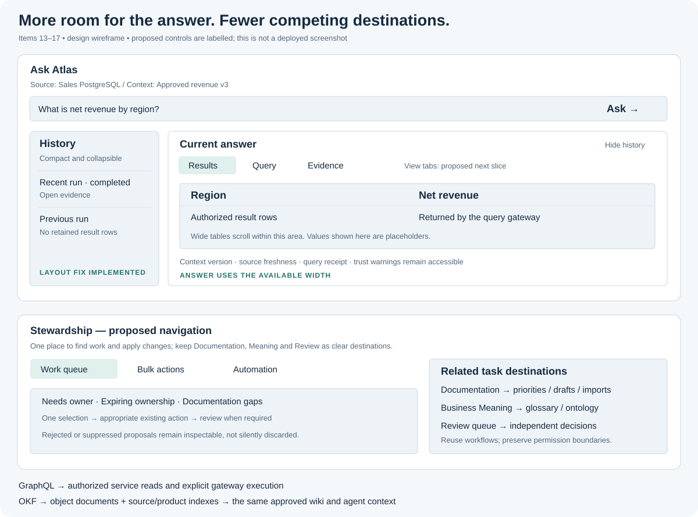
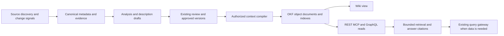

# Items 13–17: GraphQL, open knowledge context and workspace design

Date: 2026-09-16. Source inspected from `66dd878`; concurrent implementation continues.

This is the restarted design/implementation review requested for items 13–17. It extends the [footprint design](20-database-footprint-and-agent-context.md) and the [current review](../review-2026-09-16/REVIEW.md). The [delivery tracker](../60-delivery/03-tracker.md) remains the status authority. Task labels below are acceptance slices for incorporation into that queue, not a competing completion tracker.

## Decisions and actual delivery

| Item | Existing implementation | Decision / status in this pass |
|---|---|---|
| 13. GraphQL query/data | REST, MCP, context compiler, authorized lineage and query gateway. Tableau GraphQL artifact parsing exists; an Atlas GraphQL server was not found. | Design a bounded metadata GraphQL facade and a separately controlled execution operation. **Design only; no GraphQL endpoint added.** |
| 14. OKF | Approved object descriptions, ontology, context products, compiler, source-change rebuilding and document ingestion. No OKF compiler target found. | Adopt official OKF v0.2 as an export/import representation of governed knowledge. Object documents + source/product indexes + wiki presentation. **Design only; no OKF exporter/importer delivered.** |
| 15. Fewer tabs/navigation destinations | LineageWorkspace and DocumentationWorkspace already consolidate views; ontology authoring is in Business Meaning. | Keep these merges. Reduce navigation by user task and progressive disclosure; do not nest every old screen under another tab bar. Further consolidation is specified below. |
| 16. Large answer, small history | Ask history expands while its answer inherits the shared 352px evidence panel. | **Implemented in this pass:** 260px history, flexible answer, hide/show history, compact mobile history below the answer, scoped CSS and a useful empty answer state. Result/query/evidence tabs are a subsequent acceptance slice. |
| 17. Stewardship duplication | Bulk action/backlog, Documentation, Business Meaning, Task agents, Playbooks, Negative knowledge, Relationships and Review queue have different contracts. | Group entry points, reuse forms/selection, preserve the reviewer boundary. Do not delete capabilities merely because their screens overlap. **Design and task mapping below.** |



The drawing is a design wireframe, not a screenshot or proof of completed UI. It marks the proposed parts explicitly.

## 13. GraphQL: what it queries and how data executes

### Why add it

An agent or UI often needs an object, its approved meaning, dependencies, coverage and context-product eligibility together. A typed GraphQL read can compose those existing services without introducing a second catalog or another SQL execution path. REST remains supported; GraphQL is an interface, not the knowledge graph itself.

GraphQL's official guidance places authorization in shared business logic and recommends bounded demand controls. Apply those principles at Atlas's existing policy/service boundaries, including nested fields and aliases. Sources: [authorization](https://graphql.org/learn/authorization/), [security](https://graphql.org/learn/security/).

### Proposed contract — not a published API

One endpoint, proposed `POST /graphql`, with a versioned schema artifact and compatibility checks independent of OpenAPI. Select the Python library through a small compatibility spike against the project's FastAPI/auth/session stack before adding a dependency; the design does not assume a library is installed.

| Surface | Proposed fields/operations | Governing rule |
|---|---|---|
| Metadata query | source, asset, assets, schema/column metadata, relationships, lineage, coverage, approved description | Existing metadata permissions at every node/edge; identifiers never imply access |
| Context query | published context product, pinned object references, compiled knowledge document/index, provenance/freshness | Existing product eligibility and pinned versions; no unscoped expansion |
| Execution lookup | execution status and authorized evidence receipt | Existing execution ownership/scope; return rows only where the current API permits their availability |
| Execution mutation | execute approved tool version with typed parameters and optional context product; explicit requested row limit | Calls the existing governed-tool/orchestrator/gateway path; no resolver SQL execution |

Start with metadata reads. Add execution only after cross-surface authorization/entitlement parity passes. A GraphQL `query` must not trigger source SQL, invoke a procedure, or hide execution behind a computed field. Use an explicit mutation for a new execution, with one execution root per operation and a caller-scoped idempotency key. Do not automatically retry an ambiguous execution outcome.

Initially omit arbitrary SQL from GraphQL: the existing SQL API remains the authorized route. Native CALL/EXEC remains FP18's explicit deferred contract. No generated per-table CRUD schema or arbitrary Cypher is required by this design.

### Resolver rules

- Reuse domain services, not HTTP loopback calls or router imports. Extract a shared service if an existing permission check lives only in a REST route.
- Resolve caller organization/workspace/agent contract on the request. Enforce object and cross-boundary permissions again on nested fetches. Filter forbidden nodes before counts/pagination; use the existing absence/refusal policy consistently.
- Request-scoped batching/cache keys include scope and pinned versions. Never share a loader cache across callers; never batch away per-object authorization.
- Initial configurable limits: depth 6, 50 aliases, page size at most 100, 500 returned graph nodes, bounded scalar lengths, response bytes and resolver deadline. Estimate list fan-out and alias repetition before execution; calibrate limits with measured fixtures.
- Require an operation name; reject multi-operation ambiguity and HTTP batching initially. Read timeouts and rate/cost budgets are separate from warehouse execution budgets. Bound introspection according to deployment policy without treating hidden schema as authorization.
- Return stable error codes/correlation IDs, with no SQL, credentials or forbidden object names in internal errors. Audit an execution once through the existing execution path; record query telemetry separately.
- Preserve source dialect/object identity. No engine-specific introspection logic belongs in resolvers.

### Acceptance

GQL-A: typed metadata reads and cursor paging; REST/GraphQL results agree for the same identity and scope. GQL-B: nested fields, aliases, direct IDs, aggregates and caches cannot expose another tenant/product. GQL-C: cycles, excessive depth/fan-out and oversized documents refuse before expensive work. GQL-D: execution mutation obeys tool version, parameters, masking, quality holds, contract budgets, product scope and revocation; duplicate submissions do not produce duplicate execution. GQL-E: gateway/SDK examples and a query explorer inside Agent Gateway, not another top-level navigation destination.

## 14. OKF: object documents, bundles and wiki

### Specification and boundaries

Use the [official GoogleCloudPlatform OKF specification](https://github.com/GoogleCloudPlatform/open-knowledge-format/blob/main/SPEC.md), inspected as **v0.2**. Pin the upstream revision and keep conformance fixtures when implementation starts. OKF uses Markdown concepts with YAML frontmatter and links; `type` is required. The root index may declare `okf_version`; indexes support selective navigation. Optional provenance, verification and lifecycle fields describe knowledge. They do not grant Atlas permissions or execute tools.

The repository's [README](https://github.com/GoogleCloudPlatform/open-knowledge-format) describes a portable producer/consumer format. Atlas should supply its existing governance and retrieval around it, not replace them. “Open” means interoperable, not publicly readable.

### One representation at three useful scopes

**Generate one document per meaningful object or business concept, then assemble selected documents into source and product bundles. Render the same approved content as the wiki.** A single giant source document would lose selective retrieval and make every change invalidate the whole artifact. Three separately authored stores would drift.

Proposed Atlas layout (identifiers are illustrative):

```text
bundle/
  index.md
  sources/source-<stable-id>/
    index.md
    schemas/schema-<stable-id>/
      index.md
      tables/table-<stable-id>.md
      views/view-<stable-id>.md
      routines/routine-<signature-id>.md
      packages/package-<stable-id>.md
  concepts/concept-<stable-id>.md
  tools/tool-version-<stable-id>.md
```

An Atlas manifest outside the concept tree records compiler/profile version, selected product version, file hashes, source-object versions, policy partition and scope digest. That manifest is an Atlas extension, not an OKF requirement. Use opaque safe path segments; show actual names in content. Routine overloads, source-qualified names and package members must not collide.

Source bundles are scoped exports of discovered, authorized objects. Product bundles contain only the selected approved references and permitted dependencies. Source/schema summaries are navigational context; they must not invent a business purpose. Columns normally remain sections of their owning table; split unusually large definitions by stable structural section only when retrieval limits require it. Represent unsupported kinds and unavailable definitions honestly.

### What Atlas puts in a document

| Content | Authoritative input / rule |
|---|---|
| Identity, engine, object kind, signature | Catalog/envelope identity; preserve native type |
| Purpose, grain, inputs/outputs, business rules | Approved description and semantic versions, with evidence; unknown when not established |
| Columns, joins, dependencies and side effects | Captured metadata and reviewed lineage; proposed relationships labeled separately |
| Freshness and coverage | Definition digest, capture version, last successful discovery, permission/parse/truncation status; do not equate a new export timestamp with fresh source evidence |
| Meaning | Product-pinned ontology, glossary and semantic versions |
| Tools | Approved version references, input/output contract and invocation through Atlas; never credentials or runnable embedded code auto-executed by import |
| Limitations | Dynamic SQL, unresolved lineage, missing permissions, contradictions and rejected assumptions |

Keep Atlas-specific metadata in a documented `atlas` extension. Map formal OKF lifecycle/verification fields separately from Atlas draft/approval/withdrawal states. A `verified` claim in an imported file is evidence supplied by its author, not an Atlas approval. Only export a human verification attribution where Atlas has that recorded event for the relevant content version; publishing a bundle does not mean a reviewer verified every inferred statement.

Do not export raw data rows, secrets, literal-bearing source bodies or unrestricted external links by default. Reuse value-free representations, screening and existing authorization at export and read time. A plain Markdown link is not proof of a foreign key or an approved join; typed relationships remain canonical Atlas records.

### Generation, incremental refresh and consumption



1. **Build:** deterministic extraction supplies the facts; an agent may propose missing explanations through existing description workflows. The exporter itself must not invent content or implicitly make paid model calls.
2. **Validate:** pinned OKF syntax plus stricter Atlas export rules: safe paths, unique identities, bounded YAML/Markdown, no forbidden links/content, citations and version consistency. Keep general OKF parsing distinct from Atlas's stronger publish policy.
3. **Publish:** one immutable bundle snapshot/manifest under the existing product approval/version contract. Stable serialization and recorded timestamps make equal inputs reproducible. Produce an explicit size/coverage failure rather than a silently truncated “complete” bundle.
4. **Refresh:** hash changed definitions/descriptions/meaning, use recorded dependency edges to rebuild affected documents and indexes, preserve unchanged artifacts, and stage semantic changes for review. Deleted/renamed objects receive stable identity handling and lifecycle transitions; rejected drafts must not be continuously regenerated unchanged.
5. **Retrieve:** resolve user/product scope first, search summaries, expand only authorized links within hop/document/token limits, fetch exact approved versions, then assemble question-specific context. Keep document IDs/digests/citations in the answer receipt.
6. **Answer:** distinguish sourced definitions from inferred conclusions. Ambiguity, stale required evidence or incomplete joins produces clarification/refusal as appropriate. An OKF description cannot answer a current revenue total; request the approved tool/query through the gateway and cite its execution receipt.
7. **Invalidate:** source or permission changes invalidate affected caches and future online reads. A downloaded file cannot be remotely revoked; export permissions, classification and expiry notices govern distribution. Do not promise offline revocation.

### API and UI additions

- Add an OKF bundle target beside existing context compiler targets. Keep single-file compile responses compatible: use a separate bundle job/download contract if necessary rather than putting a ZIP into a text-content field.
- Source/object preview and product export must reuse the compiler's scope resolver. Suggested operations: preview one concept, build a source/product bundle, poll build, inspect manifest/diff, download authorized snapshot. These are proposed contracts, not installed routes.
- Knowledge view inside existing Catalog object details and Context Products: readable document, evidence/coverage, version changes and download. Source overview links to its index. No standalone “OKF administration” screen.
- Wiki edits create proposals in existing documentation/meaning workflows; approval regenerates the representation. Do not write Markdown directly into canonical approved state.
- Import, if included in the first release, uses the existing document-ingestion/review family: untrusted preview → object mapping → conflicts → draft claims → approval. No auto-fetch of links, path escape, symlinks, unsafe YAML tags, archive bombs or auto-running executors. Otherwise label import explicitly unsupported while shipping export; never imply round-trip editing is already available.

### Acceptance

OKF-A: PostgreSQL/SQL Server fixtures produce per-table/view/routine documents and source/product indexes; all supported adapters use the same normalized compiler. OKF-B: deterministic export, safe names/overloads, approved versions, verified provenance and no private-value leakage. OKF-C: a changed view regenerates only affected documents; no-op scans reproduce hashes. OKF-D: an unauthorized dependency is absent from text, index, links and counts. OKF-E: agent answer identifies exact context versions, uses appropriate tools for data and preserves uncertainty. OKF-F: wiki and downloads show the same approved meaning; hostile imported content cannot change authority. Test against the pinned specification before claiming conformance.

## 15. Navigation and tabs: keep the completed merges

The current [September 16 reconciliation](../60-delivery/25-review-reconciliation-2026-09-16.md) records the recent reduction to 38 destinations and why Relationships/Cross-source were not collapsed. This design retains that work. Route count is not the success metric: a user should find and complete a task with fewer choices and no lost capabilities.

Proposed visible work areas: **Explore** (Catalog, Ask, Lineage), **Curate** (Stewardship, Documentation, Business Meaning), **Review** (existing queue), **Build & share** (Tools, Context Products, Agent Gateway), **Operate** (Sources, Operations), and **Admin** (identity/policy/configuration). These are navigation groups over current routes, not six new dashboards. Preserve role-sensitive discovery without treating hidden navigation as authorization.

Use one primary workspace view selector, then in-page sections or a focused detail view. Keep secondary controls contextual; avoid primary tabs, nested tabs and a right-hand tabbed drawer all competing. Preserve old URLs, selected source/product/asset, unsaved changes and browser back/forward. Search/navigation must still find legacy names.

Do not merge the meaning of a metric with its calculation, a tool with its context bundle, or metadata permissions with cross-boundary grants. Similar-looking lists are not proof of duplicate functionality.

## 16. Answer-first layouts

### Fix applied now

Ask's CSS is now scoped to its workspace: history has a 260px rail; the answer fills remaining width; Hide history makes the answer full-width. At narrower widths the answer appears before a 240px-high history list. Run IDs wrap instead of forcing horizontal page overflow. Other evidence drawers keep their existing dimensions. Toggling history preserves the current response and does not resubmit the question.

This changes presentation only. Past result rows are still not retained; reopening a historical run must continue to say that explicitly. No unrequested persistence/export of query results is introduced.

### Next UI slice

Add **Results / Query / Evidence** views within the answer workspace, with results selected after a successful question, query at readable full width and provenance/version receipts accessible. Keep trust warnings and refusal state visible across views. Reopened history defaults to available evidence, not an empty results promise. State keys distinguish the answer view from the run/product/source, and invalid or changed scope resets dependent state.

Apply the same principle to Tool execution/Tool plans and Studio/validation where a history/list competes with the main output, after inspecting each screen: small optional history, large current artifact, focused details. Do not globally widen the shared evidence component; many catalog drawers are correctly secondary.

Acceptance: 1280px and 1440px desktop result area visibly dominates; narrow view has answer before history; 200%/400% reflow and keyboard focus remain usable; wide results scroll inside their grid; collapsing history does not lose result data, selection or typed question; changing source/product cannot relabel a prior answer; no new result retention. Verify in a real browser as well as component tests.

## 17. Stewardship: merge workflows, preserve authority

| Existing surface | Proposed home / action | What remains distinct |
|---|---|---|
| Unowned backlog and ownership expiry | Stewardship → Work queue, with actionable filters | Assignment, expiry and escalation rules |
| Bulk tagging/classification/ownership/certification | Stewardship → Bulk actions; reuse the same selection/form from Catalog | Each action's role, preview/confirmation and review contract |
| Documentation priorities/drafts/imports | Keep the already-built Documentation workspace; link from Work queue | Evidence imports versus authored claims versus prioritization |
| Playbooks and task-agent operations | Stewardship → Automation entry; links/sections for schedules and task runs | Human-authored playbook configuration versus bounded agent execution |
| Negative knowledge | Contextual rejected/suppressed evidence view and an advanced Work queue filter | Suppression keys, material-change rules and audit history |
| Business Meaning | Keep one glossary/ontology authoring destination | Ontology publication and semantic-model calculation remain separate |
| Review queue / reviewer oversight | Keep independent review destination and oversight controls | Maker-checker separation; no author self-approval via a shortcut |
| Relationships / Cross-source | Contextual navigation between their existing views first | Boundary grants and cross-source identity matching; the previous merge was deliberately declined |

Use a shared filtered asset selection contract for Catalog and bulk actions; do not add a second bulk-action endpoint. If safe preview is required, implement an explicitly read-only preview service—never call a write endpoint to count matches. Revalidate selection/version/permission on submission; preview does not authorize a future write.

Stewardship navigation should lead with **Work queue / Bulk actions / Automation**. Documentation and Business Meaning remain direct task destinations; do not embed their full tab hierarchies under another Stewardship tab. Automation configuration and historical audit views can be progressively disclosed without deleting their APIs.

Before removing any screen/module, inventory its actions, APIs, role visibility, URL parameters and tests. Merge the entry point only after each action has a reachable replacement, old links have aliases and equivalent permission/unsaved-edit behavior is verified. Shared components should replace actual duplicate controllers; keep distinct domain services where rules differ.

## Delivery sequence and acceptance ownership

| Slice | Existing work to extend | Exit |
|---|---|---|
| 16A, this pass | Ask UI / S13 | Narrow history, wide answer, collapse, targeted tests and build |
| 15A / 17A | S13 navigation | Route/action inventory, proposed group map, no lost actions or authorization behavior |
| 16B | Ask and other execution workspaces | Results/Query/Evidence views and browser/reflow acceptance |
| 14A | FP12 context compiler / FP08 descriptions | Pin OKF revision, mapping contract, pure exporter and PG/SQL Server fixtures |
| 14B | FP16 maintenance / FP13 evaluation | Incremental bundles, authorized reads/wiki, provenance-backed answer evaluation |
| 14C | Existing ingestion family | Explicitly scoped import/round-trip decision and hostile-content tests before enabling edits |
| 13A | Existing catalog/context services | Metadata GraphQL spike/schema, resolver parity, demand limits and contract tests |
| 13B | Existing tool/gateway / FP12 | Explicit execution mutation and gateway/budget/idempotency parity |
| 17B | Stewardship/Catalog existing actions | Shared selection, safe preview if adopted, independent review and route compatibility |

No broader agent-autonomy work, new database candidates, storage replacement or native procedure invocation is opened here. GraphQL and OKF are explicit additions requested in items 13–14; the other items improve existing user journeys.

### Verification record for this pass

- Ask component suite: 22 tests passed, including preserving an answer and avoiding resubmission when history is toggled.
- Production UI build: TypeScript and Vite passed.
- Documentation link check: all relative links resolved across 244 Markdown files. The targeted source-claim selector matched no cases for this new document; no source-claim test pass is claimed for it.
- Existing application code unrelated to the Ask layout was left intact. Concurrent tracker/reconciliation changes were not overwritten.
- Visual wireframe is explanatory; deployed browser acceptance and GraphQL/OKF conformance are not claimed.
