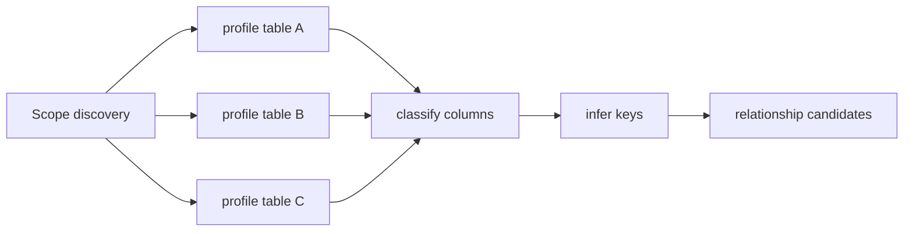

# Module 05 — Profiling and Classification

> Layer L2 · Schema `profiling` · Owner: Data Platform

## 1. Purpose

Learns what the data looks like **without retaining what it says**. Produces value-free statistics and deterministic sensitivity classifications that feed relationship inference, semantic inference, data quality, and masking decisions.

This module is where ADR-0014 (value-free control plane) is most costly and most important. Value-based profiling would be more accurate; it would also copy regulated bank data into a second system.

## 2. Jobs served

S1 (document a domain without typing 10,000 descriptions), S5 (prove the domain is governed), U-adjacent (classification evidence), A2 indirectly.

## 3. Responsibilities

- Analysis run and task DAG creation, execution, retry, cancellation, resume.
- Adaptive sampling within hard bounds.
- Value-free statistics: row estimates, null rates, distinct estimates, length distributions, schema fingerprints.
- Deterministic sensitivity classification with evidence.
- Primary and composite key inference.
- Profile artifact offload to object storage.

## 4. Not responsibilities

| Not this module | Where it lives |
|---|---|
| Executing profile SQL | 16 query-gateway (INV-2) |
| Cross-table relationships | 06 relationships |
| Quality thresholds and incidents | 11 data-quality |
| Business meaning | 07 semantic-layer |

## 5. Domain model

```text
analysis_run, analysis_task (DAG node, dependencies, retry state)
table_profile, column_profile, profile_artifact (→ object storage)
classification, classification_evidence, key_inference
```

## 6. The DAG model

An analysis run is **not** an agent per table (P7). It is a dependency graph of deterministic tasks:



| Property | Behaviour |
|---|---|
| Priority | Per-source priority class |
| Retry | Transient failures retried with backoff; permanent failures classified and reported |
| Skip | Unchanged objects (matching fingerprint) are skipped |
| Ordering | Cross-table work waits for prerequisite table profiles |
| Isolation | A failed task does not corrupt the run |
| Resume | Cancellation and resume leave consistent state |

A 1,000-table scan is 1,000 cheap tasks, not 1,000 agents.

## 7. Bounds

| Bound | Default |
|---|---|
| Sample rows per table | Adaptive by size, hard cap |
| Columns per batch | Configured |
| Tables per run | Configured |
| Task timeout | Configured |
| Concurrency per source | Per source policy |

**Full scans cannot occur without an explicit approved policy.** This is a release gate, not a preference — an unbounded profile against a production warehouse is an availability incident for the bank.

## 8. What is and is not computed

| Computed (value-free) | Not computed by default |
|---|---|
| Row count estimate | Actual row values |
| Null rate per column | Top values |
| Distinct count estimate | Value ranges |
| Min/max **length** | Min/max **value** |
| Schema fingerprint | Value distribution histograms |
| Type and nullability | Pattern samples |

Ranges and top values require a **policy-approved classification-specific exception** with its own retention contract.

## 9. Classification

Deterministic rules produce classification with evidence — rule ID, matched signal, confidence. Classification drives masking decisions in the query gateway, so a wrong classification is a security event, not a cosmetic one.

| Input | Used |
|---|---|
| Column name patterns | Yes |
| Data type and length | Yes |
| Constraint participation | Yes |
| Parent table context | Yes |
| **Actual values** | **No** (ADR-0014) |
| Authoritative external classification feed | Target — highest-accuracy source |

## 10. Public interface

```python
# profiling/api.py
def create_analysis_run(scope, datasource_id, policy: ScanPolicy) -> AnalysisRunDTO
def get_run(scope, run_id) -> AnalysisRunDTO
def cancel_run(scope, run_id) -> AnalysisRunDTO
def resume_run(scope, run_id) -> AnalysisRunDTO
def get_table_profile(scope, table_id) -> TableProfileDTO | None
def get_column_profiles(scope, table_id) -> list[ColumnProfileDTO]
def get_classification(scope, column_id) -> ClassificationDTO
def get_key_inference(scope, table_id) -> KeyInferenceDTO
```

## 11. Events

Emits `profile.completed`, `profile.failed`, `classification.assigned`, `key.inferred`, `analysis_run.started|completed|cancelled`.

## 12. Dependencies

04 catalog, 16 query-gateway.

## 13. Current state → target

| Aspect | Now | Target |
|---|---|---|
| Safe profiling | Implemented — value-free statistics with sampling and hard bounds | Policy-approved ranges/top-values by classification |
| Analysis DAG | Implemented — Temporal, independently retryable table tasks, heartbeats, cancel, resume | Continue-as-new test at maximum source scale |
| Classification | Implemented — deterministic rules with evidence | Authoritative external classification feed integration |
| Key inference | Implemented (single-column) | Composite key inference |
| Artifact offload | Implemented | Retention policy enforcement |

## 14. Open work

| ID | Item | Priority |
|---|---|---|
| PR-1 | Composite key inference | P1 |
| PR-2 | Policy-approved range/top-value profiling by classification | P2 |
| PR-3 | Authoritative classification feed integration | P1 |
| PR-4 | Task-level retry/heartbeat drill-down API for the operator console | P1 |
| PR-5 | Maximum-scale continue-as-new certification | P0 |
| PR-6 | Freshness-relevant profiling once watermarks are approved | P1 |
