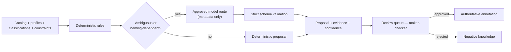

# Module 07 — Semantic Layer

> Layer L2 · Schema `semantics` · Owner: Data Intelligence

## 1. Purpose

Holds what the data **means**: business domains, entities, table and column annotations, metrics, dimensions, measures, grain, and time semantics — all versioned, all approved, all replayable.

The industry has converged on the finding that raw text-to-SQL against physical schemas is not enterprise-viable and a semantic layer materially improves accuracy and consistency. That makes the semantic layer table stakes. Atlas differentiates one level up: **semantics that carry policy and compile into executable governed tools.**

## 2. Jobs served

A1, A2 (trust), S1 (curate rather than author), S2 (resolve conflicts), R1 (approve with context).

## 3. Responsibilities

- Business domains, entities, and their mapping to physical objects.
- Table and column annotations: description, role, grain, synonyms, analytical questions.
- Metrics, dimensions, and measures with versioned definitions.
- Immutable semantic model versions: draft → validated → approved → published → superseded, with clone-to-rollback.
- Metadata-only semantic inference (deterministic + optional approved model route).
- Safe tool blueprints — column-only, deterministically rendered.
- Cross-domain relationship mapping.

## 4. Not responsibilities

| Not this module | Where it lives |
|---|---|
| Term lifecycle and ownership | 08 glossary-stewardship |
| Approval mechanics | 17 policy-governance |
| Model invocation | 15 model-gateway |
| SQL execution | 16 query-gateway |
| Tool lifecycle | 14 tool-registry |

## 5. Domain model

```text
business_domain, business_entity
table_annotation, column_annotation
semantic_model_version, metric, metric_version, dimension, measure
grain_definition, time_semantics, join_rule
tool_blueprint
```

## 6. Inference model



**What the model receives.** Bounded identifiers, types, classifications, constraints, and deterministic baselines. Never sample values (ADR-0014).

**What the model may propose.** Domains, entities, descriptions, table roles, grain, synonyms, analytical questions, and a **column-only tool blueprint**.

**What the model may never do.** Author executable SQL, publish anything, or approve anything (ADR-0001). A promoted blueprint is rendered deterministically into a governed tool **draft** that then follows the normal publication workflow.

**Economics.** One inference call per domain or table family, not per table. Model call volume must not scale linearly with table count.

## 7. Versioning

| Property | Behaviour |
|---|---|
| Immutability | A published version is never edited; changes create a new version |
| States | draft → validated → approved → published → superseded |
| Rollback | Clone a prior version forward; history is never rewritten |
| Runtime pinning | Every agent run pins the semantic version it used (P4) |
| Invalidation | Query memory tied to a superseded version is suppressed |

Pinning is what makes an answer replayable a year later, which is what an auditor asks for.

## 8. Public interface

```python
# semantic_layer/api.py
def get_annotation(scope, table_id) -> TableAnnotationDTO | None
def list_domains(scope) -> list[DomainDTO]
def resolve_entity(scope, name_or_synonym: str) -> EntityRef | None
def get_metric(scope, metric_id, version: int | None) -> MetricDTO
def compile_metric(scope, metric_id, params) -> LogicalPlan          # deterministic
def run_inference(scope, datasource_id, policy) -> InferenceRunDTO
def publish_version(scope, version_id) -> SemanticVersionDTO          # via module 17
def get_cross_domain_map(scope) -> CrossDomainMapDTO
```

`compile_metric` is deterministic by design: the same metric definition and parameters always produce the same logical plan. A model never participates in compilation.

## 9. Events

Emits `semantic.inference_completed`, `semantic.proposal_created`, `semantic.annotation_published`, `metric.published`, `metric.superseded`, `semantic.version_published`.

## 10. Dependencies

04 catalog, 15 model-gateway.

## 11. Current state → target

| Aspect | Now | Target |
|---|---|---|
| Business-semantic inference | Implemented for the metadata-structure slice — deterministic + optional approved model, strict validation, maker-checker, authoritative annotations, cross-domain FK map | Confidence calibration, bank-domain evaluation corpus |
| Metrics | Implemented — versioned, grain/time/physical mappings, maker-checker, supersession, clone rollback | Governed dimensions, glossary binding, metric suggestions from approved annotations |
| Tool blueprints | Implemented — deterministic rendering to a governed tool draft | Multi-table blueprints |
| Semantic authoring IDE | Not implemented | Module 18 Studio — parity requirement vs. Snowflake Semantic Studio and Atlan Context Engineering Studio |
| Conflict handling | Not implemented | Module 08 |
| Open Semantic Interchange | Not implemented | Evaluate — commoditization risk and interoperability opportunity |

## 12. Open work

| ID | Item | Priority |
|---|---|---|
| SM-1 | Governed dimension authoring | P1 |
| SM-2 | Glossary term binding to semantic objects | P0 |
| SM-3 | Confidence calibration + bank-domain evaluation corpus | P1 |
| SM-4 | Metric suggestions from approved annotations | P1 |
| SM-5 | Multi-table tool blueprints | P1 |
| SM-6 | OSI import/export evaluation | P2 |
| SM-7 | Semantic diff view for reviewers | P1 |
