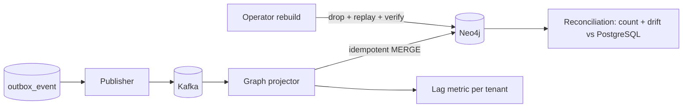

# Module 10 — Knowledge Graph

> Layer L2 · Schema `graph_projection` (state) + Neo4j (projection) · Owner: Data Intelligence

## 1. Purpose

Provides graph-native traversal over the estate — schemas, tables, columns, relationships, entities, metrics, tools, lineage — **bounded, lazy, and value-free** (ADR-0010).

The graph is a **projection**, never truth (INV-1). It can be deleted and rebuilt at any time.

## 2. Jobs served

S4 (know what breaks), A3 (find the right asset), R1 (blast radius).

## 3. Responsibilities

- Projecting authoritative state into Neo4j via outbox consumption.
- Server-side search over graph nodes.
- Bounded directional traversal (1–4 hops) with explicit truncation reasons.
- Projection lag measurement and reconciliation.
- Full rebuild from authoritative state.

## 4. Not responsibilities

| Not this module | Where it lives |
|---|---|
| Owning any authoritative fact | The originating module |
| Relationship inference | 06 relationships |
| Lineage edge creation | 09 lineage |
| Rendering | 21 experience-shell |

## 5. Graph model

```text
(Database)-[:HAS_SCHEMA]->(Schema)-[:HAS_TABLE]->(Table)-[:HAS_COLUMN]->(Column)
(Column)-[:REFERENCES]->(Column)
(Table)-[:DERIVES_FROM]->(Table)
(Metric)-[:USES_COLUMN]->(Column)
(BusinessEntity)-[:REPRESENTED_BY]->(Table)
(Tool)-[:READS_FROM]->(Table)
(Agent)-[:CAN_CALL]->(Tool)
(Report)-[:USES_METRIC]->(Metric)
(Term)-[:DEFINES]->(Table|Column)
```

Every node carries its tenancy boundary (INV-5). A traversal cannot cross a tenant boundary.

## 6. Bounded traversal contract

| Control | Behaviour |
|---|---|
| Depth | 1–4 hops, server-enforced |
| Node cap | Per-response, policy-configured |
| Edge cap | Per-response, policy-configured |
| Direction | Explicit — upstream, downstream, or both |
| Truncation | **Explicit reason returned** — never a silently partial result |
| Search | Server-side; the client never receives an unfiltered object list |
| Values | Metadata and approved aggregate evidence only. **Never** customer, account, or transaction values |

**The property this protects.** A browser must never download an enterprise graph, and a screenshot of the graph explorer must never contain regulated data. Both follow from the contract rather than from careful UI coding.

## 7. Projection and rebuild



| Property | Requirement |
|---|---|
| Idempotency | MERGE by stable node/edge key; re-delivery is normal |
| Lag | Measured per projection per tenant; alarmed on threshold |
| Reconciliation | Scheduled count and drift comparison against authoritative state |
| Rebuild | Full rebuild < 4 hours for 1M objects; drilled quarterly |
| Authority | Never read for an authorization, approval, or correctness decision |

## 8. Public interface

```python
# knowledge_graph/api.py
def search_nodes(scope, q, kinds, page) -> Page[NodeDTO]
def focus(scope, node: NodeRef, depth: int, direction, filters) -> BoundedGraphDTO
def get_projection_health(scope) -> ProjectionHealthDTO
def request_rebuild(scope, projection: str) -> RebuildJobDTO      # operator only
```

`BoundedGraphDTO` always carries `truncated: bool` and `truncation_reason` when caps are hit.

## 9. Events

Consumes catalog, relationship, semantic, lineage, tool, and quality events. Emits `graph.projection.lagging`, `graph.rebuild.started|completed`.

## 10. Dependencies

04 catalog, 06 relationships (plus event consumption from 07, 09, 11, 14).

## 11. Current state → target

| Aspect | Now | Target |
|---|---|---|
| Graph Explorer V2 | Implemented — server-side search, 1–4 hop directional traversal, node/edge caps, truncation reasons, evidence inspection, focus history, zoom | Unchanged core contract |
| Declared FK edges | Implemented | Performance at millions of nodes |
| Approved inferred relationships | Not projected | Project approvals to Neo4j |
| Cross-source traversal | Not implemented | Required for heterogeneous estates |
| Time / version comparison | Not implemented | "What did this look like last quarter" |
| Saved perspectives | Not implemented | Persona-specific saved views |
| Million-node rendering | Not certified | Level-of-detail rendering adapter — **without changing the API boundary** |

## 12. Open work

| ID | Item | Priority |
|---|---|---|
| KG-1 | Project approved relationships to Neo4j | P1 |
| KG-2 | Cross-source traversal | P1 |
| KG-3 | Level-of-detail rendering for large neighbourhoods | P1 |
| KG-4 | Time-aware / version-comparison traversal | P2 |
| KG-5 | Saved perspectives per persona | P2 |
| KG-6 | Rebuild timing drill and published SLO | P0 |
| KG-7 | Scheduled reconciliation with alerting | P1 |
