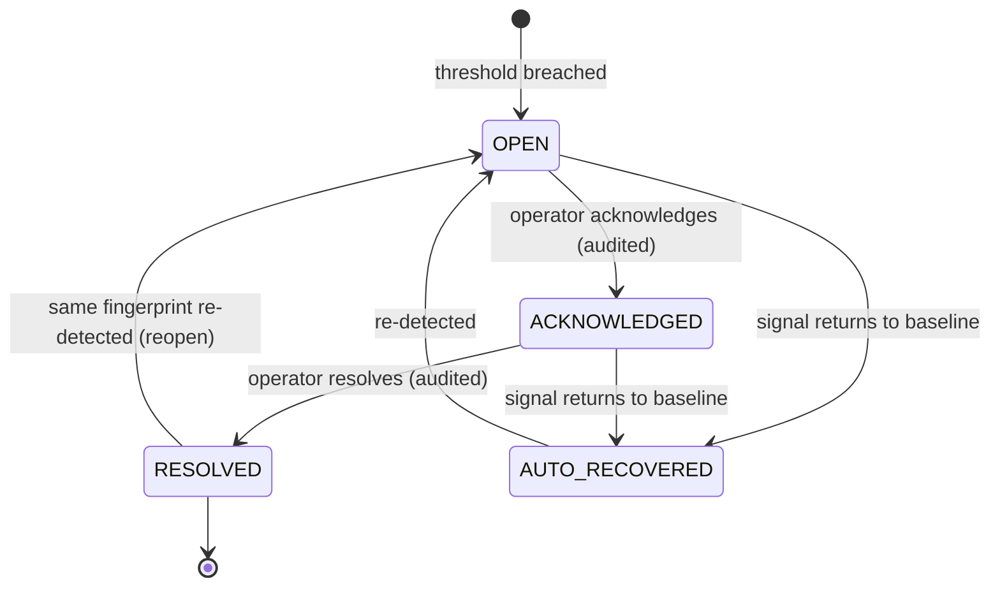

# Module 11 — Data Quality

> Layer L2 · Schema `quality` · Owner: Data Platform

## 1. Purpose

Determines whether data can be trusted **right now**, and — uniquely — feeds that judgement into runtime decisions.

Atlas will not out-detect Monte Carlo or Anomalo; they have years of head start in detection science. **Atlas's angle is coupling** (whitespace W1): a quality incident should demote a table in retrieval ranking, attach a trust warning to any answer that used it, and gate governed tools whose SLA depends on it. No standalone observability tool can do this because none of them owns the query path.

## 2. Jobs served

A2 (can I trust this number), S5 (prove the domain is governed), P2 (fleet health), B2.

## 3. Responsibilities

- Quality policies at source and table level.
- Deterministic, value-free baseline comparison: volume, null-rate, schema fingerprint.
- Immutable observations.
- Incident lifecycle: open, reopen, auto-recover, acknowledge, resolve — all audited.
- Freshness contracts based on **approved watermarks only**.
- Metadata scan-age reporting, explicitly distinguished from data freshness.
- SLA/SLO definitions on data.
- **Runtime coupling**: quality signals feeding retrieval, agent answers, and tool gating.

## 4. Not responsibilities

| Not this module | Where it lives |
|---|---|
| Executing check SQL | 16 query-gateway |
| Profiling statistics | 05 profiling |
| Ticketing | ITSM integration |
| ML anomaly detection | Deliberately not competed on — integrate best-of-breed |

## 5. Domain model

```text
quality_policy (scope: SOURCE | TABLE, thresholds, enabled_checks)
quality_baseline, quality_observation (immutable, value-free)
quality_incident (fingerprint, state, opened_at, recovered_at)
freshness_contract (watermark_column, classification, retention)
quality_sla, quality_notification_route
```

## 6. Two things that must never be confused

| Signal | Meaning | Reported as |
|---|---|---|
| **Metadata scan age** | When Atlas last inspected the source's structure | "Scan age" |
| **Source-row freshness** | When the business data last changed | "Freshness" — `NOT_CONFIGURED` until an approved watermark exists |

Reporting scan age as freshness would be actively misleading: a user reading "fresh: 10 minutes ago" and acting on month-old data has been misled by the platform. Freshness **fails closed** (ADR-0016). Competitors will show a number where Atlas shows "not configured"; that is the correct trade.

## 7. Value-freedom

| Check | Basis |
|---|---|
| Volume | Row-count estimate comparison |
| Null rate | Rate comparison |
| Schema drift | Fingerprint comparison |
| Freshness | Approved watermark maximum |
| Distribution drift | **Not available** without an approved value-access exception |

Observations retain counts, rates, and hashes — never rows (ADR-0014).

## 8. Incident lifecycle



Incidents are **fingerprinted**, so re-detection reopens the existing incident rather than creating a duplicate. An estate that generates thousands of duplicate incidents produces alert fatigue and then gets ignored.

## 9. Runtime coupling — the differentiator

Currently **planned, not built**. This is the highest-leverage unbuilt item in the roadmap.

| Coupling | Behaviour | Consumer |
|---|---|---|
| Retrieval demotion | A table with an open high-severity incident ranks lower | 12 retrieval |
| Answer warning | Any answer using an affected table carries a visible trust warning with the incident | 13 agent-runtime |
| Tool gating | A governed tool whose dependency has an open incident is flagged or blocked per policy | 14 tool-registry |
| Impact surfacing | Quality incidents appear in the impact graph | 09 lineage, 10 knowledge-graph |
| Certification expiry | An asset with a sustained incident loses certification | 08 glossary-stewardship |

**Why nobody else has it.** Detection vendors do not own the query path; catalog vendors do not either. Atlas is the only product in the competitive matrix that is both the governance plane and the execution plane.

## 10. Public interface

```python
# data_quality/api.py
def upsert_policy(scope, target: PolicyTarget, policy) -> QualityPolicyDTO
def get_posture(scope, datasource_id) -> QualityPostureDTO
def list_incidents(scope, filt, page) -> Page[IncidentDTO]
def transition_incident(scope, incident_id, action, rationale) -> IncidentDTO
def get_trust_signal(scope, table_id) -> TrustSignalDTO        # consumed by 12, 13, 14
def configure_freshness(scope, table_id, contract) -> FreshnessContractDTO  # via module 17
```

`get_trust_signal` is the coupling API. It must be fast — it is called on the retrieval and answer paths.

## 11. Events

Emits `quality.observation_recorded`, `quality.incident_opened|reopened|acknowledged|resolved|auto_recovered`, `quality.sla_breached`.

## 12. Dependencies

05 profiling, 16 query-gateway.

## 13. Current state → target

| Aspect | Now | Target |
|---|---|---|
| Baselines | Implemented — volume, null-rate, schema fingerprint; source/table policies; immutable observations | Custom rule packs, seasonality |
| Incidents | Implemented — fingerprinted lifecycle, audited transitions, auto-recovery | Notification routing, ownership escalation |
| Freshness | Fails closed as `NOT_CONFIGURED` | Approved connector watermark contracts |
| Scan-age posture | Implemented and explicitly labelled | Unchanged |
| Scan integration | Implemented — automatic Temporal integration | Rule scheduling beyond scans |
| **Runtime coupling** | **Not implemented** | **The differentiator — P1** |
| Notification / escalation | Not implemented | Entry-ticket gap |
| SLA / SLO on data | Not implemented | Entry-ticket gap |

## 14. Open work

| ID | Item | Priority |
|---|---|---|
| DQ-1 | Notification and escalation routing | P0 |
| DQ-2 | Approved connector watermark contracts → activate freshness | P0 |
| DQ-3 | **Runtime coupling: retrieval demotion, answer warnings, tool gating** | P1 |
| DQ-4 | Custom rule packs and rule scheduling | P1 |
| DQ-5 | Data SLA/SLO definitions | P1 |
| DQ-6 | Seasonality-aware thresholds | P2 |
| DQ-7 | Bank-scale incident-volume certification | P1 |
| DQ-8 | Open quality framework for third-party detector integration | P2 |
