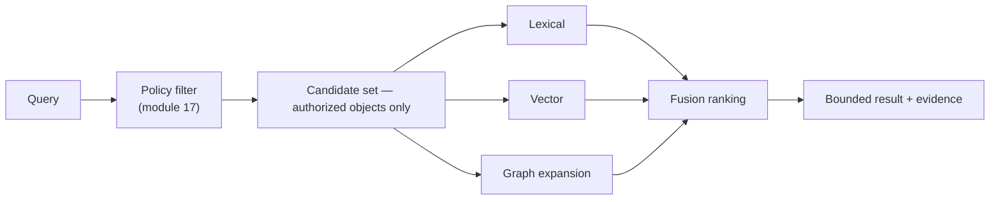

# Module 12 — Retrieval and Search

> Layer L3 · Schema `retrieval` · Owner: Data Intelligence

## 1. Purpose

Finds the right context — for a human searching, and for the agent grounding an answer. These are the same problem with different consumers, so they share one ranking pipeline.

The rule that distinguishes Atlas: **policy filtering happens before ranking, not after.** An object the user may not see never enters the candidate set, so it can never influence ranking, never appear in a count, and never leak through an ordering side channel.

## 2. Jobs served

A3 (find the right asset among 400,000), A1 (grounding), S1, B3.

## 3. Responsibilities

- Lexical search across catalog, semantics, glossary, lineage artifacts, tools, and metrics.
- Vector similarity over semantic embeddings.
- Graph expansion from seed results.
- Fusion ranking across signals.
- Permission filtering **before** ranking.
- Retrieval evidence: what was selected and why.
- Index maintenance from outbox events.

## 4. Not responsibilities

| Not this module | Where it lives |
|---|---|
| Owning the objects it indexes | Their owning modules |
| Graph traversal UI | 10 knowledge-graph |
| Answer generation | 13 agent-runtime |
| Policy decisions | 17 policy-governance |

## 5. Ranking model

```text
final_score =
    semantic_similarity
  × domain_relevance
  × confidence_factor
  × canonical_table_factor
  × usage_factor
  × quality_factor          ← from module 11 (planned)
  × certification_factor
```

Every factor is inspectable in the retrieval evidence. An unexplainable ranking cannot be debugged, and a steward cannot improve what they cannot see.

| Factor | Source |
|---|---|
| semantic_similarity | Vector + lexical fusion |
| domain_relevance | 07 semantic-layer domain match |
| confidence_factor | Inference confidence on annotations and relationships |
| canonical_table_factor | 06 relationships canonical resolution — prefers "current customer" over a history table |
| usage_factor | Execution history (planned) |
| quality_factor | 11 data-quality trust signal (planned — whitespace W1) |
| certification_factor | 08 glossary certification state |

## 6. Permission filtering



**Why filter first.** Filtering after ranking leaks information: result counts, ordering, and "did anything match" all reveal the existence of objects the user may not see. Filtering first removes the class of leak rather than mitigating it.

## 7. Public interface

```python
# retrieval/api.py
def search(scope, q: str, kinds, filters, page) -> Page[SearchHitDTO]
def retrieve_for_grounding(scope, intent: ResolvedIntent, budget) -> GroundingSetDTO
def explain_ranking(scope, query_id, hit_id) -> RankingExplanationDTO
def reindex(scope, kinds) -> ReindexJobDTO    # operator only
```

`retrieve_for_grounding` returns a **bounded** set with per-item selection reasons; the agent runtime never receives an unbounded context.

## 8. Events

Consumes catalog, semantic, glossary, lineage, tool, and quality events for indexing. Emits `retrieval.index_lagging`, `retrieval.reindex_completed`.

## 9. Dependencies

04, 07, 08, 09, 10, 11 (read); 17 policy (filter).

## 10. Performance

| Operation | p95 |
|---|---|
| Search first paint | 1 s |
| Grounding retrieval | 120 ms |
| Ranking explanation | 100 ms |

## 11. Current state → target

| Aspect | Now | Target |
|---|---|---|
| Lexical ranking | Implemented — org/source-scoped across active tables, columns, approved annotations, published metrics, published tools, latest dbt artifacts, with bounded evidence and selection reasons | PostgreSQL full-text index |
| Permission filtering | Implemented — before ranking | Unchanged |
| Vector retrieval | **Not implemented** | Entry-ticket gap — pgvector projection |
| Graph expansion | **Not implemented** | Entry-ticket gap |
| Fusion ranking | **Not implemented** | Entry-ticket gap |
| Usage signals | Not implemented | Parity with Alation/Snowflake popularity ranking |
| Quality coupling | Not implemented | Differentiator W1 |
| Large-catalog benchmarks | **Not run** | Required before any scale claim |
| Command palette / global search UX | Not implemented | Entry-ticket gap |

## 12. Open work

| ID | Item | Priority |
|---|---|---|
| RT-1 | Vector projection and similarity retrieval | P0 |
| RT-2 | Graph expansion from seed hits | P0 |
| RT-3 | Fusion ranking with inspectable factors | P0 |
| RT-4 | PostgreSQL full-text index for lexical | P0 |
| RT-5 | Global search + command palette | P0 |
| RT-6 | Usage/popularity signal | P1 |
| RT-7 | Quality trust factor in ranking | P1 |
| RT-8 | Large-catalog retrieval benchmarks | P0 |
| RT-9 | Cross-source search | P0 |
