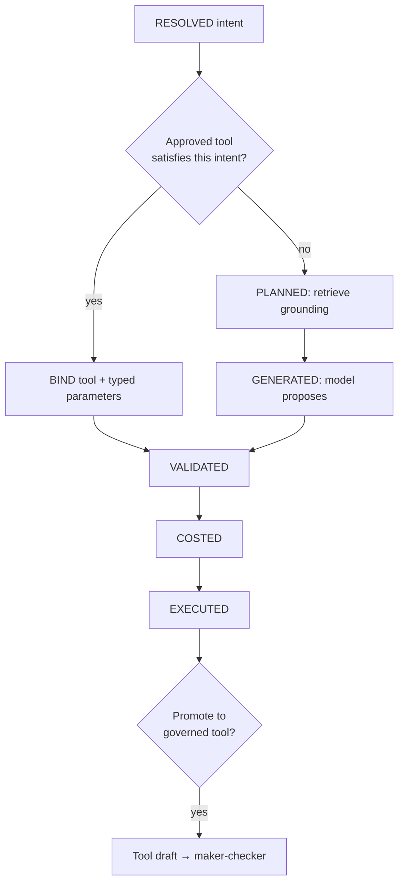

# Module 13 — Agent Runtime

> Layer L3 · Schema `agent` · Owner: AI Platform

## 1. Purpose

> **Implementation review (2026-09-09, updated after remediation):** Read the [critical architecture review](../10-architecture/15-agent-architecture-critical-review.md) for the five core capabilities (three LLM-capable workflows and two deterministic components) and the AR-01..AR-12 findings with their current status. Since that review: contract token and wall-clock caps now have a runtime consumer (`aida.agent_budget`, reserving against `agent_budget_window` before generation and reconciling after), `capability_envelope.context_product_ids` is enforced at the MCP boundary, `write_lanes` is refused rather than stored unenforced, roster reporting is per-agent-version, and retrieval evidence is screened before it enters the model payload. Enterprise-scale capacity (AR-09) is untouched and unmeasured. Older "current state" and open-work tables below are dated planning snapshots, not certification of today's deployment.

The governed analytical state machine: takes a question, screens it, resolves it against approved semantics, prefers an approved tool, generates only when it must, and hands everything to the deterministic gateway for execution.

This module is where ADR-0001 (models propose, deterministic services decide) becomes concrete. It is the single most important module for the product's differentiation and for its model-risk story.

## 2. Jobs served

A1 (answer a governed question), A2 (trust explanation), A5 (understand refusals), U2 (prove the model could not act unapproved).

## 3. The state machine

```text
RECEIVED → AUTHORIZED → SCREENED → RESOLVED → PLANNED → GENERATED
        → VALIDATED → COSTED → EXECUTED → EXPLAINED → COMPLETED
```

Every transition is explicit, recorded, and pins the versions in force at that point.

| State | What it establishes | Failure behaviour |
|---|---|---|
| RECEIVED | Request accepted, correlation ID assigned | — |
| AUTHORIZED | Identity, tenancy, purpose, role (INV-5) | Deny |
| **SCREENED** | Prompt-risk classifier passed **before any retrieval** (ADR-0013) | Deny with version + reason codes |
| RESOLVED | Entities resolved against approved semantics | Ambiguity → clarification or deny |
| PLANNED | Bounded, policy-filtered grounding retrieved | Insufficient grounding → deny |
| GENERATED | Model produced a **schema-validated proposal** (INV-3) | Invalid output discarded, not repaired |
| VALIDATED | Deterministic AST parse, allowlist, deny rules | Deny — **the model's influence ends here** |
| COSTED | EXPLAIN and cost ceiling | Deny |
| EXECUTED | Read-only, bounded, masked, via the one gateway (INV-2) | Deny or bounded failure |
| EXPLAINED | Lineage, versions, confidence, quality signals assembled | — |
| COMPLETED | Evidence persisted | — |

**Two ordering properties support the boundary.** `SCREENED` precedes retrieval, so inputs detected and blocked by the classifier do not reach retrieval. This does not prove that all hostile input is detected. The execution gateway must enforce validation and authorization before execution; the orchestrator's post-execution checkpoints provide additional verification, not a replacement for those controls.

> **Implementation status (2026-08-31).** All eleven states exist with a real transition table,
> and the **SCREENED-before-retrieval ordering is verified in the code** — prompt-risk screening
> runs in `src/aida/agent_orchestrator.py` before the retrieval transition. All eleven states are
> individually gated and can refuse.
>
> **The last five (`gap/02` row `C3`).** `VALIDATED`, `COSTED`, `EXECUTED`, `EXPLAINED` and
> `COMPLETED` are five separately-gated checkpoints
> (`GovernedAgentOrchestrator._checkpoint_validated/_costed/_executed/_explained/_completed`),
> each able to refuse the run independently, called in sequence after
> `query_gateway.execute()` returns. The underlying work those states name — AST/allowlist
> validation, the cost ceiling, read-only bounded masked execution — still happens exactly once,
> inside that one `execute()` call (INV-2 keeps SQL execution to a single choke point, so it
> cannot be re-run five times); each checkpoint is the orchestrator's own independent
> re-verification of that work's *result* against policy it holds separately from the gateway,
> so a defect in the gateway's internal enforcement does not silently pass through as a governed
> answer. `EXPLAINED` also gained a real deny path that did not exist before: an open CRITICAL
> quality incident on the answer's own source table now blocks the run via `check_quality_gate`
> (the same gate TL-3 already uses to block a governed tool before it runs), not merely a
> warning. Each checkpoint's independent refusal is proven in
> `tests/test_agent_orchestrator_checkpoints.py`, one test per checkpoint, engineering a failure
> specific to only that checkpoint with the other four held healthy.

## 4. Tool-first execution



**Economic hypothesis to measure** (D2). Reusing approved tools can avoid generation calls and reduce repeated validation effort, although source execution still has cost and risk. No verified comparison establishes that every competitor regenerates SQL per question. Target: ≥40% tool-first execution rate in a mature tenant; measure accepted-answer accuracy and total cost alongside the rate.

## 5. Prompt-risk screening

A **versioned, deterministic classifier** running before retrieval. Blocks:

- instruction override,
- system-prompt or credential extraction,
- policy or masking bypass,
- privilege escalation,
- unbounded data extraction.

Retained evidence is **value-free**: classifier version, score, reason codes, plus the question HMAC. The raw question is never stored (ADR-0014).

**Coverage qualification (2026-09-09, updated after remediation).** Indirect-screening code exists in `injection_defense.py` and `ingest_screening.py`, with ingestion and MCP integrations. Tracing the ingresses found one that was genuinely unscreened: `retrieval_evidence` carries a business annotation's `business_name` and its domain/entity display names straight into the model payload, with no stored verdict to consult. Those fields are now screened at that boundary, with quarantined text withheld behind a fixed marker while the persisted audit record keeps every hit verbatim. `_model_context` was found to carry only identifiers, types and constraint shapes -- no free text. **This closes one ingress, not the class.** AR-10's path-level coverage audit and adversarial evaluation are outstanding; the classifier is evadable by paraphrase, and INV-3 -- a successful injection still produces a proposal that cannot execute, publish or bind a tool -- remains the load-bearing control. Neither complete absence nor complete protection should be claimed.

## 6. Evidence model

Every run produces a replayable, value-free record. This is what makes auditability evidence-grade rather than transcript-grade (differentiator D3).

| Captured | Purpose |
|---|---|
| State transitions with timestamps | Reconstruct the path |
| Prompt-risk version, score, reason codes | Explain screening |
| Retrieval selections with ranking reasons | Explain why *this* context |
| Semantic version and policy version pinned | Replay the decision |
| Tool selection or generation path | Explain the execution choice |
| Generated SQL, literals redacted | Explain what ran |
| AST validation result | Prove deterministic authority |
| Cost estimate and actual | Explain resource use |
| Masking applied | Prove disclosure control |
| Output-to-source column lineage | Conventional lineage |
| **Refusals with the control that fired** | **Explain what did not happen** |

## 7. Public interface

```python
# agent_runtime/api.py
def start_run(scope, question: str, options) -> AgentRunDTO
def get_run(scope, run_id) -> AgentRunDTO
def get_trace(scope, run_id) -> AgentTraceDTO
def submit_feedback(scope, run_id, feedback) -> None
def list_query_memory(scope, filt, page) -> Page[QueryMemoryDTO]
def run_evaluation(scope, suite_id) -> EvaluationRunDTO
```

## 8. HTTP surface

| Method | Path |
|---|---|
| POST | `/v1/agent-runs` |
| GET | `/v1/agent-runs/{id}`, `/v1/agent-runs/{id}/trace` |
| POST | `/v1/agent-runs/{id}/feedback` |
| POST | `/v1/agent-runs/{id}/promote-to-tool` |
| GET | `/v1/query-memory` |
| POST | `/v1/agent-evaluations` |

## 9. Query memory

Value-free, semantic-version-aware reuse of prior successful analyses.

| Property | Behaviour |
|---|---|
| Stored | Structural and semantic shape, not question text or values |
| Versioning | Tied to the semantic version used |
| Invalidation | Suppressed when that version is superseded |
| Feedback | Negative feedback suppresses reuse |
| Not a cache | It informs planning; it never bypasses validation or execution controls |

## 10. Events

Emits `agent.run_started|completed|denied`, `screening.blocked`, `agent.tool_selected`, `agent.generation_requested`, `agent.feedback_recorded`.

## 11. Dependencies

12 retrieval, 14 tool-registry, 15 model-gateway, 16 query-gateway, 17 policy-governance.

## 12. Current state → target

| Aspect | Now | Target |
|---|---|---|
| Typed state machine | Implemented, framework-neutral, with `SCREENED` gate | Unchanged |
| Prompt-risk screening | Implemented — versioned deterministic classifier, value-free evidence | Indirect injection, multilingual, obfuscation |
| Governed retrieval | Implemented — policy-filtered, bounded grounding | Vector + graph expansion (module 12) |
| Tool-first execution | Implemented | Multi-step tool plans |
| Generation | Implemented — OpenAI Responses + Gemini structured output | Additional approved routes |
| Evidence and traces | Implemented — value-free | AI decision lineage as graph edges (module 09) |
| Evaluations | Implemented — durable control evaluations | Bank model-risk corpus |
| Query memory | Implemented — version-aware, feedback suppression | Similarity retrieval, safe adaptation, usage scoring |

## 13. Open work

| ID | Item | Priority |
|---|---|---|
| AG-1 | Indirect-injection defence for retrieved metadata | P0 |
| AG-2 | Multilingual and obfuscation coverage in screening | P0 |
| AG-3 | Bank model-risk evaluation corpus | P0 |
| AG-4 | Multi-step tool plans with budgets | P1 |
| AG-5 | AI decision lineage emission | P0 |
| AG-6 | Quality trust warnings on answers | P1 |
| AG-7 | Query memory similarity retrieval and safe adaptation | P1 |
| AG-8 | Retrieval and model benchmarks | P0 |
