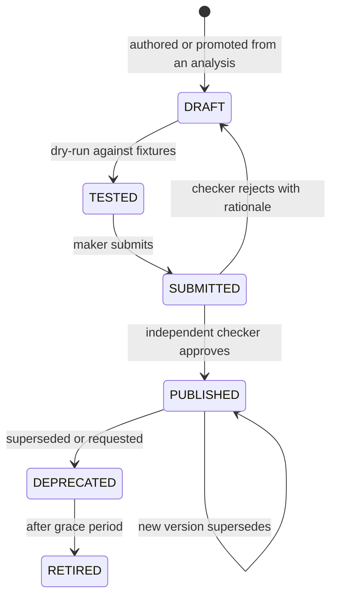

# Module 14 — Tool Registry

> Layer L3 · Schema `tools` · Owner: AI Platform

## 1. Purpose

Turns a successful analysis into a **reusable, versioned, governed capability**. This is differentiator D2 and the mechanism that makes Atlas's cost and risk fall with usage while competitors' rise.

## 2. Jobs served

A4 (do this every month without regenerating), B1 (run the approved analysis), R1/R3 (approve), U3 (approval chains).

## 3. Responsibilities

- Tool definition: deterministic parameterized SQL and a typed parameter schema.
- Versioning: a new version per SQL or parameter change.
- Maker-checker lifecycle: draft → test → submit → approve → publish → deprecate → retire.
- RBAC bindings: who and which agents may invoke.
- Deterministic invocation with AST literal binding.
- Promotion of a successful analysis into a tool draft.
- Tool dependency tracking and blast-radius queries.
- Tool certification.

## 4. Not responsibilities

| Not this module | Where it lives |
|---|---|
| Executing SQL | 16 query-gateway (INV-2) |
| Approval mechanics | 17 policy-governance |
| Tool selection during a run | 13 agent-runtime |
| Authoring UI | 18 studio |

## 5. Domain model

```text
tool, tool_version, tool_parameter_schema
tool_binding (principal/agent → tool, permissions)
tool_invocation, tool_dependency, tool_certification
```

## 6. Parameter contract

Parameters are **typed and validated**, and values are bound into the AST — never string-interpolated. This is the mechanism that makes a governed tool safer than the generated SQL it replaced.

```json
{
  "name": "exposure_by_counterparty",
  "version": 3,
  "parameters": [
    {"name": "as_of_date", "type": "date", "required": true},
    {"name": "lob_code",   "type": "string", "required": true, "enum_source": "lob_reference"},
    {"name": "min_amount", "type": "decimal", "required": false, "default": 0}
  ],
  "returns": {"kind": "table", "columns": ["counterparty_id", "exposure_amount"]}
}
```

| Control | Behaviour |
|---|---|
| Type validation | Rejected before execution |
| Enum sources | Bound to governed reference data, not free text |
| AST literal binding | Values bound into the parsed tree — injection is not possible by construction |
| No dynamic SQL | Tool SQL is fixed at version publication |
| Gateway execution | Tools do **not** bypass the query gateway |

## 7. Lifecycle



Maker ≠ checker is platform-enforced (INV-8).

## 8. Promotion from analysis

The path that makes the registry fill up on its own:

1. An analyst completes a successful governed run.
2. They request promotion.
3. Atlas **deterministically renders** the executed SQL into a parameterized template — the model does not author it.
4. Parameters are inferred from the literals that were redacted, and confirmed by the analyst.
5. A tool **draft** is created and enters the normal maker-checker workflow.
6. On publication, the agent prefers this tool for matching intents.

Step 3 is the safety property: a governed tool's SQL is never model output (ADR-0001).

## 9. Public interface

```python
# tool_registry/api.py
def list_tools(scope, filt, page) -> Page[ToolDTO]
def get_tool(scope, tool_id, version=None) -> ToolDTO
def match_intent(scope, intent: ResolvedIntent) -> list[ToolMatchDTO]   # used by module 13
def invoke(scope, tool_id, version, params) -> ExecutionRequest         # → module 16
def create_draft_from_run(scope, run_id) -> ToolDTO
def submit_for_review(scope, tool_version_id) -> ProposalDTO            # via module 17
def get_dependencies(scope, tool_id) -> list[AssetRef]
```

## 10. Events

Emits `tool.drafted`, `tool.submitted`, `tool.published`, `tool.deprecated`, `tool.invoked`, `tool.certification_completed`.

## 11. Dependencies

16 query-gateway, 17 policy-governance.

## 12. Competitive note

Alation's **AI Agent SDK** and **Data Products Builder Agent** are the closest analogues in the market. The distinction: those build *data products* (curated datasets) and *agents*; Atlas builds **executable governed capabilities with typed parameter contracts that run through a deterministic gateway**. The parameter contract plus AST binding plus gateway execution is what makes an Atlas tool safe to hand to a business consumer who never sees SQL.

## 13. Current state → target

| Aspect | Now | Target |
|---|---|---|
| Versioning and parameter schemas | Implemented | Unchanged |
| AST literal binding | Implemented | Unchanged |
| Maker-checker lifecycle | Implemented | Unchanged |
| RBAC bindings | Implemented | ABAC bindings |
| Promotion from analysis | Implemented | Multi-table blueprints |
| Retrieval ranking of tools | Implemented | Usage-weighted ranking |
| Tool certification | Not implemented | Formal certification corpus |
| Multi-tool plans | Not implemented | Parity requirement |
| Quality gating | Not implemented | Differentiator W1 |
| Tool SDK for third parties | Not implemented | Ecosystem |

## 14. Open work

| ID | Item | Priority |
|---|---|---|
| TL-1 | Formal tool certification corpus and workflow | P0 |
| TL-2 | Multi-tool plans with step/time/token/cost budgets | P1 |
| TL-3 | Quality-signal gating of tool invocation | P1 |
| TL-4 | Usage-weighted tool ranking | P1 |
| TL-5 | Public Tool SDK | P2 |
| TL-6 | Tool-first execution rate metric and dashboard | P1 |
| TL-7 | Deprecation impact preview | P1 |
