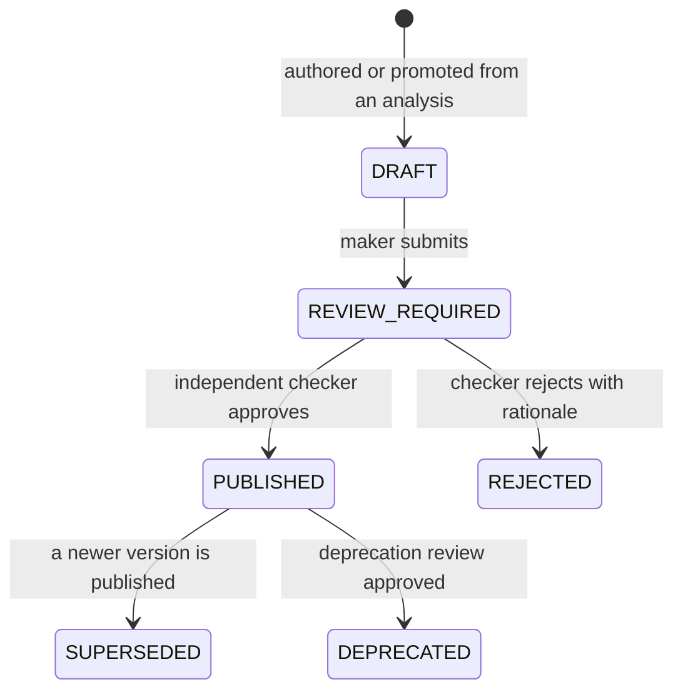

# Module 14 — Tool Registry

> Layer L3 · Schema `tools` · Owner: AI Platform

## 1. Purpose

Turns a successful analysis into a **reusable, versioned, governed capability**. This is differentiator D2 and the mechanism that makes Atlas's cost and risk fall with usage while competitors' rise.

## 2. Jobs served

A4 (do this every month without regenerating), B1 (run the approved analysis), R1/R3 (approve), U3 (approval chains).

## 3. Responsibilities

- Tool definition: deterministic parameterized SQL and a typed parameter schema.
- Versioning: a new version per SQL or parameter change.
- Maker-checker lifecycle: draft → submit → approve → publish → deprecate (a newer publication supersedes the old version; there is no separate test or retire state).
- RBAC bindings: who and which agents may invoke.
- Deterministic invocation with AST literal binding.
- Promotion of a successful analysis into a tool draft.
- Tool dependency tracking and blast-radius queries.
- Tool certification.

## 4. Not responsibilities

| Not this module | Where it lives |
|---|---|
| Executing SQL | 16 query-gateway (INV-2) |
| Approval mechanics | 17 policy-governance |
| Tool selection during a run | 13 agent-runtime |
| Authoring UI | 18 studio |

## 5. Domain model

```text
tool, tool_version, tool_parameter_schema
tool_binding (principal/agent → tool, permissions)
tool_invocation, tool_dependency, tool_certification
```

> **Implementation status (2026-09-20).** There is no per-module database schema, so "Schema `tools`" in the header names the bounded context only; the models are in `src/aida/models.py` in the one shared schema. The real tables are `governed_tool` and `governed_tool_version` (the tool and its versions, with the parameter schema, `allowed_roles` and `referenced_tables` held as columns of the version), `tool_execution` (the invocation record), `tool_certification_case` and `tool_certification_run`, and `tool_plan`, `tool_plan_step` and `tool_plan_execution`. `tool_binding`, `tool_parameter_schema`, `tool_dependency` and `tool_certification` as separate tables do not exist.

## 6. Parameter contract

Parameters are **typed and validated**, and values are bound into the AST — never string-interpolated. This is the mechanism that makes a governed tool safer than the generated SQL it replaced.

```json
{
  "name": "exposure_by_counterparty",
  "version": 3,
  "parameters": [
    {"name": "as_of_date", "type": "date", "required": true},
    {"name": "lob_code",   "type": "string", "required": true, "enum_source": "lob_reference"},
    {"name": "min_amount", "type": "decimal", "required": false, "default": 0}
  ],
  "returns": {"kind": "table", "columns": ["counterparty_id", "exposure_amount"]}
}
```

| Control | Behaviour |
|---|---|
| Type validation | Rejected before execution |
| Enum sources | Bound to governed reference data, not free text |
| AST literal binding | Values bound into the parsed tree — injection is not possible by construction |
| No dynamic SQL | Tool SQL is fixed at version publication |
| Gateway execution | Tools do **not** bypass the query gateway |

> **Implementation status (2026-09-20).** The JSON above is the design view. The code names parameter types `STRING`, `INTEGER`, `NUMBER`, `BOOLEAN` and `DATE` (`parameter_type`), holds a fixed set of permitted values as a static `allowed_values` list, and has no `enum_source` binding to governed reference data. See [the tool contract](../30-contracts/07-tool-and-agent-contract.md) §2.

## 7. Lifecycle



Maker ≠ checker is platform-enforced (INV-8). The states are those in `src/aida/tool_api.py` and `src/aida/semantic_api.py`; the design's `TESTED`, `SUBMITTED` and `RETIRED` states do not exist, and a rejected version stays `REJECTED` rather than returning to draft (see [the tool contract](../30-contracts/07-tool-and-agent-contract.md) §4).

## 8. Promotion from analysis

The path that makes the registry fill up on its own:

1. An analyst completes a successful governed run.
2. They request promotion.
3. Atlas **deterministically renders** the executed SQL into a parameterized template — the model does not author it.
4. Parameters are inferred from the literals that were redacted, and confirmed by the analyst.
5. A tool **draft** is created and enters the normal maker-checker workflow.
6. On publication, the agent prefers this tool for matching intents.

Step 3 is the safety property: a governed tool's SQL is never model output (ADR-0001).

## 9. Public interface

> **Implementation status (2026-09-20).** The signatures below are the design target. No `tool_registry/api.py` exists and none of these functions is defined. The behaviour is in the HTTP handlers in `src/aida/tool_api.py` (create, submit, deprecate, certify), `src/aida/tool_execution.py` (`POST /v1/tool-versions/{version_id}/execute`) and `src/aida/tool_plans_api.py`, reached through the routes in `Docs/90-reference/openapi-baseline.json`.

```python
# tool_registry/api.py
def list_tools(scope, filt, page) -> Page[ToolDTO]
def get_tool(scope, tool_id, version=None) -> ToolDTO
def match_intent(scope, intent: ResolvedIntent) -> list[ToolMatchDTO]   # used by module 13
def invoke(scope, tool_id, version, params) -> ExecutionRequest         # → module 16
def create_draft_from_run(scope, run_id) -> ToolDTO
def submit_for_review(scope, tool_version_id) -> ProposalDTO            # via module 17
def get_dependencies(scope, tool_id) -> list[AssetRef]
```

## 10. Events

Emits `tool.version.draft_created.v1`, `governance.review_requested.v1` (on submission), `tool.version.published.v1`, `tool.version.deprecated.v1` (with the `tool.version.rejected.v1` and `tool.version.deprecation_rejected.v1` decisions), `tool.execution.completed.v1`, `tool.certification_run.executed.v1`, `tool.certification_completed.v1` and `tool.certification_rejected.v1`, and `tool_plan.execution_completed`. The event catalog maps each to the design name it replaces.

## 11. Dependencies

16 query-gateway, 17 policy-governance.

## 12. Competitive note

Alation's **AI Agent SDK** and **Data Products Builder Agent** are the closest analogues in the market. The distinction: those build *data products* (curated datasets) and *agents*; Atlas builds **executable governed capabilities with typed parameter contracts that run through a deterministic gateway**. The parameter contract plus AST binding plus gateway execution is what makes an Atlas tool safe to hand to a business consumer who never sees SQL.

## 13. Current state → target

| Aspect | Now | Target |
|---|---|---|
| Versioning and parameter schemas | Implemented | Unchanged |
| AST literal binding | Implemented | Unchanged |
| Maker-checker lifecycle | Implemented | Unchanged |
| RBAC bindings | Implemented | ABAC bindings |
| Promotion from analysis | Implemented | Multi-table blueprints |
| Retrieval ranking of tools | Implemented, usage-weighted (TL-4: the tool list orders by completed executions) | Unchanged |
| Tool certification | Implemented (TL-1) — a corpus of deterministic cases run against a version's real invocation path, with a reviewer decision (`/v1/tools/{tool_id}/certification-*`, `POST /v1/tool-versions/{version_id}/certification-runs`) | Depth of the live corpus (tracker section P) |
| Multi-tool plans | Implemented (TL-2) — the `/v1/tool-plans` routes with step, time, token and cost budgets | Parity requirement |
| Quality gating | Implemented (TL-3) — `quality_coupling.check_tool_gate` runs inside tool execution and can block on open quality incidents | Differentiator W1 |
| Tool SDK for third parties | Implemented (TL-5) — `sdk/aida_tool_sdk`, a candidate builder that can only submit a draft | Ecosystem |

## 14. Open work

Every row below is delivered in the tracker as of 2026-09-20 (TL-2 to TL-7 `DONE`, TL-1 `MERGED`); what remains, such as the depth of the live certification corpus, is tracked in tracker section P.

| ID | Item | Priority |
|---|---|---|
| TL-1 | Formal tool certification corpus and workflow (delivered) | P0 |
| TL-2 | Multi-tool plans with step/time/token/cost budgets (delivered) | P1 |
| TL-3 | Quality-signal gating of tool invocation (delivered) | P1 |
| TL-4 | Usage-weighted tool ranking (delivered) | P1 |
| TL-5 | Public Tool SDK (delivered) | P2 |
| TL-6 | Tool-first execution rate metric and dashboard (delivered: `GET /v1/organizations/{organization_id}/tool-first-rate`) | P1 |
| TL-7 | Deprecation impact preview (delivered: `GET /v1/tool-versions/{version_id}/deprecation-impact`) | P1 |
