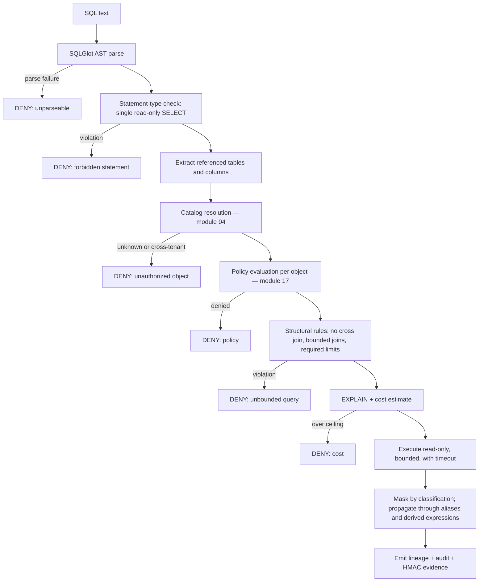

# Module 16 — Query Execution Gateway

> Layer L3 · Schema `execution` · Owner: Data Platform + Security

## 1. Purpose

**The one path to a data source.** Every source query — generated SQL, approved tool SQL, profiler SQL, lineage extraction SQL, quality check SQL, administrator SQL — passes through here (ADR-0004, INV-2).

This is differentiator D1, the hardest capability for a competitor to copy, because it is a *negative* property: the absence of bypass paths. Competitors cannot add it incrementally — their notebooks, BI passthrough, and SDK query methods *are* bypass paths.

## 2. Jobs served

A1, A5 (understand refusals), P2, U2 (prove the model could not act unapproved), P6 (cost).

## 3. Responsibilities

- SQL AST parsing and validation (SQLGlot).
- Deny rules: mutations, DDL, multi-statement, unbounded joins, cross joins.
- Catalog allowlist derived from **parsed** references.
- Policy evaluation per referenced object.
- EXPLAIN and cost ceiling.
- Read-only, bounded execution with timeout and row/byte caps.
- Column masking and redaction by classification.
- HMAC evidence and audit correlation.
- Query lineage emission.
- Cancellation propagation.

## 4. Not responsibilities

| Not this module | Where it lives |
|---|---|
| Deciding what to ask | 13 agent-runtime |
| Owning the connection | 02 connectivity (gateway calls it privately) |
| Policy rule definition | 17 policy-governance |
| Result presentation | 21 experience-shell |

## 5. Required context

Target: every request carries all of these. There is no partial-context path.

```text
identity_context, purpose, datasource_id, workload_class,
policy_version, timeout, max_rows, max_bytes, correlation_id
```

Target: missing any field is a rejection, not a default.

> **Implementation status (2026-09-20).** The gateway does not take that request. `QueryExecutionGateway.execute` (`src/aida/query_gateway.py`) takes the session, the datasource, the caller's `SecurityContext` (identity, organization, roles, and a `business_purpose` that may be absent), a correlation id, the SQL text, an optional `requested_limit` and an optional `semantic_version` (plus an optional workspace and context-product scope). `workload_class` appears nowhere in `src/`, and the call carries no `policy_version`, `timeout` or `max_bytes`. The bounds come from settings instead: an absent or oversized row limit is replaced by `default_query_row_limit` or clamped to `hard_query_row_limit` (reported as `ROW_LIMIT_APPLIED`, see [the request and audit contract](../30-contracts/09-runtime-request-and-audit-contracts.md) §7), the timeout is `query_timeout_seconds`, and the only byte cap is the byte-shaped dry-run estimate gate for adapters that report bytes (BigQuery's `max_bigquery_dry_run_bytes`). A missing row limit is therefore defaulted, not rejected.

## 6. Validation pipeline



**The pipeline order matters.** References are extracted from the *parsed tree*, not by string matching, so comment tricks, alias games, and encoding do not evade the allowlist. Policy is evaluated per resolved object, not per statement.

## 7. Masking

| Property | Behaviour |
|---|---|
| Basis | Deterministic classification from module 05 |
| Propagation | Through aliases and derived expressions — a masked column stays masked when renamed or wrapped in a function |
| Default | Conservative — when classification is uncertain, mask |
| Evidence | The masking decision is recorded per execution |
| Target | Source-native row/column policies and dynamic masking |
| Sync (QG-2) | `policy_native_sync.py`/`policy_native_sync_api.py`: unconditional (subject-match-empty) `FILTER`/`MASK` obligations from the same governed ABAC policy set can be previewed and, maker-checker-gated, applied as native DDL — PostgreSQL RLS (row) and SQL Server DDM (column) today. Defense in depth, not a substitute: this table's masking keeps running unconditionally regardless of whether a sync exists or succeeded |

Alias propagation is the subtle part. `SELECT ssn AS x FROM …` and `SELECT SUBSTR(ssn,1,3) FROM …` must both mask; a naive implementation catches neither.

## 8. Public interface

```python
# query_gateway/api.py
def execute(request: ExecutionRequest) -> ExecutionResult | Denial
def explain(request: ExecutionRequest) -> CostEstimate | Denial
def validate(request: ExecutionRequest) -> ValidationResult
def cancel(execution_id) -> CancellationResult
```

`ExecutionRequest` is the only way to reach a source. Connector execution symbols are module-private and the boundary is enforced by an import-linter contract that fails CI (INV-2).

> **Implementation status (2026-09-20).** The signatures above are the design target. There is no `query_gateway/api.py` and no `ExecutionRequest` type: the surface is the `QueryExecutionGateway` class in `src/aida/query_gateway.py`, and it has two operations, `validate` and `execute`. `explain` is not a separate operation (the cost estimate is taken inside the one validation pipeline that both `validate` and `execute` run), and there is no `cancel`: no connector implements cancellation (tracker QG-4). The INV-2 contract is real and does fail CI: connector SQL execution (`SqlExecutor.estimate_read_query` and `execute_read_query`) is reachable only from the query gateway. The execution record is the `query_execution` table in the shared schema, not a separate `execution` schema.

## 9. Events

Emits `execution.requested|denied|completed|cancelled`, `execution.cost_exceeded`, `execution.masking_applied` (target names).

> **Implementation status (2026-09-20).** Only one of those is emitted, under a different name: `query.execution.completed.v1`, an outbox event carrying the execution id, datasource id and row count. The rest of the trail is audit events (`query.validate.gateway` for a validation call, and `query.execute.requested` and `query.execute` for an execution, the last with outcome `SUCCESS` or `DENIED`), and neither a cost refusal nor a masking decision is its own event: a refusal is a `DENIED` `query.execute` audit event whose `details` carry the reason (for cost, `QUERY_COST_EXCEEDS_POLICY` with the plan cost and the limit), and the masking decision is in a successful execution's `details` (the masked column names).

## 10. Dependencies

02 connectivity (private execution), 04 catalog (resolution), 09 lineage (emission), 17 policy-governance.

## 11. Performance

| Operation | p95 |
|---|---|
| AST validation | 30 ms |
| Policy evaluation | 50 ms |
| EXPLAIN | Source-dependent, capped |
| Total gateway overhead excl. source | 100 ms |

## 12. Current state → target

| Aspect | Now | Target |
|---|---|---|
| AST validation | Implemented — SQLGlot, allowlists, deny rules | Adversarial corpus per certified dialect |
| Cost gate | Implemented — EXPLAIN, cost ceiling, byte budget for byte-billed adapters | Warehouse workload groups |
| Bounded execution | Implemented — read-only, timeout, row/byte caps | Cancel propagation certification |
| Masking | Implemented — conservative, alias/derived propagation; QG-6 tokenization for opted-in columns (`ColumnTokenizationPolicy`, local dev provider certified, Vault Transform adapter shape); QG-2 source-native sync for Postgres RLS (row) and SQL Server DDM (column), preview + maker-checker apply, apply verified only against a mocked connection | SQL Server native RLS, Postgres native column masking (documented future work); apply certified against a live source; Vault Transform certified against a live Vault |
| Evidence | Implemented — HMAC, audit correlation, lineage; the HMAC key can live in a KMS (QG-5: `VaultTransitSigningProvider` in `src/aida/signing.py`, live-certified 2026-09-02 against Vault, no key material in the application process), though `hmac_signing_provider` defaults to a local HMAC | Other KMS providers |
| Concurrency control | Implemented (QG-3) — a per-line-of-business cap on in-flight executions, keyed by the datasource's LOB (`src/aida/lob_concurrency.py`, `query_gateway_lob_max_concurrent`); in-process, so per API replica rather than across replicas | A cross-replica bound |

## 13. Open work

| ID | Item | Priority |
|---|---|---|
| QG-1 | Adversarial SQL corpus per certified dialect | P0 |
| QG-2 | Source-native row/column policy synchronization | P0 — IN PROGRESS. Postgres RLS + SQL Server DDM shipped, preview + maker-checker apply; apply not yet certified against a live source; SQL Server RLS and Postgres column masking remain future work |
| QG-3 | Per-LOB quotas and concurrency controller — delivered 2026-09-01 (tracker QG-3 DONE); in-process, per replica | P1 |
| QG-4 | Cancel propagation certification | P1 |
| QG-5 | KMS-managed HMAC keys — delivered and live-certified 2026-09-02 against Vault (tracker QG-5 DONE) | P0 |
| QG-6 | Dynamic masking and tokenization integration | P1 — delivered 2026-08-31, see tracker QG-6 (Vault Transform adapter untested against a live Vault) |
| ~~QG-7~~ | ~~Import-linter contract enforcing gateway exclusivity~~ — **DONE 2026-08-30**. See ADR-0004 implementation status and INV-2 | — |
