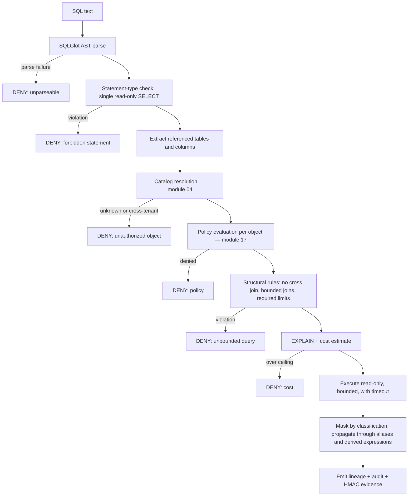

# Module 16 — Query Execution Gateway

> Layer L3 · Schema `execution` · Owner: Data Platform + Security

## 1. Purpose

**The one path to a data source.** Every source query — generated SQL, approved tool SQL, profiler SQL, lineage extraction SQL, quality check SQL, administrator SQL — passes through here (ADR-0004, INV-2).

This is differentiator D1, the hardest capability for a competitor to copy, because it is a *negative* property: the absence of bypass paths. Competitors cannot add it incrementally — their notebooks, BI passthrough, and SDK query methods *are* bypass paths.

## 2. Jobs served

A1, A5 (understand refusals), P2, U2 (prove the model could not act unapproved), P6 (cost).

## 3. Responsibilities

- SQL AST parsing and validation (SQLGlot).
- Deny rules: mutations, DDL, multi-statement, unbounded joins, cross joins.
- Catalog allowlist derived from **parsed** references.
- Policy evaluation per referenced object.
- EXPLAIN and cost ceiling.
- Read-only, bounded execution with timeout and row/byte caps.
- Column masking and redaction by classification.
- HMAC evidence and audit correlation.
- Query lineage emission.
- Cancellation propagation.

## 4. Not responsibilities

| Not this module | Where it lives |
|---|---|
| Deciding what to ask | 13 agent-runtime |
| Owning the connection | 02 connectivity (gateway calls it privately) |
| Policy rule definition | 17 policy-governance |
| Result presentation | 21 experience-shell |

## 5. Required context

Every request must carry all of these. There is no partial-context path.

```text
identity_context, purpose, datasource_id, workload_class,
policy_version, timeout, max_rows, max_bytes, correlation_id
```

Missing any field is a rejection, not a default.

## 6. Validation pipeline



**The pipeline order matters.** References are extracted from the *parsed tree*, not by string matching, so comment tricks, alias games, and encoding do not evade the allowlist. Policy is evaluated per resolved object, not per statement.

## 7. Masking

| Property | Behaviour |
|---|---|
| Basis | Deterministic classification from module 05 |
| Propagation | Through aliases and derived expressions — a masked column stays masked when renamed or wrapped in a function |
| Default | Conservative — when classification is uncertain, mask |
| Evidence | The masking decision is recorded per execution |
| Target | Source-native row/column policies and dynamic masking |

Alias propagation is the subtle part. `SELECT ssn AS x FROM …` and `SELECT SUBSTR(ssn,1,3) FROM …` must both mask; a naive implementation catches neither.

## 8. Public interface

```python
# query_gateway/api.py
def execute(request: ExecutionRequest) -> ExecutionResult | Denial
def explain(request: ExecutionRequest) -> CostEstimate | Denial
def validate(request: ExecutionRequest) -> ValidationResult
def cancel(execution_id) -> CancellationResult
```

`ExecutionRequest` is the only way to reach a source. Connector execution symbols are module-private and the boundary is enforced by an import-linter contract that fails CI (INV-2).

## 9. Events

Emits `execution.requested|denied|completed|cancelled`, `execution.cost_exceeded`, `execution.masking_applied`.

## 10. Dependencies

02 connectivity (private execution), 04 catalog (resolution), 09 lineage (emission), 17 policy-governance.

## 11. Performance

| Operation | p95 |
|---|---|
| AST validation | 30 ms |
| Policy evaluation | 50 ms |
| EXPLAIN | Source-dependent, capped |
| Total gateway overhead excl. source | 100 ms |

## 12. Current state → target

| Aspect | Now | Target |
|---|---|---|
| AST validation | Implemented — SQLGlot, allowlists, deny rules | Adversarial corpus per certified dialect |
| Cost gate | Implemented — EXPLAIN, cost ceiling | Per-LOB quotas, warehouse workload groups |
| Bounded execution | Implemented — read-only, timeout, row/byte caps | Cancel propagation certification |
| Masking | Implemented — conservative, alias/derived propagation; QG-6 tokenization for opted-in columns (`ColumnTokenizationPolicy`, local dev provider certified, Vault Transform adapter shape) | Source-native row/column policies |
| Evidence | Implemented — HMAC, audit correlation, lineage | KMS-managed HMAC keys |
| Concurrency control | Not implemented | Per-LOB quotas and a concurrency controller |

## 13. Open work

| ID | Item | Priority |
|---|---|---|
| QG-1 | Adversarial SQL corpus per certified dialect | P0 |
| QG-2 | Source-native row/column policy synchronization | P0 |
| QG-3 | Per-LOB quotas and concurrency controller | P1 |
| QG-4 | Cancel propagation certification | P1 |
| QG-5 | KMS-managed HMAC keys | P0 |
| QG-6 | Dynamic masking and tokenization integration | P1 — delivered 2026-08-31, see tracker QG-6 (Vault Transform adapter untested against a live Vault) |
| ~~QG-7~~ | ~~Import-linter contract enforcing gateway exclusivity~~ — **DONE 2026-08-30**. See ADR-0004 implementation status and INV-2 | — |
