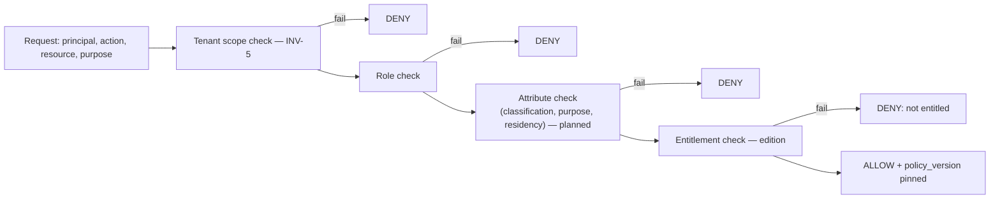

# Module 17 — Policy and Governance

> Layer L1 (cross-cutting) · Schema `governance` · Owner: Data Governance + Platform Security

## 1. Purpose

Makes policy evaluation and maker-checker approval **platform primitives** rather than per-feature implementations. Every governed object type — semantics, metrics, tools, model routes, relationships, quality policies, connectors, glossary terms — flows through the same review queue and the same decision model.

This is one of only two modules callable from any layer (the other is 20). It never calls back into a domain module, which is what keeps the exception acyclic and safe.

## 2. Jobs served

R1–R4 (all reviewer jobs), S2, U3 (approval chains), P5, and the authorization substrate for every other job.

## 3. Responsibilities

- Policy definition, versioning, and evaluation.
- RBAC today; ABAC and purpose-based access as the target.
- Entitlements (edition and licence gating).
- The **unified review queue** across all object types.
- Proposal, assignment, decision, and rationale capture.
- Maker ≠ checker enforcement (INV-8).
- Delegation and bulk decisions.
- Policy decision logging.

## 4. Not responsibilities

| Not this module | Where it lives |
|---|---|
| Authentication | 01 identity-tenancy |
| Object-specific validation | The owning module |
| Audit ledger storage | 20 observability-audit |
| Source-system authorization | The source — always authoritative |

## 5. Domain model

```text
policy, policy_version, policy_rule, entitlement
proposal (object_type, object_ref, maker, submitted_at, evidence_ref)
review_assignment, decision (checker, outcome, rationale, decided_at)
delegation, policy_decision_log
```

## 6. The unified review queue

Every governed object type uses **one** queue. This is a deliberate architectural choice with a specific payoff.

| If review were per-feature | With a unified queue |
|---|---|
| Maker≠checker implemented N times, inconsistently | Enforced once, structurally |
| Reviewers learn N interfaces | One interface, one mental model |
| Bulk review impossible across types | Bulk across the whole queue |
| Delegation per feature | Delegation once |
| Audit shape differs per type | One decision shape for auditors |

Object-type-specific detail is supplied by the owning module as an **evidence payload** rendered in a common detail pane — the queue stays generic, the evidence stays rich.

## 7. Policy evaluation



| Property | Requirement |
|---|---|
| Default | **Deny** |
| Latency | p95 ≤ 50 ms — this is on every request path |
| Versioning | The evaluating policy version is pinned into the decision (P4) |
| Logging | Every decision logged with inputs and outcome |
| Fail closed | Policy state unavailable → deny (INV-4) |

## 8. Maker-checker

| Rule | Enforcement |
|---|---|
| Maker ≠ checker | Platform-enforced for every object type; feature modules cannot implement their own approval |
| Rationale | Mandatory on every decision, captured into the audit ledger |
| Bulk decisions | One decision covering many items, each retaining its own rationale — a bulk approval is one decision, not a bypass |
| Delegation | Explicit, time-bounded, audited |
| Reassignment | Audited |
| Self-approval | Denied; test `test_self_approval_denied` is planned, not yet written (2026-08-30) |

## 9. Public interface

```python
# policy_governance/api.py
def authorize(principal, action, resource, purpose=None) -> Decision  # hot path
def filter_authorized(principal, refs: list[ResourceRef]) -> list[ResourceRef]  # used by module 12
def submit_proposal(scope, object_type, object_ref, evidence) -> ProposalDTO
def list_queue(scope, filt, page) -> Page[ProposalDTO]
def decide(scope, proposal_id, outcome, rationale) -> DecisionDTO
def bulk_decide(scope, decisions: list[BulkDecision]) -> BulkResult
def delegate(scope, from_principal, to_principal, scope_spec, until) -> DelegationDTO
```

`filter_authorized` is the function that makes retrieval filter-before-rank possible (module 12). It must be fast and must never return a resource the principal cannot see.

## 10. Events

Emits `policy.version_published`, `proposal.submitted`, `proposal.assigned`, `decision.made`, `delegation.granted|revoked`, `policy.decision_denied`.

## 11. Current state → target

| Aspect | Now | Target |
|---|---|---|
| RBAC | Implemented — role gates, organization enforcement | Retained |
| ABAC | **Not implemented** | Entry-ticket gap — attributes: classification, purpose, residency, agent-vs-human |
| Purpose-based access | Not implemented | Required for regulated purposes |
| Unified review queue | Implemented — cross-object, filters, rationale, independent decisions | Bulk assignment, richer evidence schemas |
| Maker ≠ checker | Implemented | Unchanged |
| Bulk decisions | Not implemented | Entry-ticket gap |
| Delegation | Not implemented | Required for real steward operations |
| Entitlements | Not implemented | Required once editions exist |
| Policy decision logging | Partial | Full, with inputs, for auditors |

**Competitive note.** Databricks now ships ABAC grant policies with identity attributes from the IdP and **context attributes distinguishing agent from workspace access**. That last one is the important signal: distinguishing "a human is asking" from "an agent is asking" is becoming a baseline expectation, and Atlas's ABAC work must include it.

## 12. Open work

| ID | Item | Priority |
|---|---|---|
| PG-1 | ABAC with classification, purpose, residency attributes | P0 |
| PG-2 | Agent-vs-human context attribute | P0 |
| PG-3 | Bulk decisions with per-item rationale | P0 |
| PG-4 | Delegation and reassignment | P1 |
| PG-5 | Entitlement evaluation for editions | P1 |
| PG-6 | Full policy decision logging for auditors | P0 |
| PG-7 | External PDP (OPA / bank PDP) adapter | P1 |
| PG-8 | Policy simulation ("who could see this?") | P2 |
