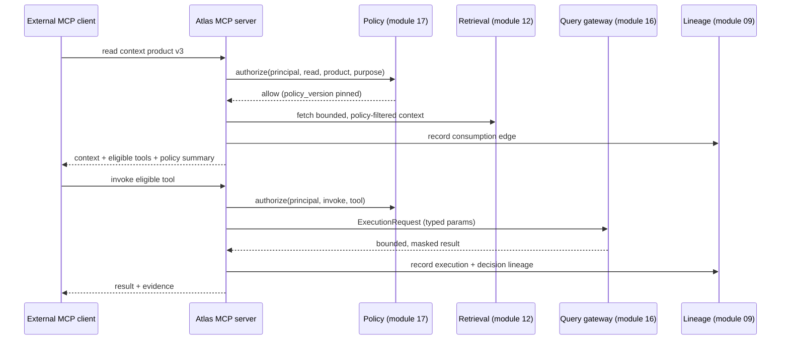

# Module 19 — Context Products and MCP

> Layer L4 · Schema `context_products` · Owner: AI Platform

## 1. Purpose

Packages governed context — glossary, semantics, lineage, policy, quality signals, and tool eligibility — for consumption by **external** AI clients over MCP, with the same policy enforcement the native analyst gets.

This is whitespace **W2**. Every competitor now ships an MCP server. What none of them does is **keep governing at consumption**: they authenticate, hand over context, and stop. Atlas evaluates policy on every read, records consumption as lineage, and exposes tool eligibility rather than raw context.

## 2. Jobs served

A1 (from an external surface), P5 (operator control over external consumption), S1, B3.

## 3. Responsibilities

- Context product definition, versioning, and publication.
- MCP server exposing products as resources and tools.
- Per-read policy evaluation and tenancy enforcement.
- Consumption recording as lineage and audit evidence.
- Rate limiting and budgets per consumer.
- Value-freedom enforcement at the boundary.

## 4. Not responsibilities

| Not this module | Where it lives |
|---|---|
| Owning the context | The originating modules |
| Executing queries for external agents | 16 query-gateway, via governed tools only |
| Authenticating the external client | 01 identity-tenancy |
| Being an agent | The external client is the agent |

## 5. Why "context product" and not "an API"

A raw metadata API hands over everything the caller is entitled to and forgets about it. A context product is a **curated, versioned, governed package** with an owner and a purpose.

| Property | Raw API | Context product |
|---|---|---|
| Scope | Whatever the caller requests | A defined, reviewed set |
| Versioning | Endpoint version | Product version pinned by the consumer |
| Ownership | The platform team | A named steward |
| Approval | None | Maker-checker before publication |
| Consumption record | An access log | **Lineage edges** |
| Policy | At the endpoint | **At every read** |
| Purpose | Implicit | Declared and enforced |

## 6. What a context product contains

```text
context_product
├── scope           (domains, entities, assets — bounded)
├── semantics       (approved annotations, metrics, grain, join rules)
├── glossary        (approved terms, synonyms)
├── lineage_summary (bounded upstream/downstream)
├── quality_signals (trust state per included asset)
├── policy_summary  (what the consumer may and may not do)
└── eligible_tools  (governed tools invocable in this context)
```

**`eligible_tools` is the differentiating element.** Competitors hand an external agent context and let it generate SQL in its own environment. Atlas hands it context *plus a list of approved capabilities it may invoke through the governed gateway*. The external agent gets more power and less freedom — which is exactly the trade a bank wants.

## 7. Governance at consumption



Note that an external agent's tool invocation goes through the **same query gateway** as a native run (INV-2). There is no external execution path.

## 8. Value-freedom at the boundary

| Crosses to an external client | Never crosses |
|---|---|
| Approved annotations and descriptions | Sample values |
| Metric and dimension definitions | Credentials |
| Bounded lineage summaries | Other tenants' anything |
| Quality trust signals | Unapproved drafts |
| Policy summaries | Raw SQL of unpublished tools |
| Bounded, masked tool results | Anything outside the caller's authorization scope |

## 9. Public interface

```python
# context_products/api.py
def list_products(scope) -> list[ContextProductDTO]
def get_product(scope, product_id, version=None) -> ContextProductDTO
def publish_product(scope, draft_id) -> ProposalDTO        # via module 17
def read_product(principal, product_id, version) -> ContextPayload | Denial
def list_eligible_tools(principal, product_id) -> list[ToolDTO]
def get_consumption(scope, product_id, page) -> Page[ConsumptionDTO]
```

## 10. MCP surface

| MCP concept | Atlas mapping |
|---|---|
| Resource | A context product version |
| Resource read | Policy-evaluated, lineage-recorded context fetch |
| Tool | An eligible governed tool |
| Tool call | `ExecutionRequest` through the query gateway |
| Prompt | Curated analytical question templates from approved annotations |

## 11. Events

Emits `context.product_published|deprecated`, `context.product_consumed`, `context.consumption_denied`, `context.budget_exceeded`.

## 12. Dependencies

12 retrieval, 17 policy-governance (plus 14 tool-registry and 16 query-gateway for tool invocation).

## 13. Current state → target

**Partially built, and previously under-reported.** `src/aida/mcp_server.py` implements a real JSON-RPC 2.0 MCP endpoint (`POST /mcp`, mounted in `src/aida/main.py`) with `initialize`, `ping`, `tools/list`, `tools/call`, `resources/list`, and `resources/read`. Tool calls do **not** bypass the gateway: `tools/call` runs through the same `GovernedAgentOrchestrator` → `QueryExecutionGateway` path as the native analyst (prompt-risk screening, AST guard, cost check, masking, audit). `tools/list` and `tools/call` now also enforce the tool's `allowed_roles` binding — an MCP caller is offered, and may invoke, only the governed tools its identity is bound to, mirroring the native `POST /v1/tool-versions/{id}/execute` check; an ineligible tool is denied with the same "not found or not published" response used for a genuinely-absent tool, so eligibility is never revealed as a distinguishable side channel. What is still missing is everything the *context product* abstraction itself was meant to provide: there is no `ContextProduct` concept anywhere in the codebase (no model, no versioning, no maker-checker, no scope/purpose curation) — the MCP server exposes raw catalog metadata and governed tools directly, not a reviewed, owned, versioned package. `resources/list` and `resources/read` (metadata reads) are not recorded as consumption/lineage evidence the way tool calls are. The server advertises a `"prompts": {}` capability in `initialize` but implements no `prompts/list` or `prompts/get` handler. There is no per-consumer rate limiting or budget enforcement. This file had previously reported the entire module as unbuilt; that was inaccurate — verify against the code, not this table, before re-scoping work here.

| Aspect | Now | Target |
|---|---|---|
| MCP server | **Implemented** — JSON-RPC 2.0 over `POST /mcp`, mounted; tool calls route through the full governed gateway | Add MCP `prompts/*` (capability is advertised but unimplemented) |
| Context products | Not implemented — no `ContextProduct` model, versioning, or maker-checker; MCP exposes raw catalog/tools instead | P0 |
| Per-read policy | Partial — tenancy-scoped on every read/list; tool eligibility now enforced by role binding | ABAC / purpose-based evaluation once module 17 has it natively |
| Consumption lineage | Partial — tool calls get the same audit/evidence trail as native runs; resource reads (`resources/list`/`read`) are not recorded at all | P0 |
| Eligible tools exposure | **Implemented** — `tools/list` only returns role-eligible tools; an ineligible `tools/call` is denied without confirming the tool's existence | Extend to a real `ContextProduct.eligible_tools` once CX-2 exists |
| Consumer budgets | Not implemented | P1 |

## 14. Open work

| ID | Item | Priority |
|---|---|---|
| CX-1 | MCP server with resource and tool surfaces | P0 |
| CX-2 | Context product definition, versioning, maker-checker | P0 |
| CX-3 | Per-read policy evaluation | P0 |
| CX-4 | Consumption recorded as lineage | P0 |
| CX-5 | Eligible-tool exposure and governed invocation | P0 |
| CX-6 | Per-consumer rate limits and budgets | P1 |
| CX-7 | Workload identity for MCP consumers | P0 |
| CX-8 | BI-surface context injection (Tableau, Power BI, Looker) | P1 |

## 15. Enterprise AI control-plane expansion

### 15.1 Market reference and product boundary

The Collibra Platform and its August 2026 product announcements are a market reference for
expected enterprise surfaces, not a design to copy. The relevant public references are:

- `https://www.collibra.com/products/collibra-platform`
- `https://www.collibra.com/blog/data-lineage-read-apis-mcp-server-lineage-on-demand`
- `https://www.collibra.com/blog/data-products-application-centralized-oversight-for-all-your-data-products`
- `https://www.collibra.com/blog/a-single-governed-source-of-truth-for-every-ai-agent-and-platform-introducing-collibra-s`
- `https://www.collibra.com/products/ai-command-center`
- `https://www.collibra.com/products/data-quality-and-observability`

**Wired to the epic backlog 2026-08-29**: CP-2/CP-3 -> `60-delivery/02-epic-backlog.md` EE.8, CP-5 -> EE.9, CP-6 -> EE.10, CP-7/CP-8 -> EE.11. See also `competitors/08-collibra-lineage-and-platform-analysis-2026-08.md`.

The reference set was reviewed on 2026-08-29. It establishes that buyers now expect a
platform to govern data products, context, lineage, quality, policies, models, and agents as
one connected system. Atlas keeps a narrower boundary: it does not become a BI tool,
notebook, pipeline authoring environment, or general-purpose ticketing system. It becomes the
governed context and action plane that those systems consume.

### 15.2 Required platform capabilities

| ID | Required capability | Atlas requirement | Acceptance evidence |
|---|---|---|---|
| CP-1 | Governed context products | Stable product identity, immutable versions, owner, purpose, bounded asset scope, semantic versions, glossary versions, quality requirements, policy summary, and eligible tools | Maker-checker lifecycle test; published versions are immutable; cross-tenant and draft-read denial tests |
| CP-2 | Data product registry | Product, domain, owner, ports, lifecycle, certification, usage terms, quality posture, lineage coverage, and linked context products | Candidate through retired lifecycle; portfolio filters; ownership and certification queues |
| CP-3 | Data contract registry | Versioned schema, quality, freshness, SLA, compatibility, producer, consumer, and product-port bindings using ODCS-compatible import/export | Compatibility check and maker-checker tests; a breaking change cannot publish without an approved exception |
| CP-4 | Data marketplace | Consumer-facing discovery of published products with trust, ownership, usage terms, and governed access requests | Policy-filtered search; request/approve/expire flow; no unpublished product leakage |
| CP-5 | Context compiler | Deterministic specifications map graph context to Snowflake Semantic Views, Databricks Metric Views, OSI, ODCS, and custom schemas | Repeatable output hash; schema validation; REST, MCP, and YAML delivery; drift report against deployed definitions |
| CP-6 | Lineage MCP | Callable upstream, downstream, impact, entity resolution, and transformation-detail tools over technical and business lineage | Fuzzy resolution corpus; bounded depth; policy filtering before traversal; transformation evidence returned without values |
| CP-7 | Unified AI registry | Register AI use cases, models, agents, versions, owners, datasets, policies, assessments, deployments, and runtime signals | Full lifecycle and dependency graph; CLI manifest registration; platform-neutral provider model |
| CP-8 | AI trust and compliance | Explainable trust score from documentation, lifecycle, quality, policy, evaluation, and runtime posture; EU AI Act, NIST AI RMF, AI UC-1, and custom assessment templates | Every score factor inspectable; no opaque model-only score; approval, remediation, and retirement workflows |
| CP-9 | Quality and observability | Reusable rules, warehouse pushdown, anomaly monitors, scores, incident routing, ownership, SLAs, and lineage-aware blast radius | Rule execution evidence; deduplicated incidents; owner notification; quality signal shown on product and agent context |
| CP-10 | Privacy operations | Purpose, legal basis, processing location, retention, sensitive-data flow, policy simulation, and external privacy-system integration | Purpose-limited access test; retention evidence; sensitive lineage impact report |
| CP-11 | Workflow automation | Versioned workflow templates for reviews, access, certification, quality remediation, and compliance; fixed safety gates remain code-owned | Workflow audit trail; timers/escalations; no workflow can bypass maker-checker or execution policy |
| CP-12 | Adoption and portfolio intelligence | Product views, context reads, agent/tool consumption, access requests, lifecycle queues, quality posture, and value-free usage trends | Tenant-scoped dashboards; bounded retention; no question text or source values stored |
| CP-13 | Integration ecosystem | Certified adapters for databases, warehouses, BI, transformation, quality, model registries, and ITSM; canonical envelope and SDK remain the scaling mechanism | Capability certification per adapter; unsupported capabilities fail closed; version compatibility report |
| CP-14 | Unstructured context | Govern metadata for documents and knowledge assets without becoming a document-chat product | Metadata-only ingestion, classification, ownership, policy, and references; content retrieval delegated to an approved provider |

### 15.3 Context product lifecycle

```text
DRAFT -> REVIEW_REQUIRED -> PUBLISHED -> SUPERSEDED
  |             |
  +-> REJECTED <-+

PUBLISHED -> DEPRECATION_REVIEW -> DEPRECATED
```

- A stable `context_product` identity owns a sequence of immutable
  `context_product_version` records.
- Only drafts may be edited. A new change creates a new version instead of mutating a
  published definition.
- Submission creates a `CONTEXT_PRODUCT_VERSION` item in the unified governance queue.
- The requester cannot approve their own version.
- Publishing supersedes the previous published version for the same product atomically.
- MCP and REST consumers see only published versions for which their roles and purpose are
  eligible. Unauthorized and nonexistent products have indistinguishable external responses.

### 15.4 Minimum context product contract

```json
{
  "product_key": "consumer-risk-analysis",
  "version": 3,
  "purpose": "Approved context for consumer credit-risk analysis",
  "owner_principal": "consumer-risk-stewards",
  "table_ids": ["tbl_..."],
  "semantic_model_version_ids": ["sem_..."],
  "glossary_term_version_ids": ["termv_..."],
  "eligible_tool_version_ids": ["toolv_..."],
  "allowed_consumer_roles": ["RiskAnalyst"],
  "lineage_depth": 2,
  "quality_requirements": {"minimum_score": 85, "deny_on_critical_incident": true},
  "policy_summary": {"source_values": "GATEWAY_ONLY", "retention": "NO_RAW_CONTEXT"}
}
```

Every referenced object is resolved in the product's organization and project before a draft
is accepted. Semantic, glossary, and tool references must identify approved or published
versions before submission. Wildcard estate scope is not permitted.

## 16. Delivery slices

| Slice | Scope | Exit condition | Status |
|---|---|---|---|
| CP-S1 | Context product identity, immutable versions, validation, maker-checker, REST API, audit, outbox | A product can be created, submitted, independently approved, listed, and read with tenant isolation | Backend implemented; database integration proof pending |
| CP-S2 | Published context products as MCP resources; role eligibility and consumption evidence | External agents consume only eligible published products and every read is audited | **Backend implemented** |
| CP-S3 | Lineage MCP tools and unified lineage projection | Upstream, downstream, impact, and transformation questions return bounded governed evidence | Planned |
| CP-S4 | Data products, ports, contracts, and lifecycle dashboard | Producers manage a portfolio and publish qualifying products | Planned |
| CP-S5 | Marketplace and access requests | Consumers discover and request governed products without draft or tenant leakage | Planned |
| CP-S6 | Context specification and compiler | One approved definition compiles deterministically to MCP, REST, YAML, OSI, ODCS, Snowflake, or Databricks targets | Planned |
| CP-S7 | AI registry, assessments, and operational trust | Models, agents, use cases, dependencies, controls, and runtime signals share one governed registry | Planned |
| CP-S8 | Adoption, privacy, workflow, and ecosystem expansion | Portfolio operations are measurable and integrations are certified | Planned |
