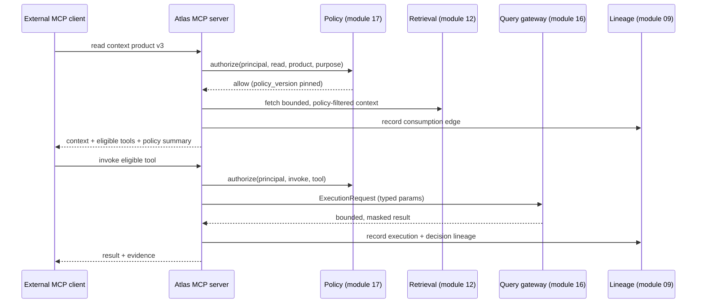

# Module 19 — Context Products and MCP

> Layer L4 · Schema `context_products` · Owner: AI Platform

## 1. Purpose

Packages governed context — glossary, semantics, lineage, policy, quality signals, and tool eligibility — for consumption by **external** AI clients over MCP, with the same policy enforcement the native analyst gets.

This is whitespace **W2**. Every competitor now ships an MCP server. What none of them does is **keep governing at consumption**: they authenticate, hand over context, and stop. Atlas evaluates policy on every read, records consumption as lineage, and exposes tool eligibility rather than raw context.

## 2. Jobs served

A1 (from an external surface), P5 (operator control over external consumption), S1, B3.

## 3. Responsibilities

- Context product definition, versioning, and publication.
- MCP server exposing products as resources and tools.
- Per-read policy evaluation and tenancy enforcement.
- Consumption recording as lineage and audit evidence.
- Rate limiting and budgets per consumer.
- Value-freedom enforcement at the boundary.

## 4. Not responsibilities

| Not this module | Where it lives |
|---|---|
| Owning the context | The originating modules |
| Executing queries for external agents | 16 query-gateway, via governed tools only |
| Authenticating the external client | 01 identity-tenancy |
| Being an agent | The external client is the agent |

## 5. Why "context product" and not "an API"

A raw metadata API hands over everything the caller is entitled to and forgets about it. A context product is a **curated, versioned, governed package** with an owner and a purpose.

| Property | Raw API | Context product |
|---|---|---|
| Scope | Whatever the caller requests | A defined, reviewed set |
| Versioning | Endpoint version | Product version pinned by the consumer |
| Ownership | The platform team | A named steward |
| Approval | None | Maker-checker before publication |
| Consumption record | An access log | **Lineage edges** |
| Policy | At the endpoint | **At every read** |
| Purpose | Implicit | Declared and enforced |

## 6. What a context product contains

```text
context_product
├── scope           (domains, entities, assets — bounded)
├── semantics       (approved annotations, metrics, grain, join rules)
├── glossary        (approved terms, synonyms)
├── lineage_summary (bounded upstream/downstream)
├── quality_signals (trust state per included asset)
├── policy_summary  (what the consumer may and may not do)
└── eligible_tools  (governed tools invocable in this context)
```

**`eligible_tools` is the differentiating element.** Competitors hand an external agent context and let it generate SQL in its own environment. Atlas hands it context *plus a list of approved capabilities it may invoke through the governed gateway*. The external agent gets more power and less freedom — which is exactly the trade a bank wants.

## 7. Governance at consumption



Note that an external agent's tool invocation goes through the **same query gateway** as a native run (INV-2). There is no external execution path.

## 8. Value-freedom at the boundary

| Crosses to an external client | Never crosses |
|---|---|
| Approved annotations and descriptions | Sample values |
| Metric and dimension definitions | Credentials |
| Bounded lineage summaries | Other tenants' anything |
| Quality trust signals | Unapproved drafts |
| Policy summaries | Raw SQL of unpublished tools |
| Bounded, masked tool results | Anything outside the caller's authorization scope |

## 9. Public interface

```python
# context_products/api.py
def list_products(scope) -> list[ContextProductDTO]
def get_product(scope, product_id, version=None) -> ContextProductDTO
def publish_product(scope, draft_id) -> ProposalDTO        # via module 17
def read_product(principal, product_id, version) -> ContextPayload | Denial
def list_eligible_tools(principal, product_id) -> list[ToolDTO]
def get_consumption(scope, product_id, page) -> Page[ConsumptionDTO]
```

## 10. MCP surface

| MCP concept | Atlas mapping |
|---|---|
| Resource | A context product version |
| Resource read | Policy-evaluated, lineage-recorded context fetch |
| Tool | An eligible governed tool |
| Tool call | `ExecutionRequest` through the query gateway |
| Prompt | Curated analytical question templates from approved annotations |

## 11. Events

Emits `context.product_published|deprecated`, `context.product_consumed`, `context.consumption_denied`, `context.budget_exceeded`.

## 12. Dependencies

12 retrieval, 17 policy-governance (plus 14 tool-registry and 16 query-gateway for tool invocation).

## 13. Current state → target

**Entirely unbuilt.** This is a P0 entry-ticket gap *and* the W2 differentiator — an unusual combination that makes it the highest-priority new build alongside glossary.

| Aspect | Now | Target |
|---|---|---|
| MCP server | Not implemented | P0 — the distribution channel for 2026 |
| Context products | Not implemented | P0 |
| Per-read policy | Not implemented | P0 — the differentiator |
| Consumption lineage | Not implemented | P0 |
| Eligible tools exposure | Not implemented | P0 — the differentiator |
| Consumer budgets | Not implemented | P1 |

## 14. Open work

| ID | Item | Priority |
|---|---|---|
| CX-1 | MCP server with resource and tool surfaces | P0 |
| CX-2 | Context product definition, versioning, maker-checker | P0 |
| CX-3 | Per-read policy evaluation | P0 |
| CX-4 | Consumption recorded as lineage | P0 |
| CX-5 | Eligible-tool exposure and governed invocation | P0 |
| CX-6 | Per-consumer rate limits and budgets | P1 |
| CX-7 | Workload identity for MCP consumers | P0 |
| CX-8 | BI-surface context injection (Tableau, Power BI, Looker) | P1 |
