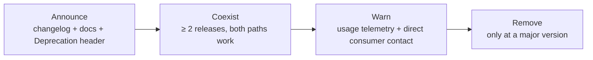

# Contract Strategy

> Status: Authoritative. Owner: Architecture.
> A contract is a promise you cannot quietly break. This document says which promises Atlas makes, to whom, and how they are allowed to change.

## 1. Contract tiers

Not all interfaces deserve the same protection. Over-protecting internals slows development; under-protecting externals breaks consumers.

| Tier | Examples | Compatibility promise | Change process |
|---|---|---|---|
| **T1 — External, versioned** | REST API, metadata ingestion envelope, event schemas, MCP surface, OpenLineage endpoint | Backward-compatible within a major version; 2-release deprecation before removal | ADR + consumer notification + migration guide |
| **T2 — Internal module interfaces** | `<module>/api.py`, `<module>/contracts.py` | Stable within a release; breaking changes coordinated in the same PR | Review by the owning module's owner |
| **T3 — Internal implementation** | `service.py`, `repository.py`, `models.py` | None | Free to change |
| **T4 — SDK contracts** | Connector SDK, Tool SDK | Semantic versioning; breaking changes only on a major | ADR + migration guide + deprecation period |

**The rule that keeps this honest:** a change to a T3 file that alters T1 or T2 observable behaviour is a T1/T2 change, regardless of which file it lives in.

## 2. Compatibility rules

### Allowed without a version bump

- Adding an optional request field with a safe default.
- Adding a response field (consumers must ignore unknown fields).
- Adding a new endpoint, event type, or enum value **that consumers can ignore**.
- Relaxing a validation constraint.
- Improving an error message without changing its code.

### Requires a new major version

- Removing or renaming any field.
- Changing a field's type or cardinality.
- Making an optional field required.
- Tightening a validation constraint.
- Changing the meaning of an existing value.
- Changing an error code.
- Changing default behaviour.

### The enum trap

Adding an enum value is safe **only if** consumers are documented and tested to ignore unknown values. Atlas documents this explicitly for every enum in a T1 contract, and the OpenAPI description states it. A consumer that switches exhaustively on an enum will break, and that is a contract failure even though the producer followed the rules.

## 3. Versioning schemes

| Contract | Scheme | Where the version lives |
|---|---|---|
| REST API | Path prefix `/v1/` | URL |
| Metadata envelope | `envelope_version` field | Payload |
| Events | `event_version` field + versioned topic name | Envelope and topic |
| MCP context products | Product version | Resource identifier |
| Connector SDK | Semantic version | Package |
| Tool parameter schemas | Tool version | Tool record |
| Semantic models, metrics, policies, model routes | Immutable object versions | Domain records |

> **Implementation status (2026-09-20).** The Events row is the target, not what runs. There is no `event_version` field: `serialize_event` in `src/aida/projectors/outbox_publisher.py` sends `event_id`, `event_type`, `aggregate_type`, `aggregate_id`, a nullable `organization_id`, `occurred_at` and `payload`, so the only version marker is the `.v1` suffix in most event-type names (10 of the 129 literal event types lack it as of 2026-09-20). There is no versioned topic per family either: every event goes to the single Kafka topic `aida.platform.events.v1` with the event type in a header, and there is no schema registry. See [the event catalog](04-event-catalog.md).

## 4. Deprecation process



| Rule | Detail |
|---|---|
| Minimum coexistence | 2 releases for T1/T4 |
| Sunset signalling | `Deprecation` and `Sunset` HTTP headers on deprecated endpoints |
| Usage telemetry | Removal requires evidence that usage has stopped, not just that time has passed |
| Migration guide | Mandatory for every T1/T4 removal |
| Emergency removal | Security only, with an incident record |

> **Implementation status (2026-09-20).** The `Deprecation` and `Sunset` headers are not emitted anywhere in `src/`. Deprecation today is an OpenAPI flag only: the three `/api/v1/organizations/{organization_id}/consumption-lineage/...` aliases (`src/aida/consumption_lineage_api.py`) carry `deprecated: true` in `Docs/90-reference/openapi-baseline.json` and send no header.

## 5. Contract testing

| Contract | Test |
|---|---|
| REST API | OpenAPI schema diff in CI; breaking change fails the build — **wired (2026-09-20)**: the `openapi-diff` job in `.github/workflows/ci.yml` runs `scripts/openapi_diff.py` against the committed `Docs/90-reference/openapi-baseline.json`, and a breaking change (removed path or operation, newly required field, narrowed enum, ...) fails unless `info.version` is bumped |
| Events | Schema-registry compatibility check (`BACKWARD` minimum) |
| Module interfaces | Import-linter contracts; type checks on public signatures |
| Envelope | Golden-payload fixtures across supported versions |
| SDK | Reference implementation test suite that a third party can run |
| Error codes | Enumerated and asserted stable |

The OpenAPI diff gate is the highest-value single test here: it makes an accidental breaking change impossible to merge without an explicit override.

## 6. Error contract

Errors are part of the contract. A consumer branching on an error code depends on it as much as on a field name.

```json
{
  "error": {
    "code": "POLICY_DENIED",
    "message": "Human-readable, safe to display",
    "correlation_id": "cor_...",
    "details": {"policy_version": "12", "resource_type": "table"},
    "retryable": false
  }
}
```

| Rule | Reason |
|---|---|
| Codes are stable identifiers | Consumers branch on them |
| Messages may change | They are for humans |
| `retryable` is explicit | Consumers must not infer it from the status code |
| `correlation_id` always present | Support and audit |
| **Denials do not leak which check failed in detail** | An attacker learns the control surface from verbose denials |
| `details` are bounded and value-free | INV-6 |

The tension in the last two rows is real: users need actionable refusals, and attackers must not get a map of the controls. The resolution is that the *reason code* is specific and the *detail* is bounded — "POLICY_DENIED with policy_version 12" is actionable without revealing which rule fired.

> **Implementation status (2026-09-20).** The envelope above is the target and is not what the API returns. Handled errors use FastAPI's default body, `{"detail": "<message>"}`: `GET /v1/datasources/<unknown id>` returns 404 `{"detail":"datasource not found"}`, and a request-validation failure returns 422 with `detail` as a list of `{type, loc, msg, input}` entries. A few routes put a structured object in `detail` with its own `code` (the governed-tool Ask 409 in `src/aida/api.py`). The `error` object appears only for unhandled 500s (`src/aida/main.py`) as `{"error": {"code": "INTERNAL_SERVER_ERROR", "message", "correlation_id"}}`, with no `details` or `retryable`. Every response carries an `X-Correlation-Id` header (supplied by the client or generated), so the correlation id is available as a header on errors that have no `correlation_id` in the body.

## 7. Contract ownership

| Contract | Owner | Reviewer |
|---|---|---|
| REST API conventions | Architecture | Product |
| Per-module HTTP surface | Module owner | Architecture |
| Event catalog | Architecture | Consumers |
| Metadata envelope | Data Platform | Architecture + external producers |
| MCP surface | AI Platform | Architecture + Security |
| Connector SDK | Data Platform | External adapter teams |
| Error taxonomy | Architecture | All |

## Related documents

- API conventions: `30-contracts/02-api-conventions.md`
- Module interfaces: `30-contracts/03-internal-module-contracts.md`
- Event catalog: `30-contracts/04-event-catalog.md`
- Ingestion envelope: `30-contracts/05-metadata-ingestion-envelope.md`
