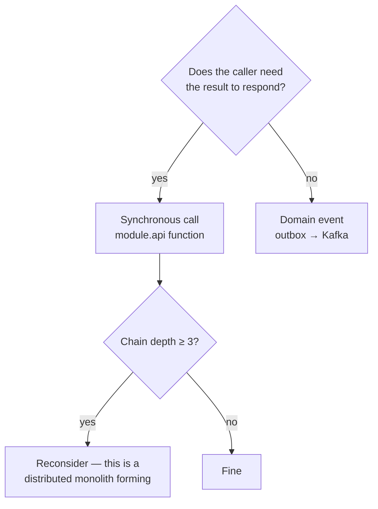

# Internal Module Contracts

> Status: Authoritative. Owner: Architecture.
> How modules talk to each other inside the monolith — and why the rules are strict even though there is no network between them.

## 1. Why internal contracts need rules

In a microservice system, the network enforces boundaries: you cannot accidentally import another service's ORM model. In a monolith, nothing stops you. The boundary therefore has to be enforced by tooling, and the tooling only works if the shape of a module is uniform.

Everything in this document exists so that `10-architecture/05-service-extraction-plan.md` step 3 — "swap the in-process adapter for a remote one" — is a small change rather than a rewrite.

## 2. The two public files

Each module exposes exactly two importable modules:

```text
<module>/api.py        — functions other modules call
<module>/contracts.py  — DTOs, enums, events, error types
```

Everything else — `service.py`, `repository.py`, `models.py`, `schemas.py`, `router.py`, `workers/` — is private. Enforced by import-linter (`module-privacy` contract).

## 3. Interface design rules

| Rule | Reason |
|---|---|
| **DTOs only, never ORM entities** | An ORM entity carries a session, lazy loaders, and the owning module's schema. Passing one couples lifetimes and makes extraction impossible. |
| Every function takes an explicit `TenantScope` | INV-5; no ambient tenancy |
| Return types are declared and immutable | Callers must not mutate another module's data |
| No callbacks into the caller | Prevents cycles; use events instead |
| Errors are typed, from `contracts.py` | Callers handle known failures, not stringly-typed ones |
| Functions are the unit, not classes | A function maps cleanly to an RPC method later |
| No optional side effects | A read function does not write |

## 4. DTO conventions

```python
# catalog/contracts.py
from dataclasses import dataclass
from typing import Literal

ObjectType = Literal["BASE_TABLE", "VIEW", "MATERIALIZED_VIEW", "EXTERNAL"]

@dataclass(frozen=True, slots=True)
class TableDTO:
    id: str
    organization_id: str
    datasource_id: str
    catalog_name: str
    schema_name: str
    name: str
    object_type: ObjectType
    is_active: bool
    fingerprint: str
    updated_at: datetime
```

| Rule | Reason |
|---|---|
| `frozen=True` | Immutability across the boundary |
| `slots=True` | Memory at 30M-row scale |
| No methods with domain logic | A DTO is data; logic stays in the owning module |
| No nested ORM types | Serializable by construction |
| Explicit tenancy fields | Callers can assert scope |
| Serializable without the database | This is what makes the remote adapter trivial |

## 5. Cross-module reference pattern

**Never** hold a foreign ORM object or a cross-schema foreign key (ADR-0015). Hold the ID and resolve through the interface.

```python
# semantics/models.py — private
class TableAnnotation(Base):
    __tablename__ = "table_annotation"
    __table_args__ = {"schema": "semantics"}
    id: Mapped[str] = mapped_column(primary_key=True)
    organization_id: Mapped[str]
    table_id: Mapped[str]          # catalog.table.id — NO ForeignKey
    ...
```

```python
# semantics/service.py
from atlas.modules.catalog import api as catalog_api

def describe(scope, annotation):
    table = catalog_api.get_table(scope, annotation.table_id)   # DTO
```

The cost is a lost SQL join. The benefit is that `semantics` can move to its own database without a data migration.

### Handling orphans

Because the database cannot enforce cross-module integrity, orphan handling is explicit:

| Situation | Behaviour |
|---|---|
| Referenced object deprecated | Referencing module receives the event and marks its record affected |
| Referenced object missing | Interface returns `None`; caller handles it as a domain case, never an exception |
| Systematic orphans | Reconciliation job detects and reports; exposed as a health metric |

## 6. Synchronous vs. event-driven



| Use synchronous when | Use events when |
|---|---|
| The result is part of the response | The effect is a side effect |
| Latency matters and the call is cheap | The consumer may be slow or absent |
| Failure should fail the request | Failure should retry independently |
| Example: catalog resolution during SQL validation | Example: projecting a catalog change into Neo4j |

**The depth-3 rule.** A synchronous chain three modules deep means the boundaries are wrong or the work should be an event. It is a design smell that reintroduces distributed-monolith latency inside one process.

## 7. The two cross-cutting exceptions

`17 policy-governance` and `20 observability-audit` may be called from any layer, because policy must be evaluable everywhere and audit must be writable everywhere.

Both are **safe exceptions** because:

- They never call back into a domain module — the graph stays acyclic.
- Their interfaces are narrow and stable.
- They are decide-only and append-only respectively.

No other module gets this exemption. A proposal to add a third cross-cutting module is a proposal to weaken the layering.

## 8. Testing across boundaries

| Test kind | Approach |
|---|---|
| Module unit tests | Run standalone; other modules replaced by in-memory fakes built from their `contracts.py` |
| Contract tests | The fake and the real implementation are tested against the same interface suite |
| Integration tests | Real modules, real database, per-module schemas |
| Import contracts | Import-linter in CI — **partially wired (2026-08-30)**: `lint-imports` runs in the `quality` job, but the four contracts in `pyproject.toml` cover the `identity_tenancy` scaffold, INV-2 gateway exclusivity, one leaf-module ratchet, and the lineage→gateway direction (C4/ST-11). The cross-module contracts this document depends on cannot exist until the modules do — see `10-architecture/04-module-decomposition.md` §5.2 |

**The fake-parity rule.** A fake that drifts from the real implementation produces green tests and a broken system. Both should be run against the same suite, so drift fails CI. **Planned, not built (2026-08-30):** there are no module `contracts.py` fakes to run parity against — `src/atlas/modules/identity_tenancy/contracts.py` is a 9-line stub — and no parity suite exists in `tests/`.

## 9. Extraction readiness

A module is extraction-ready when all are true:

1. Import-linter passes with zero exemptions.
2. Tests run standalone.
3. Its schema has no cross-schema FKs except into `identity`.
4. Its public interface has been stable for two releases.
5. All DTOs serialize without a database session.
6. No synchronous callback into a caller.
7. All cross-module effects that are not needed in the response are events.

These are the same conditions as `10-architecture/05-service-extraction-plan.md` §5, stated at code level.

## Related documents

- Module decomposition: `10-architecture/04-module-decomposition.md`
- Service extraction: `10-architecture/05-service-extraction-plan.md`
- Coding standards: `40-engineering/03-coding-standards.md`
