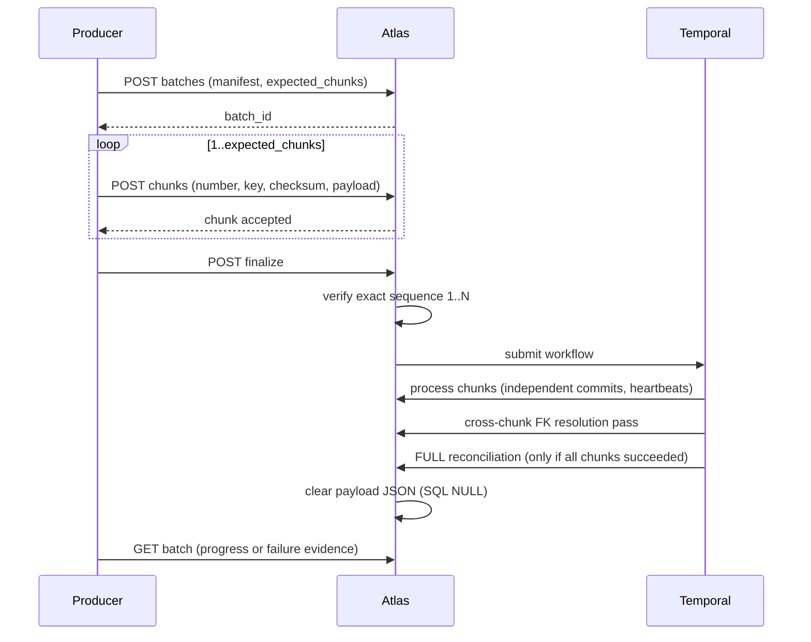

# Metadata Ingestion Envelope

> Status: Authoritative, T1 external contract. Owner: Data Platform. Current version: `1.1`. **`1.0` remains accepted, unchanged, permanently.**
> One envelope for every transport: native pull, authenticated push, source-side agent, and future broker intake (ADR-0012).

> **Implementation status (2026-09-20).** `1.1` is implemented for the view, routine, object-comment and grant axes (`src/aida/schemas.py`, `src/aida/envelope_models.py`, `src/aida/ingestion.py`, migrations `a1c9f4b7e230` and `d5f8b21c4a03`). Index and partition inventory, listed against 1.1 in earlier drafts of §10, is **not** an envelope axis: the push envelope has no field for either. It is delivered on the pull path only (tracker `CN-8`): the `metadata_index` and `metadata_partition` tables are filled from what an adapter's `discover()` returns, for the adapters that advertise `indexes` and `partitions` (PostgreSQL and Oracle as of 2026-09-20; see the [engine capability matrix](../90-reference/engine-capability-matrix.md)), and are read at `GET /v1/tables/{table_id}/indexes` and `GET /v1/tables/{table_id}/partitions`. Native pull for views, routines and object comments is implemented in **all six** connectors (PostgreSQL, SQL Server, Oracle, BigQuery, Snowflake and Databricks), with two honest exceptions for grants: BigQuery advertises `grants: false` because BigQuery has no SQL grants, and Databricks advertises `grants: false` because Unity Catalog's privilege model is not the SQL grant model (INV-9). The push transport accepts 1.1 from any producer regardless of connector. The pull path persists the new axes: the `discover_datasource` activity in `src/aida/workflows/activities.py` calls `persist_envelope_extensions` (`src/aida/ingestion.py`), so all three transports store them. *An earlier revision of this callout said the pull path was unwired; that was true when written and is no longer.* Detail and evidence: `Docs/review-2026-08/gap/07-envelope-v11.md` (contract, storage, PostgreSQL, SQL Server) and `Docs/review-2026-08/gap/08-envelope-v11-connectors.md` (Oracle, Snowflake, BigQuery).

## 1. Why one envelope

Four transports, one persistence path. Object identity, drift detection, privacy filtering, and graph projection behave identically regardless of how metadata arrived — so a fix applies everywhere, and a new transport is an adapter rather than a new persistence design.

## 2. Envelope 1.0

```json
{
  "envelope_version": "1.0",
  "idempotency_key": "cmdb:2026-08-27:0001",
  "producer": "bank-metadata-bridge",
  "transport": "PUSH",
  "snapshot_type": "INCREMENTAL",
  "emitted_at": "2026-08-27T20:00:00Z",
  "catalogs": [
    {
      "name": "bank",
      "attributes": {"region": "us-east"},
      "schemas": [
        {
          "name": "customer",
          "tables": [
            {
              "name": "account",
              "object_type": "BASE_TABLE",
              "columns": [
                {
                  "name": "account_id",
                  "ordinal_position": 1,
                  "physical_type": "bigint",
                  "nullable": false
                }
              ],
              "constraints": [
                {
                  "name": "account_pk",
                  "constraint_type": "PRIMARY_KEY",
                  "columns": ["account_id"]
                }
              ]
            }
          ]
        }
      ]
    }
  ]
}
```

## 2.1 Envelope 1.1 — the four axes it adds

1.1 is **purely additive**. Every field below is optional, every 1.0 payload validates unchanged, and a producer written against 1.0 keeps working with no edit, forever. `envelope_version` also still *defaults* to `"1.0"`, so a producer that never sent the field is not silently promoted.

The axes exist because four questions could not be answered from a 1.0 snapshot: what a view is actually computed from, what a stored procedure does, what the source's own authors wrote about an object, and who the source already lets read it. The first two are the input to view-DDL lineage parsing and procedure parsing; the third is the strongest meaning signal an estate carries for free; the fourth is evidence for reviewing a workspace source binding.

```json
{
  "envelope_version": "1.1",
  "idempotency_key": "cmdb:2026-08-30:0001",
  "producer": "bank-metadata-bridge",
  "transport": "PUSH",
  "snapshot_type": "INCREMENTAL",
  "emitted_at": "2026-08-30T20:00:00Z",
  "catalogs": [
    {
      "name": "bank",
      "source_description": "the consumer banking warehouse",
      "schemas": [
        {
          "name": "customer",
          "source_description": "deposit subject area",
          "tables": [
            {
              "name": "open_account",
              "object_type": "VIEW",
              "source_description": "accounts that are still open",
              "view_definition": {
                "definition_sql": "SELECT account_id FROM customer.account WHERE closed_on IS NULL",
                "is_materialized": false,
                "is_updatable": true,
                "check_option": "NONE",
                "truncated": false,
                "unavailable_reason": null
              },
              "columns": [
                {
                  "name": "account_id",
                  "ordinal_position": 1,
                  "physical_type": "bigint",
                  "nullable": false,
                  "source_description": "surrogate key of the deposit account"
                }
              ]
            }
          ],
          "routines": [
            {
              "name": "close_account",
              "routine_type": "PROCEDURE",
              "language": "plpgsql",
              "body_sql": "BEGIN UPDATE customer.account SET closed_on = now() WHERE account_id = p_account_id; END;",
              "return_type": null,
              "is_deterministic": false,
              "security_mode": "DEFINER",
              "source_description": null,
              "truncated": false,
              "unavailable_reason": null,
              "parameters": [
                {
                  "name": "p_account_id",
                  "ordinal_position": 1,
                  "mode": "IN",
                  "physical_type": "bigint",
                  "default_expression": null
                }
              ],
              "attributes": {}
            }
          ],
          "grants": [
            {
              "grantee": "risk_reader",
              "grantee_type": "ROLE",
              "privilege": "SELECT",
              "object_type": "TABLE",
              "object_name": "account",
              "schema_name": "customer",
              "is_grantable": false
            }
          ]
        }
      ]
    }
  ]
}
```

### New field semantics

| Field | Where | Required | Semantics |
|---|---|:--:|---|
| `source_description` | catalog, schema, table, column | No | The description the **source** carries. Evidence, not authority: a steward-authored or model-proposed description outranks it. ≤ 10,000 chars |
| `view_definition` | table | No | Present only for views and materialized views. See below |
| `view_definition.definition_sql` | | No | The defining text, verbatim. `null` means **unavailable**, never empty |
| `view_definition.is_materialized` | | No | Default `false` |
| `view_definition.is_updatable` | | No | Tri-state: `true` \| `false` \| `null` (source did not say) |
| `view_definition.check_option` | | No | `NONE` \| `LOCAL` \| `CASCADED`, source-reported |
| `view_definition.truncated` | | No | `true` if the source returned a prefix. Default `false` |
| `view_definition.unavailable_reason` | | Conditional | **Required when `definition_sql` is `null`; forbidden otherwise** |
| `routines[]` | schema | No | Stored procedures and functions. ≤ 10,000 per schema, ≤ 50,000 per envelope |
| `routines[].routine_type` | | Yes | `FUNCTION` \| `PROCEDURE` \| `PACKAGE` (R11-FP03; a package is never presented as a callable function) |
| `routines[].attributes.package_name` | | No | R11-FP03: the package a member subprogram belongs to. Part of the routine's identity, so a member and a standalone routine of the same name and signature are two routines. A member's `body_sql` is null with a reason: its source is the package's |
| `routines[].attributes.native_subtype` | | No | R11-FP03: the engine's finer kind beside `routine_type`, for example SQL Server `SCALAR`, `INLINE_TABLE`, `MULTI_STATEMENT_TABLE` or BigQuery `SCALAR_FUNCTION` (at most 30 characters) |
| `routines[].body_sql` | | No | The body, verbatim. `null` means **unavailable**, never empty |
| `routines[].unavailable_reason` | | Conditional | **Required when `body_sql` is `null`; forbidden otherwise** |
| `routines[].security_mode` | | No | `DEFINER` \| `INVOKER` |
| `routines[].parameters[]` | | No | Ordered; `ordinal_position` unique within a routine; `mode` is `IN` \| `OUT` \| `INOUT` \| `VARIADIC` \| `TABLE` |
| `routines[].attributes` | | No | Same bounds and same value-free screening as every other attribute bag (§7) |
| `grants[]` | schema | No | Source-side privileges. ≤ 100,000 per schema |
| `grants[].grantee_type` | | No | `USER` \| `ROLE` \| `GROUP` \| `PUBLIC`. Default `ROLE` |
| `grants[].object_type` | | No | `TABLE` \| `VIEW` \| `PROCEDURE` \| `FUNCTION` \| `PACKAGE` \| `SCHEMA` \| `SEQUENCE`. Default `TABLE` |
| `grants[].is_grantable` | | No | `WITH GRANT OPTION`. Default `false` |

### Unavailable is not empty

The single rule the 1.1 storage model is shaped around:

| The source… | `definition_sql` / `body_sql` | `truncated` | `unavailable_reason` |
|---|---|:--:|---|
| gave the full text | the text | `false` | `null` |
| gave a prefix | the prefix | `true` | `null` |
| **would not give it** | **`null`** | `false` | **required** |
| has nothing to give | `""` | `false` | `null` |

A null definition with no reason is **rejected**, not accepted. An unexplained null is indistinguishable from a connector defect six months later, and a downstream parser that cannot tell "not allowed to read it" from "there is nothing to read" reports a confident absence of lineage for a view it never saw.

### Grants are evidence, never authority

Nothing in `grants[]` grants anything in this platform. The policy engine does not read it, no authorization decision consults it, and ADR-0018 keeps authority in the platform's own access policies. The axis exists so that "who can already see this in the source" is answerable and so a workspace source binding can be reviewed against what the source itself permits.

`DENY`-style negative privileges are **not** modelled. Representing revocation would need a resolution rule that nothing downstream consumes yet, and a half-represented DENY reads as an absent one.

### Version discipline

| Case | Behaviour |
|---|---|
| `envelope_version: "1.0"`, no 1.1 fields | Accepted, behaves exactly as before. Permanent |
| `envelope_version: "1.1"`, any content | Accepted |
| `envelope_version: "1.0"` **carrying 1.1 fields** | **422**, naming every offending field |
| `envelope_version` omitted | Treated as `"1.0"` |
| Batch chunks | Carry no version of their own; validated against the manifest's `envelope_version` at upload |

Declaring 1.0 while sending 1.1 content is rejected rather than silently stripped. A producer that ships view definitions and receives `201` has every reason to expect lineage to follow, and would discover otherwise only months later by noticing an absence.

## 3. Field semantics

| Field | Required | Semantics |
|---|:--:|---|
| `envelope_version` | No | Contract version, `1.0` \| `1.1`; defaults to `1.0` when omitted (see Version discipline). Backward-compatible evolution only. |
| `idempotency_key` | Yes | Unique per datasource. Same key + same payload → original job. Same key + different payload → **409**. |
| `producer` | Yes | Producer identity. Signed producer identity is planned. |
| `transport` | No (target: Yes) | Accepted today: `PUSH` (the default) \| `STREAM`. `PULL` and `AGENT` are design values that the endpoint rejects |
| `snapshot_type` | No (target: Yes) | `FULL` \| `INCREMENTAL`. **An omitted value means `INCREMENTAL`**, on the synchronous endpoint and on the batch manifest alike; `FULL` applies only when the producer sends it (see the note in §4) |
| `emitted_at` | Yes | Producer-side timestamp (RFC 3339 UTC) |
| `catalogs[]` | Yes | Nested inventory |
| `attributes` | No | Scalar, bounded, ≤ 50 per object |

## 4. Snapshot semantics — the part that matters most

| Type | Behaviour |
|---|---|
| `INCREMENTAL` | Creates and updates objects present in the envelope. **Never retires omitted objects.** The safe choice, and the default: an omitted `snapshot_type` means `INCREMENTAL`. |
| `FULL` | Authoritative for the complete datasource scope. Soft-deprecates active objects omitted from the envelope. **Explicit only:** `FULL` is applied only when the producer sends it, and that explicit value is the whole of the confirmation. The server asks for no second step (see the note below). |

> **Implementation status (2026-09-20).** `POST /v1/datasources/{datasource_id}/metadata-ingestions` (`MetadataIngestionCreate` in `src/atlas/modules/ingestion/schemas.py`) defaults an omitted `snapshot_type` to `INCREMENTAL`, the same default the batch manifest (`MetadataIngestionBatchCreate`) already had; it used to default to `FULL`, so a producer that left the field out sent an authoritative snapshot that soft-deprecated every active object it omitted (tracker `R11-AUD05`). A snapshot that retires what it omits is therefore applied only when the producer writes `"snapshot_type": "FULL"`, and that explicit value is the confirmation: the server has no confirmation field and no second step, and adds none. Only the default moved: the field is still optional, its two values are unchanged, and every request body that validated before still does; `transport` still defaults to `PUSH`. For the 1.1 axes `FULL` also needs the envelope to declare version `1.1`, as the next paragraph says. Two consequences a producer can observe. A producer that relied on the old default to retire omissions must now send `FULL`. And the payload fingerprint covers `snapshot_type`, so an idempotency key first used by a body that omitted it (and so ran as `FULL`) and replayed after this change fingerprints as `INCREMENTAL` and answers **409** rather than returning the original job: refused, not re-applied as a snapshot the producer never asked for. `tests/test_ingestion_snapshot_default.py` pins the default on both entry points, that an omitting request through the application retires nothing while an explicit `FULL` still does, and the replay behaviour.

**A `FULL` 1.0 envelope is authoritative for the 1.0 inventory only.** It carries no statement about views, routines, descriptions or grants, so its silence is not omission and the 1.1 axes are left alone. Reconciliation of the 1.1 axes is gated on the declared version *and* on `FULL`, so a producer that rolls back to 1.0 for a release does not wipe the estate's view definitions. The same chunk accumulation rule below applies to the 1.1 axes, through the same mechanism.

**The critical rule for batched `FULL`:** a `FULL` batch accumulates stable object identities across every chunk and runs omission reconciliation **only after all chunks have succeeded**. It can never retire metadata from a partial delivery.

Without this rule, a network failure halfway through a large `FULL` delivery would soft-delete the metadata that did not arrive — data loss caused by a transient error. This is the single most important correctness property in the ingestion path.

## 5. Atomicity and locking

| Property | Behaviour |
|---|---|
| Lock | Deliveries acquire a datasource row lock, serializing competing snapshots for one source without blocking others |
| Atomicity | Delivery record, catalog changes, and the graph snapshot event commit in one transaction |
| Fingerprints | SHA-256 over canonical JSON |
| Payload retention | Raw payloads are **not retained** in the ingestion job after success |

## 6. Bounds

| Boundary | Default | Adjustable |
|---|---|---|
| Synchronous envelope | 100 catalogs / 50,000 tables / 250,000 columns / 50,000 routines | Down only |
| Batch | 1,000 chunks / 1,000,000 tables / 5,000,000 columns | Down only |
| Attributes per object | 50, scalar, bounded | Down only |
| Request size (local proxy) | 64 MiB on the two routes that carry an envelope (`POST .../metadata-ingestions` and `POST .../chunks`); nginx's own default (1 MiB) on every other `/v1/` route; see the note below | `ui-next/nginx.conf` |

> **Implementation status (2026-09-20).** The 40 MiB figure this row used to carry came from the legacy `ui/` portal's `nginx.conf` (`client_max_body_size 40m`, removed with that portal in `0f8a4c4`); `ui-next/nginx.conf`, its replacement, never had it and set `client_max_body_size` only on `/mcp` (8 MiB) and `/graphql` (128 KiB), so nginx's 1 MiB default applied to every `/v1/` route, the ingestion routes included: measured on 2026-09-20, a 2 MiB body answered 413 through the UI proxy on `:3001` while the same body reached authentication (401) on the API's own port (tracker `R11-AUD05`). The file now gives `POST /v1/datasources/{id}/metadata-ingestions` and `POST /v1/metadata-ingestion-batches/{id}/chunks` a location of their own with `client_max_body_size 64m`, and every other `/v1/` route still gets 1 MiB. The 64 MiB is derived from the bounds above, because the ingestion code has no byte limit: a chunk is validated through the same model as a synchronous push, so both routes share one ceiling per request body, 50,000 tables and 250,000 columns (`SYNC_MAX_TABLES` and `SYNC_MAX_COLUMNS` in `src/atlas/modules/ingestion/schemas.py`). A body at those caps serialises to about 54 MiB with 32-character identifiers and every optional field written out, and 64 MiB leaves about 19 % for descriptions and whitespace. The batch bounds (1,000 chunks, 1,000,000 tables, 5,000,000 columns) cap the total across chunks, not any one request, so they do not enter the figure. A body that carries routine text (up to 1,000,000 characters a routine) or long descriptions can exceed 64 MiB, and belongs in more chunks. The limit exists only in the proxy: a request sent straight to the API has no byte limit, and the bounds above are then the only ones. Because nginx buffers and forwards a body before the API authenticates anything, 64 MiB is also what one unauthenticated request to those two routes may now cost through the proxy. `scripts/check_proxy_contract.py` (CI job `quality`) resolves each route through nginx's location rules and fails if either envelope route gets less than 64 MiB, more than 128 MiB or an unlimited body (`0`), or if any other `/v1/` route gets more than 1 MiB; `tests/test_proxy_body_limits.py` binds that script's route list to the application's route table and its floor to the synchronous caps; the `ui-proxy` CI job posts bodies of 2, 40 and 64 MiB, and of 64 MiB plus one byte, to the two routes, and of 1 and 2 MiB to ordinary `/v1/` routes, through the real nginx image.

Larger estates use the durable batch contract (§8). Cumulative table and column admission is enforced **under the batch lock during every upload** and rechecked before processing — so a batch cannot exceed its bound by racing uploads.

## 7. Validation and privacy

Validated before persistence: nested names, sizes, object types, constraint types, foreign-key cardinality, local-column references, duplicate columns, duplicate ordinals.

Additionally for 1.1: routine type and parameter mode enumerations, duplicate routine-parameter ordinals, grantee and privilege shape, the availability rule above (a null definition or body must carry a reason; a reason must not accompany a present one), and the declared-version rule. A malformed 1.1 field is a **422**, never a silently dropped field.

**Rejected outright:** attribute keys associated with samples, row values, passwords, secrets, tokens, or credentials (INV-6).

Technical default expressions and descriptions are permitted but bounded. **Producers remain responsible for excluding literal regulated values** — the platform rejects what it can detect, but a description field containing a customer name is a producer defect.

## 8. Durable batch contract

For estates above the synchronous boundary.



| Rule | Detail |
|---|---|
| Batch key | Unique per datasource |
| Chunk number and key | Unique within the batch |
| Replay | Exact replay returns original records; reuse with different content → 409 |
| Finalization | Allowed only when the exact sequence `1..expected_chunks` exists |
| Independence | Chunks commit independently, so retry resumes rather than restarts |
| Idempotency | Object fingerprints make reapplication safe |
| Cross-chunk FKs | A second value-free pass resolves FKs whose referenced table arrived in another chunk |
| Failure | Validated chunk payloads retained for authorized retry; replacement run linked via `resumed_from_run_id` |
| Temporal unavailable | **Fails closed** — no stranded pseudo-queued job |

## 9. API surface

| Method | Path | Purpose |
|---|---|---|
| GET | `/v1/connectors/capability-matrix` | Honest implementation, maturity, transport, version inventory |
| POST | `/v1/datasources/{id}/metadata-ingestions` | Validate and atomically apply an envelope |
| GET | `/v1/datasources/{id}/metadata-ingestions` | Delivery and change evidence |
| POST | `/v1/datasources/{id}/metadata-ingestion-batches` | Create an idempotent manifest |
| GET | `/v1/datasources/{id}/metadata-ingestion-batches` | Batch progress and completion evidence |
| POST | `/v1/metadata-ingestion-batches/{id}/chunks` | Upload a checksum-addressed chunk |
| GET | `/v1/metadata-ingestion-batches/{id}/chunks` | Chunk status and checksums — **payload never exposed** |
| POST | `/v1/metadata-ingestion-batches/{id}/finalize` | Seal and submit |
| GET | `/v1/metadata-ingestion-batches/{id}` | Poll workflow progress or failure evidence |
| POST | `/v1/datasources/{id}/connector-certifications` | Persist conformance evidence |
| GET | `/v1/datasources/{id}/connector-certifications` | Certification history |

Roles: `PlatformAdmin`, `MetadataAdmin`, `DataAdmin`, or the workload-oriented `MetadataIngestor`. All mutations write audit and outbox records.

> **Implementation status (2026-09-20).** The push routes name `MetadataIngestor` in their role checks, but it is not in `PLATFORM_ROLES` (`src/aida/oidc.py`), and under OIDC only roles in that set can be granted through `oidc_role_mappings`. A workload identity therefore cannot carry `MetadataIngestor` in a deployment that uses OIDC; it works only under the development identity, where `X-Roles` accepts any string. A producer in a real deployment has to hold `PlatformAdmin`, `MetadataAdmin` or `DataAdmin`.

## 10. Planned evolution

| Version | Adds | State |
|---|---|---|
| 1.1 | View definitions; routines and their parameters; source-side object descriptions; source-side grants | **Shipped 2026-08-30** |
| 1.1+ | Index and partition inventory — deferred out of 1.1, tracked as `CN-8` | Pull path only: `metadata_index` and `metadata_partition` are populated and served (PostgreSQL and Oracle adapters). The push envelope field: not started |
| 1.2 | BI assets (dashboards, reports); pipeline and topic assets | Not started |
| 1.3 | File and API assets; ML model assets | Not started |
| 2.0 | Only if a breaking change becomes unavoidable | — |

All evolution is backward-compatible within a major version, governed by the schema-registry compatibility policy.

## Related documents

- Envelope 1.1 record and evidence: `review-2026-08/gap/07-envelope-v11.md`
- Ingestion module: `20-modules/03-ingestion.md`
- ADR-0012: `10-architecture/adr/ADR-0012-single-metadata-envelope.md`
