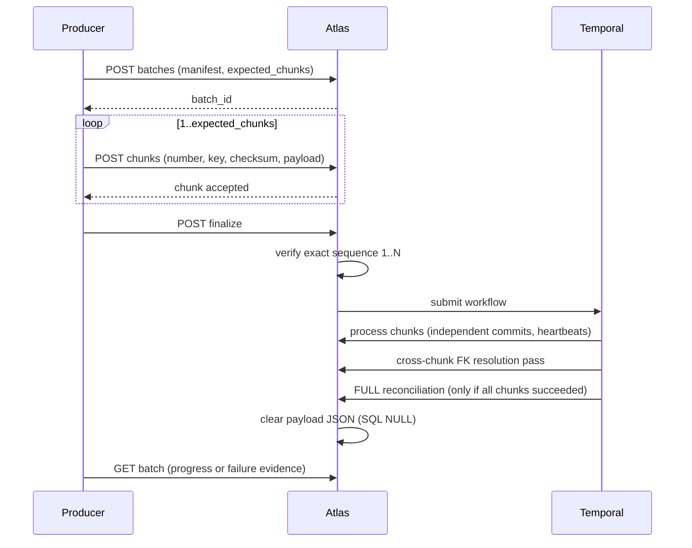

# Metadata Ingestion Envelope

> Status: Authoritative, T1 external contract. Owner: Data Platform. Current version: `1.0`.
> One envelope for every transport: native pull, authenticated push, source-side agent, and future broker intake (ADR-0012).

## 1. Why one envelope

Four transports, one persistence path. Object identity, drift detection, privacy filtering, and graph projection behave identically regardless of how metadata arrived — so a fix applies everywhere, and a new transport is an adapter rather than a new persistence design.

## 2. Envelope 1.0

```json
{
  "envelope_version": "1.0",
  "idempotency_key": "cmdb:2026-08-27:0001",
  "producer": "bank-metadata-bridge",
  "transport": "PUSH",
  "snapshot_type": "INCREMENTAL",
  "emitted_at": "2026-08-27T20:00:00Z",
  "catalogs": [
    {
      "name": "bank",
      "attributes": {"region": "us-east"},
      "schemas": [
        {
          "name": "customer",
          "tables": [
            {
              "name": "account",
              "object_type": "BASE_TABLE",
              "columns": [
                {
                  "name": "account_id",
                  "ordinal_position": 1,
                  "physical_type": "bigint",
                  "nullable": false
                }
              ],
              "constraints": [
                {
                  "name": "account_pk",
                  "constraint_type": "PRIMARY_KEY",
                  "columns": ["account_id"]
                }
              ]
            }
          ]
        }
      ]
    }
  ]
}
```

## 3. Field semantics

| Field | Required | Semantics |
|---|:--:|---|
| `envelope_version` | Yes | Contract version. Backward-compatible evolution only. |
| `idempotency_key` | Yes | Unique per datasource. Same key + same payload → original job. Same key + different payload → **409**. |
| `producer` | Yes | Producer identity. Signed producer identity is planned. |
| `transport` | Yes | `PULL` \| `PUSH` \| `AGENT` \| `STREAM` |
| `snapshot_type` | Yes | `FULL` \| `INCREMENTAL` |
| `emitted_at` | Yes | Producer-side timestamp (RFC 3339 UTC) |
| `catalogs[]` | Yes | Nested inventory |
| `attributes` | No | Scalar, bounded, ≤ 50 per object |

## 4. Snapshot semantics — the part that matters most

| Type | Behaviour |
|---|---|
| `INCREMENTAL` | Creates and updates objects present in the envelope. **Never retires omitted objects.** Safe default. |
| `FULL` | Authoritative for the complete datasource scope. Soft-deprecates active objects omitted from the envelope. **Requires explicit confirmation** in the UI. |

**The critical rule for batched `FULL`:** a `FULL` batch accumulates stable object identities across every chunk and runs omission reconciliation **only after all chunks have succeeded**. It can never retire metadata from a partial delivery.

Without this rule, a network failure halfway through a large `FULL` delivery would soft-delete the metadata that did not arrive — data loss caused by a transient error. This is the single most important correctness property in the ingestion path.

## 5. Atomicity and locking

| Property | Behaviour |
|---|---|
| Lock | Deliveries acquire a datasource row lock, serializing competing snapshots for one source without blocking others |
| Atomicity | Delivery record, catalog changes, and the graph snapshot event commit in one transaction |
| Fingerprints | SHA-256 over canonical JSON |
| Payload retention | Raw payloads are **not retained** in the ingestion job after success |

## 6. Bounds

| Boundary | Default | Adjustable |
|---|---|---|
| Synchronous envelope | 100 catalogs / 50,000 tables / 250,000 columns | Down only |
| Batch | 1,000 chunks / 1,000,000 tables / 5,000,000 columns | Down only |
| Attributes per object | 50, scalar, bounded | Down only |
| Request size (local proxy) | 40 MiB | — |

Larger estates use the durable batch contract (§8). Cumulative table and column admission is enforced **under the batch lock during every upload** and rechecked before processing — so a batch cannot exceed its bound by racing uploads.

## 7. Validation and privacy

Validated before persistence: nested names, sizes, object types, constraint types, foreign-key cardinality, local-column references, duplicate columns, duplicate ordinals.

**Rejected outright:** attribute keys associated with samples, row values, passwords, secrets, tokens, or credentials (INV-6).

Technical default expressions and descriptions are permitted but bounded. **Producers remain responsible for excluding literal regulated values** — the platform rejects what it can detect, but a description field containing a customer name is a producer defect.

## 8. Durable batch contract

For estates above the synchronous boundary.



| Rule | Detail |
|---|---|
| Batch key | Unique per datasource |
| Chunk number and key | Unique within the batch |
| Replay | Exact replay returns original records; reuse with different content → 409 |
| Finalization | Allowed only when the exact sequence `1..expected_chunks` exists |
| Independence | Chunks commit independently, so retry resumes rather than restarts |
| Idempotency | Object fingerprints make reapplication safe |
| Cross-chunk FKs | A second value-free pass resolves FKs whose referenced table arrived in another chunk |
| Failure | Validated chunk payloads retained for authorized retry; replacement run linked via `resumed_from_run_id` |
| Temporal unavailable | **Fails closed** — no stranded pseudo-queued job |

## 9. API surface

| Method | Path | Purpose |
|---|---|---|
| GET | `/v1/connectors/capability-matrix` | Honest implementation, maturity, transport, version inventory |
| POST | `/v1/datasources/{id}/metadata-ingestions` | Validate and atomically apply an envelope |
| GET | `/v1/datasources/{id}/metadata-ingestions` | Delivery and change evidence |
| POST | `/v1/datasources/{id}/metadata-ingestion-batches` | Create an idempotent manifest |
| GET | `/v1/datasources/{id}/metadata-ingestion-batches` | Batch progress and completion evidence |
| POST | `/v1/metadata-ingestion-batches/{id}/chunks` | Upload a checksum-addressed chunk |
| GET | `/v1/metadata-ingestion-batches/{id}/chunks` | Chunk status and checksums — **payload never exposed** |
| POST | `/v1/metadata-ingestion-batches/{id}/finalize` | Seal and submit |
| GET | `/v1/metadata-ingestion-batches/{id}` | Poll workflow progress or failure evidence |
| POST | `/v1/datasources/{id}/connector-certifications` | Persist conformance evidence |
| GET | `/v1/datasources/{id}/connector-certifications` | Certification history |

Roles: `PlatformAdmin`, `MetadataAdmin`, `DataAdmin`, or the workload-oriented `MetadataIngestor`. All mutations write audit and outbox records.

## 10. Planned evolution

| Version | Adds |
|---|---|
| 1.1 | Index and partition inventory; view and procedure definitions |
| 1.2 | BI assets (dashboards, reports); pipeline and topic assets |
| 1.3 | File and API assets; ML model assets |
| 2.0 | Only if a breaking change becomes unavoidable |

All evolution is backward-compatible within a major version, governed by the schema-registry compatibility policy.

## Related documents

- Ingestion module: `20-modules/03-ingestion.md`
- ADR-0012: `10-architecture/adr/ADR-0012-single-metadata-envelope.md`
