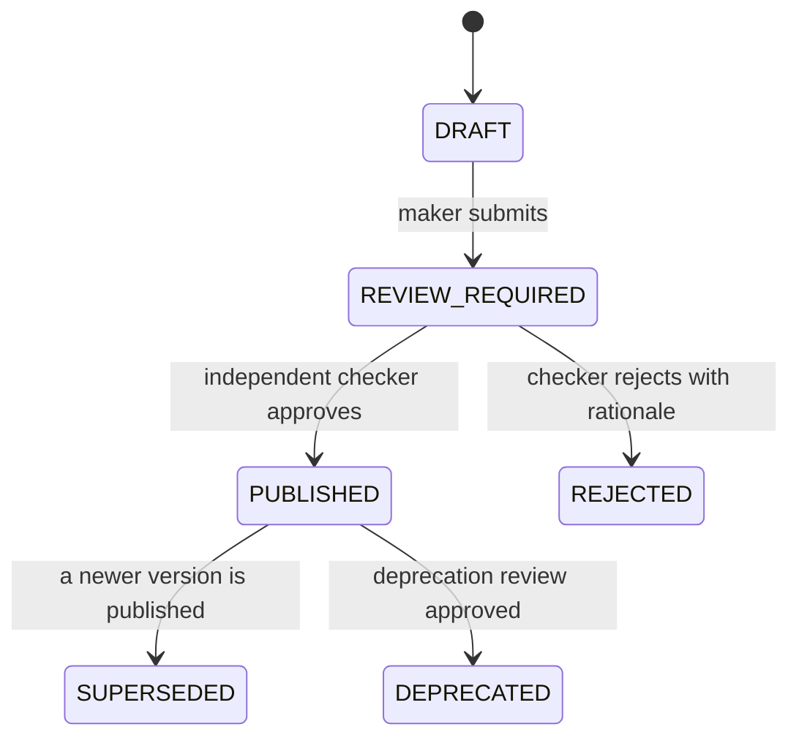

# Tool and Agent Contract

> Status: Authoritative, T1/T4 contract. Owner: AI Platform.
> Defines what a governed tool is, how it is invoked, and what an agent — internal or external — may do.

## 1. Tool definition

```json
{
  "id": "tool_exposure_by_counterparty",
  "version": 3,
  "name": "Exposure by counterparty",
  "description": "Total exposure per counterparty for a given LOB as of a date.",
  "status": "PUBLISHED",
  "organization_id": "org_...",
  "parameters": [
    {"name": "as_of_date", "type": "date", "required": true},
    {"name": "lob_code", "type": "string", "required": true, "enum_source": "lob_reference"},
    {"name": "min_amount", "type": "decimal", "required": false, "default": 0}
  ],
  "returns": {
    "kind": "table",
    "columns": [
      {"name": "counterparty_id", "type": "string"},
      {"name": "exposure_amount", "type": "decimal"}
    ]
  },
  "bindings": {"roles": ["RiskAnalyst", "RiskReviewer"], "agents": ["atlas.analyst"]},
  "dependencies": ["tbl_positions", "tbl_counterparty"],
  "semantic_version_pin": 44,
  "certification": {"status": "CERTIFIED", "certified_at": "2026-07-01", "expires_at": "2027-07-01"}
}
```

> **Implementation status (2026-09-20).** The JSON above is the design view of a tool. The stored tool version (`POST /v1/projects/{project_id}/tools`, read back as `GovernedToolVersionRead` in `src/aida/schemas.py`) has `slug`, `version`, `status`, `name`, `description`, `datasource_id`, `semantic_model_version_id` (the semantic pin), `sql_template`, `parameters`, `allowed_roles`, `referenced_tables` (the dependencies) and `fingerprint`. It has no `returns` schema, no per-agent `bindings` (roles only), and no embedded `certification` object; certification is read at `GET /v1/tools/{tool_id}/certification-status`. Parameter `type` values and `enum_source` are corrected in §2.

## 2. Parameter type system

| Type (`parameter_type`) | Validation |
|---|---|
| `STRING` | `max_length` bound (at most 10,000); optional `allowed_values` |
| `INTEGER`, `NUMBER` | `minimum` and `maximum` bounds; optional `allowed_values`; `NUMBER` must be finite |
| `DATE` | ISO 8601 date |
| `BOOLEAN` | — |

Every parameter also carries `required`, an optional `default`, and a `sensitive` flag; `allowed_values` is a static list of at most 500 entries, and the name must match `^[a-z][a-z0-9_]{0,63}$` (`ToolParameterDefinition` in `src/aida/schemas.py`, checked by `src/aida/tool_rendering.py`).

> **Implementation status (2026-09-20).** The design's `decimal`, `timestamp`, `enum` and `array<T>` types and its `enum_source` binding to governed reference data are not implemented. A fixed set of permitted values is expressed with `allowed_values`, and a decimal is a `NUMBER`.

**Not supported, deliberately:** free-form SQL fragments, table names as parameters, column lists as parameters, or any parameter that changes the *shape* of the query. Those would make the tool's SQL dynamic, which would put the model or the caller back in the authoring seat.

## 3. Invocation contract

```http
POST /v1/tool-versions/{version_id}/execute
{
  "parameters": {"as_of_date": "2026-06-30", "lob_code": "MARKETS"},
  "max_rows": 1000
}
```

The version is the path (`POST /v1/tools/{tool_id}/invocations` was the original design name and does not exist). The body carries `parameters` and an optional `max_rows`; the response is `ToolExecutionResponse`: the tool execution and version ids, the query execution, and the quality gate outcome. There is no `purpose` field on this route, and the REST route takes no idempotency key; the GraphQL mutation `executeGovernedTool` does.

Execution guarantees:

| Guarantee | Mechanism |
|---|---|
| Type validation before execution | Rejected at the boundary |
| **AST literal binding** | Values bound into the parsed tree — injection is impossible by construction, not by escaping |
| No dynamic SQL | Tool SQL is fixed at version publication |
| **Gateway execution** | Tools do **not** bypass the query gateway (INV-2) |
| Policy evaluation | Per referenced object, at invocation |
| Masking | Applied to results by classification |
| Evidence | Invocation, execution, and lineage recorded |
| Bounded | Row, cost or byte, and time caps set in gateway settings (there is no per-workload-class cap: see [the query gateway](../20-modules/16-query-gateway.md) §5) |

## 4. Tool lifecycle



Maker ≠ checker is platform-enforced (INV-8). A rejected submission is marked `REJECTED` and does not return to draft (only a `DRAFT` can be submitted), so a fix is a new version; the checker's rationale is kept on the governance review.

> **Implementation status (2026-09-20).** These are the states the code uses (`src/aida/tool_api.py`, `src/aida/semantic_api.py`). The design's `TESTED` and `SUBMITTED` states and its `RETIRED` state do not exist: submission is `POST /v1/tool-versions/{version_id}/submit`, deprecation is a second maker-checker review (`POST /v1/tool-versions/{version_id}/deprecation-submit`), and a draft can be submitted without a prior test state (certification runs, `POST /v1/tool-versions/{version_id}/certification-runs`, are a separate step). Publishing a version marks the tool's previous `PUBLISHED` version `SUPERSEDED`, so exactly one version of a tool is callable at a time.

## 5. Promotion from an analysis

The path that fills the registry without anyone sitting down to author tools:

1. Analyst completes a successful governed run.
2. Requests promotion.
3. **Atlas deterministically renders** the executed SQL into a parameterized template. The model does not author it (ADR-0001).
4. Parameters are inferred from the redacted literals and confirmed by the analyst.
5. A draft is created and enters maker-checker.
6. On publication, the agent prefers this tool for matching intents.

Step 3 is the safety property: a governed tool's SQL is never model output, even when the analysis that inspired it involved generation.

## 6. Agent contract

An "agent" is any principal that invokes tools — the native Atlas analyst, or an external MCP client.

| Rule | Applies to |
|---|---|
| Must authenticate with a workload or user identity | All |
| Must declare a purpose for purpose-bound operations | All |
| May invoke only tools bound to its identity | All |
| **May not generate SQL that bypasses the gateway** | All — there is no such path |
| Subject to step, time, token, and cost budgets | All |
| Every action is recorded as decision lineage | All |
| Subject to prompt-risk screening | Native runtime |
| Subject to per-read policy evaluation | External MCP clients |

**The symmetry is the point.** An external agent consuming Atlas over MCP is governed by the same controls as the native analyst. There is no privileged internal path and no unprivileged external one — there is one path.

## 7. Budgets

| Budget | Scope | Enforcement |
|---|---|---|
| Steps per plan | Per run | Hard stop |
| Wall time | Per run | Timeout |
| Model tokens | Per route, per period | Model gateway |
| Monetary spend | Per route, per period | Hard cap |
| Source query cost | Per execution | Cost gate |
| Rows / bytes returned | Per execution | Result cap |
| Invocations | Per consumer, per period | Rate limit |

## 8. Tool SDK

For third-party tool authoring, the shipped package is `sdk/aida_tool_sdk` (TL-5). It is a candidate builder and serializer, not a decorator: an author builds a `ToolCandidate` offline, validates it locally with the same `SqlGuard` and `render_tool_sql` code the server runs, and submits it as a draft.

```python
from uuid import UUID

from aida_tool_sdk import ToolCandidate, parameter
from aida_tool_sdk.client import ToolDraftClient
from aida_tool_sdk.validation import validate_candidate

candidate = ToolCandidate(
    slug="exposure_by_counterparty",
    name="Exposure by counterparty",
    description="Total exposure per counterparty for a given LOB as of a date.",
    datasource_id=UUID("00000000-0000-0000-0000-000000000000"),
    dialect="postgres",
    sql_template=(
        "SELECT counterparty_id, SUM(exposure_amount) AS exposure_amount "
        "FROM risk.positions WHERE as_of_date = :as_of_date AND lob_code = :lob_code "
        "GROUP BY counterparty_id HAVING SUM(exposure_amount) >= :min_amount"
    ),
    allowed_roles=["ToolConsumer"],
)
candidate.add_parameter(parameter(name="as_of_date", parameter_type="DATE"))
candidate.add_parameter(
    parameter(name="lob_code", parameter_type="STRING", allowed_values=["MARKETS", "RETAIL"])
)
candidate.add_parameter(
    parameter(name="min_amount", parameter_type="NUMBER", required=False, default=0, minimum=0)
)

result = validate_candidate(candidate)  # local only: no network, database or credential
ToolDraftClient("https://atlas.example", token=bearer_token).submit_draft(project_id, candidate)
```

`submit_draft` posts to `POST /v1/projects/{project_id}/tools`, which always creates a **draft**. Publication still requires maker-checker. An SDK that could publish would be a bypass of INV-8, so the package has no `publish`, `approve`, `certify` or `execute`. The design's `atlas_sdk` package with a `@tool` decorator and `Param.*` types does not exist.

## Related documents

- Tool registry: `20-modules/14-tool-registry.md`
- Agent runtime: `20-modules/13-agent-runtime.md`
- Context products and MCP: `20-modules/19-context-products-and-mcp.md`
