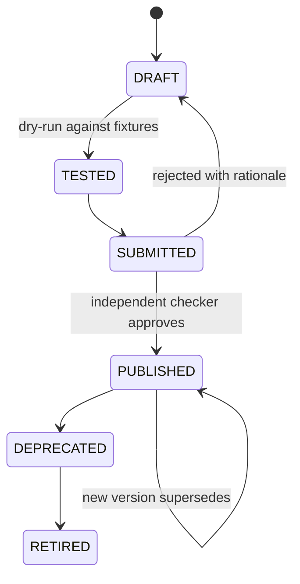

# Tool and Agent Contract

> Status: Authoritative, T1/T4 contract. Owner: AI Platform.
> Defines what a governed tool is, how it is invoked, and what an agent — internal or external — may do.

## 1. Tool definition

```json
{
  "id": "tool_exposure_by_counterparty",
  "version": 3,
  "name": "Exposure by counterparty",
  "description": "Total exposure per counterparty for a given LOB as of a date.",
  "status": "PUBLISHED",
  "organization_id": "org_...",
  "parameters": [
    {"name": "as_of_date", "type": "date", "required": true},
    {"name": "lob_code", "type": "string", "required": true, "enum_source": "lob_reference"},
    {"name": "min_amount", "type": "decimal", "required": false, "default": 0}
  ],
  "returns": {
    "kind": "table",
    "columns": [
      {"name": "counterparty_id", "type": "string"},
      {"name": "exposure_amount", "type": "decimal"}
    ]
  },
  "bindings": {"roles": ["RiskAnalyst", "RiskReviewer"], "agents": ["atlas.analyst"]},
  "dependencies": ["tbl_positions", "tbl_counterparty"],
  "semantic_version_pin": 44,
  "certification": {"status": "CERTIFIED", "certified_at": "2026-07-01", "expires_at": "2027-07-01"}
}
```

## 2. Parameter type system

| Type | Validation |
|---|---|
| `string` | Length bound; optional `enum_source` or pattern |
| `integer`, `decimal` | Range bounds |
| `date`, `timestamp` | Format and range |
| `boolean` | — |
| `enum` | Bound to governed reference data via `enum_source` |
| `array<T>` | Element type + cardinality bound |

**Not supported, deliberately:** free-form SQL fragments, table names as parameters, column lists as parameters, or any parameter that changes the *shape* of the query. Those would make the tool's SQL dynamic, which would put the model or the caller back in the authoring seat.

## 3. Invocation contract

```http
POST /v1/tools/{tool_id}/invocations
{
  "version": 3,
  "parameters": {"as_of_date": "2026-06-30", "lob_code": "MARKETS"},
  "purpose": "regulatory_reporting",
  "idempotency_key": "..."
}
```

Execution guarantees:

| Guarantee | Mechanism |
|---|---|
| Type validation before execution | Rejected at the boundary |
| **AST literal binding** | Values bound into the parsed tree — injection is impossible by construction, not by escaping |
| No dynamic SQL | Tool SQL is fixed at version publication |
| **Gateway execution** | Tools do **not** bypass the query gateway (INV-2) |
| Policy evaluation | Per referenced object, at invocation |
| Masking | Applied to results by classification |
| Evidence | Invocation, execution, and lineage recorded |
| Bounded | Row, byte, and time caps per workload class |

## 4. Tool lifecycle



Maker ≠ checker is platform-enforced (INV-8). A rejected submission returns to draft with the checker's rationale attached.

## 5. Promotion from an analysis

The path that fills the registry without anyone sitting down to author tools:

1. Analyst completes a successful governed run.
2. Requests promotion.
3. **Atlas deterministically renders** the executed SQL into a parameterized template. The model does not author it (ADR-0001).
4. Parameters are inferred from the redacted literals and confirmed by the analyst.
5. A draft is created and enters maker-checker.
6. On publication, the agent prefers this tool for matching intents.

Step 3 is the safety property: a governed tool's SQL is never model output, even when the analysis that inspired it involved generation.

## 6. Agent contract

An "agent" is any principal that invokes tools — the native Atlas analyst, or an external MCP client.

| Rule | Applies to |
|---|---|
| Must authenticate with a workload or user identity | All |
| Must declare a purpose for purpose-bound operations | All |
| May invoke only tools bound to its identity | All |
| **May not generate SQL that bypasses the gateway** | All — there is no such path |
| Subject to step, time, token, and cost budgets | All |
| Every action is recorded as decision lineage | All |
| Subject to prompt-risk screening | Native runtime |
| Subject to per-read policy evaluation | External MCP clients |

**The symmetry is the point.** An external agent consuming Atlas over MCP is governed by the same controls as the native analyst. There is no privileged internal path and no unprivileged external one — there is one path.

## 7. Budgets

| Budget | Scope | Enforcement |
|---|---|---|
| Steps per plan | Per run | Hard stop |
| Wall time | Per run | Timeout |
| Model tokens | Per route, per period | Model gateway |
| Monetary spend | Per route, per period | Hard cap |
| Source query cost | Per execution | Cost gate |
| Rows / bytes returned | Per execution | Result cap |
| Invocations | Per consumer, per period | Rate limit |

## 8. Tool SDK (planned)

For third-party tool authoring:

```python
from atlas_sdk import tool, Param

@tool(name="exposure_by_counterparty", version=3)
def exposure(
    as_of_date: Param.Date(required=True),
    lob_code: Param.Enum(source="lob_reference"),
    min_amount: Param.Decimal(default=0),
):
    return """
        SELECT counterparty_id, SUM(exposure_amount) AS exposure_amount
        FROM {positions}
        WHERE as_of_date = :as_of_date AND lob_code = :lob_code
        GROUP BY counterparty_id
        HAVING SUM(exposure_amount) >= :min_amount
    """
```

The SDK produces a **draft**. Publication still requires maker-checker. An SDK that could publish would be a bypass of INV-8.

## Related documents

- Tool registry: `20-modules/14-tool-registry.md`
- Agent runtime: `20-modules/13-agent-runtime.md`
- Context products and MCP: `20-modules/19-context-products-and-mcp.md`
