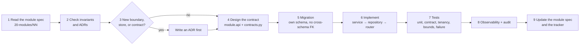

# Development Specification

> Status: Authoritative. Owner: Engineering.
> The single document an engineer reads before writing code. Everything else in `40-engineering/` is detail behind this.

## 1. What we are building

Atlas: the governed AI data operating system for regulated enterprises. Python 3.12+, FastAPI, PostgreSQL, Temporal, Kafka, Neo4j — a **modular monolith with four deployment units** (ADR-0011), decomposed into 21 modules with mechanically enforced boundaries.

## 2. Non-negotiables

Before writing any code, internalize the nine invariants in `10-architecture/01-principles-and-invariants.md`. The four that most often get violated by well-intentioned changes:

| Invariant | The mistake to avoid |
|---|---|
| **INV-2** one execution choke point | "I'll just call the connector directly for this one profiling query." |
| **INV-3** model output is never authority | "The model returned valid SQL, so we can execute it." |
| **INV-5** total tenant isolation | Adding a query helper without a tenant scope argument. |
| **INV-6** value-free control plane | Logging an exception object that contains a row. |

Each has a test that fails. If you find yourself disabling one, stop and raise an ADR instead.

## 3. Definition of done

A change is done when **all** of these hold. Not most.

| # | Criterion |
|---|---|
| 1 | Tests pass: unit, contract, integration, and the invariant suite |
| 2 | `ruff check` and strict `mypy` are clean |
| 3 | Import-linter contracts pass with **no new exemptions** |
| 4 | Migrations are reversible and applied to a single head |
| 5 | Every mutation writes an audit event in the same transaction |
| 6 | New endpoints carry full OpenAPI documentation (see `30-contracts/02-api-conventions.md` §11) |
| 7 | New events are in `30-contracts/04-event-catalog.md` |
| 8 | Tenancy scoping is present and tested with a foreign-tenant case |
| 9 | Bounds are explicit — no unbounded scan, traversal, or retrieval |
| 10 | Failure behaviour is specified: fail closed or degrade, and which |
| 11 | Observability: metrics, structured logs, trace spans |
| 12 | The relevant module spec in `20-modules/` is updated |
| 13 | Performance is within the regression gates |
| 14 | Value-freedom holds — no source values in state, logs, events, or model context |

## 4. Feature development flow



**Step 1 is not optional.** The module spec names what the module does and does not own. Half of all boundary violations come from implementing a feature in the module where it was convenient rather than the module that owns it.

## 5. Where does this code go?

> **Implementation status (2026-08-30).** The module names below are bounded contexts, **not
> directories**. Only `src/atlas/modules/identity_tenancy/` exists, and it is a 69-line
> scaffold with no business rules; all working code is in the flat `src/aida/` package. Use the
> table below to decide *which context owns the concern*, then use the "Lives today in" column
> of the table in `20-modules/00-module-index.md` to find the file. Do not create
> `src/atlas/modules/<name>/` for a new feature — that is the extraction work (`ST-05`/`06`/`07`),
> sequenced in `40-engineering/06-refactor-plan.md`, and adding a half-migrated module ahead of
> it makes the extraction harder rather than easier.

| The change is about… | Module |
|---|---|
| Who is asking | 01 identity-tenancy |
| Reaching a source | 02 connectivity |
| Getting metadata in | 03 ingestion |
| What objects exist | 04 catalog |
| What the data looks like | 05 profiling |
| How tables connect | 06 relationships |
| What the data means | 07 semantic-layer |
| Who owns meaning | 08 glossary-stewardship |
| Where data came from | 09 lineage |
| Traversing the estate | 10 knowledge-graph |
| Whether data is trustworthy | 11 data-quality |
| Finding things | 12 retrieval |
| Answering a question | 13 agent-runtime |
| Reusable capability | 14 tool-registry |
| Talking to a model | 15 model-gateway |
| Touching a source | 16 query-gateway |
| Deciding permission | 17 policy-governance |
| Authoring governed objects | 18 studio |
| Serving external agents | 19 context-products-mcp |
| Evidence and telemetry | 20 observability-audit |
| The product frame | 21 experience-shell |
| Infrastructure with no domain knowledge | `platform/` |

**If it does not fit any row, do not invent a `common/` package.** Raise it — either the boundary is wrong, or the feature belongs somewhere you have not considered.

## 6. Writing a new module

Only when an existing module genuinely does not own the concern, and after an ADR.

> **Implementation status (2026-08-30). Target shape.** `scripts/generate_module.py` will
> generate this tree, and `tests/test_module_scaffold_generator.py` asserts it — that is how
> `identity_tenancy` was produced. But a generated module is inert today: `models.py` cannot
> have its "own schema" (no module schemas exist in PostgreSQL), `migrations/` is not wired
> into Alembic (all 34 revisions live in the repository-root `migrations/versions/`),
> `repository.py`'s `TenantScope` has no base class to enforce it, `tests/` is outside
> `testpaths`, and "add its import-linter layer" is not possible because no layers contract
> exists. Generating a module is currently an act of documentation, not of structure.

```text
src/atlas/modules/<name>/
├── api.py            # PUBLIC — DTOs only, TenantScope on every function
├── contracts.py      # PUBLIC — DTOs, enums, events, errors
├── router.py         # FastAPI APIRouter
├── service.py        # domain logic — the only place business rules live
├── models.py         # PRIVATE — SQLAlchemy, own schema
├── schemas.py        # PRIVATE — request/response models
├── repository.py     # PRIVATE — TenantScope required
├── events.py         # domain events
├── workers/          # Temporal activities
├── migrations/       # Alembic revisions for this schema
└── tests/            # runs standalone
```

Register it in `10-architecture/04-module-decomposition.md` §4, add its spec to `20-modules/`, and add its import-linter layer.

## 7. Common tasks

### Adding an endpoint

1. Owning module's `router.py`.
2. Request/response in that module's `schemas.py`.
3. Authorization via `policy_governance.api.authorize`.
4. Tenancy scope from the request context — never ambient.
5. Audit event in the same transaction as any mutation.
6. Full OpenAPI documentation.
7. Tests including the foreign-tenant denial case.

### Adding a database table

1. Owning module's schema only.
2. Tenancy columns mandatory.
3. No cross-schema FK except into `identity` (ADR-0015).
4. Reversible migration.
5. Index every column any filter will use.
6. Partition if the projected row count exceeds the threshold in `10-architecture/06-data-architecture.md` §7.

### Adding a background job

1. Decide the worker class (`10-architecture/08-workers-and-workflows.md` §2).
2. Temporal activity in the owning module's `workers/`.
3. Idempotent, heartbeating, cancellable, bounded.
4. Stable workflow ID.
5. Metrics and failure classification.
6. Test the forced-restart case.

### Adding a source-touching operation

**There is exactly one way.** Build an `ExecutionRequest` and call `query_gateway.api.execute`. If that seems not to fit your case, the case is the problem — raise it rather than working around INV-2.

## 8. Anti-patterns

| Anti-pattern | Why it is rejected |
|---|---|
| Importing another module's `models.py` | Violates MD-2; makes extraction impossible |
| Cross-schema foreign key | Violates ADR-0015 |
| Unscoped repository query | Violates INV-5 |
| Direct connector execution | Violates INV-2 |
| Executing model output | Violates INV-3 |
| Unbounded query, traversal, or retrieval | Violates P3 |
| Mutation without an audit event | Violates INV-7 |
| Feature-local approval logic | Violates INV-8 |
| Logging a value or a secret | Violates INV-6 |
| A `common/` or `utils/` package with domain logic | Becomes a second monolith with no owner |
| Silently ignoring an unknown request parameter | A typo becomes a wrong result |
| Disabling an import-linter rule to ship | Returns the codebase to the current defect |

## 9. Review checklist

A reviewer asks these in order:

1. Is it in the right module?
2. Does it cross a boundary correctly — `api.py` and DTOs only?
3. Is tenancy scoped and tested?
4. Is everything bounded?
5. Does it audit?
6. Does it fail closed where it should?
7. Are values excluded from state, logs, events, and model context?
8. Is failure behaviour specified and tested?
9. Are metrics, logs, and spans present?
10. Is the module spec updated?

## Related documents

- Repository layout: `40-engineering/02-repository-layout.md`
- Coding standards: `40-engineering/03-coding-standards.md`
- Testing strategy: `40-engineering/04-testing-strategy.md`
- Refactor plan: `40-engineering/06-refactor-plan.md`
