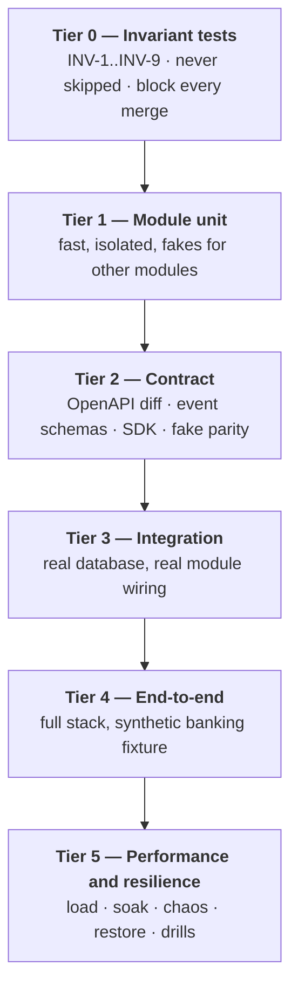

# Testing Strategy

> Status: Authoritative. Owner: Engineering + QA.
> The organizing idea: **the invariants are the product's safety guarantees, so they get their own test tier that never gets skipped.**

## 1. Test tiers

> **Implementation status (2026-09-20).** The tier model below is target. `tests/` is a flat
> directory of 476 test files (`find tests -name 'test_*.py'`) holding about 14,450 collected
> tests (`pytest --collect-only`; collected, not passed), all run by one `pytest` invocation in
> the `tests` CI job under a 69% combined coverage floor; there is no tier separation, no
> per-tier duration budget, and nothing distinguishes a Tier 0 test from a Tier 3 test at
> collection time. **Tier 0 exists in substance**: `tests/test_tier0_invariants.py` plus one
> module each for INV-1, 5, 6, 7 and 9 (the §2 table below was re-derived on 2026-09-20).
> **Tier 2 exists in part**: the OpenAPI-diff gate
> (`tests/test_openapi_diff_gate.py`, and the `openapi-diff` CI job), the event-catalog gate
> (`tests/test_event_catalog_gate.py`) and the migration/ORM drift gate
> (`tests/test_migration_orm_drift.py`, in the `migration-drift` CI job) all exist; there is no
> schema-registry compatibility or fake-parity suite. **Tier 4 exists in part**: a browser
> journey through the production proxy (the `ui-journey` CI job, which runs the four Playwright
> specs under `e2e/tests/`) and `scripts/verify-local.ps1`. **The user interface has its own
> tests, outside that count**: `ui-next` holds 114 vitest files as of 2026-09-20
> (`find ui-next/src -name '*.test.ts' -o -name '*.test.tsx'`), run by `npm run test` in the
> `ui-next` CI job, and they include the jsdom accessibility sweep
> (`ui-next/src/a11y-sweep.test.tsx`). **Tier 5's load, soak, chaos and restore tests do not
> exist**; `perf-baseline` is an in-process regression gate, not those. Tiers 1 and 3 exist only
> as ordinary tests in the same flat directory.

| Tier | Runs | Duration budget |
|---|---|---|
| 0 Invariants | Every commit | < 2 min |
| 1 Module unit | Every commit | < 3 min |
| 2 Contract | Every commit | < 2 min |
| 3 Integration | Every commit | < 10 min |
| 4 End-to-end | Every merge to main | < 30 min |
| 5 Performance | Nightly + per release | Hours |

## 2. Tier 0 — Invariant tests

The safety net. Each maps to an invariant in `10-architecture/01-principles-and-invariants.md`.

> **Implementation status (2026-09-20).** **Built, re-verified 2026-09-20** by searching for each
> function name across `tests/` (`grep -rn "def test_<name>" tests`): all eleven tests below
> exist, so all nine invariants have a named test. The 2026-08-30 tally was seven built and four
> planned (INV-1, INV-6, INV-7, INV-9); those four have since landed, in
> `tests/test_inv1_single_authoritative_store.py`, `tests/test_inv6_value_freedom.py`,
> `tests/test_inv7_attributability.py` and `tests/test_engine_capability_matrix.py`, while
> `tests/test_tier0_invariants.py` holds INV-2, INV-3, INV-4, INV-8 and the workspace half of
> INV-5. The Method column below says what each test does today, which for INV-1, INV-6 and
> INV-9 is narrower than the method first specified. *(This tally moves. Re-grep rather than
> trusting it.)*

| Test | Invariant | Status | Method |
|---|---|---|---|
| `test_projection_rebuild` | INV-1 | **Built** | In `tests/test_inv1_single_authoritative_store.py`: runs the real `project_discovery` twice against a fixed set of authoritative rows served by an in-memory session double (`ModelRoutedSession`, not a live PostgreSQL), discarding the recorded graph in between, and requires the two projections to be identical (replay determinism). Its own docstring says it does not prove that Neo4j applies the projection correctly |
| `test_no_connector_execution_outside_gateway` | INV-2 | **Built** | AST scan of every module under `src/aida` for a call to either SQL-accepting member |
| `test_the_connector_handed_to_the_platform_has_no_sql_surface` | INV-2 | **Built** | Fails if the SQL methods are moved back onto `Connector` |
| `test_model_output_types_are_inert` | INV-3 | **Built** | Assert no proposal type implements or coerces to an executable command interface |
| `test_production_config_fail_closed` | INV-4 | **Built** | Parameterized over each incomplete-posture case; assert startup refusal or denial |
| `test_the_secure_production_baseline_itself_is_accepted` | INV-4 | **Built** | The negative control — a correct posture must still start |
| `test_cross_tenant_denial` | INV-5 | **Built** | Route-table-driven; in `tests/test_inv5_tenant_isolation.py` (plus a second in the Tier-0 file). Also asserts every route is authenticated, every route reaches a tenant check, and every worker is tenant-scoped |
| `test_no_source_values_in_control_plane` | INV-6 | **Built** | In `tests/test_inv6_value_freedom.py`: drives the real `QueryExecutionGateway.execute` in process against a fake executor that returns sentinel-laden rows, then searches every row it stages (query record, audit, outbox) for the sentinels. The same module adds structural, profiling, ingestion and trace-span scans. Narrower than the specced full-stack sentinel sweep: there is no real warehouse behind it |
| `test_every_mutation_audits` | INV-7 | **Built** | In `tests/test_inv7_attributability.py`: derives the mutating routes from HTTP verb and call graph and requires each to reach `record_audit`; `test_no_unaudited_mutation_remains`, in the same file, runs with no exemption list |
| `test_self_approval_denied` | INV-8 | **Built** | Every governed object type; attempt self-approval |
| `test_capability_matrix_matches_certification` | INV-9 | **Built** | In `tests/test_engine_capability_matrix.py`: every `SUPPORTED` or `PARTIAL` cell of the published capability matrix is checked against the code that would have to exist for the claim to hold. The enforcement clause (flags derived from a committed certification result) has its own module, `tests/test_inv9_capability_honesty.py` |

**These are never marked `skip` or `xfail`.** A failing invariant test blocks the merge, full stop. If an invariant genuinely needs to change, that is an ADR, not a test annotation. (As of 2026-09-20 none of the eleven carries either marker. `test_capability_flags_are_derived_from_certification` in `tests/test_inv9_capability_honesty.py` keeps a conditional strict `xfail`, which applies only while `KNOWN_UNCERTIFIED_CLAIMS` is non-empty; it is empty today, so the test runs as an ordinary assertion.)

The two highest-value tests here are `test_cross_tenant_denial` (which is generated by reflection over the route table, so a new endpoint is covered automatically) and `test_no_source_values_in_control_plane` (which catches the class of leak that code review reliably misses). **Both exist as of 2026-09-20.** The first landed on 2026-08-30 and works exactly as described. The second landed later and is narrower than specced: it proves the query path value-free end to end, and the profiling and ingestion paths from the connector boundary inwards, against fakes, so the full-stack sentinel sweep over every table, log line, event payload and trace is still the piece of INV-6 that is not built.

## 3. Tier 1 — Module unit tests

| Rule | Detail |
|---|---|
| Standalone | `pytest src/atlas/modules/<name>` passes with no other module — **target**; `testpaths = ["tests"]` today, and six module directories exist under `src/atlas/modules/` |
| Fakes from `contracts.py` | Never import another module's internals |
| Fast | No network, no real database except an in-memory or transactional fixture |
| Coverage focus | Domain logic, boundary conditions, failure paths |

Every module must additionally test: tenancy scoping, bound enforcement with truncation, idempotency of repeatable operations, and each declared failure mode.

## 4. Tier 2 — Contract tests

| Contract | Test |
|---|---|
| REST API | OpenAPI schema diff against the released spec; a breaking change fails |
| Events | Schema-registry compatibility (`BACKWARD` minimum); every published type present in the event catalog |
| Module interfaces | Type checks on public signatures; DTOs serialize without a database session |
| **Fake parity** | Fakes and real implementations run against the **same** interface suite |
| Ingestion envelope | Golden-payload fixtures per supported version |
| SDK | Reference suite a third party can run against their adapter |
| Error codes | Enumerated and asserted stable |

The fake-parity test is the one people skip and then regret: a fake that drifts produces green tests and a broken system.

## 5. Tier 3 — Integration tests

Real PostgreSQL with per-module schemas, real module wiring, real Temporal test environment.

Focus areas: cross-module flows, transaction boundaries and audit atomicity, outbox → projection with idempotency, migration up and down, and concurrency (row locks, admission control, race conditions).

## 6. Tier 4 — End-to-end tests

Full docker-compose stack against a **synthetic banking fixture** — never production data.

| Scenario | Asserts |
|---|---|
| Source onboarding → discovery → profiling → semantics | The metadata pipeline end to end |
| Batch ingestion with forced mid-batch restart | Resume without reprocessing committed chunks |
| Conflicting-content replay | 409, original preserved |
| Cross-chunk FK resolution | Exact expected counts |
| `FULL` batch with a failed chunk | **No metadata retired** |
| Analyst question → tool-first execution | Governed answer with evidence |
| Analyst question → generation → validation → execution | Full state machine |
| Prompt-injection attempt | Blocked at `SCREENED`, before retrieval |
| Cross-tenant access attempt | 403 at every surface |
| Model route approved but not activated | Explicit denial, not a degraded answer |
| Kill switch engaged | Model traffic stops; deterministic paths continue |
| Projection deleted and rebuilt | Identical results |

## 7. Tier 5 — Performance and resilience

| Test | Cadence | Gate |
|---|---|---|
| Load (target scale) | Per release | Latency and throughput targets |
| Soak (72 h) | Per release | No leak or degradation |
| Spike (10× burst) | Per release | Graceful backpressure, no data loss |
| Chaos (source timeouts, broker duplication, projector crash, DB failover) | Quarterly | Correct degradation |
| Projection rebuild timing | Quarterly | Recovery targets |
| PITR restore drill | Quarterly | RTO |
| Credential rotation drill | Quarterly | Zero failed requests |
| Kill-switch drill | Quarterly | < 60 s to full stop |
| Migration rehearsal | Per release | Up and down on production-like data |
| Connector certification | Per connector version | Vendor/version behaviour under load |
| Adversarial SQL corpus | Per release | Zero bypasses |
| Prompt-injection corpus (incl. multilingual, obfuscated, indirect) | Per release | Zero bypasses |
| Penetration test | Annually + on major change | No critical findings |
| Accessibility audit | Per release | WCAG AA |
| Browser regression | Per release | Supported matrix |

## 8. Test data

| Rule | Reason |
|---|---|
| **Synthetic only** — never production data | ADR-0014 |
| Fixtures model realistic banking structures: history tables, SCD, partial FKs, ambiguous names | Real estates are messy; clean fixtures hide real failures |
| Sentinel values for INV-6 scanning | Detects value leakage |
| Labelled benchmark corpus for semantic and relationship quality | Otherwise "accuracy improved" is an opinion |
| Fixtures versioned with the code | Reproducibility |

## 9. Current status

| Tier | Status |
|---|---|
| 0 Invariants | **Built as files, not as a distinct tier** (2026-09-20) — all nine invariants have a named test (§2); one `pytest` run collects them with everything else and no marker separates them |
| 1 Module unit | About 14,450 tests collected on 2026-09-20 (collected, not a pass count); not yet per-module standalone |
| 2 Contract | Partial — the OpenAPI diff gate and the event-catalog gate exist (2026-09-20); no schema-registry compatibility or fake-parity suite |
| 3 Integration | Partial |
| 4 End-to-end | Good — R20 fixture covers batch replay, conflicting-content denial, cross-chunk FK, exact counts, payload cleanup |
| 5 Performance | **Partial** (2026-09-20) — no target-scale load, soak, chaos, restore or penetration evidence: tracker R11-B15 and R11-C9 are BLOCKED on customer inputs, and the scale measurements on record are proxies, such as the 100,000-table catalog that tracker CT-2 records. **Accessibility is no longer "no evidence"**: it has automated evidence — a jsdom axe sweep of every navigable screen (`ui-next/src/a11y-sweep.test.tsx`, run by the `ui-next` CI job), Playwright axe specs in both themes plus 320px reflow behind the production proxy (`e2e/tests/accessibility.spec.ts`, run by the `ui-journey` job) and a live audit over every screen of a deployed stack (`e2e/scripts/live-a11y-audit.mjs`, `npm run audit:a11y` in `e2e/`). Human acceptance is still open — screen reader, zoom by eye, focus-indicator contrast, multi-monitor scaling (tracker R11-C2) |

## 10. Priority gaps

| ID | Item | Priority |
|---|---|---|
| TS-1 | Formalize Tier 0 with all nine invariant tests | P0 |
| TS-2 | Reflection-generated cross-tenant denial coverage | P0 |
| TS-3 | Sentinel-based value-leakage scan | P0 |
| TS-4 | OpenAPI diff gate | P0 |
| TS-5 | Adversarial SQL corpus per dialect | P0 |
| TS-6 | Prompt-injection corpus incl. indirect and multilingual | P0 |
| TS-7 | Load, soak, and spike suites | P0 |
| TS-8 | Chaos and restore drills | P0 |
| TS-9 | Accessibility audit | P1 |
| TS-10 | Labelled semantic/relationship benchmark corpus | P1 |

> **Implementation status (2026-09-20).** The table above is the 2026-08-30 gap list. Tracker status today: TS-1 to TS-6 and TS-10 are DONE; TS-7 and TS-8 (load, soak, spike, chaos, restore) were merged into R11-B15, which is BLOCKED on a target size and topology; TS-9 (accessibility audit) was merged into R11-C2, which is PARTIAL, with the automated half landed and human acceptance open.
