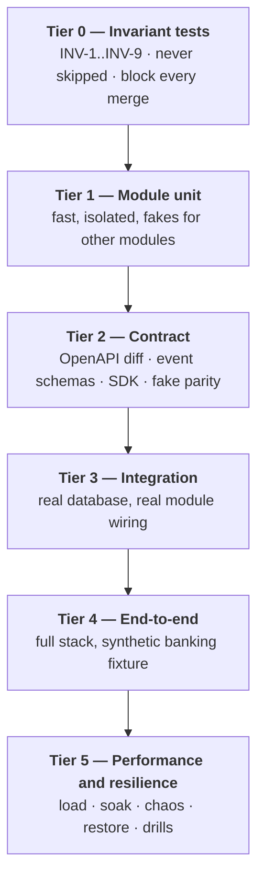

# Testing Strategy

> Status: Authoritative. Owner: Engineering + QA.
> The organizing idea: **the invariants are the product's safety guarantees, so they get their own test tier that never gets skipped.**

## 1. Test tiers

| Tier | Runs | Duration budget |
|---|---|---|
| 0 Invariants | Every commit | < 2 min |
| 1 Module unit | Every commit | < 3 min |
| 2 Contract | Every commit | < 2 min |
| 3 Integration | Every commit | < 10 min |
| 4 End-to-end | Every merge to main | < 30 min |
| 5 Performance | Nightly + per release | Hours |

## 2. Tier 0 — Invariant tests

The safety net. Each maps to an invariant in `10-architecture/01-principles-and-invariants.md`.

> **Implementation status (2026-08-30).** None of the nine tests below exists yet under
> `tests/` — tracker `ST-03` (Tier 0 invariant suite) is `TODO`. This tier, and the
> "never marked `skip`" guarantee below, is the target; see
> `10-architecture/01-principles-and-invariants.md` for the per-invariant status.

| Test | Invariant | Method | Status |
|---|---|---|---|
| `test_projection_rebuild` | INV-1 | Delete Neo4j and the search index; replay; assert identical query results | Planned, not written |
| `test_no_connector_execution_outside_gateway` | INV-2 | Static import-graph analysis | Planned, not written |
| `test_model_output_types_are_inert` | INV-3 | Assert no proposal type implements or coerces to an executable command interface | Planned, not written |
| `test_production_config_fail_closed` | INV-4 | Parameterized over each incomplete-posture case; assert startup refusal or denial | Planned, not written |
| `test_cross_tenant_denial` | INV-5 | Every endpoint and worker exercised with a foreign tenant context | Planned, not written |
| `test_no_source_values_in_control_plane` | INV-6 | Sentinel values in source data; scan every table, log line, event payload, and trace | Planned, not written |
| `test_every_mutation_audits` | INV-7 | Reflection over governed models; exercise each mutation; assert a matching audit row | Planned, not written |
| `test_self_approval_denied` | INV-8 | Every governed object type; attempt self-approval | Planned, not written |
| `test_capability_matrix_matches_certification` | INV-9 | Assert every advertised capability has a passing certification check | Planned, not written |

**These are never marked `skip` or `xfail`.** A failing invariant test blocks the merge, full stop. If an invariant genuinely needs to change, that is an ADR, not a test annotation.

Once written, the two highest-value tests here will be `test_cross_tenant_denial` (generated by reflection over the route table, so a new endpoint is covered automatically) and `test_no_source_values_in_control_plane` (which catches the class of leak that code review reliably misses) — both still planned, not written (2026-08-30).

## 3. Tier 1 — Module unit tests

| Rule | Detail |
|---|---|
| Standalone | `pytest src/atlas/modules/<name>` passes with no other module |
| Fakes from `contracts.py` | Never import another module's internals |
| Fast | No network, no real database except an in-memory or transactional fixture |
| Coverage focus | Domain logic, boundary conditions, failure paths |

Every module must additionally test: tenancy scoping, bound enforcement with truncation, idempotency of repeatable operations, and each declared failure mode.

## 4. Tier 2 — Contract tests

| Contract | Test |
|---|---|
| REST API | OpenAPI schema diff against the released spec; a breaking change fails |
| Events | Schema-registry compatibility (`BACKWARD` minimum); every published type present in the event catalog |
| Module interfaces | Type checks on public signatures; DTOs serialize without a database session |
| **Fake parity** | Fakes and real implementations run against the **same** interface suite |
| Ingestion envelope | Golden-payload fixtures per supported version |
| SDK | Reference suite a third party can run against their adapter |
| Error codes | Enumerated and asserted stable |

The fake-parity test is the one people skip and then regret: a fake that drifts produces green tests and a broken system.

## 5. Tier 3 — Integration tests

Real PostgreSQL with per-module schemas, real module wiring, real Temporal test environment.

Focus areas: cross-module flows, transaction boundaries and audit atomicity, outbox → projection with idempotency, migration up and down, and concurrency (row locks, admission control, race conditions).

## 6. Tier 4 — End-to-end tests

Full docker-compose stack against a **synthetic banking fixture** — never production data.

| Scenario | Asserts |
|---|---|
| Source onboarding → discovery → profiling → semantics | The metadata pipeline end to end |
| Batch ingestion with forced mid-batch restart | Resume without reprocessing committed chunks |
| Conflicting-content replay | 409, original preserved |
| Cross-chunk FK resolution | Exact expected counts |
| `FULL` batch with a failed chunk | **No metadata retired** |
| Analyst question → tool-first execution | Governed answer with evidence |
| Analyst question → generation → validation → execution | Full state machine |
| Prompt-injection attempt | Blocked at `SCREENED`, before retrieval |
| Cross-tenant access attempt | 403 at every surface |
| Model route approved but not activated | Explicit denial, not a degraded answer |
| Kill switch engaged | Model traffic stops; deterministic paths continue |
| Projection deleted and rebuilt | Identical results |

## 7. Tier 5 — Performance and resilience

| Test | Cadence | Gate |
|---|---|---|
| Load (target scale) | Per release | Latency and throughput targets |
| Soak (72 h) | Per release | No leak or degradation |
| Spike (10× burst) | Per release | Graceful backpressure, no data loss |
| Chaos (source timeouts, broker duplication, projector crash, DB failover) | Quarterly | Correct degradation |
| Projection rebuild timing | Quarterly | Recovery targets |
| PITR restore drill | Quarterly | RTO |
| Credential rotation drill | Quarterly | Zero failed requests |
| Kill-switch drill | Quarterly | < 60 s to full stop |
| Migration rehearsal | Per release | Up and down on production-like data |
| Connector certification | Per connector version | Vendor/version behaviour under load |
| Adversarial SQL corpus | Per release | Zero bypasses |
| Prompt-injection corpus (incl. multilingual, obfuscated, indirect) | Per release | Zero bypasses |
| Penetration test | Annually + on major change | No critical findings |
| Accessibility audit | Per release | WCAG AA |
| Browser regression | Per release | Supported matrix |

## 8. Test data

| Rule | Reason |
|---|---|
| **Synthetic only** — never production data | ADR-0014 |
| Fixtures model realistic banking structures: history tables, SCD, partial FKs, ambiguous names | Real estates are messy; clean fixtures hide real failures |
| Sentinel values for INV-6 scanning | Detects value leakage |
| Labelled benchmark corpus for semantic and relationship quality | Otherwise "accuracy improved" is an opinion |
| Fixtures versioned with the code | Reproducibility |

## 9. Current status

| Tier | Status |
|---|---|
| 0 Invariants | **Partial** — the invariant suite is not yet formalized as a distinct tier |
| 1 Module unit | 121 tests passing; not yet per-module standalone |
| 2 Contract | Partial — no OpenAPI diff gate; no event-catalog assertion |
| 3 Integration | Partial |
| 4 End-to-end | Good — R20 fixture covers batch replay, conflicting-content denial, cross-chunk FK, exact counts, payload cleanup |
| 5 Performance | **Not run** — no load, soak, chaos, restore, penetration, or accessibility evidence |

## 10. Priority gaps

| ID | Item | Priority |
|---|---|---|
| TS-1 | Formalize Tier 0 with all nine invariant tests | P0 |
| TS-2 | Reflection-generated cross-tenant denial coverage | P0 |
| TS-3 | Sentinel-based value-leakage scan | P0 |
| TS-4 | OpenAPI diff gate | P0 |
| TS-5 | Adversarial SQL corpus per dialect | P0 |
| TS-6 | Prompt-injection corpus incl. indirect and multilingual | P0 |
| TS-7 | Load, soak, and spike suites | P0 |
| TS-8 | Chaos and restore drills | P0 |
| TS-9 | Accessibility audit | P1 |
| TS-10 | Labelled semantic/relationship benchmark corpus | P1 |
