# CI/CD and Release

> Status: Authoritative. Owner: Engineering + Platform.

## 1. Pipeline

```mermaid
flowchart LR
    A[Commit] --> B["Fast gate < 5 min<br/>ruff · mypy · import-linter · Tier 0 · Tier 1"]
    B --> C["Contract gate < 2 min<br/>OpenAPI diff · event schemas · fake parity"]
    C --> D["Integration < 10 min<br/>real DB · migrations up/down"]
    D --> E["Security<br/>SAST · dependency audit · secret scan · container scan"]
    E --> F["Build<br/>image · SBOM · sign"]
    F --> G["E2E < 30 min<br/>full stack · synthetic fixture"]
    G --> H["Performance regression gates"]
    H --> I[Publish]
    I --> J[Deploy: integration → pre-prod → production]
```

**Design principle: fail fastest first.** A boundary violation or an invariant failure should be known within five minutes, not after a thirty-minute E2E run.

## 2. Merge gates

> **Implementation status (2026-08-30).** CI exists as of 2026-08-30
> (`.github/workflows/ci.yml`, tracker `ST-02`) and runs **five** of the fourteen gates below.
> The pipeline diagram in §1 describes stages C, E, F, G and H that have no job.
>
> | Gate | Today |
> |---|---|
> | `ruff check` | **Wired** — `quality` job |
> | `mypy --strict` | **Wired** — `quality` job, but `packages = ["aida"]`, so `src/atlas/` is not type-checked |
> | `import-linter` | **Wired** — `quality` job; 4 contracts as of 2026-08-30 and growing (see `10-architecture/04-module-decomposition.md` §5.2) |
> | Tier 0 invariants | **Partially wired** — the `tests` job runs `tests/test_tier0_invariants.py`, which covers 4 of 9 invariants |
> | Tier 1 module unit | **Partially wired** — all 44 test files run, but there is no tier separation and no per-module suite |
> | Migration | **Wired** — the `migrations` job asserts exactly one Alembic head. The "irreversible migration" half is not checked |
> | OpenAPI diff | **Not wired** — no step, and no released spec committed to diff against |
> | Event catalog | **Not wired** — and the catalog has drifted from the emitted names as a result (`30-contracts/04-event-catalog.md`) |
> | Audit coverage | **Not wired** — `test_every_mutation_audits` does not exist |
> | SAST · Dependency audit · Secret scan | **Not wired** — no tool in the `dev` extras |
> | Docs lint | **Not wired** |
> | Performance | **Not wired** — no baseline exists to regress against |
>
> "Every one of these blocks the merge" is therefore true of five gates today. Closing the
> rest is tracker `E1` follow-on work.

Every one of these blocks the merge.

| Gate | Blocks on |
|---|---|
| `ruff check` | Any finding |
| `mypy --strict` | Any error |
| `import-linter` | Any violation, **including a new exemption** |
| Tier 0 invariants | Any failure — never skippable |
| Tier 1 module unit | Any failure |
| OpenAPI diff | Any breaking change without an approved version bump |
| Event catalog | A published event type not in the catalog |
| Migration | More than one Alembic head; an irreversible migration |
| Audit coverage | A governed mutation without an audit event |
| SAST | High or critical |
| Dependency audit | Critical vulnerability |
| Secret scan | Any hit |
| Docs lint | An endpoint missing required OpenAPI documentation |
| Performance | Regression beyond the thresholds in `10-architecture/10-performance-and-scale-model.md` §9 |

## 3. Release model

Production-grade **vertical releases**, not a throwaway POC followed by a rewrite. Every release exercises contracts, isolation keys, audit events, workflow durability, migrations, and observability.

| Version | Meaning |
|---|---|
| Major | Breaking T1 contract change |
| Minor | New capability, backward-compatible |
| Patch | Fix, no contract change |

Release artifacts: signed container image with SBOM, migration set, OpenAPI spec, event catalog snapshot, changelog with deprecations, performance report, and updated status matrix and tracker.

## 4. Deployment sequence

| Stage | Purpose | Gate to advance |
|---|---|---|
| Integration | Real OIDC, test tenant, synthetic data | All tests green |
| Pre-production | Production-equivalent config, production-like volumes, non-production data | Performance targets met; migration rehearsed |
| Production | Live | Change approval; rollback plan; monitoring confirmed |

Deployment is rolling with readiness gating. A replica takes traffic only when its dependencies verify (INV-4) — a replica that cannot reach PostgreSQL is not ready and serves nothing.

## 5. Migration policy

| Rule | Reason |
|---|---|
| Reversible | Rollback must be possible |
| Backward-compatible with the previous release | Enables rolling deployment |
| Expand → migrate → contract, across releases | Never a simultaneous schema-and-code break |
| Rehearsed on production-like data before production | Duration and lock behaviour are discovered in rehearsal, not in production |
| Long-running migrations run out-of-band | A migration must not block a deployment |
| Single head enforced | Prevents divergent branches |

The expand/contract discipline is what makes rolling deployment safe: release N adds the new column and writes both; release N+1 reads the new column; release N+2 drops the old one.

## 6. Feature flags

| Use | Do not use |
|---|---|
| Progressive rollout of a new capability | To gate a safety control |
| Per-tenant enablement | As a permanent configuration mechanism |
| Kill switch for a risky path | To defer a decision indefinitely |
| Service-extraction cutover (in-process ↔ remote) | — |

Flags carry an owner and an expiry date. A flag past its expiry fails the build — otherwise the flag set becomes a second, undocumented configuration system.

## 7. Rollback

| Scenario | Action |
|---|---|
| Bad application release | Roll back the image; migrations are backward-compatible by policy |
| Bad migration | Run the down migration; if impossible, restore from PITR |
| Bad projection | Rebuild from authoritative state — no restore needed (INV-1) |
| Bad model route | Kill switch; deterministic paths continue |
| Bad policy version | Revert to the prior version; decisions are version-pinned so history stays interpretable |

**The property that makes rollback cheap:** projections are rebuildable and policies are versioned, so most rollbacks touch only the application layer.

## 8. Environment configuration

| Environment | Identity | Secrets | Model generation |
|---|---|---|---|
| Local | Development headers | `env://` allowed | Optional |
| CI | Development headers | Ephemeral | Disabled |
| Integration | Real OIDC | Real provider, test scope | Test route |
| Pre-production | Real OIDC | Real provider | Production-equivalent route |
| Production | Bank OIDC | Bank provider | Only after all five activation conditions (ADR-0009) |

**Safety controls do not vary by environment.** A control disabled in a lower environment is a control that has never been tested.

## 9. Supply chain

| Control | Requirement |
|---|---|
| Base image | Pinned by digest |
| Dependencies | Locked; SBOM per build |
| Signing | Images signed; admission policy verifies |
| Provenance | Build attestation |
| Vulnerability policy | Fail on critical; documented patch SLA |
| Runtime user | Non-root |

## 10. Current status

| Aspect | Now | Target |
|---|---|---|
| Lint, type, test | Clean and passing | Retained |
| Migration single-head | Enforced | Retained |
| Import-linter | **Not configured** | P0 — the modular monolith depends on it |
| OpenAPI diff gate | Not configured | P0 |
| SBOM, signing, provenance | Not configured | P0 |
| Performance gates | Not configured | P0 |
| Deployment pipeline | Local compose only | Kubernetes with staged environments |

## Related documents

- Testing strategy: `40-engineering/04-testing-strategy.md`
- Deployment topology: `10-architecture/09-deployment-topology.md`
- Performance model: `10-architecture/10-performance-and-scale-model.md`
