# CI/CD and Release

> Status: Authoritative. Owner: Engineering + Platform.

## 1. Pipeline

```mermaid
flowchart LR
    A[Commit] --> B["Fast gate < 5 min<br/>ruff · mypy · import-linter · Tier 0 · Tier 1"]
    B --> C["Contract gate < 2 min<br/>OpenAPI diff · event schemas · fake parity"]
    C --> D["Integration < 10 min<br/>real DB · migrations up/down"]
    D --> E["Security<br/>SAST · dependency audit · secret scan · container scan"]
    E --> F["Build<br/>image · SBOM · sign"]
    F --> G["E2E < 30 min<br/>full stack · synthetic fixture"]
    G --> H["Performance regression gates"]
    H --> I[Publish]
    I --> J[Deploy: integration → pre-prod → production]
```

**Design principle: fail fastest first.** A boundary violation or an invariant failure should be known within five minutes, not after a thirty-minute E2E run.

## 2. Merge gates

> **Implementation status (2026-09-20).** CI exists (`.github/workflows/ci.yml`, tracker `ST-02`,
> first landed 2026-08-30) and has 21 jobs as of 2026-09-20. Most of the fourteen gates below have
> a job; the table says which do not, and what each wired one does and does not cover. The jobs
> run in parallel — there is no `needs:` ordering, no publish stage and no deploy stage — so the
> pipeline diagram in §1 is still the target shape, not the workflow.
>
> | Gate | Today |
> |---|---|
> | `ruff check` | **Wired** — `quality` job |
> | `mypy --strict` | **Wired** — `quality` job runs `mypy src sdk/aida_tool_sdk` with `strict = true`, so `src/atlas/` and the tool SDK are type-checked as well as `src/aida/` (the `packages = ["aida"]` line in `pyproject.toml` only limits a bare `mypy` run) |
> | `import-linter` | **Wired** — `quality` job; 13 contracts in `pyproject.toml` as of 2026-09-20 (the enforced list is generated into `10-architecture/14-generated-architecture-map.md`) |
> | Tier 0 invariants | **Partially wired** — a test module exists for each of the nine invariants (`tests/test_tier0_invariants.py`, plus one module each for INV-1, 5, 6, 7 and 9), all run by the `tests` job. There is no separate Tier 0 job or marker, so nothing makes them unskippable |
> | Tier 1 module unit | **Partially wired** — every test file (476 as of 2026-09-20) runs in one `tests` job under a 69% combined coverage floor (`--cov-fail-under=69`), but there is no tier separation and no per-module suite |
> | Migration | **Wired** — the `migrations` job asserts exactly one Alembic head and runs the source-side parity self-test; `migration-drift` applies every migration to an empty PostgreSQL and diffs the result against the ORM. The "irreversible migration" half is not checked: no downgrade is ever run, and 44 of the 192 `downgrade()` functions are no-ops (as of 2026-09-20) |
> | OpenAPI diff | **Wired** — the `openapi-diff` job runs `scripts/openapi_diff.py` against the committed `Docs/90-reference/openapi-baseline.json`; `ui-types-diff` does the same for the generated `ui-next/src/lib/types.ts` |
> | Event catalog | **Wired as a ratchet** — `tests/test_event_catalog_gate.py`, in the `tests` job, fails on a new `event_type=` in `src/` that is neither in `30-contracts/04-event-catalog.md` nor in its named `KNOWN_ST14_DRIFT` baseline. The drift already in that baseline (tracker `ST-14`) is not cleared |
> | Audit coverage | **Wired** — `test_every_mutation_audits` in `tests/test_inv7_attributability.py` derives the mutating routes from HTTP verb and call graph and requires each to reach `record_audit`; it runs in the `tests` job |
> | SAST · Dependency audit · Secret scan | **Partly wired** — dependency audit runs (`dependency-scan`: pip-audit on the locked non-dev set plus a CycloneDX SBOM; `frontend-dependency-scan`: `npm audit` on the `ui-next` lockfile) and so does secret scan (`secret-scan`: gitleaks over the full history). **SAST is not wired**, and there is no container-image scan |
> | Docs lint | **Not wired** as defined (an endpoint missing OpenAPI documentation). The `docs` job is a different check: every relative Markdown link resolves, and the shim register and architecture map match the tree |
> | Performance | **Partly wired** — `perf-baseline` times four in-process hot paths against a committed baseline and fails on a reproduced regression of more than 20%; `quality-baseline` does the same for retrieval and tool-selection quality. Neither is the bank-scale threshold set in `10-architecture/10-performance-and-scale-model.md` §9, and there is no load, soak or spike suite |
>
> Jobs with no row above: `deployment-parity` (manual only — it needs a running deployment to
> compare against), `reachability`, `connector-version-fixtures`, `frontend-reachability`,
> `destination-inventory`, `docker-build`, `ui-next`, `ui-proxy` and `ui-journey`.
>
> **Still absent:** SAST; a container-image scan; image signing and build provenance; a
> downgrade round-trip (see the Migration row); the docs lint as defined above; live SQL Server
> and Oracle tests; and load, soak, spike, chaos and restore suites. The real-PostgreSQL
> concurrency suites (for example `tests/test_agent_budget_postgres_concurrency.py`) skip in the
> `tests` job — it has no PostgreSQL service and sets none of their `AIDA_*_TEST_DATABASE_URL`
> overrides — so only `migration-drift` and `connector-version-fixtures` run against a real
> PostgreSQL. "Every one of these blocks the merge" is therefore not yet true of the gates listed
> above as absent or partial.

Every one of these blocks the merge.

| Gate | Blocks on |
|---|---|
| `ruff check` | Any finding |
| `mypy --strict` | Any error |
| `import-linter` | Any violation, **including a new exemption** |
| Tier 0 invariants | Any failure — never skippable |
| Tier 1 module unit | Any failure |
| OpenAPI diff | Any breaking change without an approved version bump |
| Event catalog | A published event type not in the catalog |
| Migration | More than one Alembic head; an irreversible migration |
| Audit coverage | A governed mutation without an audit event |
| SAST | High or critical |
| Dependency audit | Critical vulnerability |
| Secret scan | Any hit |
| Docs lint | An endpoint missing required OpenAPI documentation |
| Performance | Regression beyond the thresholds in `10-architecture/10-performance-and-scale-model.md` §9 |

## 3. Release model

Production-grade **vertical releases**, not a throwaway POC followed by a rewrite. Every release exercises contracts, isolation keys, audit events, workflow durability, migrations, and observability.

| Version | Meaning |
|---|---|
| Major | Breaking T1 contract change |
| Minor | New capability, backward-compatible |
| Patch | Fix, no contract change |

Release artifacts: signed container image with SBOM, migration set, OpenAPI spec, event catalog snapshot, changelog with deprecations, performance report, and updated status matrix and tracker.

## 4. Deployment sequence

| Stage | Purpose | Gate to advance |
|---|---|---|
| Integration | Real OIDC, test tenant, synthetic data | All tests green |
| Pre-production | Production-equivalent config, production-like volumes, non-production data | Performance targets met; migration rehearsed |
| Production | Live | Change approval; rollback plan; monitoring confirmed |

Deployment is rolling with readiness gating. A replica takes traffic only when its dependencies verify (INV-4) — a replica that cannot reach PostgreSQL is not ready and serves nothing.

## 5. Migration policy

| Rule | Reason |
|---|---|
| Reversible | Rollback must be possible |
| Backward-compatible with the previous release | Enables rolling deployment |
| Expand → migrate → contract, across releases | Never a simultaneous schema-and-code break |
| Rehearsed on production-like data before production | Duration and lock behaviour are discovered in rehearsal, not in production |
| Long-running migrations run out-of-band | A migration must not block a deployment |
| Single head enforced | Prevents divergent branches |

The expand/contract discipline is what makes rolling deployment safe: release N adds the new column and writes both; release N+1 reads the new column; release N+2 drops the old one.

## 6. Feature flags

| Use | Do not use |
|---|---|
| Progressive rollout of a new capability | To gate a safety control |
| Per-tenant enablement | As a permanent configuration mechanism |
| Kill switch for a risky path | To defer a decision indefinitely |
| Service-extraction cutover (in-process ↔ remote) | — |

Flags carry an owner and an expiry date. A flag past its expiry fails the build — otherwise the flag set becomes a second, undocumented configuration system.

## 7. Rollback

| Scenario | Action |
|---|---|
| Bad application release | Roll back the image; migrations are backward-compatible by policy |
| Bad migration | Run the down migration; if impossible, restore from PITR |
| Bad projection | Rebuild from authoritative state — no restore needed (INV-1) |
| Bad model route | Kill switch; deterministic paths continue |
| Bad policy version | Revert to the prior version; decisions are version-pinned so history stays interpretable |

**The property that makes rollback cheap:** projections are rebuildable and policies are versioned, so most rollbacks touch only the application layer.

## 8. Environment configuration

| Environment | Identity | Secrets | Model generation |
|---|---|---|---|
| Local | Development headers | `env://` allowed | Optional |
| CI | Development headers | Ephemeral | Disabled |
| Integration | Real OIDC | Real provider, test scope | Test route |
| Pre-production | Real OIDC | Real provider | Production-equivalent route |
| Production | Bank OIDC | Bank provider | Only after all five activation conditions (ADR-0009) |

**Safety controls do not vary by environment.** A control disabled in a lower environment is a control that has never been tested.

## 9. Supply chain

| Control | Requirement |
|---|---|
| Base image | Pinned by digest |
| Dependencies | Locked; SBOM per build |
| Signing | Images signed; admission policy verifies |
| Provenance | Build attestation |
| Vulnerability policy | Fail on critical; documented patch SLA |
| Runtime user | Non-root |

## 10. Current status

| Aspect | Now | Target |
|---|---|---|
| Lint, type, test | Gated in CI (2026-09-20): `ruff check`, `mypy` over `src` and `sdk/aida_tool_sdk`, the full suite under a 69% coverage floor | Retained |
| Migration single-head | Enforced (`migrations` job); drift against the ORM checked on an empty PostgreSQL; no downgrade round-trip | Retained; add the round-trip |
| Import-linter | Configured and enforced (`quality` job), 13 contracts as of 2026-09-20 | Retained — the modular monolith depends on it |
| OpenAPI diff gate | Enforced (`openapi-diff` job) | Retained |
| SBOM, signing, provenance | SBOM: CycloneDX from the locked set, uploaded by `dependency-scan`. Signing and provenance: not configured | P0 |
| Performance gates | In-process regression gate only (`perf-baseline`); no load, soak or spike suite | P0 for the load suites |
| Deployment pipeline | Local compose only; `infra/k8s/` is an unapplied sketch of one service | Kubernetes with staged environments |

## Related documents

- Testing strategy: `40-engineering/04-testing-strategy.md`
- Deployment topology: `10-architecture/09-deployment-topology.md`
- Performance model: `10-architecture/10-performance-and-scale-model.md`
