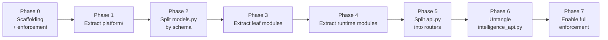

# Refactor Plan — Flat Package to Modular Monolith

> Status: Authoritative. Owner: Engineering.
> Converting `src/aida/` (~18,000 lines, flat) into the 21-module structure of `10-architecture/04-module-decomposition.md`, **without stopping feature delivery and without a big-bang rewrite.**

## 1. Why this is worth doing now

Three defects are already active: no enforceable boundaries, high change amplification through shared `models.py`/`schemas.py`, and no extraction seam. Every month of new features on the current shape makes the refactor larger.

The refactor is also a **prerequisite for the roadmap**: modules 08 (glossary), 18 (studio), and 19 (context products) are large new builds. Building them into the flat package would roughly double the eventual refactor.

## 2. Strategy — strangler, not rewrite

**Rules for the whole refactor:**

1. The application works after every phase. No long-lived refactor branch.
2. Behaviour does not change. This is structural work; a behaviour change in a refactor PR is rejected.
3. Tests pass continuously. If a test needs to change, the refactor is doing something it should not.
4. Import-linter contracts are added incrementally and **never relaxed** once added.
5. Each phase is independently shippable and revertible.

## 3. Phase 0 — Scaffolding and enforcement

Build the container before moving anything into it.

| Task | Detail |
|---|---|
| Create `src/atlas/` with `platform/` and `modules/` | Empty target structure |
| Add import-linter with a permissive baseline | Records the current state so it cannot get worse |
| Add per-module Alembic schema conventions | Schema-per-module scaffolding |
| Add the Tier 0 invariant test suite | The safety net that makes the rest safe |
| Add the module template generator | Makes the uniform shape the path of least resistance |

**Exit:** contracts run in CI at a permissive baseline; invariant tests pass.

**The important part of Phase 0** is the ratchet: the baseline records existing violations and fails on *new* ones. From day one the shape stops getting worse, even before it gets better.

## 4. Phase 1 — Extract `platform/`

Move infrastructure with no domain knowledge: `db.py`, `config.py`, `logging.py`, `context.py`, plus pagination, idempotency, error taxonomy, and telemetry scaffolding (the latter four are not yet built as separate files, and are new code, not a file move). `main.py` (app assembly) moves later, in Phase 5, once it no longer has to import nearly every domain router directly.

**Correction, 2026-08-29 (ST-04 verification):** `events.py` was listed here in an earlier revision of this plan. It doesn't belong in Phase 1 — it directly constructs and writes `AuditEvent`/`OutboxEvent` (`aida.models`), which are module 20's owned tables per `04-module-decomposition.md` §4 and §9, not domain-free infrastructure. Moving it to `platform/` as-is would fail the `platform-purity` contract on day one. §9 already has the right target: `events.py` and `projectors/outbox_publisher.py` move to module 20 (observability-audit) in Phase 3/4. What genuinely belongs in `platform/`'s `outbox` package (§8) is a generic transactional-write primitive every module calls — that doesn't exist yet; it's new code to design, not this file moved verbatim.

**Exit:** `platform-purity` contract passes — `platform/` imports no domain module.

**Risk: low.** These have few inbound domain dependencies.

## 5. Phase 2 — Split `models.py` and `schemas.py`

**The highest-value and highest-risk phase.** 1,274 + 1,298 lines split across 21 modules.

| Step | Detail |
|---|---|
| 2.1 | Map every model class to its owning module (mapping table in `04-module-decomposition.md` §9) |
| 2.2 | Create per-module `models.py` files with `__table_args__ = {"schema": "<module>"}` |
| 2.3 | **Migration: move tables into their module schemas.** No data movement — `ALTER TABLE … SET SCHEMA` |
| 2.4 | **Replace cross-module ForeignKey constraints with plain ID columns** (ADR-0015) |
| 2.5 | Split `schemas.py` into per-module `schemas.py` (private) and `contracts.py` (public DTOs) |
| 2.6 | Add the `module-privacy` contract |

**Risk: high.** Step 2.4 removes database-enforced integrity. Mitigations: run an orphan-detection reconciliation job before and after; assert identical counts; keep the change reversible for one release; do 2.4 as its own PR so it can be reverted independently.

**Exit:** every model lives in its module's schema; no cross-schema FKs except into `identity`.

## 6. Phase 3 — Extract leaf modules

Modules with few dependencies, in order: `identity` (01), `connectivity` (02), `ingestion` (03), `catalog` (04), `observability` (20).

Per module: move the code, define `api.py` and `contracts.py`, convert callers to use the public interface, move tests to `modules/<name>/tests/`, verify standalone execution, and tighten the import contract for that module.

**Risk: medium.** `catalog` has many inbound callers; convert them incrementally with the old import kept as a deprecated alias for one release.

## 7. Phase 4 — Extract runtime modules

`query_gateway` (16), `model_gateway` (15), `tools` (14), `agent_runtime` (13), `governance` (17).

**The critical step: add the `gateway-exclusivity` contract.** This is INV-2 made mechanical, and it is the highest-value single line in the whole import-linter configuration.

`agent_runtime` merges `agent_orchestrator.py`, `agent_runtime.py`, `agent_intelligence.py`, `agent_evals.py`, and `prompt_risk.py` — four files that are one bounded context.

**Risk: medium.** These are hot paths; performance must be verified after extraction (no accidental N+1 from interface indirection).

## 8. Phase 5 — Split `api.py`

1,530 lines into per-module `router.py` files, mounted by `entrypoints/api.py`.

**Route paths must not change.** This is invisible to clients. Verify with the OpenAPI diff gate: the spec after the split must be identical to the spec before it. That test makes the phase objectively safe.

**Risk: low, given the diff gate.**

## 9. Phase 6 — Untangle `intelligence_api.py`

1,140 lines spanning relationships (06), semantics (07), and lineage (09).

Untangle by tracing each endpoint to the domain it actually serves. Where a single endpoint serves two domains, split it into two endpoints with a composition layer — do not put shared logic in a `common` module.

**Risk: medium.** This is the least mechanical phase and needs domain judgement.

## 10. Phase 7 — Full enforcement

| Task | Detail |
|---|---|
| Remove all import-linter baseline exemptions | The ratchet reaches zero |
| Enable the layered contract at full strictness | |
| Enable the cross-cutting acyclicity contract | |
| Per-module CI jobs | Each module's tests run independently |
| Delete deprecated import aliases | |
| Update all module specs to reflect reality | |

**Exit:** zero exemptions; every module extraction-ready per `30-contracts/03-internal-module-contracts.md` §9.

## 11. Sequencing with feature work

| Phase | Feature work in parallel? | Note |
|---|---|---|
| 0 Scaffolding | Yes | Additive only |
| 1 platform/ | Yes | Low conflict |
| 2 models split | **Freeze migrations** | The one phase needing a quiet window |
| 3 Leaf modules | Yes, in other modules | |
| 4 Runtime modules | Limited in runtime | |
| 5 api.py split | Freeze new endpoints briefly | Short phase |
| 6 intelligence untangle | Limited in 06/07/09 | |
| 7 Enforcement | Yes | Cleanup |

**Rule for new modules built during the refactor.** Glossary (08), studio (18), and context products (19) are **built directly in the target structure from day one**. They never enter the flat package. This is why Phase 0 comes first: the target structure must exist before the new builds start.

## 12. Effort and risk summary

| Phase | Relative effort | Risk | Reversible? |
|---|---|---|---|
| 0 Scaffolding | S | Low | Yes |
| 1 platform/ | M | Low | Yes |
| 2 models split | **L** | **High** | Yes, within one release |
| 3 Leaf modules | L | Medium | Yes |
| 4 Runtime modules | M | Medium | Yes |
| 5 api.py split | M | Low | Yes |
| 6 intelligence untangle | M | Medium | Yes |
| 7 Enforcement | S | Low | Yes |

## 13. Success criteria

1. No module imports another module's private files.
2. Every module's tests run standalone.
3. Every module owns its schema; no cross-schema FKs except into `identity`.
4. Import-linter passes with **zero** exemptions.
5. `api.py`, `models.py`, and `schemas.py` no longer exist as god-modules.
6. All nine invariant tests pass.
7. No behaviour change and no performance regression.
8. A new engineer can find where code belongs from `40-engineering/01-development-spec.md` §5 alone.

## Related documents

- Module decomposition: `10-architecture/04-module-decomposition.md`
- Repository layout: `40-engineering/02-repository-layout.md`
- ADR-0011, ADR-0015
