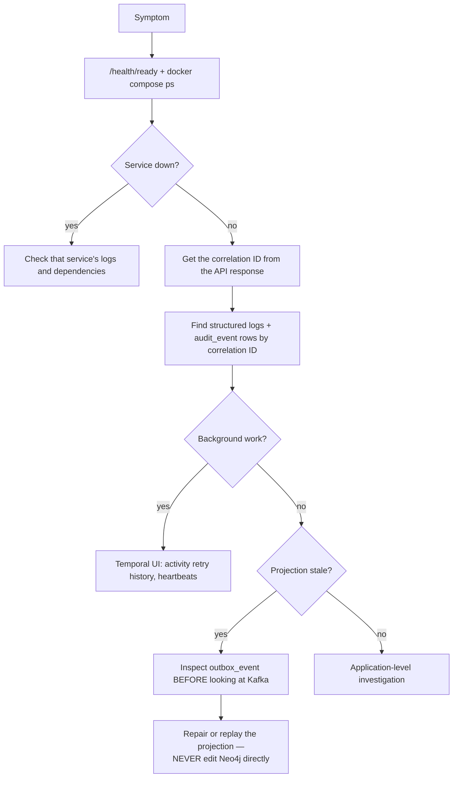

# Local Operations Runbook

> Status: Authoritative for the local environment. Owner: Engineering.
> Local Docker is a **production-shaped engineering environment**, not a production topology. Production procedures are in `10-architecture/09-deployment-topology.md`.

## 1. Start and verify

```powershell
docker compose up -d --build
docker compose ps
Invoke-RestMethod http://localhost:8000/health/live
Invoke-RestMethod http://localhost:8000/health/ready
./scripts/verify-local.ps1
```

### What the default stack starts, and what it does not

`docker compose up` starts ten services: `postgres`, `temporal`, `migrate`,
`api`, `ui-next`, `metadata-worker`, `fleet-scheduler`, `sample-source`,
`sample-mssql-source` and `sample-mssql-source-init`. The rest are behind
Compose profiles. With default settings Redis, Neo4j and MinIO are not reached,
but **Redpanda is**: `metadata-worker` starts a Kafka consumer side-car
(`run_newly_created_table_drafter_consumer`, supervised by
`supervise_newly_created_table_drafter`, from `aida/workflows/worker.py`)
whenever `AIDA_AUTO_ENQUEUE_ON_INGEST` is true, and it defaults to true. With no
Redpanda in the default stack the consumer cannot connect, so the auto-drafting
of descriptions for newly created tables does not happen (and, with no
`outbox-publisher`, the events it would consume stay `PENDING`). That is no
longer silent: the supervisor logs `newly_created_table_drafter_unavailable`
(with `attempt`, `next_retry_seconds` and `bootstrap_servers`; an error on the
first failure and every tenth attempt, a warning between) and retries with a
backoff that doubles from 2 s to a cap of 60 s, while the Temporal worker
carries on. Run with `--profile events` and it starts working, with no restart
of `metadata-worker`, once Redpanda is reachable
(`newly_created_table_drafter_started`), or set
`AIDA_AUTO_ENQUEUE_ON_INGEST=false` to turn the feature off explicitly, which
also stops the retries and the log lines. The same state is a metric,
`aida_newly_created_table_drafter_consumer_up`, which is 0 for as long as the
consumer is being retried once `metadata-worker` has opened its metrics port
(section 9c).

| Profile | Services | Capability that is **off** without it | Turn it on |
|---|---|---|---|
| `cache` | `redis` | Redis-backed lineage cache and MCP budget counters. The limits in `mcp_budget.py` are unchanged and still enforced; without Redis there is no store to enforce them in. | `$env:AIDA_LINEAGE_CACHE_ENABLED="true"; $env:AIDA_MCP_BUDGET_ENABLED="true"; docker compose --profile cache up -d` |
| `graph` | `neo4j`, `graph-projector`, `redpanda`, `outbox-publisher` | **Neo4j graph reads.** Graph, lineage and impact screens keep working on the `postgres` graph adapter — the certified one, reading the same relational tables — so this profile is only needed to exercise Neo4j itself. | `$env:AIDA_LINEAGE_NEO4J_READ_ENABLED="true"; docker compose --profile graph up -d` |
| `events` | `redpanda`, `redpanda-console`, `outbox-publisher` | **Kafka transport and the projection it drives.** Producers still write every event to `outbox_event`; rows stay `PENDING` until a publisher runs. Also off: the auto-drafting of descriptions for newly created tables (see above). | `docker compose --profile events up -d` |
| `archive` | `minio` | **The audit archive destination.** `audit_archive_storage_backend` defaults to `none` (`NullArchiveStorage` refuses rather than reporting success). | `$env:AIDA_AUDIT_ARCHIVE_STORAGE_BACKEND="s3"; docker compose --profile archive up -d` |
| `temporal-ui` | `temporal-ui` | The Temporal Web UI only. Temporal itself is in the default stack. | `docker compose --profile temporal-ui up -d` |
| `monitoring` | `prometheus` | **Metrics scraping** on `http://localhost:9090`. It scrapes `api:8000`; the worker processes only when `AIDA_WORKER_METRICS_PORT` is set (default `0`: they do not listen; `infra/monitoring/prometheus/prometheus.yml` expects `9108`). | `docker compose --profile monitoring up -d` |
| `full` | all of the above except `seed` — 19 of the 20 services in `compose.yaml` | — | `docker compose --profile full up -d --build` |

`graph` deliberately pulls in `redpanda` and `outbox-publisher`: `graph-projector`
is a Kafka consumer, and Compose refuses a project whose enabled service depends
on a service in a profile that is off. Profiles combine, so
`--profile cache --profile events` is valid.

`verify-local.ps1` is expected to pass against the default stack: its graph
assertions — knowledge-graph topology, bounded neighbourhood, and the
`graph-summary` `projection_status` — are served through
`resolve_graph_store_backend`, which defaults to the `postgres` adapter reading
the same relational tables, so they need neither Neo4j nor Kafka. That
reasoning has not yet been confirmed by a full run of the verifier against a
profile-less stack; run it and record the result here when you next bring the
stack up.

### What the verifier proves

`verify-local.ps1` is the closest thing to an acceptance test for the whole platform. It creates an isolated organization/LOB/project, then:

| Area | Verified |
|---|---|
| Connectivity | PostgreSQL and SQL Server connectivity, discovery, profiling, certification |
| SQL Server | SHOWPLAN cost estimation, governed query, masking |
| Ingestion | Synchronous and durable-batch delivery, replay, conflicting-content denial |
| Quality | Policy configuration and observation recording |
| AI safety | Prompt-risk **blocking** and benign `SCREENED`/`ALLOW` |
| Execution | Governed SQL and tool-first agent runs |
| Privacy | Masking and value-free lineage |
| Governance | Maker-checker decisions and scheduling |
| Graph | Search and expansion policy caps |
| Model governance | Route approval remains separate from activation (ADR-0009) |
| Projections | Reconciliation |

## 2. Service endpoints

| Service | Endpoint | Use | Profile |
|---|---|---|---|
| Atlas portal | `http://localhost:3001` (`http://localhost:5174` with the `compose.dev.yaml` overlay) | Analyst, steward, governance, operations workbenches | default |
| API / OpenAPI | `http://localhost:8000/docs` | API exploration | default |
| Temporal UI | `http://localhost:8080` | Workflow history and retries | `temporal-ui` |
| Redpanda Console | `http://localhost:8081` | Topics and consumer groups | `events` |
| Neo4j Browser | `http://localhost:7474` | Projection inspection | `graph` |
| MinIO Console | `http://localhost:9001` | Object storage | `archive` |
| Prometheus | `http://localhost:9090` | Metrics scraping; `/targets` shows what is up | `monitoring` |

The last five resolve only when their profile is enabled — see section 1.

Local credentials in `compose.yaml` are intentionally non-production values.

## 3. Routine evidence checks

```powershell
docker compose logs --tail 100 api metadata-worker

# outbox-publisher and graph-projector run only under the events/graph
# profiles. Naming a service explicitly enables its profile, so no --profile
# flag is needed here; the command simply returns nothing when they were
# never started.
docker compose logs --tail 100 outbox-publisher graph-projector

docker compose exec postgres psql -U aida -d aida -c "select status, count(*) from analysis_run group by status"
docker compose exec postgres psql -U aida -d aida -c "select status, count(*) from query_execution group by status"
docker compose exec postgres psql -U aida -d aida -c "select status, count(*) from data_quality_observation group by status"
docker compose exec postgres psql -U aida -d aida -c "select status, severity, count(*) from data_quality_incident group by status, severity"
docker compose exec postgres psql -U aida -d aida -c "select status, count(*) from outbox_event group by status"
docker compose exec postgres psql -U aida -d aida -c "select status, count(*) from metadata_ingestion_batch group by status"
docker compose exec postgres psql -U aida -d aida -c "select status, count(*) from metadata_ingestion_chunk group by status"
```

### Expected invariants

If any of these is false, stop and investigate before continuing — each corresponds to a platform guarantee.

| Invariant | Guarantee |
|---|---|
| Every completed analysis run has a Temporal workflow ID | Durability (ADR-0002) |
| Profiling persists **no source values** | INV-6 |
| Quality observations retain only counts, rates, identifiers, fingerprints | INV-6, ADR-0016 |
| Metadata scan age is **not** presented as source-row freshness | ADR-0016 |
| Every query execution is `COMPLETED`, `REJECTED`, or `FAILED` with audit evidence | INV-2, INV-7 |
| Pending outbox events drain to `PUBLISHED` (**`events`/`graph` profile only** — with no publisher running, `PENDING` is the correct and lossless resting state; PostgreSQL is authoritative) | Projection health |
| Completed ingestion chunks expose only checksums and counts, with SQL-NULL payload | ADR-0012 |
| The graph can be rebuilt from PostgreSQL and events | INV-1 |

## 4. Migration and readiness

```powershell
docker compose run --rm migrate alembic check
Invoke-RestMethod http://localhost:8000/health/ready
```

`alembic check` must report a single head with no drift.

`/health/ready` stays green on the default stack: `aida/readiness.py` probes
PostgreSQL, Temporal, the background tasks, the outbox backlog and the
workspace authorization posture — none of Redis, Neo4j, Kafka or the object
store. The outbox probe reports `pending` and `oldest_age_seconds` as numbers
and is `DOWN` only when it cannot measure them at all, so the backlog that
accumulates without a publisher does not turn readiness red.

## 5. Enterprise ingestion — manual operation

Open **Source fleet** at `http://localhost:3001` (`http://localhost:5174` with the development overlay).

1. Run connection verification.
2. Run at least one pull scan **before** certification — certification checks prior connection evidence.
3. Canonical delivery defaults to `INCREMENTAL`.
4. For large estates: create a batch manifest, upload every numbered chunk, then finalize.
5. Temporal progress and checksums remain visible after successful payload cleanup.
6. Use `FULL` **only** when all chunks together represent the entire datasource scope. Omission retirement is deferred until every chunk succeeds (ADR-0012).

**Do not submit sample rows or secrets in metadata attributes.** The contract rejects common value-bearing keys, but producer-side classification and review remain required for descriptions and default expressions.

### SQL Server fixture requirements

The fixture source needs `db_datareader` for governed SELECT and database-scoped `SHOWPLAN` for no-execution cost estimation. The init sidecar uses `sqlcmd -b`; a credential, DDL, or grant failure **must leave the service failed** rather than silently producing a partial fixture. A partial fixture produces tests that pass for the wrong reason.

## 6. Safe restart

```powershell
docker compose restart api metadata-worker

# Only meaningful when the events/graph profile is up; a no-op otherwise.
docker compose restart outbox-publisher graph-projector
```

Temporal histories, PostgreSQL state, Kafka logs, Neo4j data, Redis state, and object storage survive restarts through named volumes. The volumes behind the optional services are declared unconditionally, so enabling a profile later reattaches the same data rather than starting empty.

## 7. Stop

```powershell
docker compose stop
```

**Do not** use `docker compose down -v` unless destruction of all local platform and sample data is explicitly intended.

## 8. Failure triage



**The rule that matters:** PostgreSQL is authoritative (INV-1). Repairing a symptom by editing Neo4j creates a divergence that the next rebuild silently reverts, and you will debug it twice.

## 9. Common issues

| Symptom | Likely cause | Action |
|---|---|---|
| `/health/ready` fails | A dependency is not up | Check `docker compose ps`; readiness is dependency-gated by design |
| Generation returns an explicit denial | One of the five activation conditions is unmet | Check activation posture — this is correct behaviour, not a bug (ADR-0009) |
| Freshness shows `NOT_CONFIGURED` | No approved watermark contract | Correct behaviour (ADR-0016) |
| Batch stuck at finalize | Missing chunk in the sequence | Check chunk numbers — finalization requires exact `1..N` |
| Batch finalize fails when Temporal is down | Fail-closed by design | Restore Temporal; no stranded job was created |
| Projection stale | Outbox backlog or projector down | Check `outbox_event` status counts first. On the default stack there is no publisher at all, so a `PENDING` backlog is expected, not a fault — start `--profile events` (or `--profile graph`) to drain it |
| An optional service is absent from `docker compose ps` | Its profile was not enabled | Expected. Bring it up with the `--profile` flag from section 1. Naming a profiled service explicitly (`docker compose up neo4j`) enables its profile too; the flag is what a *bare* `docker compose up` needs |
| Query rejected with a policy denial | Working as designed | Check the denial reason code in the trace |
| Cross-tenant 403 | Working as designed | Verify the organization header |

## 9b. Connecting an MCP client locally

Lifted 2026-08-30 from the retired MCP integration guide
(`_superseded/26-mcp-server-integration-guide.md`) — this was the only operational content in it.

The server is a plain HTTP JSON-RPC 2.0 endpoint at `POST /mcp`, authenticated with the same
OIDC bearer token as the REST API. It is **not** a stdio server, so a client that only speaks
stdio needs an HTTP proxy in front of it rather than a direct `command` entry:

```json
{
  "mcpServers": {
    "atlas": {
      "command": "npx",
      "args": ["-y", "mcp-remote", "http://localhost:8000/mcp"],
      "env": { "ATLAS_TOKEN": "<your-oidc-token>" }
    }
  }
}
```

Whatever the client, the governance path is identical to the REST path and cannot be bypassed
through MCP: prompt-risk screening before retrieval (ADR-0013), SQL AST validation and cost
gating in the query gateway (INV-2), classification-based masking, an immutable `QueryExecution`
and `AgentRun` record (INV-7), and a `query.execution.completed.v1` outbox event.

## 9c. The scheduler's leader and the table drafter: what to scrape, and the keepalive settings

> **Implementation status (2026-09-21).** R11-AUD03 and R11-AUD04 remainders. The series and the
> three alerts below exist and are unit-tested (`tests/test_scheduler_leadership.py`,
> `tests/test_newly_created_table_drafter_supervisor.py`, `tests/test_monitoring_rules.py`), against
> a fake lock and a stub consumer. They have **not** been scraped by a running Prometheus, the alert
> expressions have not been through `promtool`, and **no failover drill has been run**, so every
> number in the keepalive table is arithmetic, not a measurement.

**What is published, and by which process.** Each is in that process's own registry, so it is
reachable only when that process has opened its metrics listener (`aida.worker_metrics`), which it
does only when `AIDA_WORKER_METRICS_PORT` is non-zero in its own environment. The default is 0.

| Series | Process (compose service) | Reads as |
|---|---|---|
| `aida_scheduler_is_leader` | `fleet-scheduler` | 1 while this replica holds the leadership lock as of its last check, 0 while it stands by. One series per replica; the scrape's `instance` names the replica. |
| `aida_scheduler_leadership_transitions_total` (`transition` is `acquired` or `lost`) | `fleet-scheduler` | Changes this process saw. `lost` is a leader whose check failed; a clean shutdown is not counted. |
| `aida_newly_created_table_drafter_consumer_up` (`consumer_group`) | `metadata-worker` | 1 while the drafter's Kafka consumer has started and is consuming, 0 while it is not. **No series at all** when `auto_enqueue_on_ingest` is off or the process has no listener. |
| `aida_newly_created_table_drafter_failures_total` | `metadata-worker` | Attempts that ended without a stop having been asked for; the supervisor restarts the consumer after each. |

Turn it on for the compose stack (the listener is inside each container's network; compose
publishes no host port for it):

```powershell
$env:AIDA_WORKER_METRICS_PORT="9108"; docker compose --profile monitoring up -d fleet-scheduler metadata-worker prometheus
```

With the default of 0, `http://localhost:9090/targets` shows `atlas-fleet-scheduler` and
`atlas-metadata-worker` as DOWN, which is the honest reading: nothing is listening.

**Reading them.**

* Which replica leads: `aida_scheduler_is_leader == 1`. How many do: `sum(aida_scheduler_is_leader)` --
  1 is healthy. 0 for five minutes is `AtlasSchedulerNoLeader`. More than 1 is visible but has no
  alert: a deposed leader keeps reading 1 until the iteration it is running ends, and how long that
  is has not been measured, so a fixed window would either page on a normal handover or wait out a
  real fault. More than 1 that persists is the sign of a lock that is not excluding anyone, most
  likely `AIDA_DATABASE_URL` pointing at a transaction-mode pooler.
* Leadership flapping: `sum(increase(aida_scheduler_leadership_transitions_total{transition="lost"}[1h]))`;
  `AtlasSchedulerLeadershipFlapping` fires at three, a placeholder.
* The drafter: on the **default stack this is 0, and that is expected** -- `auto_enqueue_on_ingest`
  defaults to true and the stack has no broker. `AtlasNewlyCreatedTableDrafterConsumerDown` fires
  after 15 minutes there. Start `--profile events` and it goes to 1 without restarting the worker,
  or set `AIDA_AUTO_ENQUEUE_ON_INGEST=false`, which removes the series and silences the alert.
  A message that fails on every delivery keeps the gauge at 0 except for the moment each attempt
  starts, so a scrape can land on 1; `aida_newly_created_table_drafter_failures_total` rising is the
  unambiguous view of that loop.

**Failover time, and the keepalive settings that decide it.** The leadership lock is held by a
PostgreSQL backend. When the leader's process dies the operating system closes its socket and
PostgreSQL releases the lock at once. When its host or network vanishes without closing anything,
PostgreSQL releases it only when it decides the connection is dead, and that is TCP keepalive's
decision. `tcp_keepalives_idle`, `tcp_keepalives_interval` and `tcp_keepalives_count` default to 0,
which PostgreSQL documents as "the operating system's default"; nothing in this repository's compose
file, `infra/postgres/init.sql` or code sets them. Linux's defaults are 7200 s, 75 s and 9 probes
(kernel `ip-sysctl` documentation), so the dead peer is noticed after 7200 + 9 x 75 = 7875 s, which is
2 h 11 min 15 s. The isolated leader stops itself at its next check (a 5 s timeout, made before every
iteration), so this is not a double run -- it is **no scheduler at all** for that long.

| Setting | Linux default | Recommended | Notes |
|---|---|---|---|
| `tcp_keepalives_idle` | 7200 s | 60 | Silence before the first probe. |
| `tcp_keepalives_interval` | 75 s | 10 | Between unanswered probes. |
| `tcp_keepalives_count` | 9 | 6 | Unanswered probes before the server gives up. |
| Dead peer noticed after | 7875 s | **120 s** | idle + interval x count |

Add the standby's 5 s retry and the failover is about two minutes. `AtlasSchedulerNoLeader` waits five
minutes because of exactly that: long enough that a failover that works does not page, short enough
that one that does not is reported in minutes rather than hours. Change these numbers and that
window has to be revisited; `tests/test_monitoring_rules.py` reads the values below and fails if the
window no longer outlasts them.

Why these and not lower or higher. A healthy peer answers a probe, so a short idle time costs a few
packets per idle connection per minute, and a live leader's connection is quiet only while a pass is
running; the probes can also keep a flow alive through a NAT or load balancer that drops idle ones.
It is the count that decides how much silence a session survives: 6 probes 10 s apart is a minute of
total silence before the server ends it, which rides out a brief route flap. Lower it and a leader
that was only briefly unreachable loses its session for no gain, because it has already stopped
itself. Raise it and every added minute is a minute without a scheduler. These are starting values
from the arithmetic above, not from a drill.

Set them in `postgresql.conf` (or a managed service's parameter group) and reload:

```
tcp_keepalives_idle = 60
tcp_keepalives_interval = 10
tcp_keepalives_count = 6
```

or for one role, if only some sessions should carry them. The shipped configuration has a single
role (`aida`) for every Atlas process, so today that is all of them, including the API's pooled
connections. A role of the scheduler's own is a deployment decision this repository does not make:

```sql
ALTER ROLE aida SET tcp_keepalives_idle = 60;
ALTER ROLE aida SET tcp_keepalives_interval = 10;
ALTER ROLE aida SET tcp_keepalives_count = 6;
```

All three are user-settable parameters (they are `PGC_USERSET` in PostgreSQL 17's `guc_tables.c`),
which is why a role can carry them. A role or reload change reaches sessions opened after it; the
leader's lock connection is long-lived, so restart the scheduler to be sure it has them.

Check with `SHOW tcp_keepalives_idle;` **over TCP** -- PostgreSQL ignores these settings for sessions
on a Unix-domain socket and reads them as 0 there, so a `psql` run inside the container with no
`-h` reports 0 whatever is set (`docker compose exec postgres psql -h 127.0.0.1 -U aida -d aida`).
The `pg_locks` query in `src/aida/scheduler_leadership.py` names the leader's backend.

PostgreSQL also has `tcp_user_timeout` (milliseconds; the local stack's PostgreSQL 17 has it). It
bounds a case keepalives do not: a peer that vanishes while the server still has unacknowledged data
in flight, which the TCP retransmission timer governs (about 925 s on Linux by default, per the
kernel documentation) rather than keepalive. The lock session is idle between checks, so keepalives
are the path that matters for it, and no value is recommended here: how it interacts with keepalives
is operating-system specific and has not been measured on this platform.

**The first drill.** Isolate the leader from PostgreSQL without closing its connection (drop its
packets; do not stop the container), and time the gap from `scheduler_lost_leadership` on the
isolated replica to `scheduler_became_leader` on the standby. Compare it with the two minutes
computed here and record the result in this section.

## 10. Production substitutions

Before any deployment:

| Local | Production |
|---|---|
| Development identity headers | Bank OIDC issuer, audience, JWKS, claim mappings |
| `env://` secrets | Registered enterprise secret adapter |
| Single-node services | Managed or HA platforms |
| Source credentials | Read-only delegated source identity |
| Local policy | Bank policy bundle |

Production configuration **rejects** development identity, the development SQL override, weak audit keys, non-HTTPS remote JWKS, and `env://` credentials (INV-4).

## Related documents

- Deployment topology: `10-architecture/09-deployment-topology.md`
- Testing strategy: `40-engineering/04-testing-strategy.md`
- Observability and audit: `20-modules/20-observability-and-audit.md`
