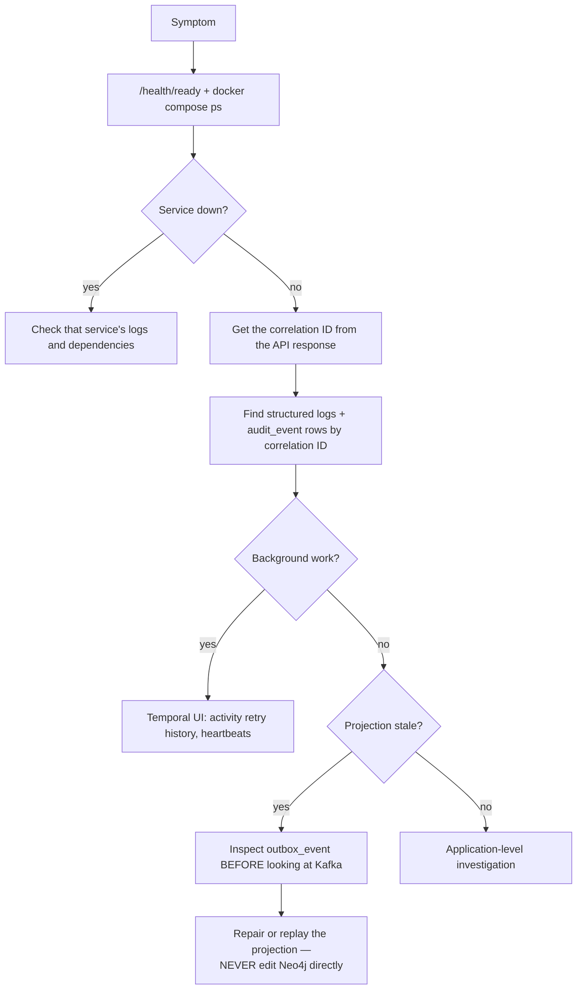

# Local Operations Runbook

> Status: Authoritative for the local environment. Owner: Engineering.
> Local Docker is a **production-shaped engineering environment**, not a production topology. Production procedures are in `10-architecture/09-deployment-topology.md`.

## 1. Start and verify

```powershell
docker compose up -d --build
docker compose ps
Invoke-RestMethod http://localhost:8000/health/live
Invoke-RestMethod http://localhost:8000/health/ready
./scripts/verify-local.ps1
```

### What the default stack starts, and what it does not

`docker compose up` starts ten services: `postgres`, `temporal`, `migrate`,
`api`, `ui-next`, `metadata-worker`, `fleet-scheduler`, `sample-source`,
`sample-mssql-source` and `sample-mssql-source-init`. The rest are behind
Compose profiles because, with default settings, nothing reaches them.

| Profile | Services | Capability that is **off** without it | Turn it on |
|---|---|---|---|
| `cache` | `redis` | Redis-backed lineage cache and MCP budget counters. The limits in `mcp_budget.py` are unchanged and still enforced; without Redis there is no store to enforce them in. | `$env:AIDA_LINEAGE_CACHE_ENABLED="true"; $env:AIDA_MCP_BUDGET_ENABLED="true"; docker compose --profile cache up -d` |
| `graph` | `neo4j`, `graph-projector`, `redpanda`, `outbox-publisher` | **Neo4j graph reads.** Graph, lineage and impact screens keep working on the `postgres` graph adapter — the certified one, reading the same relational tables — so this profile is only needed to exercise Neo4j itself. | `$env:AIDA_LINEAGE_NEO4J_READ_ENABLED="true"; docker compose --profile graph up -d` |
| `events` | `redpanda`, `redpanda-console`, `outbox-publisher` | **Kafka transport and the projection it drives.** Producers still write every event to `outbox_event`; rows stay `PENDING` until a publisher runs. | `docker compose --profile events up -d` |
| `archive` | `minio` | **The audit archive destination.** `audit_archive_storage_backend` defaults to `none` (`NullArchiveStorage` refuses rather than reporting success). | `$env:AIDA_AUDIT_ARCHIVE_STORAGE_BACKEND="s3"; docker compose --profile archive up -d` |
| `temporal-ui` | `temporal-ui` | The Temporal Web UI only. Temporal itself is in the default stack. | `docker compose --profile temporal-ui up -d` |
| `full` | all of the above | — | `docker compose --profile full up -d --build` |

`graph` deliberately pulls in `redpanda` and `outbox-publisher`: `graph-projector`
is a Kafka consumer, and Compose refuses a project whose enabled service depends
on a service in a profile that is off. Profiles combine, so
`--profile cache --profile events` is valid.

`verify-local.ps1` is expected to pass against the default stack: its graph
assertions — knowledge-graph topology, bounded neighbourhood, and the
`graph-summary` `projection_status` — are served through
`resolve_graph_store_backend`, which defaults to the `postgres` adapter reading
the same relational tables, so they need neither Neo4j nor Kafka. That
reasoning has not yet been confirmed by a full run of the verifier against a
profile-less stack; run it and record the result here when you next bring the
stack up.

### What the verifier proves

`verify-local.ps1` is the closest thing to an acceptance test for the whole platform. It creates an isolated organization/LOB/project, then:

| Area | Verified |
|---|---|
| Connectivity | PostgreSQL and SQL Server connectivity, discovery, profiling, certification |
| SQL Server | SHOWPLAN cost estimation, governed query, masking |
| Ingestion | Synchronous and durable-batch delivery, replay, conflicting-content denial |
| Quality | Policy configuration and observation recording |
| AI safety | Prompt-risk **blocking** and benign `SCREENED`/`ALLOW` |
| Execution | Governed SQL and tool-first agent runs |
| Privacy | Masking and value-free lineage |
| Governance | Maker-checker decisions and scheduling |
| Graph | Search and expansion policy caps |
| Model governance | Route approval remains separate from activation (ADR-0009) |
| Projections | Reconciliation |

## 2. Service endpoints

| Service | Endpoint | Use | Profile |
|---|---|---|---|
| Atlas portal | `http://localhost:3000` | Analyst, steward, governance, operations workbenches | default |
| API / OpenAPI | `http://localhost:8000/docs` | API exploration | default |
| Temporal UI | `http://localhost:8080` | Workflow history and retries | `temporal-ui` |
| Redpanda Console | `http://localhost:8081` | Topics and consumer groups | `events` |
| Neo4j Browser | `http://localhost:7474` | Projection inspection | `graph` |
| MinIO Console | `http://localhost:9001` | Object storage | `archive` |

The last four resolve only when their profile is enabled — see section 1.

Local credentials in `compose.yaml` are intentionally non-production values.

## 3. Routine evidence checks

```powershell
docker compose logs --tail 100 api metadata-worker

# outbox-publisher and graph-projector run only under the events/graph
# profiles. Naming a service explicitly enables its profile, so no --profile
# flag is needed here; the command simply returns nothing when they were
# never started.
docker compose logs --tail 100 outbox-publisher graph-projector

docker compose exec postgres psql -U aida -d aida -c "select status, count(*) from analysis_run group by status"
docker compose exec postgres psql -U aida -d aida -c "select status, count(*) from query_execution group by status"
docker compose exec postgres psql -U aida -d aida -c "select status, count(*) from data_quality_observation group by status"
docker compose exec postgres psql -U aida -d aida -c "select status, severity, count(*) from data_quality_incident group by status, severity"
docker compose exec postgres psql -U aida -d aida -c "select status, count(*) from outbox_event group by status"
docker compose exec postgres psql -U aida -d aida -c "select status, count(*) from metadata_ingestion_batch group by status"
docker compose exec postgres psql -U aida -d aida -c "select status, count(*) from metadata_ingestion_chunk group by status"
```

### Expected invariants

If any of these is false, stop and investigate before continuing — each corresponds to a platform guarantee.

| Invariant | Guarantee |
|---|---|
| Every completed analysis run has a Temporal workflow ID | Durability (ADR-0002) |
| Profiling persists **no source values** | INV-6 |
| Quality observations retain only counts, rates, identifiers, fingerprints | INV-6, ADR-0016 |
| Metadata scan age is **not** presented as source-row freshness | ADR-0016 |
| Every query execution is `COMPLETED`, `REJECTED`, or `FAILED` with audit evidence | INV-2, INV-7 |
| Pending outbox events drain to `PUBLISHED` (**`events`/`graph` profile only** — with no publisher running, `PENDING` is the correct and lossless resting state; PostgreSQL is authoritative) | Projection health |
| Completed ingestion chunks expose only checksums and counts, with SQL-NULL payload | ADR-0012 |
| The graph can be rebuilt from PostgreSQL and events | INV-1 |

## 4. Migration and readiness

```powershell
docker compose run --rm migrate alembic check
Invoke-RestMethod http://localhost:8000/health/ready
```

`alembic check` must report a single head with no drift.

`/health/ready` stays green on the default stack: `aida/readiness.py` probes
PostgreSQL, Temporal, the background tasks, the outbox backlog and the
workspace authorization posture — none of Redis, Neo4j, Kafka or the object
store. The outbox probe reports `pending` and `oldest_age_seconds` as numbers
and is `DOWN` only when it cannot measure them at all, so the backlog that
accumulates without a publisher does not turn readiness red.

## 5. Enterprise ingestion — manual operation

Open **Source fleet** at `http://localhost:3000`.

1. Run connection verification.
2. Run at least one pull scan **before** certification — certification checks prior connection evidence.
3. Canonical delivery defaults to `INCREMENTAL`.
4. For large estates: create a batch manifest, upload every numbered chunk, then finalize.
5. Temporal progress and checksums remain visible after successful payload cleanup.
6. Use `FULL` **only** when all chunks together represent the entire datasource scope. Omission retirement is deferred until every chunk succeeds (ADR-0012).

**Do not submit sample rows or secrets in metadata attributes.** The contract rejects common value-bearing keys, but producer-side classification and review remain required for descriptions and default expressions.

### SQL Server fixture requirements

The fixture source needs `db_datareader` for governed SELECT and database-scoped `SHOWPLAN` for no-execution cost estimation. The init sidecar uses `sqlcmd -b`; a credential, DDL, or grant failure **must leave the service failed** rather than silently producing a partial fixture. A partial fixture produces tests that pass for the wrong reason.

## 6. Safe restart

```powershell
docker compose restart api metadata-worker

# Only meaningful when the events/graph profile is up; a no-op otherwise.
docker compose restart outbox-publisher graph-projector
```

Temporal histories, PostgreSQL state, Kafka logs, Neo4j data, Redis state, and object storage survive restarts through named volumes. The volumes behind the optional services are declared unconditionally, so enabling a profile later reattaches the same data rather than starting empty.

## 7. Stop

```powershell
docker compose stop
```

**Do not** use `docker compose down -v` unless destruction of all local platform and sample data is explicitly intended.

## 8. Failure triage



**The rule that matters:** PostgreSQL is authoritative (INV-1). Repairing a symptom by editing Neo4j creates a divergence that the next rebuild silently reverts, and you will debug it twice.

## 9. Common issues

| Symptom | Likely cause | Action |
|---|---|---|
| `/health/ready` fails | A dependency is not up | Check `docker compose ps`; readiness is dependency-gated by design |
| Generation returns an explicit denial | One of the five activation conditions is unmet | Check activation posture — this is correct behaviour, not a bug (ADR-0009) |
| Freshness shows `NOT_CONFIGURED` | No approved watermark contract | Correct behaviour (ADR-0016) |
| Batch stuck at finalize | Missing chunk in the sequence | Check chunk numbers — finalization requires exact `1..N` |
| Batch finalize fails when Temporal is down | Fail-closed by design | Restore Temporal; no stranded job was created |
| Projection stale | Outbox backlog or projector down | Check `outbox_event` status counts first. On the default stack there is no publisher at all, so a `PENDING` backlog is expected, not a fault — start `--profile events` (or `--profile graph`) to drain it |
| An optional service is absent from `docker compose ps` | Its profile was not enabled | Expected. Bring it up with the `--profile` flag from section 1. Naming a profiled service explicitly (`docker compose up neo4j`) enables its profile too; the flag is what a *bare* `docker compose up` needs |
| Query rejected with a policy denial | Working as designed | Check the denial reason code in the trace |
| Cross-tenant 403 | Working as designed | Verify the organization header |

## 9b. Connecting an MCP client locally

Lifted 2026-08-30 from the retired MCP integration guide
(`_superseded/26-mcp-server-integration-guide.md`) — this was the only operational content in it.

The server is a plain HTTP JSON-RPC 2.0 endpoint at `POST /mcp`, authenticated with the same
OIDC bearer token as the REST API. It is **not** a stdio server, so a client that only speaks
stdio needs an HTTP proxy in front of it rather than a direct `command` entry:

```json
{
  "mcpServers": {
    "atlas": {
      "command": "npx",
      "args": ["-y", "mcp-remote", "http://localhost:8000/mcp"],
      "env": { "ATLAS_TOKEN": "<your-oidc-token>" }
    }
  }
}
```

Whatever the client, the governance path is identical to the REST path and cannot be bypassed
through MCP: prompt-risk screening before retrieval (ADR-0013), SQL AST validation and cost
gating in the query gateway (INV-2), classification-based masking, an immutable `QueryExecution`
and `AgentRun` record (INV-7), and a `query.execution.completed.v1` outbox event.

## 10. Production substitutions

Before any deployment:

| Local | Production |
|---|---|
| Development identity headers | Bank OIDC issuer, audience, JWKS, claim mappings |
| `env://` secrets | Registered enterprise secret adapter |
| Single-node services | Managed or HA platforms |
| Source credentials | Read-only delegated source identity |
| Local policy | Bank policy bundle |

Production configuration **rejects** development identity, the development SQL override, weak audit keys, non-HTTPS remote JWKS, and `env://` credentials (INV-4).

## Related documents

- Deployment topology: `10-architecture/09-deployment-topology.md`
- Testing strategy: `40-engineering/04-testing-strategy.md`
- Observability and audit: `20-modules/20-observability-and-audit.md`
