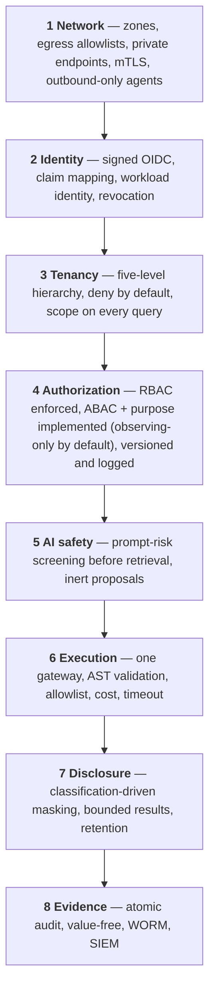

# Security Architecture

> Status: Authoritative. Owner: Platform Security.
> Scope: the controls that protect credentials, bank data, metadata, semantics, policy decisions, and evidence.

## 1. Protected assets

| Asset | Why it matters | Primary control |
|---|---|---|
| Source credentials | Direct access to bank data | Reference-only persistence; enterprise secret manager |
| Bank source data | Regulated customer, account, transaction data | Value-free control plane; masking; bounded results |
| Metadata and classifications | Reveals the estate's structure and where sensitive data lives | Tenant isolation; policy-filtered retrieval |
| Semantic definitions | Encode business logic and risk methodology | Versioning; maker-checker |
| Query results | Regulated data in motion | Bounded, masked, retention-governed |
| Identity claims | Impersonation risk | Signed OIDC verification |
| Policy decisions | The control record itself | Versioned, logged, immutable |
| Workflow histories | Operational forensics | Temporal durability |
| Audit evidence | The record a regulator inspects | Append-only, WORM export |
| Model prompts and responses | Potential leakage vector | Non-content evidence only |

## 2. Trust boundaries

```text
User / Agent
  → API identity and organization boundary          [OIDC verification, tenancy]
  → Agent orchestration boundary                    [prompt-risk screening]
  → Query Execution Gateway                         [AST, policy, cost, masking]
  → Connector / source network boundary             [read-only, delegated identity]

Control-plane transaction
  → PostgreSQL authoritative state and outbox       [atomicity, audit]
  → Kafka event boundary                            [value-free payloads, ACLs]
  → Neo4j / search / vector projections             [non-authoritative]

Metadata context
  → Model Gateway                                   [bounded, metadata-only]
  → Approved private model route                    [residency, retention, budget]
```

Each `→` is a place where something less trusted influences something more trusted. `50-security/02-threat-model.md` enumerates the threats at each.

## 3. Defence in depth



**The property to notice:** compromising any single layer does not yield data. A stolen token still faces tenancy, authorization, execution validation, and masking. A prompt injection that evades screening still faces AST validation and the allowlist. This is what makes the architecture defensible rather than merely careful.

## 4. Identity and authentication

| Control | Implementation |
|---|---|
| Token verification | Signature, issuer, audience, expiry, algorithm, subject |
| JWKS | Cached with TTL, refreshed on unknown `kid` at most once per 30-second cooldown (`src/aida/oidc.py`), so a rotated signing key is picked up by the first unknown-`kid` token after the cooldown. A failed refresh backs off 30 seconds and serves the last good key set for at most 10 minutes past its expiry, then fails closed; one shared verifier per process; pinned keys supported |
| Claim mapping | Configurable paths → organization, roles, groups |
| Failure | Denies with a generic 401. Expiry is the one reason named (`OidcTokenExpired`); signature, audience, issuer and revocation stay generic |
| Development provider | Explicit headers, **refused in production** |
| Workload identity | Required for connector agents and MCP consumers — **implemented for MCP**: outside development the endpoint admits only `AGENT` and `SERVICE_ACCOUNT` principal types (`mcp_require_workload_identity`, default on; `src/aida/mcp_server.py`). No connector agents exist |
| Revocation and replay | **Implemented** (`src/aida/token_revocation.py`) — a revoked token is refused on its next use, and a lookup that cannot be answered denies. Bank certification remains |

> **Implementation status (2026-09-21).** While the identity provider is unreachable, the JWKS cache no longer retries it on every request (R11-AUD10). After a failed attempt, a worker makes no further attempt for 30 seconds (`JWKS_REFRESH_FAILURE_BACKOFF_SECONDS`) and answers from the last good key set while that set is within 10 minutes of its cache expiry (`JWKS_STALE_KEY_SET_GRACE_SECONDS`, `src/aida/oidc.py`); past that, or when nothing was ever loaded, a request is refused with "OIDC JWKS endpoint is unavailable" (INV-4). The trade-off is that a signing key the issuer withdrew for compromise keeps verifying while this process cannot reach the issuer, for at most `oidc_jwks_cache_seconds` plus those 10 minutes (15 minutes at the shipped 300-second cache) and no longer; with a reachable provider it stops after `oidc_jwks_cache_seconds`. Both numbers are code constants, not settings. A provider that has recovered is noticed at the next attempt after the backoff, up to 30 seconds late. Each failed attempt writes one `oidc_jwks_refresh_failed` warning and the recovery one `oidc_jwks_refresh_recovered` line, so a stale key set is never silent. Pinned keys have no network and are unaffected. The token revocation route now verifies through the same per-process verifier as every other request (`shared_oidc_verifier`, `src/aida/security.py`) instead of building a new one per call, which had an empty cache and so fetched the key set on every revocation. Covered by `tests/test_oidc.py` and `tests/test_token_revocation.py`.

## 5. Authorization

| Control | State |
|---|---|
| Tenant scope check | Implemented — deny by default (INV-5) |
| Role checks | Implemented. Roles are additive sets, not a hierarchy, and some names in route guards cannot be granted under OIDC; see `20-modules/01-identity-and-tenancy.md` §5a |
| Attribute-based (classification, purpose, residency) | **Implemented for classification and purpose, observing-only by default, no residency attribute** (`src/aida/policy_engine.py`). The default posture is OBSERVING and workspaces may sit in SHADOW, where a decision is recorded but not enforced (`src/atlas/platform/config.py`) — P0 |
| Agent-vs-human context attribute | **Implemented** as the `principal_kind` policy attribute (`src/aida/policy_engine.py`), under the same observing-only default |
| Entitlement (edition) | Not implemented |
| Source-system authorization | **Always ultimately authoritative** — Atlas adds a second, stricter layer and never grants what the source would deny |
| Row/column policy | Conservative masking; source-native policy synchronization for unconditional obligations shipped for Postgres RLS (row) and SQL Server DDM (column) — preview + maker-checker apply (QG-2), apply not yet certified against a live source; subject-conditional policies and other sources remain application-level only |
| Decision logging | Partial — full logging required for auditors |

## 6. Secrets

| Control | Implementation |
|---|---|
| Persistence | **References only.** `vault://` resolves through the built-in Vault provider (`env://` is refused in production). `cyberark://` and the cloud schemes are accepted names that resolve only once a bank adapter is registered (`src/aida/secrets.py`) |
| Inline DSNs | Rejected |
| Providers | Exactly one configured and explicitly registered |
| Cache | Bounded, with rotation invalidation |
| Production | Rejects `env://` resolution |
| API exposure | Credentials never returned |
| Logging | Never — `ResolvedSecret` is not serializable |
| Rotation | Drill required before go-live |

## 7. Data protection

| Control | Implementation |
|---|---|
| Value-freedom | Enforced at ingestion, profiling, persistence, logging, events, model context (INV-6) |
| Question text | Keyed HMAC fingerprint only |
| SQL literals | Redacted before persistence |
| Masking | Deterministic classification; propagates through aliases and derived expressions |
| Result bounds | Row, byte, and time caps per workload class |
| Result retention | 24 hours default, per-classification override |
| Encryption in transit | Target: TLS everywhere; mTLS for connector agents (see the status note below) |
| Encryption at rest | Platform-standard; HMAC keys KMS-managed (target) |

> **Implementation status (2026-09-20).** Transport encryption is not in place as the target describes. The UI container's nginx listens on port 80 only (`ui-next/nginx.conf`), syslog delivery to a SIEM is plaintext over UDP or TCP (`src/aida/siem_delivery.py`), `otel_insecure` defaults to `True` (`src/atlas/platform/config.py`), and no connector agent exists to hold an mTLS identity.

## 8. Network

| Control | Implementation |
|---|---|
| Zones | Edge / app / data / source, with explicit inbound rules |
| Egress | Allowlisted by destination; no general internet access |
| Connector agents | **Outbound-only** — Atlas never dials into a restricted zone |
| Model routes | Private endpoints preferred; public endpoints require an approved residency contract |
| Data zone | Unreachable from the edge |

## 9. Fail-closed invariants

Production configuration **cannot**:

- use development identity,
- resolve credentials from the environment,
- enable the development SQL override,
- use weak audit keys,
- use an insecure remote JWKS URL.

Runtime **denies** when:

- a token fails any validation check,
- no approved and independently activated model route exists (ADR-0009),
- prompt-risk screening blocks — before retrieval, context, tool selection, or execution,
- an object is unknown, ambiguous, or cross-tenant,
- a query fails parsing, policy, catalog, cost, or read-only enforcement,
- policy state is unavailable.

**And it never treats a projection as authoritative.** Lag is visible through reconciliation counts rather than silently served as truth.

## 10. Current posture

| Domain | State |
|---|---|
| Identity | **Partial** — OIDC verification and token revocation implemented; MCP workload identity enforced outside development; bank certification and connector-agent workload identity pending |
| Authorization | **Partial** — RBAC implemented; ABAC and purpose implemented but observing-only by default, with no residency attribute; source-native policy only partly shipped (section 5) |
| Secrets | **Partial** — reference model and adapter contract implemented; bank adapter unregistered |
| Data protection | **Strong** — value-freedom, masking, bounds implemented |
| Network | **Not implemented** — single local network; zones, egress, mTLS pending |
| AI safety | **Partial** — direct prompt-risk implemented; indirect injection pending |
| Execution | **Strong** — one gateway, AST validation, cost, masking |
| Evidence | **Partial** — audit ledger, WORM archive, SIEM delivery and compliance packs implemented; the archive defaults to backend `none` and is verified only against a local Object Lock service, and SIEM delivery only against loopback stubs |
| Supply chain | **Partial** — pinned deps, non-root, CycloneDX SBOM, dependency scans (pip-audit, npm audit) and secret scanning (gitleaks) in CI; image signing, container-image scanning and a dedicated SAST scan pending |
| Certification | **Not started** — no penetration test, no SOC 2/ISO |

## Related documents

- Threat model: `50-security/02-threat-model.md`
- AI safety controls: `50-security/03-ai-safety-controls.md`
- Compliance and evidence: `50-security/04-compliance-and-evidence.md`
- System context: `10-architecture/02-system-context.md`
