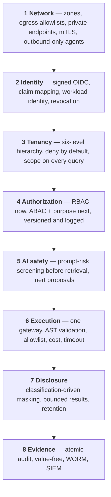

# Security Architecture

> Status: Authoritative. Owner: Platform Security.
> Scope: the controls that protect credentials, bank data, metadata, semantics, policy decisions, and evidence.

## 1. Protected assets

| Asset | Why it matters | Primary control |
|---|---|---|
| Source credentials | Direct access to bank data | Reference-only persistence; enterprise secret manager |
| Bank source data | Regulated customer, account, transaction data | Value-free control plane; masking; bounded results |
| Metadata and classifications | Reveals the estate's structure and where sensitive data lives | Tenant isolation; policy-filtered retrieval |
| Semantic definitions | Encode business logic and risk methodology | Versioning; maker-checker |
| Query results | Regulated data in motion | Bounded, masked, retention-governed |
| Identity claims | Impersonation risk | Signed OIDC verification |
| Policy decisions | The control record itself | Versioned, logged, immutable |
| Workflow histories | Operational forensics | Temporal durability |
| Audit evidence | The record a regulator inspects | Append-only, WORM export |
| Model prompts and responses | Potential leakage vector | Non-content evidence only |

## 2. Trust boundaries

```text
User / Agent
  → API identity and organization boundary          [OIDC verification, tenancy]
  → Agent orchestration boundary                    [prompt-risk screening]
  → Query Execution Gateway                         [AST, policy, cost, masking]
  → Connector / source network boundary             [read-only, delegated identity]

Control-plane transaction
  → PostgreSQL authoritative state and outbox       [atomicity, audit]
  → Kafka event boundary                            [value-free payloads, ACLs]
  → Neo4j / search / vector projections             [non-authoritative]

Metadata context
  → Model Gateway                                   [bounded, metadata-only]
  → Approved private model route                    [residency, retention, budget]
```

Each `→` is a place where something less trusted influences something more trusted. `50-security/02-threat-model.md` enumerates the threats at each.

## 3. Defence in depth



**The property to notice:** compromising any single layer does not yield data. A stolen token still faces tenancy, authorization, execution validation, and masking. A prompt injection that evades screening still faces AST validation and the allowlist. This is what makes the architecture defensible rather than merely careful.

## 4. Identity and authentication

| Control | Implementation |
|---|---|
| Token verification | Signature, issuer, audience, expiry, algorithm, subject |
| JWKS | Cached with TTL, refreshed on unknown `kid`, pinned keys supported |
| Claim mapping | Configurable paths → organization, roles, groups |
| Failure | Denies **without leaking which check failed** |
| Development provider | Explicit headers, **refused in production** |
| Workload identity | Required for connector agents and MCP consumers — **not yet implemented** |
| Revocation and replay | **Not yet implemented** — required before production |

## 5. Authorization

| Control | State |
|---|---|
| Tenant scope check | Implemented — deny by default (INV-5) |
| Role checks | Implemented |
| Attribute-based (classification, purpose, residency) | **Not implemented** — P0 |
| Agent-vs-human context attribute | **Not implemented** — P0, now a market baseline |
| Entitlement (edition) | Not implemented |
| Source-system authorization | **Always ultimately authoritative** — Atlas adds a second, stricter layer and never grants what the source would deny |
| Row/column policy | Conservative masking; source-native policy synchronization is P0 |
| Decision logging | Partial — full logging required for auditors |

## 6. Secrets

| Control | Implementation |
|---|---|
| Persistence | **References only** (`vault://`, `cyberark://`, cloud schemes) |
| Inline DSNs | Rejected |
| Providers | Exactly one configured and explicitly registered |
| Cache | Bounded, with rotation invalidation |
| Production | Rejects `env://` resolution |
| API exposure | Credentials never returned |
| Logging | Never — `ResolvedSecret` is not serializable |
| Rotation | Drill required before go-live |

## 7. Data protection

| Control | Implementation |
|---|---|
| Value-freedom | Enforced at ingestion, profiling, persistence, logging, events, model context (INV-6) |
| Question text | Keyed HMAC fingerprint only |
| SQL literals | Redacted before persistence |
| Masking | Deterministic classification; propagates through aliases and derived expressions |
| Result bounds | Row, byte, and time caps per workload class |
| Result retention | 24 hours default, per-classification override |
| Encryption in transit | TLS everywhere; mTLS for connector agents |
| Encryption at rest | Platform-standard; HMAC keys KMS-managed (target) |

## 8. Network

| Control | Implementation |
|---|---|
| Zones | Edge / app / data / source, with explicit inbound rules |
| Egress | Allowlisted by destination; no general internet access |
| Connector agents | **Outbound-only** — Atlas never dials into a restricted zone |
| Model routes | Private endpoints preferred; public endpoints require an approved residency contract |
| Data zone | Unreachable from the edge |

## 9. Fail-closed invariants

Production configuration **cannot**:

- use development identity,
- resolve credentials from the environment,
- enable the development SQL override,
- use weak audit keys,
- use an insecure remote JWKS URL.

Runtime **denies** when:

- a token fails any validation check,
- no approved and independently activated model route exists (ADR-0009),
- prompt-risk screening blocks — before retrieval, context, tool selection, or execution,
- an object is unknown, ambiguous, or cross-tenant,
- a query fails parsing, policy, catalog, cost, or read-only enforcement,
- policy state is unavailable.

**And it never treats a projection as authoritative.** Lag is visible through reconciliation counts rather than silently served as truth.

## 10. Current posture

| Domain | State |
|---|---|
| Identity | **Partial** — OIDC verification implemented; bank certification, workload identity, revocation pending |
| Authorization | **Partial** — RBAC implemented; ABAC, purpose, source-native policy pending |
| Secrets | **Partial** — reference model and adapter contract implemented; bank adapter unregistered |
| Data protection | **Strong** — value-freedom, masking, bounds implemented |
| Network | **Not implemented** — single local network; zones, egress, mTLS pending |
| AI safety | **Partial** — direct prompt-risk implemented; indirect injection pending |
| Execution | **Strong** — one gateway, AST validation, cost, masking |
| Evidence | **Partial** — audit ledger implemented; WORM, SIEM, retention pending |
| Supply chain | **Partial** — pinned deps, non-root; SBOM, signing, scanning pending |
| Certification | **Not started** — no penetration test, no SOC 2/ISO |

## Related documents

- Threat model: `50-security/02-threat-model.md`
- AI safety controls: `50-security/03-ai-safety-controls.md`
- Compliance and evidence: `50-security/04-compliance-and-evidence.md`
- System context: `10-architecture/02-system-context.md`
