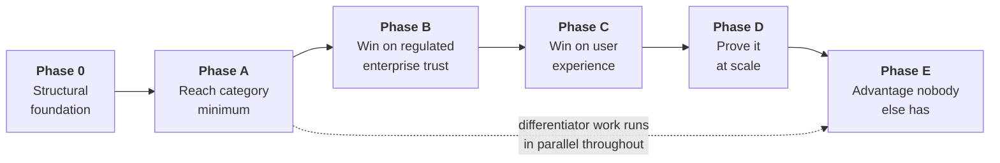

# Roadmap

> Status: Authoritative. Owner: Product + Engineering.
> Sequencing rationale: `00-product/05-differentiation-and-whitespace.md` §6 — the governed-execution window is 12–24 months, so entry-ticket gaps are closed with minimum credible investment **in parallel** while differentiation compounds.

## 1. Shape of the plan

**The parallelism matters.** Phases A–D close gaps competitors already have. Phase E work — the seven capabilities nobody else has — runs alongside from the start, because that is where the lead is.

## 2. Phase 0 — Structural foundation

**Objective:** make the codebase able to absorb the rest of the roadmap.

| Workstream | Deliverable |
|---|---|
| Refactor Phase 0–2 | Target structure, import-linter ratchet, Tier 0 invariant tests, `platform/` extraction, models split with schema-per-module |
| CI hardening | Import-linter, OpenAPI diff gate, SBOM, signing, performance gates |
| Test tiers | Formalize Tier 0; reflection-generated tenant denial; sentinel value-leak scan |

**Exit criteria**

- Import-linter runs at a ratchet baseline; new violations fail CI.
- All nine invariant tests exist and pass.
- Every model lives in its module schema; no cross-schema FKs except into `identity`.
- New modules (08, 18, 19) are built in the target structure from day one.

**Why first.** Glossary, Studio, and context products are large greenfield builds. Building them into the flat package would roughly double the eventual refactor.

## 3. Phase A — Reach category minimum

**Objective:** remove every reason a buyer rejects Atlas in the first meeting.

| Workstream | Deliverable | Module |
|---|---|---|
| Connectors | Oracle and BigQuery to certified; then Snowflake and Databricks; executable vendor/version fixtures | 02 |
| Search | Vector projection, graph expansion, fusion ranking, full-text index, cross-source search, command palette | 12, 21 |
| **Glossary and stewardship** | Term lifecycle, ownership (incl. bulk and rule-based), conflict resolution, coverage scoring | 08 |
| Lineage breadth | OpenLineage ingestion, view and procedure lineage, BI lineage | 09 |
| Quality basics | Notification and escalation routing, approved watermark contracts, data SLAs | 11 |
| **MCP context products** | MCP server, context products, per-read policy, consumption lineage, eligible tools | 19 |
| **AI control-plane products** | Data product and contract registries, marketplace, lineage MCP, deterministic context compiler, AI asset registry | 19, 09, 17, 20 |
| Catalog UX | Bulk actions, virtualization | 04, 21 |

**Exit criteria**

- Atlas is no longer dismissed as "Postgres-only" or "prototype breadth."
- A steward can govern a domain end to end without leaving Atlas.
- An external Claude or ChatGPT agent can consume governed context over MCP, with policy enforced at every read.
- A producer can publish a versioned context product and an eligible external agent can consume that exact version with attributable evidence.

**Note on module 19.** It appears in Phase A because MCP is now the distribution channel — but it is simultaneously whitespace W2. Building it early is the clearest example of an entry-ticket gap and a differentiator being the same work.

## 4. Phase B — Win on regulated-enterprise trust

**Objective:** become demonstrably safer and more governable than any general-purpose AI data tool.

| Workstream | Deliverable | Module |
|---|---|---|
| Identity | Bank OIDC certification, workload identity, revocation and replay policy, break-glass | 01 |
| Authorization | **ABAC** with classification, purpose, residency, and **agent-vs-human** attributes; source-native row/column policy | 17, 16 |
| Secrets | Registered and certified bank adapter, delegated source identity, rotation drill | 01, 02 |
| Network | Zones, egress allowlists, private endpoints, **source-side connector agents with mTLS** | 02, deployment |
| AI safety | **Indirect-injection screening**, multilingual and obfuscation corpus, bank model-risk corpus, kill-switch drill, red team | 13, 15 |
| Evidence | WORM archive, SIEM routing, retention enforcement, full policy decision logging | 20 |
| Certification | Tool certification workflow, connector certification packs | 14, 02 |

**Exit criteria**

- A bank's model-risk function can approve Atlas on documented evidence.
- Restricted network zones are servable without inbound firewall exceptions.
- The kill switch has been drilled and timed.

## 5. Phase C — Win on user experience

**Objective:** move from functional workbench to product-class experience.

| Workstream | Deliverable | Module |
|---|---|---|
| Persona navigation | Derived from OIDC groups, not browser choice | 21, 01 |
| Scale-safe UI | Virtualization, graph level-of-detail, bulk operations at 10,000 items | 21, 10 |
| **Studio** | Change sets, test harness, diff view, parameter-contract designer, impact preview | 18 |
| Evidence UX | Permalinks, exports, shareable evidence views | 21 |
| Accessibility | Full audit and remediation to WCAG AA | 21 |
| Onboarding | Guided setup per persona, better empty states | 21 |

**Exit criteria**

- Users complete analyst, steward, reviewer, and auditor workflows faster than in a generic catalog plus a separate governance tool.
- Accessibility audit passes.

## 6. Phase D — Prove it at scale

**Objective:** replace assertions with measurable, published evidence.

| Workstream | Deliverable |
|---|---|
| Benchmark corpus | Bank-scale synthetic estate: 1M objects, 1,000 sources |
| Performance | Load, soak, spike suites; published dashboards; CI regression gates |
| Resilience | Chaos, failure injection, projection rebuild timing, PITR restore, regional failover |
| Connectors | Compatibility matrix and certification reports per vendor and version |
| Security | Penetration test, adversarial SQL corpus, prompt-injection corpus |
| Operations | SLO dashboards, error budgets, runbooks, DR drill evidence |

**Exit criteria**

- Every number in `10-architecture/10-performance-and-scale-model.md` has been measured and published.
- Performance and resilience are demonstrated product attributes, not roadmap claims.

## 7. Phase E — Advantage nobody else has

**Objective:** capabilities competitors cannot copy without adopting Atlas's architectural commitment.

| Workstream | Deliverable | Whitespace |
|---|---|---|
| **Quality → runtime coupling** | Retrieval demotion, answer trust warnings, tool gating, certification expiry on sustained incidents | W1 |
| **AI decision lineage** | First-class traversable edges including refusals | W3 |
| **Negative knowledge surface** | Queryable "what we decided is not true," reused across runs | W4 |
| **Compliance packs** | Generated from runtime evidence: model risk, BCBS 239, access review | W5 |
| **Trust-scored answers** | Composite explainable confidence: quality, freshness, semantic confidence, lineage depth, tool approval | W7 |
| Multi-step tool plans | Governed plans with step, time, token, and cost budgets | — |
| Connector certification standard | Published, third-party runnable | W6 |
| Data contracts | Enforced at runtime, composing existing modules | — |

**Exit criteria**

- Atlas is not a catalog or a governance suite. It is the enterprise AI context and action layer with regulated execution built in.

## 8. Sequencing rules

| Rule | Reason |
|---|---|
| Phase 0 precedes new module builds | Otherwise the refactor doubles |
| Phase E runs in parallel from the start | The window is closing; differentiation compounds |
| Entry-ticket gaps get **minimum credible** investment | Never chase connector count |
| A feature that neither widens the governed-execution lead nor closes an ENTRY gap does not get built | The decision rule from the whitespace analysis |
| Proof (Phase D) is a product feature | Competitors publish benchmarks; assertions lose bake-offs |

## 9. Highest-priority items across all phases

If only ten things could be done, these:

| # | Item | Why |
|---|---|---|
| 1 | Refactor Phase 0–2 (structure + invariant tests) | Everything else depends on it |
| 2 | Glossary and stewardship (module 08) | Largest functional gap; blocks steward adoption |
| 3 | MCP context products (module 19) | Entry ticket **and** differentiator W2 |
| 4 | Vector + graph + fusion retrieval (module 12) | Blocks search, grounding quality, and scale claims |
| 5 | Oracle, BigQuery, Snowflake, Databricks connectors | Removes the "too narrow" rejection |
| 6 | ABAC with agent-vs-human context (module 17) | Now a market baseline |
| 7 | Indirect-injection screening (module 13) | The known hole in the safety story |
| 8 | OpenLineage + view/procedure lineage (module 09) | Entry ticket |
| 9 | Quality → runtime coupling (module 11) | Highest-leverage unbuilt differentiator |
| 10 | Load, restore, and kill-switch drills | Converts design into evidence |

## Related documents

- Epic backlog: `60-delivery/02-epic-backlog.md`
- Tracker: `60-delivery/03-tracker.md`
- Status matrix: `60-delivery/04-status-matrix.md`
- Differentiation: `00-product/05-differentiation-and-whitespace.md`
