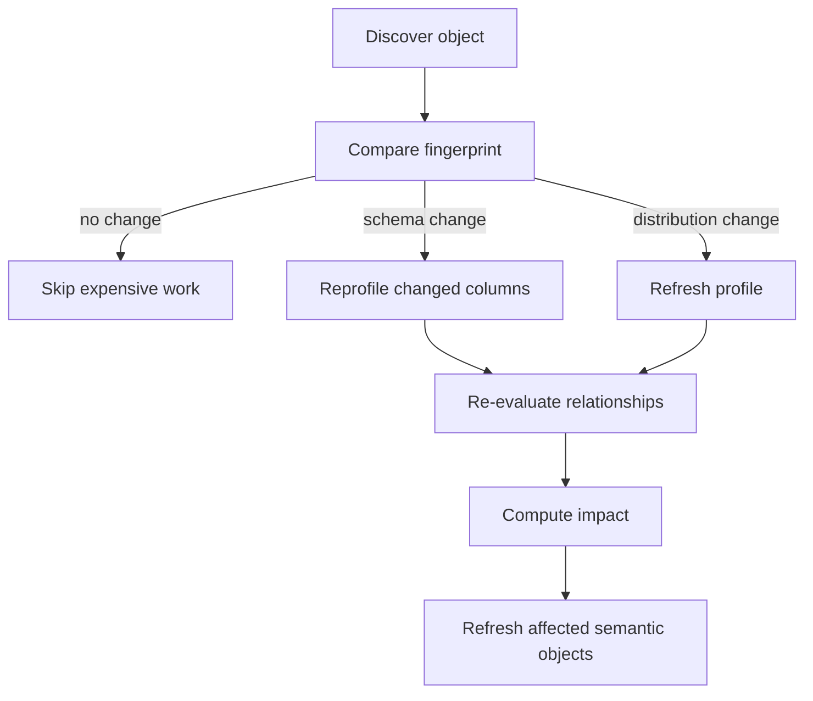

# Analysis Algorithms Reference

> Status: Reference. Owner: Data Intelligence.
> The scoring models, pruning strategies, and detection signals behind modules 05 (profiling), 06 (relationships), and 07 (semantics). Migrated from the retired flat `02-metadata-analysis-engine.md`.
>
> These are **recommended shapes with tunable weights**, not fixed constants. Every weight is configuration, every score is recorded with its algorithm version, and every inference retains its evidence (P2).

## 1. Adaptive profiling

The same strategy must not be applied to every table. A profiler that accidentally full-scans a multi-billion-row fact table is an availability incident for the bank, not a slow job.

| Table class | Strategy |
|---|---|
| **Small** | Full profile |
| **Medium** | Database statistics + sample + targeted aggregates |
| **Large fact** | Partition-aware sample + `APPROX_COUNT_DISTINCT` + recent partition + historical partition + catalog statistics |

Class is determined from catalog statistics before any data is touched. **Full scans require an explicit approved policy** — this is a release gate, not a preference.

### Statistics computed

| Per table | Per column |
|---|---|
| Approximate row count | Type, null count and ratio |
| Storage size | Approximate distinct count, uniqueness ratio |
| Partition count | Length distribution |
| Last modified timestamp | Candidate semantic type |
| Query frequency | Candidate PII classification |
| Growth rate | |
| Candidate grain | |
| Duplicate rate | |

**Deliberately excluded by default** (ADR-0014): min/max *values*, top values, frequencies, sample patterns, value entropy. These require a policy-approved, classification-specific exception with its own retention contract. Min/max *length* is retained because it is value-free.

## 2. Key detection

### Single-column candidate key

```text
candidate_pk_score =
    uniqueness      × 0.45
  + non_null_ratio  × 0.20
  + name_score      × 0.10
  + stability_score × 0.10
  + index_evidence  × 0.10
  + usage_evidence  × 0.05
```

Uniqueness dominates because it is the only signal that is close to decisive on its own; the rest break ties and guard against coincidence.

### Composite key search

Combinatorially explosive if unbounded, so candidates are pre-selected from: high-cardinality columns, business identifiers, declared indexes, commonly joined columns, and temporal columns where grain suggests period-specific uniqueness. Combinations are then tested **up to a configured maximum cardinality** (P3).

## 3. Relationship candidate generation

**Brute-force all-pairs comparison is not acceptable.** At 25,000 columns it is 312 million comparisons, most of them meaningless, and value-level comparison would violate ADR-0014.

### Pruning signals, applied before any expensive check

- Exact normalized name match
- Suffix / prefix similarity
- Semantic name similarity
- Type compatibility
- Target is a primary or unique key
- Shared business domain
- Table usage correlation
- Historical join evidence from query logs
- Lineage evidence
- Embedding similarity
- Schema proximity

Only survivors reach evidence scoring, and candidates per table are capped.

### Evidence example

```text
transaction.customer_id  →  customer.customer_id

name similarity               0.98
type compatibility            1.00
target uniqueness             0.99
value containment             0.997
query-history evidence        0.95
ETL evidence                  1.00
model semantic evidence       0.82
```

> Value containment requires comparing distinct-value sets. Under ADR-0014 this is computed **source-side as an aggregate** and only the ratio is retained — never the values themselves.

## 4. Relationship confidence hierarchy

| Evidence | Typical confidence |
|---|---:|
| Declared database foreign key | 1.00 |
| Human-approved relationship | 1.00 |
| Explicit transformation lineage | 0.98 |
| Repeated production SQL join | 0.95 |
| Strong value containment + unique target | 0.90 |
| Naming + type + domain inference | 0.75 |
| Model-only inference | 0.55–0.70 |

**A relationship retains all underlying evidence, not only a final score.** A confidence number a reviewer cannot decompose is a number they will either rubber-stamp or reject wholesale.

Note the bottom row: model-only inference never exceeds 0.70, so it can never reach a threshold that would auto-publish. That ceiling is deliberate (ADR-0001).

## 5. Temporal and history detection

Distinguishing "current customer" from "customer as of date" is a **correctness requirement**. An agent that joins a history table as if it were current produces confidently wrong answers.

### Detected types

Snapshot tables · append-only fact tables · CDC/delta tables · SCD Type 1 · SCD Type 2 · event streams · daily partitions · monthly snapshots · current/history pairs.

### Column signals

```text
effective_from   effective_to    valid_from     valid_to
snapshot_date    batch_date      load_date      ingest_timestamp
current_flag     version_number  operation_type
```

### Output shape

```json
{
  "table": "customer_history",
  "table_type": "DIMENSION_HISTORY",
  "history_strategy": "SCD2",
  "business_key": ["customer_id"],
  "effective_from": "valid_from",
  "effective_to": "valid_to",
  "current_indicator": "is_current"
}
```

## 6. Table family detection

Enterprise warehouses accumulate variants:

```text
customer · customer_current · customer_hist
customer_delta · customer_snapshot · customer_backup
```

These become one family with typed edges:

```text
customer_current  -HISTORICAL_VERSION->  customer_hist
customer_current  -CHANGE_FEED->         customer_delta
customer_current  -SNAPSHOT_VERSION->    customer_snapshot
customer_backup   -ARCHIVE_OF->          customer_current
```

**Signals:** name similarity, column overlap, key overlap, lineage, history fields, load pattern, usage, row behaviour.

## 7. Canonical table resolution

For each business concept, determine the default analytical table.

```text
Business concept: CUSTOMER

RAW.crm_customer          0.42
STAGE.customer_stage      0.37
CURATED.customer_dim      0.96   ← canonical
HISTORY.customer_hist     0.72
```

```text
canonical_score =
    semantic_confidence
  + query_usage
  + downstream_usage
  + data_quality              ← from module 11
  + freshness                 ← from module 11
  + curated_layer_weight
  + stewardship_approval      ← from module 08
  - deprecated_penalty
  - duplicate_penalty
```

The runtime agent prefers the canonical table **unless the question requires history or another specialized representation**. Note that quality and freshness are inputs — this is one of the coupling points that makes differentiator W1 concrete.

## 8. Domain discovery

Cluster tables into business domains (Customer, Account, Payments, Claims, Product, Finance, Risk, Sales, Marketing).

**Inputs:** schema names, table and column names, descriptions, query co-usage, graph connectivity, lineage, existing catalog tags, embeddings.

**Sequencing rule:** deterministic clustering first, model second. The model is useful for *naming and describing* a cluster after deterministic work has reduced the search space — not for finding the clusters.

## 9. Semantic enrichment payload

The model receives compact, value-free metadata:

```text
Table: transaction_fact
Rows: 1.8B
Grain: probable one-row-per-transaction
PK: transaction_id [0.99]
FK candidates:
  customer_id -> customer_dim.customer_id [0.98]
  merchant_id -> merchant_dim.merchant_id [0.97]
Measures: amount, tax_amount, fee_amount
Time: transaction_timestamp
Load: daily incremental
Usage: 42K queries / 90 days
```

**Requested outputs:** business description, domain, semantic concepts, measures and dimensions, synonyms, table purpose, likely analytical use cases, ambiguous meanings, recommended glossary mappings.

**Not requested, ever:** executable SQL (ADR-0001).

## 10. Incremental reanalysis

Fingerprints stored per object:

```text
schema_hash · column_hash · constraint_hash
profile_hash · sample_fingerprint
lineage_hash · query_usage_hash
```



The skip path is what makes rescanning a million-object estate affordable.

## 11. Priority scheduling

Not all tables are equal. `importance_score` inputs: query frequency, BI/report usage, downstream dependencies, graph centrality, stewardship tags, relationship count, data volume and activity, freshness requirements.

This lets the platform semantically enrich **the most important 10% of tables first** — the difference between a catalog that becomes useful in a week and one that becomes useful in a year.

## 12. Ambiguity review

```text
Object: orders.account_ref

Candidates:
  account.account_id              0.74
  customer_account.account_id     0.71
  legacy_account.id               0.68

Decision: [Approve] [Reject] [Create new relationship]
```

Three close candidates is exactly the case where a confidence threshold would guess wrong. Review decisions are **durable evidence**, not UI state.

## 13. Negative knowledge

Persisted rejected hypotheses:

```text
NOT_A_RELATIONSHIP · NOT_PII · NOT_A_PRIMARY_KEY
NOT_CANONICAL · NOT_A_METRIC
```

Without this the system repeatedly rediscovers the same bad hypothesis, and stewards lose confidence in the review queue. This is whitespace W4 — no competitor retains rejections.

## 14. Failure handling

Every task records: `status`, `attempt_count`, `last_error`, `error_class`, `started_at`, `finished_at`, `worker_id`, `source_query_id`, `resource_usage`.

**Failure classes:** authentication · source unavailable · timeout · throttling · permission denied · malformed metadata · unsupported dialect · query cost rejected · semantic model failure · model failure.

Retries apply **only where meaningful**. Retrying a permission denial is noise; retrying a throttle is correct. Classification is what makes the difference visible to an operator.

## 15. Worked scale example

For 1,000 tables and 25,000 columns:

```text
        1  datasource discovery
       20  schema jobs
    1,000  table profiling jobs
   25,000  column profile operations
   ~4,000  relationship candidates (after pruning)
     ~700  expensive relationship validations
     ~100  table family analyses
      ~20  domain analyses
     ~250  semantic model enrichment tasks
        1  semantic validation and publish task
```

**This is a worker scheduling problem, not a 1,000-agent problem** (P7). Note the ratio: 25,000 cheap deterministic operations to ~250 model calls — roughly 100:1. If model call volume ever approaches table count, the design has regressed.

## Related documents

- Profiling module: `20-modules/05-profiling-and-classification.md`
- Relationship module: `20-modules/06-relationship-intelligence.md`
- Semantic layer: `20-modules/07-semantic-layer.md`
- Workers and workflows: `10-architecture/08-workers-and-workflows.md`
