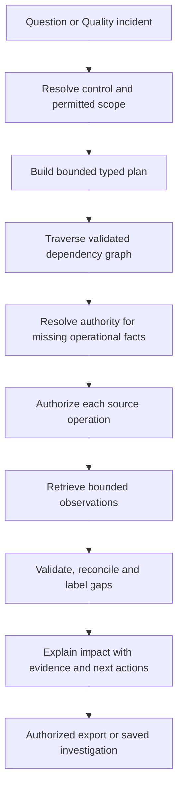

# CCDIVACLAD — External Reference Architecture

> Status: External reference with proposed Atlas implementation plan. Owner: Architecture.
> Sections 1–7 reconstruct an externally documented enterprise metadata-agent platform.
> Cite those sections as prior art, never as a requirement. Sections 8–17 assess Atlas's
> current implementation and propose changes; they are not approved requirements or
> completed implementation claims.
>
> Source: screenshots of internal Confluence pages (an architecture-and-engineering
> space and a consumer-data-platform space), OCR-extracted and reconstructed
> 2026-09-06. Some field names and figures are OCR-recovered and may carry
> transcription error; treat exact strings as indicative, not verbatim.

For the Atlas action plan, start with [what exists and what is missing](#8-atlas-implementation-assessment),
then [the end-to-end investigation](#11-flagship-workflow-control-failure-to-business-impact),
[screen improvements](#14-screen-arrangement-and-user-storytelling),
[competitive positioning](#15-competitive-position-and-product-improvements),
and [prioritized fixes](#16-prioritized-implementation-and-refactoring-backlog).

## 1. What CCDIVACLAD is

A conversational agent over enterprise **metadata**, not over the data itself. A person
asks a business question in natural language; a supervisor agent routes it; specialized
agents resolve it against a governed semantic layer and a Neo4j knowledge graph; MCP
servers fetch operational facts from systems of record; the answer returns
business-contextual and policy-filtered.

### The canonical worked example

> *"Help me understand the business impact of a data quality control failure for a
> policy named Control234."*

1. Persona asks the **CCDIVACLAD Data Concierge** in natural language.
2. **Supervisor Agent** performs intent mapping and routes to a specialized agent.
3. **Discovery Agent** converts the natural-language question into a **GraphQL request**
   representing the required business intent.
4. The **governed semantic layer** uses its ontology and knowledge graph to resolve
   business elements to technical columns to metric dimensions to impacted **Tier-1
   reports**, independent of physical data platforms. Relationships come from the data
   modelling tool; business DQ policies from the observability platform.
5. The semantic layer determines report impact and identifies the appropriate **SOR** for
   each class of fact, reporting that context back to the Discovery Agent.
6. The Discovery Agent calls the **MCP Orchestrator** for operational metrics (e.g.
   policy failure count over the last N days); the orchestrator absorbs deduplication,
   reconciliation, throttling and other boilerplate.
7. **Semantic validation**: entitlements, purpose-of-use, PII and metric-governance
   policies are enforced *before* data access; a unified response is returned.

Step 7 is the load-bearing one — policy evaluation sits between resolution and
retrieval, not after it.

## 2. Architecture layers

| Layer | Contents |
|---|---|
| Experience | CCDIVACLAD Data Concierge — personalized discovery UX |
| Orchestration | **CCDIVACLAD Supervisor Agent** (meta-control), routing and orchestration |
| Specialized agents | **Discovery Agent** (in scope); Pipeline, Testing, Deploy Agents (defined, explicitly out of scope for the current quarter) |
| Federation | **CCDIVACLAD MCP Orchestrator** — policy enforcement, routing, de-duplication, distributed query coordination, workload management and throttling |
| Registry | **MCP Registry** — server registry, version control, entitlements, unified gateway access, security and governance; adjacent: LLM, vector DB, semantic search, data products |
| Semantic | **Governed Semantic Layer** — ontology, knowledge graph, semantic metrics, metric policies, data routing engine, lineage, catalog, observability |

### Metadata source scope

| Source | Dimensions contributed |
|---|---|
| Observability platform | Pipelines, data quality, business DQ policies, policy violations, DQ scores, quality profiles |
| Data modelling / catalog tool | Models, lineage, business glossary, technical metadata, metadata associations, data product catalogs, marketplace |
| Wiki + document store | Foundational data products, use cases, engineering documents, runbooks, entitlements, change logs |
| Issue tracker | Features, epics, stories, tasks; agile/scrum/kanban workstreams |
| Schedulers (AutoSys / Airflow) | Orchestration metadata |

### Agent definitions

Each agent type is given a formal definition plus five essential characteristics — a
useful discipline in itself, because it forces a stated boundary between agent classes.

- **Supervisory agent** — operates *above* execution-level agents, focused on
  meta-control rather than task execution: oversight and monitoring; policy and goal
  alignment; **decision authority** (pause, modify, reroute, override, terminate);
  coordination across concurrent agents; escalation and human interface.
- **Discovery agent** — systematically explores environments without requiring complete
  prior knowledge of them: exploratory capability; classification and enrichment; change
  detection (new assets, schema changes, version updates); metadata emission; governed
  operation. Emits into catalogs, registries, knowledge graphs and control planes.
  Maturity ladder: name/pattern-based awareness, then rule-based, then ML/LLM-assisted,
  then semantic inference.
- **Pipeline / testing / deploy agents** — defined to the same template but deferred.
  Worth noting as a scoping pattern: define the whole agent taxonomy, ship one.

## 3. Semantic layer formalism

- **Semantic layer metrics** — formally defined quantitative measures represented as
  semantic objects: calculation logic over semantic model entities, plus governance
  attributes (ownership, certification, policy bindings), plus evaluation constraints
  (grain, filters, time context).
- **Metric policies** — rules that constrain, modify or contextualize a metric's
  definition, computation, exposure and usage. They influence metric visibility,
  calculation semantics, permissible filters and dimensions, aggregation behavior, and
  result access. Scoped by: role/user/organization; geography or jurisdiction; business
  domain or product; data sensitivity or classification; time or reporting context.
- **Data routing engine** — evaluates metadata, policies and execution context to select
  source systems, transformation paths and computation engines. Operates *independently
  of metric definitions*, enabling physical flexibility without semantic change.

Their own one-line integration:

> Metrics define **what** is measured. Policies define **when, how, and for whom**
> metrics behave. The routing engine determines **where and how** the metric is computed
> or retrieved.

**Metadata knowledge graph** is stated as a tuple `MKG = (E, R, O)` — entities,
relations, ontology — where the ontology is a formally defined vocabulary and constraint
model specifying entity classes, relationship types, attributes, and the axioms and
rules governing valid interpretations. Distinguishing properties: metadata-centric
(describes data, not data values); semantic formalism (meaning explicit via ontology,
not implied by structure); graph-based; reasoning-capable (transitive lineage, policy
propagation, impact analysis); cross-layer abstraction (technical, operational and
business metadata in one model).

## 4. The ontology

Published as a `Term | Ontology Type | Definition | Guardrails` table. The **guardrail**
column is the interesting part — each term carries an explicit anti-definition to
prevent semantic drift.

**Identification and classification**

| Term | Type | Definition | Guardrail |
|---|---|---|---|
| Label | Identifier | Human-readable identifier for an entity | Unique within scope, meaning-bearing |
| Tag | Classification marker | Lightweight keyword for search/grouping | Cannot substitute domain, ownership, or tier |
| Tier | Classification level | Criticality or SLA classification | — |
| Term | Ontology type | Canonical semantic label | — |

**Authority and governance**

| Term | Type | Definition | Guardrail |
|---|---|---|---|
| Domain | Governance boundary | Logical ownership and accountability scope | Requires accountable owner |
| ADS (Authoritative Data Source) | Domain-designated distribution point | — | **Exactly one per domain** |
| SOR (Source of Record) | Legal authority | System maintaining originating data | **One per data element** |
| Policy | Governance rule | Mandatory rule guiding behavior | Not implementation-specific |
| Control | Enforcement mechanism | Mechanism enforcing policy | Must be auditable |
| Lineage | Traceability construct | End-to-end flow of data and transformations | Tool-agnostic |
| Business Glossary | Semantic authority | Canonical definitions of business terms | Source of semantic truth |
| Technical Metadata | Descriptive metadata | — | — |

**Organization** — AU/Accounting Unit (financial accountability unit; *not technical*);
Team (operating unit accountable for delivery/support; *requires charter*); Actor/User
(human or system consumer; *must be authenticated*); Persona (behavioral usage
archetype; ***not a real user***).

**Applications, platforms and infrastructure** — Application (*not a platform by
default*); Platform (shared capability for multiple apps; *ownership distinct*);
Infrastructure (*no business logic*); Resource (*governed and tracked*); Cache
(*never authoritative*).

**Data assets and structures** — Dataset (*owner domain required*); Database (*not a
dataset*); Table (*not semantic*); Column (*must map to meaning*); Object
(*storage-agnostic*); Chunk (*not a business object*).

**Data states** — Raw (*immutable*); Curated (*lineage required*); Sanitized
(*security-compliant*).

**Execution, orchestration and processing** — Job (*not a workflow*); Workflow (*no
execution logic*); Orchestration (*not a business process*); Query (*not a dataset*);
Stream (*ephemeral unless persisted*); Topic (*schema + owner required*); Intake
(*not a tool*).

**Services and interfaces** — Service (*SLA + owner required*); API (*versioned and
governed*).

**Content and analytics** — Document (*not a dataset*); Report (*not executable*).

**Operations, reliability and risk** — Runbook (*not policy*); Incident (*not
enhancement*); Backup (*not resiliency*); Disaster (*DR scope*); Resilience (*backup
alone insufficient*).

**Delivery frameworks** — Scrum (*not a team*); Kanban (*no sprints*); Agile (*not a
framework*).

## 5. Neo4j knowledge graph standardization

### 5.1 Approved node labels

`Dataset`, `Field`, `Schema`, `Domain`, `System`, `Pipeline`, `Term`, `Policy`,
`Owner`, `Tag`, `DataProduct`.

The stated principle: the canonical ontology defines which node labels and relationship
types exist, and **which subject-predicate-object triple patterns are valid**.

### 5.2 Canonical triple patterns

| Relationship | Pattern | Always |
|---|---|---|
| `CONTAINS` | Dataset to Field, Schema to Dataset | parent structurally contains child |
| `BELONGS_TO` | Dataset to Domain | membership in a domain or category |
| `MAPS_TO` | Field to Field | canonical field in another system |
| `DERIVED_FROM` | Dataset to Dataset | lineage derivation |
| `OWNED_BY` | Dataset/DataProduct to Owner | accountable ownership |
| `GOVERNED_BY` | Dataset to Policy | subject to a policy |
| `TAGGED_WITH` | any node to Tag | classification |
| `REFERENCES` | Field to Term | semantic reference to glossary |
| `CONSUMES` | Pipeline to Dataset | pipeline reads |
| `PRODUCES` | Pipeline to Dataset | pipeline outputs |
| `PUBLISHED_IN` | DataProduct to Domain/System | published to a marketplace |
| `CERTIFIED_AS` | Dataset/DataProduct to certification | certification record |

### 5.3 Identity and MERGE rules

Every entity has a canonical unique key enabling idempotent loads. All ingestion uses
`MERGE` on these keys — **never `CREATE` without a prior existence check**.

| Entity | Merge key | Form |
|---|---|---|
| Dataset | `fqn` | `system.schema.name` (dot-delimited, lowercase) |
| Field | `fqn` | `system.schema.dataset.fieldName` |
| Schema | `system` + `name` | composite of source system ID and schema name |
| Domain | `name` | globally unique from governed domain registry |
| System | `canonicalId` | registered system-of-record identifier |
| Pipeline | `canonicalId` | orchestration tool's pipeline/job ID |
| Term | `domain` + `termName` | composite, normalized term |
| Policy | `policyId` | governance-registry assigned |
| Owner | `email` | `ldapDn` for AD-backed identities |
| Tag | `name` | normalized lowercase string |

Canonical MERGE template — the `ON CREATE` / `ON MATCH` split ensures provenance
timestamps are never overwritten on update:

```cypher
MERGE (d:Dataset {fqn: $fqn})
ON CREATE SET
  d.createdAt = datetime(),
  d.ingestTimestamp = datetime(),
  d.source = $source,
  d.environment = $environment,
  d += $props
ON MATCH SET
  d.lastUpdatedAt = datetime(),
  d += $props
```

Uniqueness constraints are created at database provisioning time and **must not be
dropped in production** (`field.fqn`, `system.canonicalId`, `owner.email`,
`policy.policyId`, and so on).

### 5.4 Property placement heuristic

| Condition | Model as |
|---|---|
| Primitive intrinsic to exactly one node | Property on the node |
| Only meaningful in the context of two specific connected nodes | Property on the relationship |
| Can exist independently of any specific pair of nodes | A separate node |

Worked examples: `readinessDate` + `status` on `PUBLISHED_IN`; `transformLogic` on
`DERIVED_FROM`; `appliedDate` + `status` on `GOVERNED_BY`; `refreshSLA` on `CONSUMES`;
`certifiedBy` + `certifiedDate` on `CERTIFIED_AS`. Schema is a **first-class node**, not
a string property on Dataset. Business term definition is a separate `Term` node linked
via `REFERENCES`, not a `fieldDescription` string.

### 5.5 Naming conventions

| Element | Convention | Example | Anti-example |
|---|---|---|---|
| Node label | PascalCase | `DataProduct`, `BusinessTerm` | `data_product`, `dataproduct` |
| Subtype label | PascalCase, appended | `:Dataset:View` | `:dataset_view` |
| Relationship type | SCREAMING_SNAKE_CASE, imperative verb | `DERIVED_FROM`, `GOVERNED_BY` | `derivedFrom`, `DerivedFrom` |
| Node property | camelCase | `createdAt`, `dataClassification` | `Created_at`, `DataClassification` |
| Relationship property | camelCase | `readinessDate`, `appliedDate` | `readiness_date` |
| Boolean | `is`/`has` prefix, camelCase | `isPii`, `isDeprecated`, `hasSla` | `pii`, `deprecated` |
| Timestamp | `At` suffix | `createdAt`, `lastUpdatedAt` | `created`, `timestamp` |
| Date | `Date` suffix | `readinessDate`, `certifiedDate` | `readiness`, `certified` |
| FQN | dot-delimited, lowercase, normalized | `edw.risk.loan_applications` | `EDW.RiskLoanApplications`, slash-delimited |

FQN values must be lowercased and normalized at ingest; pipelines must not rely on
case-insensitive matching at query time.

### 5.6 Provenance and lifecycle

Mandatory on every node regardless of label — ingestion pipelines that do not set these
fail the gate checks:

| Property | Set on | Meaning |
|---|---|---|
| `source` | CREATE + MATCH | originating feed or system identifier |
| `ingestTimestamp` | CREATE + MATCH | — |
| `createdAt` | CREATE | — |
| `lastUpdatedAt` | MATCH | — |
| `schemaVersion` | CREATE + MATCH | version of the loader that wrote the record; useful for schema-evolution tracking |

Lifecycle states and transitions:

| State | Mechanism |
|---|---|
| DRAFT | `status` property at creation |
| ACTIVE | optional `:Active` label |
| DEPRECATED | set `isDeprecated: true` + `deprecatedAt`, add `:Deprecated` label — **never delete the node** |
| ARCHIVED | `:Archived` label required; retain stub node with `archivedAt` after archival, full node moved to an archive graph |

Enrichment rule: enrichment jobs must set `source` to **their own** feed ID, not inherit
the parent node's.

### 5.7 Data quality gates

**CRITICAL — hard blockers at load time.** Pipelines gate on these before writing;
failure fails the load and alerts the responsible team.

- Dataset node missing `fqn`
- `dataClassification` not in `PUBLIC | INTERNAL | CONFIDENTIAL | RESTRICTED`
- `environment` not in `PROD | NON-PROD | SANDBOX`
- Active Dataset node missing an `OWNED_BY` relationship

**WARNING — daily DQ dashboard.**

- PROD dataset freshness SLA breach: `lastUpdatedAt` older than 24 hours

Validation rules are written as Cypher violation queries where **zero rows returned is a
pass** and one or more rows is a fail. Result vocabulary: `PASS` / `FAIL` / `INFO` /
`ERROR`, where `ERROR` means an execution or connection problem — including a missing
Cypher rule file, treated as an error because it indicates a config or deployment issue.
Rule descriptions are carried as `//` comments so logs and summaries stay
business-readable.

## 6. Ingestion frameworks

A family of configuration-driven Spark frameworks writing to Neo4j, all sharing one
HOCON skeleton — `appInfo`, `auditTable`, `email`, then per-flow `source`, `target`,
`schedule`, `extractQuery`, `saveMode` — plus graph-specific extensions. The design
intent is low-code onboarding: application teams declare source, target, transformation,
load mode and graph semantics in config, while Spark connectors, audit handling and
notifications are managed by the shared platform.

| Framework | Path | Graph specifics |
|---|---|---|
| **File-to-Graph** | Files to Neo4j | `fileType = graph-node` or `graph-relationship`. Node CSV: header mandatory, first column is the node key, **last column must be `:LABELS`** (pipe-separated for multi-label), intermediate columns are properties, optional type hints as `columnName:type` (e.g. `amount:double`). Relationship CSV: `:START_ID`/`:START_NAME`, `:END_ID`/`:END_NAME`, mandatory `:START_LABEL` and `:END_LABEL` for endpoint resolution, last column `:TYPE`. |
| **Table-to-Graph** | RDBMS / document store / Hive, both directions | Adds a `graphLoad` block: `loadType = graph-node` with `node { pkColumn, fixedLabels or labelsColumn, propertyColumns }`, or `loadType = graph-relationship` with start/end key columns, label columns and type. Neo4j can also act as **source** (`dbType = neo4j`, `extractQuery` is a Cypher projection). |
| **Spark-Extract-Export** | Cloud warehouse to Neo4j | `stagingQuery` registers a Spark temp view, `extractQuery` shapes the DataFrame with KG and audit columns, then a `neo4j_node` / `neo4j_relationship` writer persists it. Cloud-to-ground pattern across a service-controls perimeter. |
| **Document-store to KG** | Collections to raw layer to curated node collections to curated relationship collections to Neo4j | Four chained scheduler jobs, each gated on its predecessor: source ingest and node curation, relationship curation, node load, relationship load. Transformations are custom HQL; a joined query generates the unique relationship identifier. |

Shared operational spine across all four:

- **Graph setup launcher** — restricted to `CREATE CONSTRAINT` and `CREATE INDEX`, each
  of which must include `IF NOT EXISTS` for idempotent rerun.
- **Graph maintenance launcher** — **delete-only**; the guardrail explicitly rejects
  `CREATE`, `MERGE` and `SET`.
- **Non-DQ validation controls** — file name pattern; node key duplicate detection
  including case-sensitive collisions; relationship endpoint existence check before
  write; extracted-vs-inserted count reconciliation.
- **Audit and notification** — per-run audit row (application, source, target, load type,
  node count, relationship count, status, duration), templated status emails per job
  type.
- **Scheduler chain** — `GRAPH_SETUP`, then `NODE_LOAD`, then `RELATIONSHIP_LOAD`, then
  `GRAPH_MAINT`, with a stated rerun strategy: setup is always safe to rerun; rerun
  nodes before relationships when both fail.

### Scheduler-as-SOR playbook

A separate playbook covers treating the job scheduler as the system of record for
scheduling metadata. Its principles generalize well beyond that one source:

- The source system is the authority for definitions and dependency intent.
- The KG is the **serving** layer for discovery, lineage and query — nothing more.
- **No manual edits** are allowed on scheduler-derived nodes in the KG.
- Every graph record must be traceable to a source snapshot and extraction timestamp.
- Even when a node is loaded from an intermediate platform, it must be validated back
  against the originating system.
- Execution is organized as gated blocks with objective, controls, procedure and exit
  criteria; on failure, recover from the last checkpoint and re-run from that block.

## 7. Delivery and operating model

**MCP server delivery lifecycle — 17 steps:** repo creation and CI/CD setup, design
documentation, architecture review, design review, code development, build and commit,
code compliance check, code quality validation, security scan (SAST/DAST), unit testing
(**95% pass target**), code review, vault and URL setup, multi-environment deployment,
UAT/PROD configuration, UAT and documentation, production release approval, deploy and
monitor with L1/L2 platform support.

**Crowdsourced connector build-out.** One MCP server per source system, each with a named
contributor, a tracker ticket and a repo path, tracked by status — *Adoption Ready*,
*Development in Progress*, *Awaiting Code Contributor*. Sources in the catalog include:
workflow orchestrator, cloud warehouse, Neo4j, document store, issue tracker, source
control, data modelling tool, wiki, job scheduler, ITSM, observability platform,
wide-column store, dashboards, Hive, Oracle, Postgres, collaboration store, monitoring,
log analytics, and a feature store.

Stated expectation for contributors: prepare design, develop, commit and build, complete
quality/compliance/security checks, achieve the unit-test pass target, submit clean code
for review, support UAT and documentation.

**Agent onboarding — 20 steps**, split between the contributing team and the platform
team: data onboarding to KG, pre-load DQ validation, KG load execution, post-load
validation and reconciliation, agent build on the internal AI platform, MCP build if
required, agent configuration and prompt calibration, agent testing and feedback, KG and
agent integration, UAT deployment, UAT validation, production readiness and change
management, production deployment, monitoring and operations.

The onboarding philosophy is stated as **data-first, KG-driven**: prioritize enterprise
data reuse, augment with application-specific context, then enable agent-based discovery.

## 8. Atlas implementation assessment

**Recommendation:** build a governed business-impact investigation on top of Atlas's
existing quality, semantic, lineage, policy and evidence services. The missing product
is the connected journey from a failed control to affected business concepts, metrics,
reports and authoritative operational facts. Adding another chat interface or a larger
connector catalog alone will not close that gap.

Sections 1–7 preserve the reconstructed external reference. **Sections 8–17 are an
Atlas-specific assessment and proposed implementation plan**, added on 6 September
2026. They are recommendations, not an approved architecture decision or a claim that
the proposed functionality has shipped.

Assessment basis: production source inspected around revision `0f8a4c4`, refreshed
against `bb0f30e`; the intervening commit changes semantic-inference deduplication,
local verification and sample data, rather than the capability gaps below. File discovery
respected `.gitignore`; test source and ignored build/cache/dependency files were excluded.
This is a source review, not live connector, browser, scale or production-security
verification. The workspace was changing during review; links identify implementation
locations, while release status must be rechecked at delivery time.

Read this alongside the [complete engineering review](../review-2026-09-05/REVIEW.md),
[screen and journey review](../review-2026-09-05/UX-AND-JOURNEYS.md),
[remediation roadmap](../review-2026-09-05/ROADMAP.md) and
[live remediation tracker](../review-2026-09-05/POINTS-TRACKER.md). Tracker descriptions
and “in progress” entries are not evidence of a completed production capability.

### 8.1 What the status means

| Status | Interpretation |
|---|---|
| Existing primitive | Relevant production implementation exists; it can be reused. This does not certify every access path or deployment. |
| Partial | Some required behavior exists, but the reference's complete capability or user journey is not established. |
| Gap | The specific capability was not found in inspected production sources. This is scoped evidence, not a claim about uninspected systems. |
| Proposed | New design or product behavior described in this document; implementation and validation remain to be done. |

Do not assign a percentage such as “80% implemented” from module counts. A module,
reachable endpoint, configured integration and verified customer outcome are different
levels of completion.

### 8.2 What Atlas already has, and what remains

| Reference capability | Current Atlas evidence | Assessment and implementation delta | Work item |
|---|---|---|---|
| Metadata discovery and semantic enrichment | [semantic_inference_service.py](../../src/aida/semantic_inference_service.py), [semantic_inference.py](../../src/aida/semantic_inference.py) | Existing inference primitives. They do not constitute a specialist that resolves a business control across operational systems. Add typed metadata intents and resolvers. | CA-07 |
| Supervisor and specialist execution | [agent_orchestrator.py](../../src/aida/agent_orchestrator.py), [agent_roster.py](../../src/aida/agent_roster.py), [agent_runtime.py](../../src/aida/agent_runtime.py) | Partial. The inspected orchestrator is datasource-scoped and accepts questions, SQL/tool parameters and agent versions. Extend through a metadata investigation use case; do not equate SQL orchestration with cross-SOR supervision. | CA-07 |
| Controlled data access | [authorization_gate.py](../../src/aida/authorization_gate.py), [security.py](../../src/aida/security.py), [query_gateway.py](../../src/aida/query_gateway.py) | Existing enforcement primitives. Certify their coverage for every new metadata, graph, operational-fact and export path. Outbound federation adds a new boundary. | CA-00, CA-08 |
| Purpose and resource-aware policy | [context_product_policy.py](../../src/aida/context_product_policy.py), [policy_resource_attributes.py](../../src/aida/policy_resource_attributes.py) | Existing purpose checks and resource classification/quality/freshness attributes. Not proof of metric-specific geography, dimension, time-window and aggregation policies. | CA-04 |
| Business organization model | [business_graph.py](../../src/aida/business_graph.py), [identity models](../../src/atlas/modules/identity_tenancy/models.py) | Existing hierarchical, temporal business nodes and assignments. A business ownership hierarchy is not a full enterprise ontology. Add business-element, control and authority semantics. | CA-01, CA-03 |
| Typed enterprise ontology | Existing domain models and [unified_lineage.py](../../src/aida/unified_lineage.py) edge kinds | Partial typing exists. No general versioned subject–predicate–object registry and graph-wide conformance service was found. | CA-01 |
| Lineage and graph provider abstraction | [unified_lineage.py](../../src/aida/unified_lineage.py), [unified_lineage_api.py](../../src/aida/unified_lineage_api.py), [graph_store.py](../../src/aida/graph_store.py) | Existing cross-source graph and PostgreSQL/Neo4j provider boundary. Compose an authorized control-to-report impact graph; preserve source edge direction and provenance. | CA-02, CA-05 |
| BI reports, metrics and column mappings | [bi_lineage.py](../../src/aida/bi_lineage.py), `BiReportNode`, `BiMetricNode`, `BiReportMetricEdge`, `BiMetricColumnEdge` in [models.py](../../src/aida/models.py) | Existing Tableau/Power BI artifact parsing and mappings. Artifact support does not prove live connector synchronization. Add governed report criticality and crosswalks to semantic metric versions. | CA-05, CA-10 |
| Governed business metrics | `SemanticModelVersion` and `SemanticMetricVersion` in [models.py](../../src/aida/models.py), [semantic_api.py](../../src/aida/semantic_api.py) | Existing versions, aggregation, grain, source/measure/time-column bindings and allowed dimensions. Extend policy/routing separately; avoid creating a competing metric catalog. | CA-04 |
| Metric discovery assistance | [metric_suggestion_service.py](../../src/aida/metric_suggestion_service.py), [metric_suggestion_api.py](../../src/aida/metric_suggestion_api.py) | Existing suggestion/review path. Add proposed business-element and BI-metric crosswalks through review, rather than accepting model-generated mappings as truth. | CA-04, CA-11 |
| DQ policies and incidents | `DataQualityPolicy` and `DataQualityIncident` in [models.py](../../src/aida/models.py) | Existing anomaly policies, incident evidence, acknowledgement and resolution. A quality policy is not automatically an enterprise policy or auditable control. Add explicit crosswalks. | CA-05 |
| External DQ observations | [external_quality_signals.py](../../src/aida/external_quality_signals.py) | Existing bounded, idempotent vendor-signal ingestion and external incidents. New work is verified source integration, source authority and impact composition, not another signal model. | CA-03, CA-10 |
| Quality-sensitive tool execution | [quality_coupling.py](../../src/aida/quality_coupling.py) | Existing direct dependency checks can block critical incidents or warn. The inspected gate does not itself traverse the full business/report graph. Preserve this gate and add explicit transitive evidence. | CA-05 |
| Source-of-record and authoritative-distribution mappings | Source/provenance fields and organization integration policy | Gap: no inspected scoped, versioned SOR/ADS registry and fact-routing resolver. A connector name or source string is insufficient. | CA-03 |
| Inbound MCP | [mcp_server.py](../../src/aida/mcp_server.py) | Existing Atlas tools, resources, prompts and governed handlers. Keep and certify this server; expose the investigation through it after the use case is safe. | CA-07 |
| Outbound MCP federation | [integration_catalog.py](../../src/aida/integration_catalog.py), [integration_service.py](../../src/aida/integration_service.py), existing agent/tool registries | Gap: these do not establish an external MCP-server registry, authenticated client and multi-source fact reconciliation. Model external servers separately from agents and registered Atlas tools. | CA-08, CA-09 |
| Document enrichment | [document_ingestion.py](../../src/aida/document_ingestion.py), [document_ingestion_api.py](../../src/aida/document_ingestion_api.py) | Existing CSV dictionary ingestion, mappings and reviewable claims. This is not general wiki/PDF/DOCX ingestion or an ACL-synchronized Confluence/SharePoint connector. | CA-10, later expansion |
| Ingestion reconciliation | [ingestion.py](../../src/aida/ingestion.py) | Existing envelopes, fingerprints and chunk/reconciliation handling. Add reusable ontology/identity/admission rules and persisted validation runs; do not replace this with a second ingestion framework. | CA-06 |
| Derived classification | [classification_propagation.py](../../src/aida/classification_propagation.py) | Existing raise-only derived labels, evidence paths and reviewed promotion. Reuse it; clarify confidentiality levels versus PII/PCI/PHI categories and verify direction adapters. | CA-01, CA-02 |
| Certification and data products | [asset_certification.py](../../src/aida/asset_certification.py), [certification_evidence.py](../../src/aida/certification_evidence.py), product/contract models in [models.py](../../src/aida/models.py) | Existing certification, product versions and contract definitions. These are not equivalent to fully implemented policies on every metric dimension or time range. Bind publication/certification to new validation evidence. | CA-04, CA-06 |
| Provenance and evidence | [answer_provenance.py](../../src/aida/answer_provenance.py), [ai_decision_lineage.py](../../src/aida/ai_decision_lineage.py), [consumption_lineage.py](../../src/aida/consumption_lineage.py), [lineage_evidence_export.py](../../src/aida/lineage_evidence_export.py) | Existing evidence mechanisms. Their existence does not prove provenance on every graph write or a cross-source investigation receipt. Add shared assertion/snapshot references and authorization-aware exports. | CA-02, CA-12 |
| Graph exploration and saved views | [graph_perspectives_api.py](../../src/aida/graph_perspectives_api.py), current Lineage workflow | Existing saved perspectives. Add a focused impact perspective and evidence drawer instead of introducing a second graph viewer. | CA-11 |
| Lifecycle and historical explanation | Versioned semantic/product models and description withdrawal/supersession | Existing lifecycle patterns. No basis to claim universal temporal ontology history, all-node tombstones or safe permanent retention. Define lifecycle by entity type and retention policy. | CA-02, CA-03 |

**Useful Atlas foundations:** per-read policy, recorded consumption, reviewed semantic
changes, bounded results and evidence export are a strong base for this work. The
external screenshots omit some of these details; that omission is not proof that Atlas
outperforms the referenced implementation or commercial competitors.

## 9. Architecture decisions to adopt, adapt or avoid

The reference is useful prior art, but several literal interpretations would create
incorrect behavior in Atlas. Resolve these before implementing the backlog.

| Reference pattern | Atlas decision and reason |
|---|---|
| Semantic validation appears after operational retrieval in the numbered example | **Authorize before access**, including entity discovery and each source call; validate and filter responses again before composition. Post-retrieval filtering cannot undo unauthorized access. |
| Supervisor can override or reroute | Permit replanning within an authorized capability set. A supervisor cannot override a policy deny, missing approval, source entitlement or kill switch. |
| NL → GraphQL | Use a typed investigation plan with bounded resolvers first. GraphQL is an optional interface, not a prerequisite for the business outcome. Do not accept model-generated unrestricted Cypher/SQL. |
| Neo4j is the enterprise knowledge graph | Preserve Atlas's PostgreSQL-backed records and graph-provider boundary. Treat Neo4j as a rebuildable serving projection where configured; new ingestion must not create a second authoritative write path. |
| Spark/HOCON ingestion framework | Reuse existing ingestion envelopes and reconciliation. Add Spark only when measured source volume or a connector requirement justifies it. A batch engine does not replace admission policy, identity or provenance. |
| Lowercase FQN is the canonical identity | Use tenant-scoped stable IDs plus source-native keys, with dialect-aware normalization. Quoted/case-sensitive names and same-named objects in different systems must remain distinct. Preserve renames as identity aliases/history. |
| Owner email or LDAP DN is the key | Bind ownership to stable tenant principal/group identifiers; retain display names and email as mutable attributes. Support team ownership and leaver reassignment. |
| Exactly one ADS per domain and one SOR per data element | Enforce uniqueness **within a defined scope and valid-time interval**. Context, jurisdiction and fact type can have different authorities. Represent conflicts and missing mappings explicitly. |
| Every enrichment write replaces `source` | Separate origin system, extracting connector, assertion producer, ingestion run and derivation. An enrichment agent must not erase the original source attribution. |
| `d += $props` on merge | Apply an explicit mutable-field allowlist. Tenant identity, canonical IDs, origin, approval and lifecycle fields must not be overwritten by arbitrary connector payloads. |
| Critical missing owner blocks all loads | Quarantine unsafe identity/security/schema records, but allow safe discovery of unowned assets. Missing accountable ownership should block publication/certification and create a remediation task. Otherwise the catalog hides the assets most needing governance. |
| Stale `lastUpdatedAt` means stale data | Track metadata extraction time, source data watermark and operational observation time separately. An unchanged schema can be healthy while data is stale, or vice versa. |
| Deprecate, never delete | Preserve references and appropriate tombstones under defined retention rules. Do not interpret this as indefinite retention of every payload or personal identifier. |
| No manual graph edits | Protect source-derived facts. Allow reviewed stewardship assertions in a separate layer, with precedence, attribution and conflicts visible. |
| Delete-only maintenance | Restrict projection maintenance to controlled, auditable repair/rebuild operations. It must not erase authoritative records or silently alter lifecycle history. |
| A single classification value | Separate ordered confidentiality levels from independent regulated-data categories. PII, PCI and PHI are not generally interchangeable steps on a single severity ladder. Review existing propagation semantics before changing them. |
| Listed node vocabulary | Extend the conceptual vocabulary: the worked example requires controls, incidents, metrics, reports and authority assignments, which are not all in the reference's label table. |
| 95% unit-test pass target | Require all mandatory authorization, isolation, identity and reconciliation checks to pass. Track answer quality and coverage separately; a general pass percentage cannot waive a failed safety invariant. |

## 10. Semantic foundation: contracts before new agents

### 10.1 Versioned ontology and identity

Introduce an ontology registry that describes allowed entity kinds, relationship kinds,
endpoint types, cardinality, required properties and lifecycle rules. Make it
tenant-aware and versioned. Validate source assertions before serving them; distinguish
an invalid assertion from a source that has not provided enough evidence.

The following is a **proposed conceptual vocabulary**, not an instruction to rename all
existing ORM classes or Neo4j labels. Build adapters to existing models first.

| Entity | Meaning and reuse |
|---|---|
| BusinessElement / CriticalDataElement | A governed business concept independent of a physical column; domain, definition, accountable owner, criticality and validity. Map to many columns through reviewed assertions. |
| Policy / Control | Policy states the obligation; a control is a versioned mechanism that checks or enforces it. Cross-reference existing DQ policies without treating the two concepts as identical. |
| Incident / Observation | Reuse current DQ incidents and external signals. Observations retain source time, receipt time and source-native identity; incidents retain lifecycle and aggregation evidence. |
| Metric / MetricVersion | Reuse existing semantic metrics. Preserve definition, grain and physical bindings; map BI calculations explicitly rather than merging them by name. |
| Report | Reuse BI report nodes; add reviewed business criticality, accountable owner and refresh context. Agent risk/autonomy tiers must not be reused as report tiers. |
| System / AuthorityAssignment | Identify systems and scoped authority for a business element or fact type. Distinguish origin authority, authorized distribution and operational observation provider. |
| Pipeline / PipelineRun | Reuse supported pipeline/lineage metadata; distinguish intended dependencies from one run's status and observation time. |
| CertificationAssertion | A versioned assertion with issuer, scope, evidence, validity and revocation. Attach to the existing certification lifecycle. |

Minimum proposed relationship contract:

| Subject → predicate → object | Constraint or interpretation |
|---|---|
| Dataset → CONTAINS → Field | A field belongs to the correctly scoped dataset; identity resolution must be deterministic. |
| Field → REPRESENTS → BusinessElement | Many-to-many allowed; include mapping status, context and evidence. Candidate mappings cannot silently become authoritative. |
| Control → IMPLEMENTS → Policy | Policy/control versions and effective interval are explicit. |
| Control → CHECKS → Field / Dataset / BusinessElement | Include evaluated scope. Do not infer column-level checks from an undifferentiated table anomaly. |
| Incident → OBSERVED_FOR → Control | Preserve the vendor-native control mapping; unmapped signals remain visible as unmapped. |
| MetricVersion → DEPENDS_ON → Field / MetricVersion | Record expression/reference evidence and cycle handling. Use existing physical bindings where possible. |
| Report → USES → MetricVersion / Field | Keep direct-column reports representable; do not invent a governed metric when BI only provides a column dependency. |
| Pipeline → CONSUMES / PRODUCES → Dataset | Separate declared, observed and inferred edge evidence. |
| AuthorityAssignment → DESIGNATES → System | The assignment carries scope, purpose/fact type, validity and approval; the system node alone does not establish authority. |

Apply the reference's property rule: intrinsic attributes belong on an entity;
pair-specific facts belong on a relationship; independently versioned or approved facts
deserve their own record. Authority and certification often need the third option.

**Direction hazard:** Atlas's `UnifiedLink` represents a dependent source pointing to an
upstream target; classification propagation explicitly works upstream to downstream.
Document this in the adapter contract and validate both impact and ancestry paths.
Do not change edge direction casually to match a diagram.

### 10.2 Authority resolution

Define authority assignments with organization, domain/business element, fact type,
context/jurisdiction where applicable, valid-from/to, system, source-native locator,
owner, approval and version. Keep credentials in references to the secret store, not in
ontology metadata.

Resolve business meaning first, then the authority for the requested fact. For example,
the scheduler may be authoritative for a run state, the DQ platform for failed-check
counts, and Atlas for a reviewed business-term mapping. A warehouse copy is not
automatically authoritative for all three.

The resolver must return one of `RESOLVED`, `MISSING`, `CONFLICT`, `EXPIRED` or
`NOT_AUTHORIZED`, with disclosure constrained by policy. Never select the first
matching source on conflict. Store the assignment version in the investigation receipt.
Use effective dating now; full bitemporal storage can follow when correction and audit
requirements justify the added complexity.

### 10.3 Metrics, policies and execution routing

Extend existing semantic metric versions through three explicit contracts:

1. **Definition:** business meaning, aggregation, grain, measure, time column, allowed
   dimensions, unit, timezone/calendar, null handling and owner. Preserve existing IDs
   and physical bindings; add missing fields through versioned migrations.
2. **Use policy:** who may use the metric, for which purpose, dimensions, geographic
   scope, time windows and aggregation levels. Evaluate requested dimensions and
   filters as well as the selected measure. Record the policy version and decision.
3. **Execution binding:** approved source, supported operations, freshness expectations
   and permitted execution route. Route selection cannot weaken the definition or policy.

Version mappings between imported BI metrics and governed metrics. A matching name or
similar formula is a suggestion, not equivalence. Show conflicting grains, timezones and
filters to reviewers. Avoid promising financial impact: a dependency path establishes
potential exposure, not the amount of incorrect revenue or the materiality of a report.

## 11. Flagship workflow: control failure to business impact

### 11.1 Product promise and sequence

The initial measurable promise should be: **an authorized user can investigate a known
quality-control failure, identify evidenced downstream business dependencies, retrieve
available authoritative operational observations, and share a reproducible explanation.**

Use `Control234` as an illustrative fixture, not as an existing customer control.
Replace it with one real pilot control before claiming the workflow works.



1. **Establish intent and scope.** Distinguish “explain this control,” “show affected
   reports,” “retrieve recent failures” and “run a data query.” Resolve tenant, workspace,
   user and purpose. Ask a focused disambiguation question only when the control or
   requested period is ambiguous; do not let the model invent an ID.
2. **Resolve authorized entities.** Apply visibility policy before returning matching
   controls, assets or graph hints. Preserve approved control-to-DQ-policy mappings.
3. **Plan deterministically.** Let the model select a typed intent and propose validated
   arguments. The application chooses allowed resolvers, depth/node/result budgets,
   source operations and timeouts. Persist the plan and version.
4. **Compute potential impact.** Traverse incident/control → evaluated fields or datasets
   → business elements → metric dependencies → reports. Include direct-column report
   dependencies and approved cross-source edges. Report confidence as evidence class
   and coverage, not an invented probability.
5. **Fetch operational facts only when needed.** Resolve the appropriate authority and
   authorize each bounded request. Existing persisted external signals may suffice;
   federation is not required for every answer. For “last 7 days,” specify interval,
   timezone, observation timestamp, deduplication identity and source coverage.
6. **Reconcile observations.** Distinguish failure events, failed rows, failed checks and
   incident occurrences. Do not sum incompatible counters or duplicate observations
   across sources. Show contradictory authoritative observations with their timestamps.
7. **Compose the answer from evidence.** Every substantive factual claim links to a
   permitted entity, path or source observation. Display stale, incomplete, withheld and
   unavailable states separately from zero. Never convert a timeout to “no failures.”
8. **Offer the next action.** Open affected reports, inspect the lineage path, contact an
   authorized owner through an explicit user action, propose a mapping correction, or
   acknowledge the incident through the existing governed workflow. Do not automatically
   change source controls, send messages or resolve incidents from a chat answer.

### 11.2 Answer and evidence contract

Return a structured investigation result before rendering prose:

| Field group | Required behavior |
|---|---|
| Identity | Investigation ID, tenant-scoped references, initiating subject, purpose and correlation ID; exports expose only authorized identity fields. |
| Scope | Resolved control/version, requested time interval, timezone and as-of boundary. |
| Impact | Affected business elements, metric versions and reports; report criticality; supporting dependency paths; potential versus confirmed impact. |
| Observations | Source-native fact IDs, units, interval, observation/receipt times, authority-assignment version and retrieval outcome. |
| Trust | Graph snapshot/fingerprint, ontology/mapping/policy versions, assertion provenance, source freshness, stale evidence and conflicts. |
| Completeness | Traversal and source limits, excluded unsupported edge classes, missing mappings and partial source outcomes. Do not reveal hidden entity counts or names to unauthorized users. |
| Actions | Authorized next actions, responsible owner/team where visible, links that preserve investigation context. |

Store bounded metadata and receipts according to retention policy, rather than copying
unnecessary data rows, credentials or full source documents into the investigation.
Reauthorize saved investigations and exports on read. A previously permitted answer must
not become a permanent route around a revoked entitlement.

### 11.3 Completion scenarios

The flagship is complete only when the implementation demonstrates all of these:

- A mapped control reaches an evidenced metric and report; the user can inspect every
  edge and the matching source observation.
- A direct-column report is included even when no governed metric crosswalk exists.
- An unmapped control or BI metric produces a visible remediation gap, not fabricated
  impact or an empty “all clear.”
- A denied source call is never executed; a denied report is not leaked through names,
  paths, counts, summaries, cached answers or exported receipts.
- A stale snapshot, source timeout, conflicting authority and truncated traversal each
  produce distinct partial outcomes with permitted next steps.
- Duplicate external observations do not inflate counts; incompatible fact units are
  not combined; temporal comparisons use explicit boundaries.
- Changes to control mappings, report dependencies and user entitlements are reflected
  in new investigations; older receipts remain interpretable and access-controlled.

## 12. Outbound MCP and connector design

### 12.1 Keep inbound and outbound responsibilities separate

Atlas already exposes an inbound MCP server. The reference adds a different capability:
Atlas acting as a client of external operational systems. Introduce an outbound registry
and client behind a narrow application port, reusing existing identity, policy, audit
and budget mechanisms. Do not add remote invocation directly inside model prompts or
mix external destinations into the agent roster without an explicit contract.

The initial release should support **read-only operational facts** such as control
observations and pipeline run state. SQL execution must continue through the existing
QueryGateway. Non-SQL operations need a typed policy gate with equivalent subject,
purpose, resource, audit and result-bound checks.

Minimum registry and execution contract:

| Area | Required implementation |
|---|---|
| Identity and ownership | Tenant, server ID, owner/team, approved destination, environment, supported fact types and source authority references. |
| Capability pinning | Tool name/version, input/output schema hash, read/write effects, maximum response size and approved schema-change handling. Disable incompatible unreviewed changes. |
| Authentication | Secret reference or supported delegated authorization; explicit credential audience and scopes. Never blindly forward the user's inbound token to another server. |
| Destination safety | Approved endpoint and redirect rules, outbound network restrictions and protection against requests to unintended internal/metadata endpoints. User or model text cannot supply arbitrary server URLs. |
| Authorization | Preflight decision for each operation, source-side entitlement enforcement and response-field allowlists. Distinguish service-account permissions from the end user's permitted view. |
| Runtime bounds | Per-tenant/server concurrency, timeout, response limits, retry budget, circuit breaker, cancellation and cost accounting. Retry only operations whose semantics permit it. |
| Reconciliation | Source-native IDs, observation timestamps, unit/schema validation, deduplication and conflicts. Availability does not establish authority. |
| Cache | Tenant, authorization context, policy/mapping version, request scope and snapshot/time basis in the key; bounded TTL and invalidation on entitlement changes. |
| Audit | Correlated plan, policy decision, tool/schema version, request fingerprint, bounded response receipt and outcome. Redact credentials and sensitive parameters. |
| Trust and health | Last successful verified call, freshness and entitlement checks, certification state, owner, expiry and kill switch. “Configured” must be separate from “healthy.” |

Treat returned documents, descriptions and tool output as untrusted content. Parse only
the expected schema; do not allow source text to add tools, change purpose, supply
credentials or override instructions. Schema validation and prompt-injection controls
complement source authorization; neither replaces it.

### 12.2 Connector order and conformance

Choose connectors by the first customer investigation, not by the length of the reference
catalog. Deliver a narrow, verified set:

1. **One DQ provider:** reuse `external_quality_signals.py`; certify native-control
   mapping, event identity, observation units, deletion/correction behavior and replay.
2. **One BI platform:** build on supported Tableau or Power BI artifact semantics;
   verify extraction, report/metric/column identity, refresh/deletion reconciliation,
   owner/criticality mapping and available permission metadata. Label uploaded artifacts
   as snapshots; do not present them as continuously synchronized connectors.
3. **One scheduler/run provider:** reuse OpenLineage where it supplies the required
   evidence; add a source-specific adapter only for missing run facts. Distinguish
   scheduling definitions from actual execution observations.
4. **Wiki/runbooks and issue tracking later:** require document ACL synchronization,
   source citations, revision/deletion handling and bounded extraction before answers
   use them. A Jira-compatible notification payload is not a Jira knowledge connector.

Use one conformance suite for every adapter: identity stability, schema validation,
tenant isolation, source entitlement, replay, pagination, partial failures, rate limits,
corrections, deletions, credential rotation and traceable source receipts. Provide an SDK
only after two independently implemented connectors reveal the stable abstraction.

## 13. Ingestion quality, provenance and lifecycle

Create a reusable validation run model with rule-set version, source snapshot, stage,
severity, outcome, affected references, bounded evidence, remediation owner and timestamps.
Keep severity (`CRITICAL`, `WARNING`) separate from outcome (`PASS`, `FAIL`, `ERROR`,
`INFO`). A missing required rule or unavailable validator is `ERROR`, never a silent pass.

| Stage | Gate and recovery behavior |
|---|---|
| Receive/stage | Check tenant binding, source identity, payload schema, size and supported version. Quarantine malformed or cross-tenant records before they reach serving queries. |
| Resolve/validate | Enforce canonical identity, allowed triples, endpoint existence, authority conflicts and protected fields. Retain safe unresolved references as explicit gaps rather than inventing targets. |
| Publish/project | Publish only admissible assertions; commit source snapshot/reconciliation state consistently. Missing owner or incomplete mapping may permit restricted discovery but block certification. |
| Post-load reconcile | Compare source and accepted counts, rejects, unresolved edges, omissions and checksums. Do not treat a partially received snapshot as a complete deletion signal. |
| Operate | Track metadata extraction, source data watermark and operational observation freshness separately; route actionable failures to existing Quality/Ops workflows. |

Every new assertion should reference its origin, source-native ID/version, extraction
run, assertion producer, ontology/schema version, effective interval and approval where
required. Derived assertions also retain supporting assertion IDs and graph fingerprint.
Reuse answer/decision evidence services for receipts; do not claim they automatically
stamp every metadata mutation.

For migration, inventory existing records, create deterministic aliases, dry-run
backfills, emit a conflict report, and quarantine ambiguous mappings for review. Enable
validation initially in observation mode to measure compatibility, then enforce defined
admission and publication gates. Security and tenant-isolation failures must remain
blocking throughout; observation mode is not permission to serve unsafe records.

Use additive schema changes and versioned adapters. Rebuild the graph projection from
authoritative records and verify count/fingerprint parity before switching readers.
Rollback should restore the prior reader/ontology version without discarding original
source records. Assign retention and tombstone rules by entity type; record source
deletion separately from a steward withdrawing an assertion.

## 14. Screen arrangement and user storytelling

Implement the journey within the existing `ui-next` application. The earlier review's
legacy-UI parity proposal is superseded by the recorded decision to remove `ui/` outright.
The groups below are **proposed navigation organization**, not a claim that these exact
labels already exist. Prioritize the current task and reveal administrative detail when
needed; navigation visibility itself is not authorization.

| Existing area | Proposed improvement | User outcome / completion criterion |
|---|---|---|
| Overview | Show actionable incidents, affected critical reports, blocked publications and recent investigations; label demo, disconnected and stale states honestly. | The user can choose a concrete problem and reach its evidence without reconstructing context. |
| Ask Atlas | Offer intent starters: “Understand an asset,” “Investigate a failure,” “Trace impact,” and the existing data-question path. Show resolved scope, plan progress and evidence-backed answer sections. | Metadata questions do not force a datasource SQL workflow; data questions retain bounded result behavior. |
| Quality | Add an Impact tab beside incident facts/history: evaluated scope, affected business elements, metric/report paths, coverage gaps and next action. | Start investigation directly from an incident, with filters and time interval preserved. |
| Lineage | Open a focused saved impact perspective; group business/metric/report/source layers, distinguish declared/observed/inferred edges, and provide an evidence drawer. | A non-specialist can understand a path without interpreting every technical graph node. Preserve the full explorer for specialists. |
| Business Meaning | Add governed business elements, control/policy relationships, metric crosswalks, authority assignments and validation conflicts. Keep advanced ontology editing in a steward workflow. | One place to repair meaning and ownership; candidate mappings have a visible review state. |
| Sources | Show connector owner, source authority role, snapshot age, last verified sync, errors, permission-sync state and mapping coverage. | Users distinguish a configured integration from an operationally trustworthy source. |
| Agent Gateway | Keep inbound Atlas connection details distinct from an Outbound Sources tab with server/tool approvals, schemas, health and kill switches. | Developers know whether they are connecting to Atlas or authorizing Atlas to call another system. |
| Reviews | Add ontology, authority and crosswalk diffs with affected consumers, conflicts and evidence; reuse existing maker-checker decisions. | Reviewers see the consequence of approving a mapping, not only a JSON/property change. |
| Ops / Evidence | Add validation runs, source-call outcomes, investigation latency/partial results and reproducible receipts. | Operators can diagnose failure without reading prompt text or treating a success flag as delivery evidence. |

Suggested work-area grouping: **Investigate** (Overview, Ask, Quality, Lineage),
**Govern** (Business Meaning, products/contracts, Reviews), and **Operate** (Sources,
Gateway, Ops, access administration). Preserve stable routes and deep links during any
navigation change; do not launch a parallel menu system before the current route/scope
remediation is verified.

The answer page should tell a consistent story: **what happened → why it matters →
which evidence supports it → what is unknown → what can be done next**. Use plain
business names first with technical IDs available in details. Never present potential
dependency impact as confirmed bad report values.

Required interaction states include loading, partial, stale, denied, ambiguous,
unmapped, unsupported and empty. Provide keyboard-accessible tables as an alternative
to graph-only interaction, visible focus, meaningful status text and an accessible
evidence drawer. Error messages should preserve correlation IDs and safe retry actions.
Onboarding should guide a steward through one source, one verified business mapping,
one control and one useful investigation before suggesting broader configuration.

## 15. Competitive position and product improvements

### 15.1 What is already market expectation

The following primary product documentation was checked on 6 September 2026. It
establishes that these categories are competitive expectations, not a feature-by-feature
benchmark, pricing comparison or verification of any vendor's deployment behavior.

| Product evidence | Implication for Atlas |
|---|---|
| Atlan documents hosted MCP access to catalog context, discovery, lineage and additional governed operations. [Atlan MCP overview](https://docs.atlan.com/product/capabilities/atlan-ai/how-tos/atlan-mcp-overview) | An MCP endpoint and AI catalog search are table stakes. Compete on investigation completeness, evidence quality and operational usability. |
| Collibra documents MCP-based discovery of governed metadata, lineage and glossary context. [Collibra MCP](https://productresources.collibra.com/docs/collibra/latest/Content/ModelContextProtocol/co_mcp.htm) | “Governed metadata for AI” alone is not a sufficiently specific differentiator. Show reliable cross-system outcomes and measurable onboarding effort. |
| Microsoft Purview documents business-oriented data products and a critical-data-element model; the cited CDE capability is marked preview. [Data products](https://learn.microsoft.com/en-us/purview/unified-catalog-data-products), [Critical data elements](https://learn.microsoft.com/en-us/purview/unified-catalog-critical-data-elements) | Atlas needs a clear business-element → physical data → product/report story, with ownership and policy visible to business users. A technical catalog alone is insufficient. |
| Databricks documents centralized metric definitions and dimensions through metric views, and curated business context for Genie Agents. [Metric views](https://docs.databricks.com/aws/en/uc-semantics/metric-views), [Genie Agents setup](https://docs.databricks.com/aws/en/genie-agents/set-up) | Metric consistency and curated AI context require demonstrable semantics, policy and evaluation. Atlas should prove cross-platform integration before making portability or superiority claims. |

**Positioning hypothesis:** Atlas can focus on cross-platform, governed operational
metadata investigations with traceable evidence and a review-to-remediation workflow.
This is a proposed market focus, not a claim that competitors lack these capabilities.
Validate it in customer pilots and a hands-on comparison on the same representative tasks.

### 15.2 Improvements that make the product more useful

| Priority | Improvement | Why a customer would care | Evidence needed before making the claim |
|---|---|---|---|
| First | Control-to-report impact investigation | Reduces the effort to connect an operational failure to a business decision. | Verified paths and observations on customer controls; measured time versus the existing manual process. |
| First | Trust and coverage displayed with every answer | Prevents stale, missing or inaccessible information from looking like certainty. | Correct partial/denied behavior and claim-level evidence in representative investigations. |
| First | Governed business mappings and source authority | Resolves competing names and conflicting sources without silently choosing one. | Reviewed crosswalks, temporal authority resolution and explicit conflict cases. |
| First | Guided source-to-first-investigation onboarding | Shortens time before a steward or analyst gets a useful result. | Observed setup time, mapping effort and completion rate with users unfamiliar with Atlas. |
| Next | Change-impact preview before approval | Shows which reports, metrics and investigations a definition/control change may affect. | Version-aware diffs and bounded dependency impact; preview must not imply a change is already applied. |
| Next | Reusable evidence package | Makes handoffs and reviews easier without recreating an investigation. | Reauthorized export, source receipts, retention behavior and verification of any promised archive destination. |
| Next | Incident follow-through | Links investigation, assigned owner, acknowledged action and verification of recovery. | Explicit workflow state and integration receipts; notification configuration must not count as delivered action. |
| Later | Cross-platform metric portability | Helps teams retain business definitions across heterogeneous tools. | A documented supported subset with loss/unsupported-feature reporting and verified round trips; not a universal compatibility claim. |
| Later | Connector contribution kit | Allows partners and customer teams to extend coverage consistently. | At least two conformance-certified adapters, stable contracts and an owner/support model. |

Avoid a connector-count race, a generic multi-agent demo, or a new top-level screen for
every backend concept. Do not lead with autonomous remediation until read-only
investigations, permissions and review workflows are dependable. There is no need to
copy the reference's deferred Pipeline/Testing/Deploy agents into the first release.

### 15.3 Commercial and operational gaps beyond feature code

Prepare a supported-capability register: implemented, reachable, configured, verified,
supported versions, known limitations and owner. Publish honest deployment requirements
for database, graph provider, identity, background jobs and external destinations.
Provide connector permission guides, upgrade/backfill procedures, rollback instructions,
backup/restore evidence and a support escalation path.

Choose an initial customer profile through discovery: teams that already have quality
signals and BI lineage but spend substantial time reconciling business impact across
systems are a plausible starting point. Treat this as a hypothesis. Compare build and
operating costs against the measured value; define quotas and packaging only after
instrumenting source-call, model, storage and support costs. Pricing, market share and
customer willingness to pay were not researched in this assessment.

## 16. Prioritized implementation and refactoring backlog

`CA-*` identifiers are new planning items for this comparison; they do not replace the
existing `F*`, `R*`, `D*` or `T*` review items. Owners below are suggested disciplines,
not assigned people. Priorities describe delivery order: **P0** release prerequisite,
**P1** flagship requirement, **P2** next expansion. No item is marked complete here.

| ID / priority / owner | Concrete change and code seam | Dependencies | Acceptance evidence |
|---|---|---|---|
| CA-00 / P0 / Platform + Security | Revalidate applicable review findings, especially authentication/authorization, tenant/scope state, deep links, real delivery/archive outcomes and review-decision concurrency. Use the live tracker to avoid duplicating landed fixes. | Current remediation | Selected deployment passes its mandatory controls. Any promised real destination has a verified receipt. No production claim relies on an in-progress tracker entry. |
| CA-01 / P1 / Metadata + Governance | Add versioned ontology/triple contracts and adapters to existing business, metric, BI and lineage models. Define identity, cardinality, classification categories and unknown-mapping semantics. | Design decisions in §9 | Invalid endpoint types are rejected; source-native case distinctions and tenant identity survive; valid existing records have an explicit migration mapping. |
| CA-02 / P1 / Metadata + Platform | Standardize assertion provenance, stable aliases, protected fields and graph projection adapters. Document and validate dependency/impact direction. | CA-01 | Every new edge has origin/evidence; rename/replay preserves identity; backfill conflicts are reported; PostgreSQL and configured graph projection yield matching authorized paths. |
| CA-03 / P1 / Governance | Add approved, scoped, effective-dated SOR/ADS/observation-provider assignments and a deterministic resolver. | CA-01, CA-02 | Missing, conflicting, expired and denied assignments remain distinct; overlapping authority is rejected or explicitly adjudicated; receipts pin the selected version. |
| CA-04 / P1 / Semantic + Security | Extend existing semantic metric definitions with explicit policy and execution-binding contracts; add reviewed BI and business-element crosswalks. | CA-01, CA-03 | Requests with disallowed dimensions/time/purpose are denied; incompatible BI grains remain unresolved; metric version and policy decision appear in evidence. |
| CA-05 / P1 / Quality + Lineage | Map enterprise controls to current DQ policies/incidents; add bounded control-to-metric/report impact composition and governed report criticality. Reuse external signals and direct tool gates. | CA-01, CA-02, minimum CA-04 | Flagship paths work for metric-based and direct-column reports; inferred/unmapped edges are labeled; cycles/limits terminate; unauthorized dependency details are absent. |
| CA-06 / P1 / Ingestion + Ops | Add reusable staged validation rules, persisted run outcomes, publication/certification gates and reconciliation evidence to existing ingestion. | CA-01, CA-02 | Missing required rule is ERROR; unsafe records are quarantined; safe unowned records are discoverable but uncertifiable; incomplete snapshots do not delete omitted records. |
| CA-07 / P1 / Agent Platform | Add a metadata investigation use case with typed intents/plans and deterministic resolvers; expose through current REST/UI and then inbound MCP. | CA-03, CA-05, CA-06 | The end-to-end scenarios in §11.3 pass; planning cannot invent tools, bypass denials or execute unrestricted generated queries. |
| CA-08 / P1 for live federation / Integrations + Security | Add external-server registry, approved capabilities, credential references and preflight policy gate. Keep it distinct from inbound MCP and the agent roster. | CA-00, CA-03 | Unknown destinations, wrong credential audience, unapproved schema changes and denied operations cannot trigger a call; SQL retains QueryGateway enforcement. |
| CA-09 / P1 for live federation / Integrations + Ops | Implement bounded outbound client, cancellation, deduplication, typed fact results, conflict reconciliation and authorization-aware caching. | CA-08 | Timeout/partial/denied outcomes remain distinct; replay does not inflate counts; retries/concurrency stay within budget; revoked users cannot read cached results. |
| CA-10 / P1 / Integrations | Certify one DQ, one BI and one scheduler evidence path using existing adapters where possible. Mark snapshot versus live behavior. | CA-02, CA-06; CA-08/09 for MCP calls | Source receipts, correction/deletion handling, identity and entitlements demonstrated on configured sources; unsupported facts are visible. |
| CA-11 / P1 / Product + Frontend | Implement the integrated screen changes in §14, deep links, mapping-review diffs and guided onboarding. | CA-00, CA-05, CA-07 | A new pilot user completes the incident-to-evidence journey; keyboard/table alternatives work; every partial/error state has a clear explanation and safe action. |
| CA-12 / P1 / Evidence + Security | Extend existing provenance/export services with investigation receipts, source/graph/version references and reauthorization on saved reads/exports. | CA-02, CA-07; CA-09 for federated facts | Evidence can reconstruct why a claim was made; revoked access is respected; exported content and retention match policy; archive claims use verified providers. |
| CA-13 / P1 / Quality Engineering + Product | Create a representative investigation evaluation set and operator dashboard for correctness, coverage, latency, cost and user outcomes. | CA-07, CA-10, CA-11, CA-12 | Baseline and post-change results exist; all mandatory isolation/authorization checks pass; partial results are not scored as fully successful. |
| CA-14 / P2 / Governance + Product | Add change-impact preview, owner follow-through and recovery verification through existing reviews/incident workflows. | Stable flagship, review/delivery prerequisites | Preview is version-aware; actions require appropriate authority; recovery is supported by a fresh observation, not merely a closed ticket. |
| CA-15 / P2 / Platform + Integrations | Harden multi-tenant budgets, connector SDK, upgrade/restore operations and support documentation; add further sources only against customer demand. | CA-10, CA-13 and measured pilot needs | Load and recovery evidence at agreed scale; connector conformance on two independent adapters; supported-version and ownership register maintained. |

### 16.1 Refactoring boundaries and dead-code discipline

Keep a modular monolith for this work. Extract application services around invariants,
not a new microservice per reference layer. Suggested **new module responsibilities**
(names are proposals, not existing files) are `ontology_registry`, `authority_resolver`,
`metadata_investigation`, `operational_fact_gateway` and `investigation_receipts`.

- Keep API/MCP handlers thin; both call the same investigation application service.
  Authorization, source routing and evidence composition must not be reimplemented in
  each transport or frontend screen.
- Keep typed plans/results in a dependency-light contract layer. Source adapters should
  not import API routers, and metric policy should not depend on chat rendering.
- Extend existing incident, metric, certification and external-signal records. Avoid
  duplicate catalogs whose IDs and approval states can diverge.
- Reuse graph-provider interfaces, saved perspectives and evidence services. Benchmark
  bounded traversal before adding a second graph engine or asynchronous fan-out layer.
- Share status/error components and typed API contracts in `ui-next`; display one set of
  outcome semantics across Ask, Quality, Gateway and Ops.
- Delete code only after import/registration/feature-flag/CLI usage verification. An
  absent UI link does not establish dead backend code. Keep compatibility shims until
  migration consumers have moved; use the existing review's `D*` items for cleanup.

Tests were excluded from this review's source-reading scope to reduce consumption.
That does not remove the need for targeted implementation checks: identity collisions,
edge direction, authority conflicts, access revocation, partial retrieval and truthful
evidence are the important behavioral cases. Avoid tests that merely mirror method names
or snapshot large generated responses.

## 17. Delivery sequence, success measures and release decision

### 17.1 Sequence by usable outcome

| Phase | Deliverable | Exit condition |
|---|---|---|
| 0 — Establish a trustworthy baseline | CA-00; select one real control, its DQ source and report consumers; agree business owners and supported deployment. | Existing remediation is verified where relevant; pilot facts and access constraints are available; source review findings have current status. |
| 1 — Make meaning and evidence dependable | CA-01/02/03/06 plus the minimum metric/control/BI mappings from CA-04/05. Use persisted source snapshots first. | A deterministic, authorized control-to-report path is inspectable without relying on an LLM or live multi-source calls. |
| 2 — Deliver the investigation | CA-07/11/12 and the first CA-13 evaluation. Reuse available external observations and artifact lineage. | A pilot user completes the full story with evidence, explicit gaps and a governed next action. Label snapshot freshness honestly. |
| 3 — Add live operational federation | CA-08/09/10; expand CA-13 to real source failures and permission changes. Registry/gate precede client invocation. | One live multi-source investigation is reproducible, bounded and secure; connector health and partial outcomes are operationally visible. |
| 4 — Prove value and expand | CA-14/15; more connectors, portability or automation only where pilots justify them. | Measured user value, acceptable operating cost, supported upgrades/recovery and verified capacity at the agreed scale. |

Source-specific connector work and foundational contracts may overlap, but do not build
the full reference stack before proving Phase 2. An honest snapshot-backed investigation
is a useful milestone; it must not be marketed as live federation. Calendar estimates
require team capacity, chosen providers and access prerequisites, which were not supplied.

### 17.2 Proposed pilot scorecard

These are proposed evaluation definitions and initial targets, **not measured Atlas
results**. Establish the baseline with representative customer tasks and approve latency,
coverage and cost budgets before a release commitment.

| Measure | Definition / proposed gate |
|---|---|
| Mandatory policy and isolation | 100% of agreed authorization, tenant-isolation, entitlement-revocation and destination-control scenarios pass. Any failure blocks release. |
| Claim support | Every factual claim in the supported pilot scenarios has an authorized path or source observation; unsupported claims are omitted or explicitly unresolved. |
| Impact correctness | Compare returned reports/metrics against an owner-reviewed reference set; record precision and recall separately, stratified by mapped versus missing source coverage. Agree thresholds after establishing the dataset. |
| Completeness honesty | All deliberately injected timeouts, stale snapshots, denied sources, conflicts and graph limits are visible as the correct permitted partial state. None becomes zero or “all clear.” |
| Time to investigate | Measure median and p95 time from incident selection to an evidence-backed answer against the current manual process. Initial business hypothesis: at least 50% lower median time on supported pilot tasks. Validate before using in marketing. |
| Time to first value | Measure setup-to-first-verified-investigation, including access approvals, mapping and steward review; do not count a seeded demo as customer onboarding. |
| Reliability and latency | Record completed/partial/failed investigations and p50/p95 by source count and graph size. Set a budget from the chosen deployment; source outages must not hang the UI indefinitely. |
| Operating cost | Track model tokens, remote calls, retries, graph work, storage and support effort per completed investigation; set tenant quotas from measured usage. |
| Adoption and usefulness | Observe users completing tasks without assistance, repeated investigations and accepted remediation actions. Message volume alone does not establish value. |
| Recovery and supportability | Demonstrate source credential rotation, connector outage recovery, projection rebuild and backup restore for the supported topology. Record owners and evidence. |

### 17.3 Definition of done for this architecture increment

The increment is ready when a configured pilot demonstrates the §11 journey with real
source evidence; ontology, authority and metric mappings have accountable owners;
security and completeness gates pass; the UI explains gaps and next actions; and
operators can diagnose and recover failures. Update the capability register and live
tracker with implementation, configuration and verification evidence separately.

The immediate implementation focus is **CA-00 through CA-07, CA-11 and CA-12**, with
CA-13 evaluation designed alongside them. Build outbound federation through CA-08/09/10
when the pilot needs fresh facts that existing observations cannot provide. This order
turns Atlas's existing components into a coherent product outcome before increasing
integration scope.
