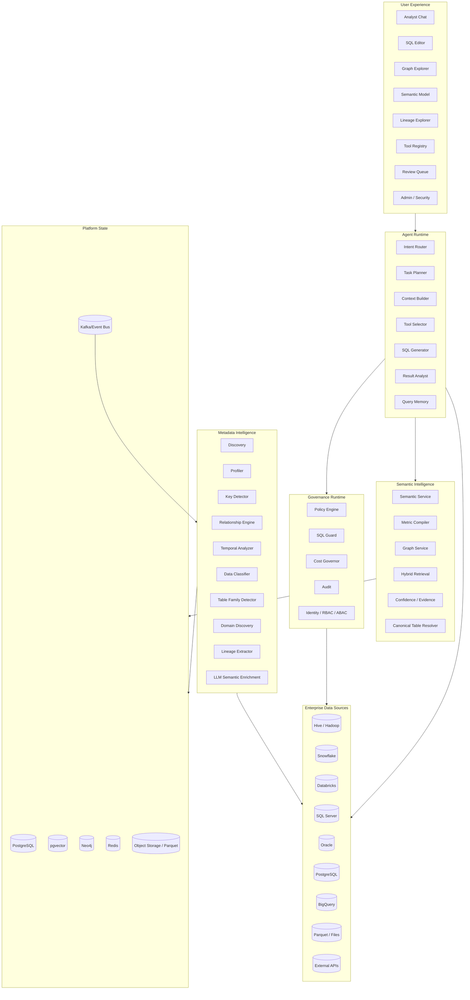
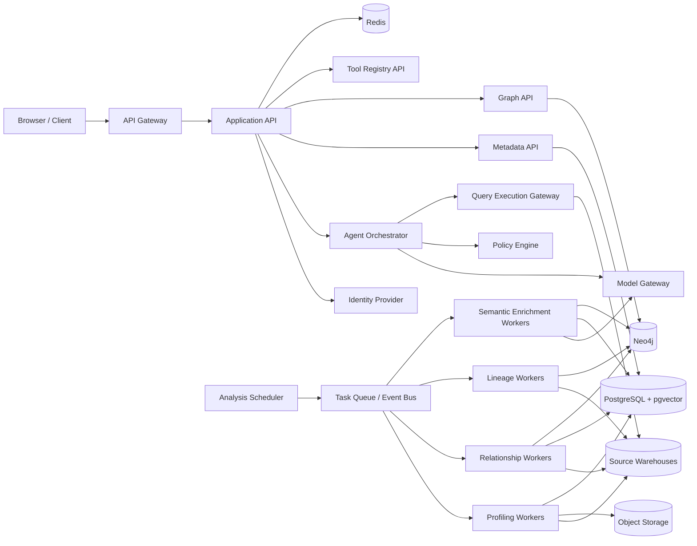
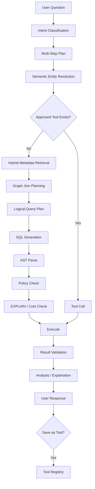

# 01 — End-to-End Architecture

## 1. Architecture Goals

The architecture must support:

- Hundreds to hundreds of thousands of tables.
- Multiple databases and schemas per project.
- Cross-schema and cross-database relationships.
- Fact, dimension, snapshot, delta, history, SCD, append-only, and reference tables.
- Partial or missing PK/FK constraints.
- Large warehouses where full scans are not acceptable.
- Semantic understanding of business meaning.
- Natural-language requests ranging from one-step questions to multi-step analytical instructions.
- Reusable analytical tools.
- Multi-model LLM routing.
- Full lineage and impact analysis.
- Strong user, agent, tool, and source-system authorization.
- Low latency for runtime analytical questions.
- Low LLM token usage during metadata maintenance.
- Human review only where confidence is insufficient.

## 2. Logical Architecture



## 3. Physical Architecture



## 4. Major Components

### 4.1 Connector Service

Responsibilities:

- Credential and connection configuration.
- Connectivity validation.
- Dialect identification.
- Metadata API abstraction.
- Query execution abstraction.
- Capability discovery.
- Connection pooling.
- Rate limiting.
- Source-specific feature flags.

Each connector should expose a normalized interface:

```text
list_catalogs()
list_schemas()
list_tables()
list_columns()
get_constraints()
get_indexes()
get_partitions()
get_table_statistics()
get_view_definition()
sample_rows()
execute_profile_query()
explain_query()
execute_query()
get_query_history()
```

### 4.2 Metadata Analysis Scheduler

The scheduler does not "send every table to an agent."

It:

1. Creates an `AnalysisRun`.
2. Discovers the scope.
3. Creates a DAG of deterministic jobs.
4. Assigns priorities.
5. Enforces warehouse concurrency limits.
6. Retries transient failures.
7. Skips unchanged objects.
8. Creates cross-table analysis only after prerequisites complete.
9. Triggers LLM enrichment selectively.
10. Publishes a new semantic version only after validation.

### 4.3 Metadata Store

PostgreSQL is authoritative for:

- Project configuration
- data-source registrations
- catalogs/schemas/tables/columns
- profiling summaries
- relationship candidates
- evidence and confidence
- semantic objects
- metric definitions
- tools
- policies
- model configurations
- analysis runs and tasks
- review decisions
- versions
- query memory
- audit references

### 4.4 Knowledge Graph

Neo4j stores graph-native relationships such as:

```text
Database -HAS_SCHEMA-> Schema
Schema -HAS_TABLE-> Table
Table -HAS_COLUMN-> Column
Column -REFERENCES-> Column
Table -DERIVES_FROM-> Table
Metric -USES_COLUMN-> Column
BusinessEntity -REPRESENTED_BY-> Table
Tool -READS_FROM-> Table
Agent -CAN_CALL-> Tool
Report -USES_METRIC-> Metric
```

### 4.5 Hybrid Retrieval

Runtime retrieval should combine:

```text
lexical search
+
vector similarity
+
graph traversal
+
metadata filters
+
usage history
+
confidence
+
security filtering
```

A useful ranking model is:

```text
final_score =
  semantic_similarity
  * domain_relevance
  * confidence_factor
  * canonical_table_factor
  * usage_factor
  * permission_factor
```

### 4.6 Semantic Query Engine

The semantic layer provides concepts such as:

- Business entities
- dimensions
- measures
- metrics
- time semantics
- grain
- valid joins
- filter rules
- default aggregations
- synonyms
- canonical tables
- history behavior

The agent should reason primarily over semantic objects rather than raw physical metadata.

## 5. Runtime Query Path



## 6. Separation of Control Plane and Data Plane

### Control Plane

Contains:

- metadata
- semantic model
- policies
- models
- tools
- agent definitions
- lineage
- audit
- job orchestration

### Data Plane

Contains:

- source warehouse queries
- result sets
- temporary analytical data
- approved execution environments

The platform should avoid permanently copying source business data unless a feature explicitly requires it.

## 7. Architecture Decision Summary

### Use PostgreSQL + Neo4j + Vector Index

Reason:

- PostgreSQL provides transactional metadata consistency.
- Neo4j provides graph traversal and lineage.
- Vectors provide semantic retrieval.
- These problems are complementary, not substitutes.

### Do Not Use a Vector DB as the Source of Truth

Vector stores do not represent authoritative PK/FK semantics, versioning, approval, or transactional relationships well.

### Do Not Use the LLM as the Profiler

Profiling is cheaper, faster, reproducible, and more accurate when deterministic.

### Do Not Use One Agent Per Table

The unit of execution is an analysis task, scheduled within a dependency graph.

## 8. Quality Attributes

Priority order:

1. correctness
2. security
3. explainability
4. reproducibility
5. metadata freshness
6. query latency
7. cost efficiency
8. scalability
9. extensibility
